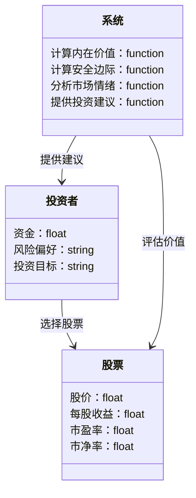
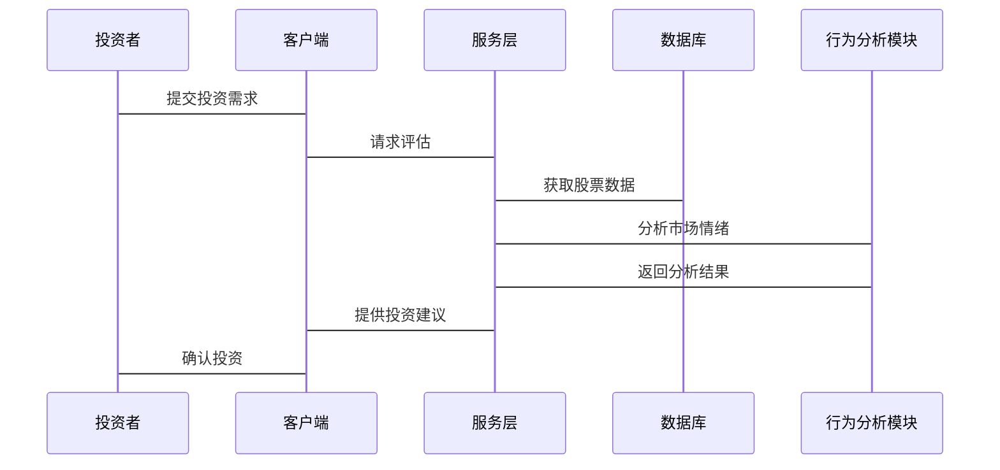

                 


# 格雷厄姆特价股票理论对行为金融学的补充

## 关键词：格雷厄姆，行为金融学，特价股票，价值投资，认知偏差，数学模型，投资策略

## 摘要：本文探讨了格雷厄姆的特价股票理论与行为金融学的结合，分析了投资者心理、认知偏差对投资决策的影响，并通过数学模型和算法对价值评估进行了深入研究，提出了优化的投资策略。

---

# 第1章: 格雷厄姆特价股票理论的背景与核心概念

## 1.1 格雷厄姆投资理论的起源与发展

### 1.1.1 投资学说的演变历程

- 17世纪至19世纪：传统金融学的基础，如复利计算和资产定价理论。
- 20世纪初：格雷厄姆与多德的价值投资理念出现，强调安全边际和低估股票。
- 20世纪中叶：行为金融学兴起，挑战传统有效市场假说，引入心理学因素。

### 1.1.2 格雷厄姆的价值投资理念

- **核心思想**：购买被市场低估的股票，注重安全边际，追求长期稳定的收益。
- **廉价股特征**：市盈率、市净率低于行业平均水平，股息率稳定，公司基本面良好。
- **投资策略**：长期持有，分散投资，避免过度交易。

### 1.1.3 特价股票的定义与特征

- **定义**：市场价格低于内在价值的股票，通常具有较高的安全边际。
- **特征**：低市盈率、低市净率、高股息率、公司基本面稳健。

## 1.2 行为金融学的基本概念与研究方法

### 1.2.1 行为金融学的定义与研究领域

- **定义**：研究投资者心理、认知偏差和行为如何影响金融市场和投资决策的学科。
- **研究领域**：认知偏差、情绪决策、社会认同对投资行为的影响。

### 1.2.2 行为金融学与传统金融学的区别

- **传统金融学**：假设市场有效，投资者理性，价格反映所有信息。
- **行为金融学**：考虑投资者心理和非理性行为，认为市场不一定有效。

### 1.2.3 行为金融学的核心理论与模型

- **认知偏差理论**：投资者的决策受系统性错误认知影响，如过度自信、确认偏见。
- **情绪周期理论**：市场情绪波动影响股票价格，如恐慌性抛售、贪婪性买入。

## 1.3 格雷厄姆理论与行为金融学的结合

### 1.3.1 格雷厄姆理论在行为金融学中的地位

- 格雷厄姆的理论为行为金融学提供了实证基础，强调心理因素对投资决策的影响。

### 1.3.2 行为金融学对格雷厄姆理论的补充

- 引入心理因素，解释为什么投资者在面对廉价股时可能因为认知偏差而做出错误决策。

### 1.3.3 两者的结合对投资决策的影响

- 综合考虑价值与心理因素，投资者在选择廉价股时需克服认知偏差，避免低估或高估。

---

# 第2章: 投资者认知偏差的分析

## 2.1 认知偏差的定义与分类

### 2.1.1 认知偏差的基本概念

- **定义**：投资者在信息处理和决策过程中产生的系统性错误认知。
- **分类**：确认偏见、过度自信、从众心理等。

### 2.1.2 常见的认知偏差类型

| 偏差类型 | 描述 | 示例 |
|----------|------|------|
| 确认偏见 | 过度关注支持自己观点的信息 | 投资者只关注利好消息，忽视利空信息。 |
| 过度自信 | 过高估计自己的能力 | 投资者认为自己能准确预测市场走势。 |
| 从众心理 | 跟随大众决策 | 牛市时跟风买入，熊市时恐慌抛售。 |

### 2.1.3 认知偏差对投资行为的影响

- **情绪化决策**：投资者因偏差做出非理性决策，导致投资损失。
- **市场波动**：认知偏差加剧市场波动，如泡沫与崩盘。

## 2.2 行为偏差对股票定价的影响

### 2.2.1 过度自信与投资决策

- 投资者因过度自信高估股票收益，导致过度投资或杠杆交易。

### 2.2.2 情绪化决策与市场波动

- 情绪化决策引发市场波动，如恐慌性抛售导致股价暴跌。

### 2.2.3 社会认同与从众行为

- 从众行为导致市场跟风现象，如科技股泡沫。

## 2.3 认知偏差对特价股票投资的影响

### 2.3.1 认知偏差如何影响特价股票的选择

- 投资者因认知偏差可能忽视廉价股的真实价值，或过度关注其短期波动。

### 2.3.2 投资者心理与特价股票的市场表现

- 认知偏差影响投资者对廉价股的估值，可能导致市场低估或高估。

### 2.3.3 如何克服认知偏差的影响

- **自我反思**：定期审视决策，识别偏差。
- **多元化投资**：分散投资降低单一股票风险。
- **长期视角**：关注长期价值，避免短期情绪干扰。

---

# 第3章: 特价股票的特征与投资策略

## 3.1 特价股票的定义与分类

### 3.1.1 特价股票的定义

- 市场价格低于内在价值的股票，通常具有较高的安全边际。

### 3.1.2 特价股票的分类

| 类型 | 特点 | 适用场景 |
|------|------|----------|
| 价值型 | 低市盈率、低市净率 | 稳定收益 |
| 成长型 | 高增长潜力 | 长期增值 |
| 股息型 | 高股息率 | 收入稳定 |

## 3.2 特价股票的筛选标准

### 3.2.1 市盈率与市净率的计算

- **市盈率（P/E）**：股价除以每股收益。
- **市净率（P/B）**：股价除以每股净资产。

### 3.2.2 股息率与股息支付率的分析

- **股息率**：股息与股价的比率，反映收益能力。
- **股息支付率**：股息与净利润的比率，反映分红能力。

### 3.2.3 公司基本面的评估

- **财务状况**：关注负债率、盈利能力、现金流。
- **行业地位**：公司是否在行业中具有竞争优势。
- **管理团队**：管理层的经验和稳定性。

## 3.3 特价股票的投资策略

### 3.3.1 价值投资策略

- **核心**：买入低于内在价值的股票，长期持有。
- **步骤**：筛选廉价股，评估内在价值，分散投资。

### 3.3.2 投资组合的构建

- **多样化**：配置不同类型的股票，降低风险。
- **风险控制**：设定止损点，避免重大损失。

### 3.3.3 风险控制与收益平衡

- **止损策略**：当股价跌至设定点时卖出，避免进一步损失。
- **仓位管理**：根据市场情况调整持仓比例，平衡风险与收益。

---

# 第4章: 行为金融学视角下的投资者心理与市场行为

## 4.1 投资者心理与市场波动

### 4.1.1 情绪周期与市场波动

- **情绪周期**：从乐观到悲观，再到乐观的循环。
- **市场波动**：情绪波动导致股价偏离基本面。

### 4.1.2 特价股票市场的投资者心理

- **贪婪与恐惧**：投资者在廉价股市场中可能因贪婪而低估风险，或因恐惧而错失机会。

### 4.1.3 市场情绪与股票价格的关系

- **正相关**：积极情绪推高股价，消极情绪压低股价。

## 4.2 投资者行为对股票定价的影响

### 4.2.1 非理性行为与市场失灵

- **非理性行为**：投资者因认知偏差做出错误决策，导致市场失灵。
- **市场失灵**：信息不对称、外部性等问题加剧市场波动。

### 4.2.2 特价股票市场的行为特征

- **价格敏感性**：投资者对价格波动敏感，可能导致市场流动性不足。
- **情绪驱动**：投资者情绪波动影响股价，尤其是廉价股市场。

### 4.2.3 行为金融学对股票定价的解释

- **心理定价**：投资者心理因素影响定价，如锚定效应导致高价或低价。

## 4.3 行为金融学对投资策略的启示

### 4.3.1 如何利用行为金融学优化投资策略

- **心理分析**：通过分析投资者心理，识别市场趋势。
- **行为预警**：利用行为指标预测市场拐点。

### 4.3.2 特价股票市场的行为分析

- **市场参与者**：分析主要投资者的行为特征，识别潜在机会。
- **市场情绪指标**：使用情绪指标指导投资决策。

### 4.3.3 行为金融学视角下的风险管理

- **风险识别**：识别行为偏差带来的风险。
- **风险对冲**：通过多样化投资降低行为偏差带来的风险。

---

# 第5章: 格雷厄姆价值评估模型的数学分析

## 5.1 格雷厄姆价值评估模型的数学原理

### 5.1.1 内在价值计算公式

$$
\text{内在价值} = \frac{\text{每股收益} \times (6.25 + \text{永续增长率})}{\text{折现率}}
$$

### 5.1.2 安全边际计算公式

$$
\text{安全边际} = \text{内在价值} - \text{市场价格}
$$

## 5.2 格雷厄姆价值评估模型的算法实现

### 5.2.1 数据准备

```python
import pandas as pd
import numpy as np

# 示例数据：假设我们有一个包含股票信息的DataFrame
data = pd.DataFrame({
    '股价': [50, 60, 70],
    '每股收益': [5, 6, 7],
    '永续增长率': [0.05, 0.06, 0.07],
    '折现率': [0.1, 0.1, 0.1]
})
```

### 5.2.2 计算内在价值

```python
def calculate_intrinsic_value(data):
    intrinsic_value = []
    for i in range(len(data)):
        revenue = data['每股收益'][i] * (6.25 + data['永续增长率'][i])
        iv = revenue / data['折现率'][i]
        intrinsic_value.append(iv)
    return intrinsic_value

intrinsic_value = calculate_intrinsic_value(data)
print("内在价值:", intrinsic_value)
```

### 5.2.3 计算安全边际

```python
def calculate_margin_of_safety(data, intrinsic_value):
    mos = []
    for i in range(len(data)):
        mos_val = intrinsic_value[i] - data['股价'][i]
        mos.append(mos_val)
    return mos

margin_of_safety = calculate_margin_of_safety(data, intrinsic_value)
print("安全边际:", margin_of_safety)
```

## 5.3 格雷厄姆价值评估模型的优化

### 5.3.1 动态调整折现率

- 根据市场环境和公司风险调整折现率，如使用CAPM模型计算折现率。

### 5.3.2 结合行为金融学因素

- 考虑投资者心理和市场情绪，调整内在价值计算中的增长率和折现率。

---

# 第6章: 系统分析与架构设计方案

## 6.1 投资决策支持系统的功能设计

### 6.1.1 领域模型设计



### 6.1.2 系统架构设计


## 6.2 系统接口设计

### 6.2.1 输入接口

- **投资者信息**：资金、风险偏好、投资目标。
- **股票数据**：股价、每股收益、市盈率、市净率。

### 6.2.2 输出接口

- **内在价值**：计算结果。
- **安全边际**：计算结果。
- **投资建议**：基于模型的建议。

## 6.3 系统交互设计



---

# 第7章: 项目实战

## 7.1 环境安装

### 7.1.1 安装Python与相关库

```bash
pip install pandas numpy matplotlib
```

## 7.2 核心实现

### 7.2.1 数据分析与可视化

```python
import matplotlib.pyplot as plt

data = pd.DataFrame({
    '股价': [50, 60, 70],
    '内在价值': [70, 80, 90],
    '安全边际': [20, 20, 20]
})

plt.figure(figsize=(10, 6))
plt.plot(data['股价'], label='股价')
plt.plot(data['内在价值'], label='内在价值')
plt.xlabel('股票')
plt.ylabel('价值')
plt.legend()
plt.show()
```

### 7.2.2 算法实现与测试

```python
# 测试格雷厄姆模型
test_data = pd.DataFrame({
    '股价': [40, 50, 60],
    '每股收益': [5, 6, 7],
    '永续增长率': [0.05, 0.06, 0.07],
    '折现率': [0.1, 0.1, 0.1]
})

test_intrinsic_value = calculate_intrinsic_value(test_data)
test_margin_of_safety = calculate_margin_of_safety(test_data, test_intrinsic_value)
print("测试结果：", test_intrinsic_value, test_margin_of_safety)
```

## 7.3 实际案例分析

### 7.3.1 案例选择

- 选择一家具有低市盈率和高股息率的公司，分析其是否为廉价股。

### 7.3.2 案例分析

- 计算内在价值和安全边际，评估是否具备投资价值。

## 7.4 项目小结

### 7.4.1 核心实现总结

- 成功实现格雷厄姆价值评估模型的Python代码。
- 通过案例分析验证模型的有效性。

### 7.4.2 改进方向

- 引入更多行为金融学因素，如投资者情绪指数，优化模型。

---

# 第8章: 总结与展望

## 8.1 核心观点回顾

### 8.1.1 格雷厄姆理论与行为金融学的结合

- 格雷厄姆理论提供了价值评估的方法，行为金融学解释了投资者心理对市场的影响。

### 8.1.2 投资者心理与市场行为的关系

- 认知偏差和情绪波动影响投资决策，导致市场波动。

## 8.2 对未来研究的展望

### 8.2.1 深入研究行为金融学因素

- 结合更多心理学理论，优化投资模型。

### 8.2.2 多学科交叉研究

- 将行为金融学与大数据、人工智能结合，提升投资决策的科学性。

## 8.3 最佳实践 tips

### 8.3.1 投资者心理管理

- 定期反思投资决策，识别并克服认知偏差。

### 8.3.2 风险控制

- 设定止损点，分散投资，避免过度集中。

### 8.3.3 持续学习

- 关注市场动态，学习新理论，提升投资能力。

---

# 附录: 参考文献与术语表

## 附录A: 参考文献

1. 格雷厄姆，本杰明. 《聪明的投资者》
2. 哈恩，理查德. 《行为金融学》
3. 劳伦斯，肯尼思. 《价值投资实战策略》

## 附录B: 术语表

- **内在价值**：股票的真实价值，不考虑市场波动。
- **安全边际**：内在价值与市场价格的差额，反映投资的安全性。
- **认知偏差**：投资者在信息处理中的系统性错误。

---

# 结束语

通过本文的分析，我们深入探讨了格雷厄姆特价股票理论与行为金融学的结合，揭示了投资者心理对投资决策的影响。希望本文能为投资者提供新的视角和工具，优化投资策略，实现长期稳健收益。

