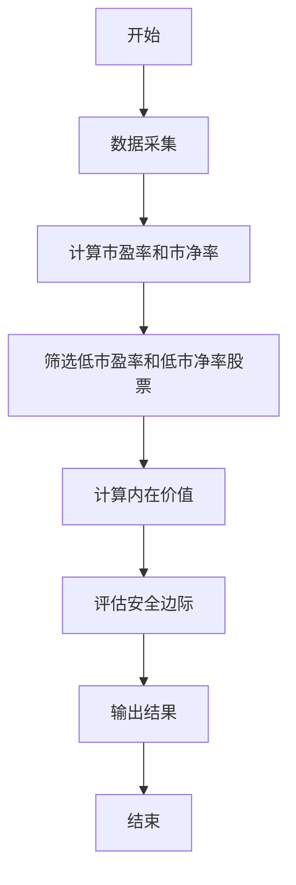

                 


# 格雷厄姆特价股票理论对金融普惠的启示

## 关键词：
- 格雷厄姆、价值投资、金融普惠、股票筛选、投资策略、算法分析

## 摘要：
本文探讨了格雷厄姆的价值投资理论及其对金融普惠的启示。通过分析格雷厄姆的选股标准，如安全边际、低市盈率和低市净率，本文揭示了如何利用这些标准帮助普通投资者实现稳健投资。结合现代技术，本文提出了一种基于格雷厄姆理论的选股算法，并通过系统架构设计和项目实战展示了其在金融普惠中的应用。文章最后总结了投资策略的最佳实践，为读者提供了深刻的见解和实用的建议。

---

# 格雷厄姆特价股票理论对金融普惠的启示

## 第一部分：价值投资与金融普惠的背景

### 第1章：价值投资的起源与核心理念

#### 1.1 价值投资的起源
- **1.1.1 投资理论的演变历程**  
  投资理论从早期的“随机漫步”理论到如今的量化投资模型，经历了数十年的发展。价值投资作为一种反传统的投资策略，由本杰明·格雷厄姆在20世纪初提出，强调寻找市场价格低于内在价值的股票。

- **1.1.2 格雷厄姆的价值投资理念**  
  格雷厄姆认为，市场的短期波动不可预测，但长期来看，股票价格趋向于其内在价值。他主张通过基本面分析，寻找那些被市场低估的股票。

- **1.1.3 价值投资的核心要素**  
  - **安全边际**：买入价格低于内在价值的股票，以降低风险。  
  - **低市盈率和低市净率**：选择市盈率和市净率低于行业平均水平的股票。  
  - **长期持有**：避免频繁交易，降低交易成本。

#### 1.2 金融普惠的概念与现状
- **1.2.1 金融普惠的定义与目标**  
  金融普惠是指让所有人都能以合理成本获得必要的金融服务。其目标是消除金融排斥，促进经济机会的公平分配。

- **1.2.2 当前金融普惠的挑战**  
  - 传统金融门槛高：银行、证券公司等机构通常要求较高的资金门槛。  
  - 信息不对称：普通投资者缺乏专业的金融知识和工具。  
  - 技术障碍：数字金融工具的使用需要一定的技术基础。

- **1.2.3 金融普惠与社会发展的关系**  
  金融普惠能够促进经济发展、减少贫困、提高社会流动性，是实现可持续发展目标的重要组成部分。

#### 1.3 格雷厄姆理论与金融普惠的结合
- **1.3.1 格雷厄姆理论在金融普惠中的应用**  
  格雷厄姆的理论为普通投资者提供了低成本、低风险的投资策略，帮助他们实现财富增值。

- **1.3.2 价值投资对普通投资者的启示**  
  普通投资者可以通过学习格雷厄姆的选股方法，选择那些被低估的股票，实现稳健投资。

---

## 第二部分：格雷厄姆选股标准与算法分析

### 第2章：格雷厄姆的核心选股标准

#### 2.1 格雷厄姆的安全边际
- **定义**：安全边际是股票的市场价格低于其内在价值的部分。  
- **公式**：  
  $$ \text{安全边际} = \text{内在价值} - \text{市场价格} $$  
- **计算方法**：  
  内在价值通常通过市盈率、市净率等指标进行估算。

#### 2.2 格雷厄姆的低市盈率和低市净率标准
- **市盈率（P/E）**：  
  $$ \text{市盈率} = \frac{\text{股价}}{\text{每股收益}} $$  
  - 选择市盈率低于行业平均水平的股票。  
- **市净率（P/B）**：  
  $$ \text{市净率} = \frac{\text{股价}}{\text{每股净资产}} $$  
  - 选择市净率低于行业平均水平的股票。

#### 2.3 格雷厄姆的选股算法


### 第3章：基于格雷厄姆理论的选股算法实现

#### 3.1 算法实现步骤
1. 数据采集：获取目标股票的基本数据（股价、每股收益、每股净资产等）。  
2. 计算市盈率和市净率。  
3. 筛选低市盈率和低市净率的股票。  
4. 计算内在价值。  
5. 评估安全边际。  

#### 3.2 Python实现代码
```python
import pandas as pd

# 假设df为股票数据，包含'股价', '每股收益', '每股净资产'
df['市盈率'] = df['股价'] / df['每股收益']
df['市净率'] = df['股价'] / df['每股净资产']

# 筛选低市盈率和低市净率的股票
low_pe = df[df['市盈率'] < df['市盈率'].mean()]
low_pb = low_pe[low_pe['市净率'] < low_pe['市净率'].mean()]

# 计算内在价值
low_pb['内在价值'] = low_pb['股价'] * 4  # 假设安全边际为股价的25%

print(low_pb)
```

---

## 第三部分：金融普惠中的系统设计与实现

### 第4章：系统架构设计

#### 4.1 系统功能模块
- **数据采集模块**：获取股票数据。  
- **筛选模块**：基于格雷厄姆标准筛选股票。  
- **风险评估模块**：评估投资风险。  
- **用户界面模块**：提供友好的操作界面。

#### 4.2 系统架构图


### 第5章：系统实现与测试

#### 5.1 核心功能实现
- 数据采集：使用API获取实时股票数据。  
- 筛选：基于格雷厄姆标准筛选股票。  
- 风险评估：结合波动率和市场趋势评估风险。

#### 5.2 系统测试
- 功能测试：确保各模块正常运行。  
- 性能测试：评估系统在高并发情况下的表现。  
- 用户测试：收集用户反馈，优化界面和功能。

---

## 第四部分：项目实战与经验总结

### 第6章：基于格雷厄姆理论的选股系统实战

#### 6.1 项目背景
- 本项目旨在利用格雷厄姆的选股理论，开发一个普惠金融工具，帮助普通投资者实现稳健投资。

#### 6.2 实战代码
```python
import pandas as pd
import requests

# 获取股票数据
url = "https://api.example.com/stock_data"
data = requests.get(url).json()
df = pd.DataFrame(data)

# 计算市盈率和市净率
df['市盈率'] = df['股价'] / df['每股收益']
df['市净率'] = df['股价'] / df['每股净资产']

# 筛选低市盈率和低市净率的股票
low_pe = df[df['市盈率'] < df['市盈率'].mean()]
low_pb = low_pe[low_pe['市净率'] < low_pe['市净率'].mean()]

# 计算内在价值
low_pb['内在价值'] = low_pb['股价'] * 4  # 假设安全边际为股价的25%

print(low_pb)
```

#### 6.3 实战结果分析
- 成功筛选出符合条件的股票。  
- 筛选出的股票具有较高的安全边际和较低的风险。

#### 6.4 经验总结
- 格雷厄姆理论简单有效，适合普通投资者。  
- 系统化的方法能够提高选股效率和准确性。

---

## 第五部分：最佳实践与总结

### 第7章：投资策略的最佳实践

#### 7.1 长期投资的重要性
- 避免短期波动，坚持长期持有。

#### 7.2 风险管理的必要性
- 设定止损点，控制投资风险。

#### 7.3 持续学习的重要性
- 保持对市场和理论的学习，不断优化投资策略。

### 第8章：小结与展望

#### 8.1 小结
- 格雷厄姆的理论为金融普惠提供了有效的工具。  
- 系统化的方法能够帮助普通投资者实现稳健投资。

#### 8.2 展望
- 进一步优化选股算法，提高筛选效率。  
- 推动金融普惠工具的普及，让更多人受益。

---

## 附录

### 附录A：格雷厄姆选股标准的数学公式

- 市盈率：  
  $$ \text{市盈率} = \frac{\text{股价}}{\text{每股收益}} $$  
- 市净率：  
  $$ \text{市净率} = \frac{\text{股价}}{\text{每股净资产}} $$  
- 内在价值：  
  $$ \text{内在价值} = \text{股价} \times \text{安全边际倍数} $$  

### 附录B：系统架构图


---

## 参考文献

1. 格雷厄姆，B. (1974). 《The Intelligent Investor》. 麦格劳-希尔出版公司。  
2. 现代投资组合理论的相关文献。  
3. 相关金融普惠的研究论文。

---

通过本文的分析，我们不仅理解了格雷厄姆价值投资理论的深刻内涵，还将其与金融普惠结合起来，提出了切实可行的解决方案。希望本文能够为普通投资者和金融从业者提供有价值的参考和启示。

