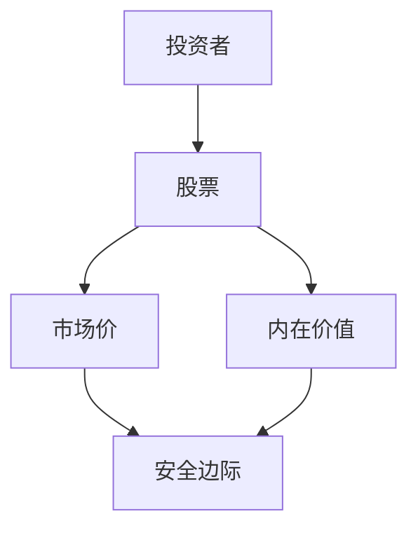
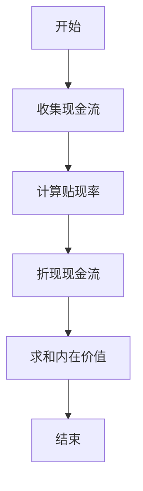
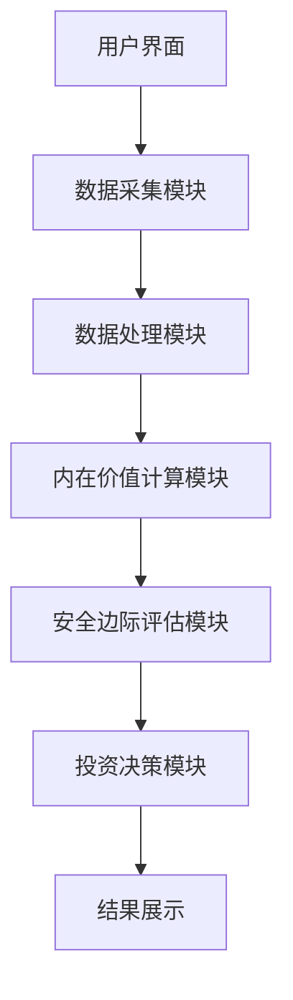

                 


# 格雷厄姆特价股票理论的现代化应用

> 关键词：格雷厄姆，价值投资，内在价值，安全边际，算法，现代化应用

> 摘要：本文深入探讨了格雷厄姆特价股票理论的核心概念及其在现代金融环境中的应用。通过结合大数据和机器学习技术，分析了如何利用现代算法来评估内在价值和安全边际，从而优化投资决策。

---

## 第一部分: 格雷厄姆特价股票理论的背景与核心概念

### 第1章: 格雷厄姆投资理论概述

#### 1.1 价值投资的起源与发展

价值投资是一种以基本面分析为基础的投资策略，起源于20世纪初。本杰明·格雷厄姆（Benjamin Graham）是该理论的创始人，他的思想深刻影响了沃伦·巴菲特（Warren Buffett）等投资大师。格雷厄姆的核心理念是寻找市场中被低估的股票，即“特价股票”。

#### 1.2 格雷厄姆的投资理念与方法

格雷厄姆提出了“安全边际”的概念，即买入价格低于内在价值的股票，以确保投资的安全性。他认为，市场先生（Mr. Market）的情绪波动会导致股票价格短期偏离其内在价值，投资者应利用这种波动性进行长期投资。

#### 1.3 特价股票的定义与特征

特价股票是指市场价格低于其内在价值的股票。格雷厄姆认为，这种股票具有以下特征：低市盈率、低市净率、高股息率和稳定的盈利能力。

---

### 第2章: 格雷厄姆理论的核心概念与联系

#### 2.1 核心概念原理

- **安全边际**：安全边际 = 内在价值 - 市场价格。格雷厄姆建议投资者购买具有足够安全边际的股票，以降低投资风险。
  
- **内在价值**：内在价值是通过分析公司财务报表和市场环境确定的股票真实价值。计算公式为：
  $$ \text{内在价值} = \sum_{t=1}^{n} \frac{\text{现金流}_t}{(1 + r)^t} $$
  其中，\( r \) 是贴现率。

- **市场波动与投资机会**：市场波动为投资者提供了低价买入优质股票的机会。格雷厄姆认为，投资者应利用市场恐慌或低估时期进行投资。

#### 2.2 核心概念属性对比表格

| 概念       | 属性           | 描述                           |
|------------|----------------|--------------------------------|
| 安全边际   | 计算方式       | 内在价值 - 市场价格             |
| 内在价值   | 评估方法       | 现金流折现法                   |
| 市场波动   | 影响因素       | 市场情绪、宏观经济、行业动态     |

#### 2.3 ER实体关系图



---

## 第二部分: 格雷厄姆特价股票理论的算法原理

### 第3章: 内在价值计算算法

#### 3.1 现金流折现法

现金流折现法是计算内在价值的核心方法。以下是其实现步骤：

1. 收集公司未来五年的自由现金流。
2. 使用适当的贴现率（如 WACC）将未来现金流折现。
3. 将所有折现后的现金流相加，得到内在价值。

#### 3.2 算法流程图



#### 3.3 Python代码实现

```python
def calculate_intrinsic_value(cash_flows, discount_rate):
    intrinsic_value = sum(cash_flow / (1 + discount_rate) ** t for t, cash_flow in enumerate(cash_flows))
    return intrinsic_value

# 示例数据
cash_flows = [100, 120, 150, 180, 200]
discount_rate = 0.1

intrinsic_value = calculate_intrinsic_value(cash_flows, discount_rate)
print(f"内在价值为: {intrinsic_value}")
```

#### 3.4 数学模型与公式

贴现率 \( r \) 的计算公式为：
$$ r = \frac{D}{E} \times r_d + \frac{E}{V} \times r_e $$
其中，\( D \) 是债务，\( E \) 是权益，\( V \) 是总价值，\( r_d \) 是债务成本，\( r_e \) 是权益成本。

---

## 第三部分: 系统分析与架构设计

### 第4章: 格雷厄姆理论的系统化应用

#### 4.1 系统功能设计

- **数据采集**：从Yahoo Finance获取股票数据。
- **内在价值计算**：使用现金流折现法计算内在价值。
- **安全边际评估**：计算安全边际，筛选出符合条件的股票。
- **投资决策**：基于安全边际和市场环境做出投资决策。

#### 4.2 系统架构图



#### 4.3 接口设计与交互流程

- **接口设计**：用户输入股票代码和时间段，系统返回安全边际和投资建议。
- **交互流程**：
  1. 用户输入股票代码。
  2. 系统获取股票数据。
  3. 计算内在价值和安全边际。
  4. 系统给出投资建议。

---

## 第四部分: 项目实战与案例分析

### 第5章: 项目实战

#### 5.1 环境安装

- 安装Python和相关库：
  ```bash
  pip install pandas numpy matplotlib requests
  ```

#### 5.2 核心代码实现

```python
import pandas as pd
import numpy as np
import requests

def get_stock_data(symbol):
    url = f"https://query1.finance.yahoo.com/v7/finance/quote/{symbol}"
    response = requests.get(url)
    data = response.json()
    return data

def calculate_intrinsic_value(cash_flows, discount_rate):
    return sum(cash_flow / (1 + discount_rate) ** t for t, cash_flow in enumerate(cash_flows))

# 示例代码
symbol = "AAPL"
data = get_stock_data(symbol)
print(data)
```

#### 5.3 案例分析

以苹果公司（AAPL）为例，计算其内在价值和安全边际。假设现金流为 [100, 120, 150, 180, 200]，贴现率为 10%。计算结果如下：
$$ \text{内在价值} = 100/(1.1) + 120/(1.1)^2 + 150/(1.1)^3 + 180/(1.1)^4 + 200/(1.1)^5 \approx 477.57 $$

假设市场价格为 500，安全边际为：
$$ \text{安全边际} = 477.57 - 500 = -22.43 $$

由于安全边际为负，建议卖出该股票。

---

## 第五部分: 总结与展望

### 第6章: 总结

格雷厄姆特价股票理论在现代金融环境中的应用具有重要意义。通过结合大数据和机器学习技术，投资者可以更精准地计算内在价值和安全边际，从而优化投资决策。

### 6.2 最佳实践与注意事项

- **风险管理**：投资者应严格控制仓位，避免过度集中。
- **持续学习**：市场环境不断变化，投资者需持续学习和调整策略。
- **工具辅助**：利用技术工具提高分析效率，如使用Python进行数据处理和建模。

---

通过以上步骤，我们可以看到格雷厄姆理论在现代金融中的强大生命力。未来，随着技术的进步，价值投资将变得更加科学和精准。

