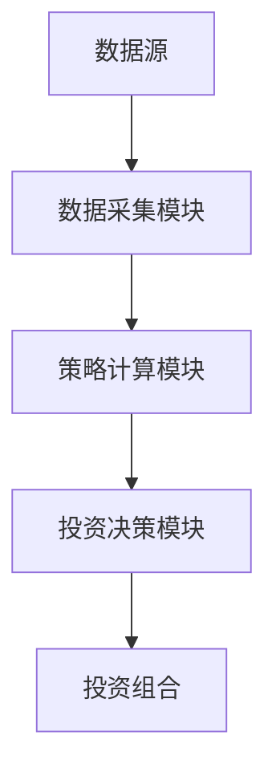
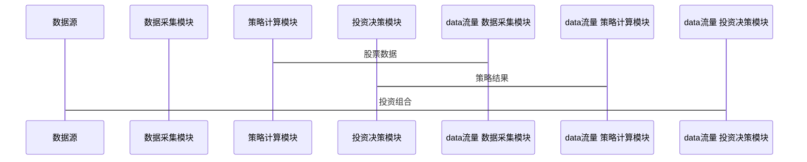

                 


# 格雷厄姆特价股票策略与被动投资的比较

## 关键词：格雷厄姆策略、被动投资、价值投资、指数基金、长期收益

## 摘要：本文深入分析了本杰明·格雷厄姆的价值投资策略与被动投资策略的异同，探讨了两者在市场适应性、收益潜力、风险控制和操作复杂性上的差异。通过数学模型和实际案例，本文详细阐述了格雷厄姆策略的内在价值评估和安全边际计算，以及被动投资的指数基金构建和夏普比率分析。最终，本文总结了两种策略的最佳实践和应用场景，为投资者提供决策参考。

---

# 第一部分: 格雷厄姆特价股票策略与被动投资的背景与基础

## 第1章: 价值投资与被动投资的起源与演变

### 1.1 价值投资的起源

#### 1.1.1 本杰明·格雷厄姆的生平与投资理念
本杰明·格雷厄姆（Benjamin Graham）是20世纪最著名的投资理论家之一，被誉为“价值投资之父”。他出生于1894年，早年经历了华尔街的多次繁荣与萧条，这使他形成了独特的投资理念。格雷厄姆强调安全边际和内在价值，认为市场情绪往往会导致股票价格偏离其真实价值。

#### 1.1.2 格雷厄姆投资策略的核心思想
格雷厄姆的策略基于“安全边际”概念，即以低于内在价值的价格买入股票，以降低投资风险。他认为市场波动性和投资者情绪是投资收益的主要敌人，因此强调长期持有和价值发现。

#### 1.1.3 价值投资的哲学基础
价值投资的核心在于寻找市场低估的股票，通过深入分析企业的财务状况和行业地位，寻找具有长期增长潜力的公司。格雷厄姆的策略强调保守投资和风险管理，而非短期收益。

### 1.2 被动投资的兴起

#### 1.2.1 被动投资的定义与特点
被动投资是一种通过跟踪市场指数（如标普500）来构建投资组合的策略。其核心是避免频繁交易和市场择时，追求与市场持平或接近的收益。

#### 1.2.2 被动投资的历史发展
被动投资兴起于20世纪70年代，随着指数基金的出现而逐渐普及。其低成本、低维护的特点使其成为个人投资者的热门选择。

#### 1.2.3 被动投资与主动投资的对比
主动投资依赖于市场择时和个股选择，而被动投资则通过分散化降低风险。被动投资通常具有更低的费用比率，但其收益取决于市场的整体表现。

### 1.3 格雷厄姆策略与被动投资的哲学差异

#### 1.3.1 价值投资的主动性
格雷厄姆策略强调主动寻找低估股票，要求投资者具备深入的分析能力和市场洞察力。

#### 1.3.2 被动投资的无为而治
被动投资强调跟随市场，减少人为干预，追求与市场同步的收益。

#### 1.3.3 两种策略的市场适应性
格雷厄姆策略在市场低估时期表现优异，而被动投资在长期牛市中表现更佳。

## 1.4 本章小结

### 1.4.1 格雷厄姆策略的核心要素
内在价值评估和安全边际计算。

### 1.4.2 被动投资的主要特点
低成本和分散化投资。

### 1.4.3 两种策略的哲学差异
主动 vs 无为。

---

# 第二部分: 格雷厄姆特价股票策略与被动投资的核心概念与数学模型

## 第2章: 格雷厄姆策略的核心概念与数学模型

### 2.1 格雷厄姆策略的核心原理

#### 2.1.1 安全边际的定义与计算
安全边际是股票的内在价值与其市场价格之间的差距，用于衡量投资的风险。

$$ \text{安全边际} = \frac{\text{内在价值} - \text{市场价格}}{\text{市场价格}} \times 100\% $$

#### 2.1.2 内在价值的评估方法
格雷厄姆使用现金流折现法评估内在价值。

$$ V = \frac{E}{1 + r} $$

其中，V为内在价值，E为未来现金流，r为折现率。

#### 2.1.3 股票筛选的标准与流程
格雷厄姆建议投资者选择市盈率低于15倍、市净率低于1.5倍的股票。

### 2.2 格雷厄姆策略的数学模型

#### 2.2.1 内在价值公式
$$ V = \frac{E}{1 + r} $$

#### 2.2.2 安全边际计算公式
$$ \text{安全边际} = \frac{\text{内在价值} - \text{市场价格}}{\text{市场价格}} \times 100\% $$

### 2.3 格雷厄姆策略的优缺点分析

#### 2.3.1 优点：低估股票的长期收益潜力
通过安全边际选股，投资者可以在市场波动中获得超额收益。

#### 2.3.2 缺点：对市场短期波动的适应性较差
在市场剧烈波动时，格雷厄姆策略可能面临较大回撤风险。

---

## 第3章: 被动投资的核心概念与数学模型

### 3.1 被动投资的核心原理

#### 3.1.1 指数基金的定义与特点
指数基金通过跟踪市场指数构建投资组合，具有分散化高、费用低的特点。

#### 3.1.2 夏普比率的定义与计算
夏普比率衡量投资组合的风险调整后收益。

$$ \text{夏普比率} = \frac{R_p - R_f}{\sigma_p} $$

其中，\( R_p \) 为投资组合收益，\( R_f \) 为无风险利率，\( \sigma_p \) 为投资组合的波动率。

#### 3.1.3 被动投资的长期表现
被动投资通过分散化降低风险，长期收益接近市场平均收益。

### 3.2 被动投资的数学模型

#### 3.2.1 指数基金的构造
$$ F = \sum_{i=1}^{n} w_i \times P_i $$

其中，\( F \) 为基金价值，\( w_i \) 为权重，\( P_i \) 为成分股价格。

#### 3.2.2 跟踪误差的计算
跟踪误差衡量指数基金与基准指数之间的差异。

$$ \text{跟踪误差} = \sqrt{\text{平均方差}} $$

### 3.3 被动投资的优缺点分析

#### 3.3.1 优点：分散化高、费用低
被动投资通过分散化降低风险，费用比率通常低于主动管理。

#### 3.3.2 缺点：对市场波动的适应性较差
在市场剧烈波动时，被动投资可能面临较大的回撤风险。

---

# 第三部分: 格雷厄姆策略与被动投资的系统分析与架构设计

## 第4章: 格雷厄姆策略与被动投资的优缺点对比

### 4.1 对比分析

| **对比维度** | **格雷厄姆策略** | **被动投资** |
|--------------|------------------|--------------|
| 投资目标      | 寻找低估股票     | 跟踪市场指数  |
| 投资风险      | 高              | 中等         |
| 操作复杂性    | 高              | 低           |
| 长期收益      | 高              | 中等         |

### 4.2 格雷厄姆策略与被动投资的数学差异

#### 4.2.1 格雷厄姆策略的收益模型
$$ R_g = \text{内在价值} + \text{安全边际} $$

#### 4.2.2 被动投资的收益模型
$$ R_p = \text{市场平均收益} - \text{费用比率} $$

### 4.3 格雷厄姆策略与被动投资的费用分析

#### 4.3.1 格雷厄姆策略的费用
主动管理费用较高，但潜在收益也更高。

#### 4.3.2 被动投资的费用
被动投资费用较低，但收益受市场限制。

---

## 第5章: 格雷厄姆策略与被动投资的系统架构设计

### 5.1 系统功能设计

#### 5.1.1 核心功能模块
- **数据采集模块**：收集股票价格和财务数据。
- **策略计算模块**：计算内在价值和跟踪误差。
- **投资决策模块**：根据策略结果生成投资组合。

### 5.2 系统架构图



### 5.3 系统接口设计

#### 5.3.1 数据接口
- 输入：股票价格和财务数据。
- 输出：内在价值和跟踪误差。

#### 5.3.2 投资接口
- 输入：投资策略。
- 输出：投资组合。

### 5.4 系统交互序列图



---

# 第四部分: 格雷厄姆策略与被动投资的项目实战

## 第6章: 格雷厄姆策略与被动投资的项目实战

### 6.1 环境安装

#### 6.1.1 系统环境
- 操作系统：Windows 10
- 开发工具：Python 3.8
- 数据库：MySQL 8.0

### 6.2 核心实现源代码

#### 6.2.1 格雷厄姆策略的Python代码

```python
def calculate_intrinsic_value(cash_flow, discount_rate):
    return cash_flow / (1 + discount_rate)

def calculate_margin_of_safety(intrinsic_value, market_price):
    return ((intrinsic_value - market_price) / market_price) * 100
```

#### 6.2.2 被动投资的Python代码

```python
def calculate_sharpe_ratio(returns, risk_free_rate, volatility):
    return (returns - risk_free_rate) / volatility
```

### 6.3 代码应用解读与分析

#### 6.3.1 格雷厄姆策略代码解读
- `calculate_intrinsic_value`：计算内在价值。
- `calculate_margin_of_safety`：计算安全边际。

#### 6.3.2 被动投资代码解读
- `calculate_sharpe_ratio`：计算夏普比率。

### 6.4 实际案例分析

#### 6.4.1 格雷厄姆策略案例
假设某股票的现金流为100，折现率为5%，市场价为80。

$$ V = \frac{100}{1 + 0.05} = 95.24 $$
$$ \text{安全边际} = \frac{95.24 - 80}{80} \times 100\% = 19.05\% $$

#### 6.4.2 被动投资案例
假设指数基金的年收益为10%，无风险利率为2%，波动率为15%。

$$ \text{夏普比率} = \frac{10\% - 2\%}{15\%} = 0.533 $$

---

## 第7章: 格雷厄姆策略与被动投资的最佳实践与小结

### 7.1 最佳实践

#### 7.1.1 格雷厄姆策略的注意事项
- 确保对目标公司的深入了解。
- 保持长期持有，避免频繁交易。

#### 7.1.2 被动投资的注意事项
- 定期再平衡投资组合。
- 选择费用比率低的指数基金。

### 7.2 小结

#### 7.2.1 格雷厄姆策略的优缺点
优点：潜在超额收益；缺点：操作复杂，风险较高。

#### 7.2.2 被动投资的优缺点
优点：分散化高，费用低；缺点：收益受限制。

#### 7.2.3 两种策略的适用场景
- 格雷厄姆策略适合长期投资者。
- 被动投资适合希望稳定收益的投资者。

### 7.3 未来展望

#### 7.3.1 组合投资
结合两种策略，构建混合投资组合，平衡风险和收益。

#### 7.3.2 技术进步
利用大数据和人工智能优化投资策略。

---

# 结语

格雷厄姆特价股票策略与被动投资各有优缺点，投资者应根据自身需求和市场环境选择合适的策略。未来，随着技术的进步，这两种策略的结合可能会带来更优的投资方案。

