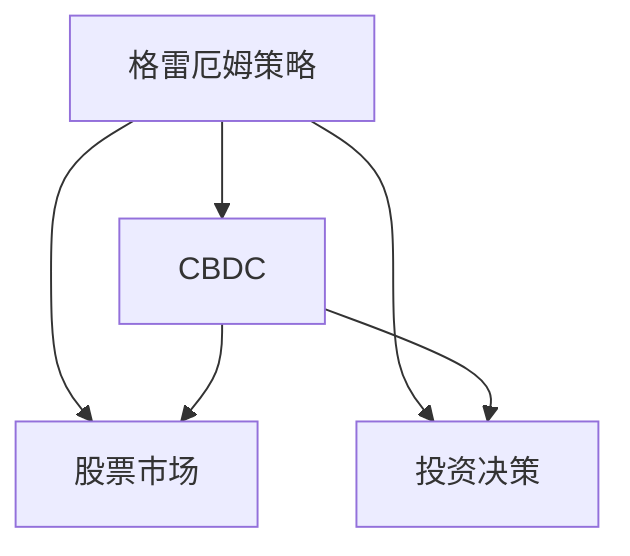
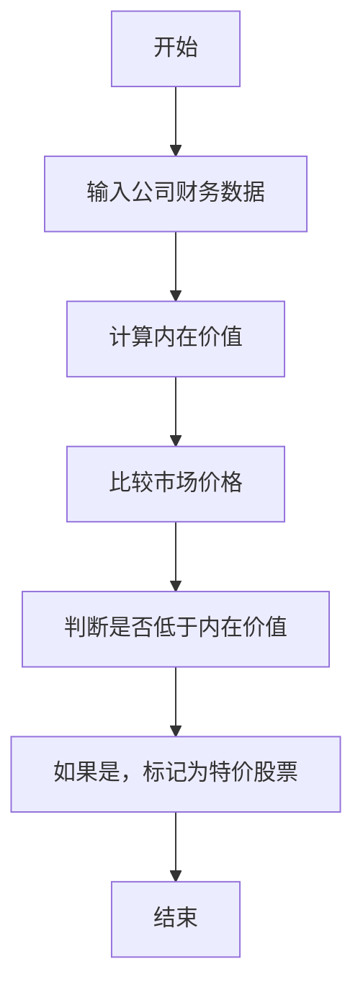
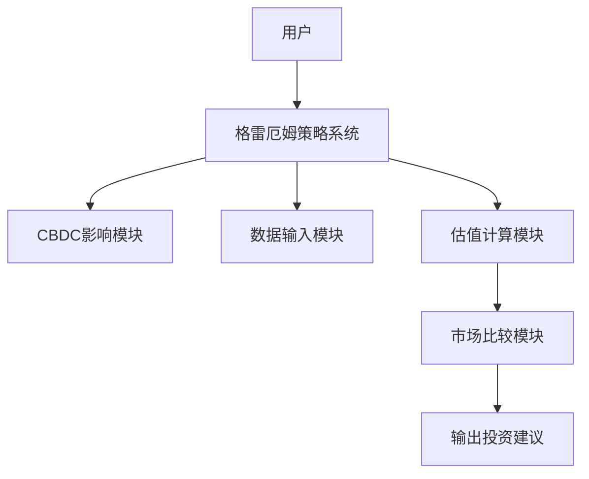

                 


# 格雷厄姆特价股票策略在不同中央银行数字货币环境下的调整

> 关键词：格雷厄姆策略、中央银行数字货币、股票估值、投资策略、数字金融

> 摘要：本文探讨了格雷厄姆特价股票策略在不同中央银行数字货币（CBDC）环境下的调整。首先，我们介绍了格雷厄姆投资理论的核心概念，包括价值投资、选股标准和特价股票的识别方法。然后，我们分析了中央银行数字货币的定义、特征及其在全球的发展现状。接着，我们深入探讨了CBDC对股票市场的影响，包括流动性、估值和波动性等方面。在此基础上，我们详细阐述了格雷厄姆策略在CBDC环境下的调整，包括股票估值模型的优化、选股标准的重新定义以及投资策略的优化与实施。最后，我们总结了格雷厄姆策略与CBDC环境结合的最佳实践和注意事项。

---

# 第一部分: 格雷厄姆特价股票策略与中央银行数字货币的背景

## 第1章: 格雷厄姆特价股票策略概述

### 1.1 格雷厄姆投资理论的核心概念

#### 1.1.1 价值投资的定义与原则

价值投资是一种投资策略，核心在于寻找市场价格低于其内在价值的资产。格雷厄姆的价值投资理论强调安全边际和长期持有的理念，认为市场先生是疯狂的，投资者应该以理性的方式寻找被市场低估的股票。

- **定义**：价值投资是一种以低于内在价值的价格购买优质资产的投资策略。
- **原则**：安全性、风险控制、长期持有、寻找市场先生的错误定价。

#### 1.1.2 格雷厄姆的选股标准

格雷厄姆提出了一系列选股标准，包括：

- **低市盈率（P/E比率）**：市盈率低于行业平均水平，通常低于15倍。
- **低市净率（P/B比率）**：市净率低于2倍。
- **高股息率**：股息率高于行业平均水平。
- **强大的财务状况**：低负债率、高流动资产比率。
- **管理层稳定性**：管理层经验丰富且稳定。

#### 1.1.3 特价股票的识别方法

格雷厄姆的特价股票识别方法包括以下几个步骤：

1. **计算内在价值**：通过分析公司的财务数据，计算其内在价值。
2. **比较市场价格**：如果市场价格低于内在价值的一定比例（通常为2/3），则视为特价股票。
3. **筛选财务健康的企业**：选择财务状况稳健、盈利能力强的公司。

---

### 1.2 格雷厄姆策略的历史发展

#### 1.2.1 格雷厄姆策略的起源

格雷厄姆的价值投资理论起源于20世纪30年代的《证券分析》一书。他强调通过基本面分析寻找低估的股票，并提出了许多至今仍被广泛使用的选股标准。

#### 1.2.2 格雷厄姆策略在现代的应用

随着金融市场的变化，格雷厄姆策略在现代得到了进一步的发展。投资者结合技术分析、量化分析等方法，对格雷厄姆的选股标准进行了优化和调整。

#### 1.2.3 格雷厄姆策略的优缺点

- **优点**：
  - 长期稳定回报。
  - 低风险投资。
- **缺点**：
  - 短期表现可能不佳。
  - 需要大量基本面分析工作。

---

## 第2章: 中央银行数字货币的概述

### 2.1 中央银行数字货币的定义与特征

#### 2.1.1 CBDC的定义

中央银行数字货币（Central Bank Digital Currency, CBDC）是指由中央银行发行的数字货币，具有法偿性和安全性。

#### 2.1.2 CBDC与传统货币的对比

| 特性 | 传统货币 | CBDC |
|------|----------|------|
| 发行机构 | 商业银行 | 中央银行 |
| 支付方式 | 现金、银行卡 | 数字钱包、智能合约 |
| 交易速度 | 较慢 | 较快 |
| 成本 | 较高 | 较低 |

#### 2.1.3 CBDC的优势与挑战

- **优势**：
  - 提高支付效率。
  - 降低金融系统的运行成本。
- **挑战**：
  - 隐私问题。
  - 技术安全风险。

---

### 2.2 全球CBDC的发展现状

#### 2.2.1 主要国家CBDC的进展

- **瑞典**：已经推出了数字克朗（e-krona）。
- **中国**：正在试点数字人民币（e-CNY）。
- **英国**：正在研究数字英镑。
- **美国**：尚未决定是否推出数字美元。

#### 2.2.2 CBDC对金融体系的影响

- **正面影响**：
  - 提高金融包容性。
  - 降低金融系统的风险。
- **负面影响**：
  - 对商业银行的冲击。
  - 隐私问题。

#### 2.2.3 CBDC对股票市场的潜在影响

- **流动性**：CBDC可能提高市场流动性。
- **估值**：CBDC可能改变股票的估值模型。
- **波动性**：CBDC可能降低市场的波动性。

---

## 第3章: 格雷厄姆策略与CBDC环境的结合

### 3.1 CBDC对股票市场的影响

#### 3.1.1 CBDC对市场流动性的改变

CBDC的引入可能增加市场的流动性，使得投资者更容易进行交易。

#### 3.1.2 CBDC对股票估值的影响

CBDC可能改变股票的估值模型，投资者需要考虑CBDC对货币供应和利率的影响。

#### 3.1.3 CBDC对市场波动性的潜在影响

CBDC可能降低市场的波动性，因为CBDC可以提供更多的价格发现机会。

---

### 3.2 格雷厄姆策略在CBDC环境下的调整

#### 3.2.1 股票估值模型的调整

在CBDC环境下，投资者需要重新评估股票的内在价值，考虑CBDC对货币供应和利率的影响。

#### 3.2.2 选股标准的重新定义

- **市盈率（P/E）**：可能需要调整。
- **市净率（P/B）**：需要重新评估。
- **股息率**：可能需要重新计算。

#### 3.2.3 投资策略的优化与实施

- **多样化投资**：分散投资，降低风险。
- **动态调整**：根据CBDC环境的变化，动态调整投资策略。

---

# 第二部分: 格雷厄姆策略在CBDC环境下的核心概念与联系

## 第4章: 核心概念与联系

### 4.1 价值投资与CBDC的关系

#### 4.1.1 价值投资的核心要素

- **内在价值**：公司基本面分析。
- **市场定价**：市场先生的错误定价。

#### 4.1.2 CBDC对价值评估的影响

CBDC可能改变股票的估值模型，投资者需要重新评估公司的内在价值。

#### 4.1.3 价值投资在CBDC环境下的新维度

- **CBDC的影响**：考虑CBDC对货币供应和利率的影响。
- **技术因素**：考虑区块链技术对金融的影响。

---

### 4.2 格雷厄姆策略与CBDC的对比分析

#### 4.2.1 格雷厄姆策略的属性特征

- **价值驱动**：基本面分析。
- **长期投资**：注重长期回报。

#### 4.2.2 CBDC的属性特征

- **技术驱动**：区块链技术。
- **政策驱动**：中央银行的政策。

#### 4.2.3 两者关系的对比表格

| 特性 | 格雷厄姆策略 | CBDC |
|------|--------------|------|
| 核心驱动力 | 价值 | 技术与政策 |
| 投资目标 | 股票 | 数字货币 |
| 风险因素 | 市场波动 | 技术安全与政策风险 |

---

### 4.3 实体关系图

#### 4.3.1 格雷厄姆策略与CBDC的实体关系图（Mermaid）



---

## 第5章: 格雷厄姆策略在CBDC环境下的算法原理

### 5.1 股票估值模型的调整

#### 5.1.1 调整后的估值公式

股票的内在价值 \( V \) 可以表示为：

$$ V = \frac{E}{k} $$

其中，\( E \) 是公司的净利润，\( k \) 是折现率。

在CBDC环境下，折现率 \( k \) 可能需要调整，考虑CBDC对利率的影响。

---

### 5.2 算法流程图（Mermaid）



---

## 第6章: 系统分析与架构设计方案

### 6.1 系统功能设计

#### 6.1.1 系统功能模块

- **数据输入**：输入公司财务数据。
- **估值计算**：计算股票的内在价值。
- **市场比较**：比较市场价格与内在价值。
- **决策输出**：输出投资建议。

#### 6.1.2 领域模型图（Mermaid）


---

### 6.2 系统架构设计

#### 6.2.1 系统架构图（Mermaid）



---

## 第7章: 项目实战

### 7.1 环境安装

- **编程语言**：Python 3.9+
- **库依赖**：Pandas、NumPy、Matplotlib

---

### 7.2 核心代码实现

```python
import pandas as pd
import numpy as np

def calculate_intrinsic_value(eps, growth_rate, discount_rate):
    # 计算内在价值
    return eps * (1 + growth_rate) / discount_rate

# 示例数据
eps = 100
growth_rate = 0.05
discount_rate = 0.1

intrinsic_value = calculate_intrinsic_value(eps, growth_rate, discount_rate)
print(f"内在价值: {intrinsic_value}")
```

---

### 7.3 案例分析

假设我们有一个公司，其净利润为100万元，增长率为5%，折现率为10%。在CBDC环境下，折现率可能调整为8%。计算其内在价值：

$$ V = \frac{100 \times (1 + 0.05)}{0.08} = 1375 \text{万元} $$

如果市场价格为1200万元，则该股票被低估，可以考虑买入。

---

### 7.4 项目小结

通过上述实战，我们可以看到格雷厄姆策略在CBDC环境下的应用是可行的。投资者需要根据CBDC的影响，动态调整其估值模型和选股标准。

---

## 第8章: 总结与展望

### 8.1 总结

本文探讨了格雷厄姆特价股票策略在不同CBDC环境下的调整。通过分析CBDC对股票市场的影响，我们提出了调整后的选股标准和投资策略。实践表明，格雷厄姆策略在CBDC环境下仍然具有较强的适用性。

### 8.2 最佳实践 tips

- **动态调整**：根据CBDC环境的变化，动态调整投资策略。
- **技术分析**：结合技术分析，提高投资决策的准确性。
- **风险管理**：重视风险管理，降低投资风险。

### 8.3 小结

格雷厄姆策略与CBDC环境的结合，不仅提高了投资决策的科学性，还为投资者提供了新的思路。

---

## 附录: 拓展阅读

- 《证券分析》——本杰明·格雷厄姆
- 《数字货币革命》——中本聪
- 《中央银行数字货币：框架与设计》——国际货币基金组织（IMF）

---

通过以上内容，我们详细探讨了格雷厄姆特价股票策略在不同CBDC环境下的调整，希望对投资者和研究者有所帮助。

