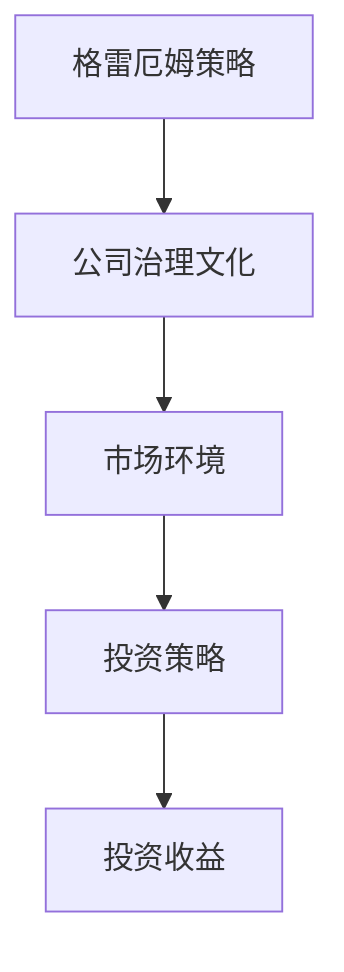
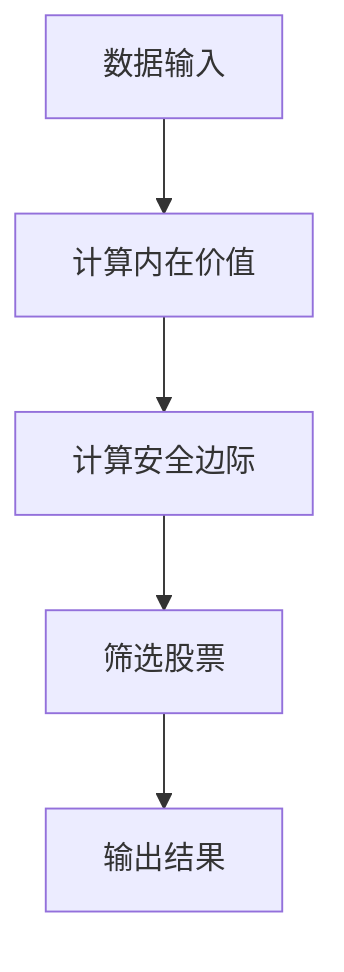
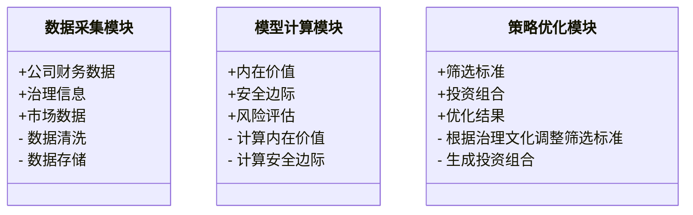
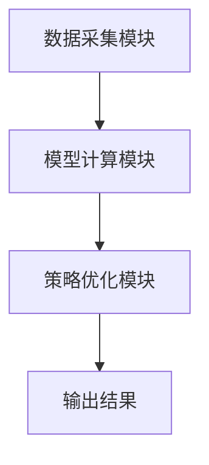

                 


```markdown
# 格雷厄姆特价股票策略在不同公司治理文化下的适应

> 关键词：格雷厄姆投资理论、公司治理文化、股票策略、投资策略优化、价值投资

> 摘要：本文深入探讨了格雷厄姆的价值投资策略在不同公司治理文化下的适应性。通过分析西方和东方公司治理文化的特点，结合数学模型和系统架构设计，提出了优化投资策略的方法。文章还包括实际案例分析和代码实现，为投资者提供了实践指导。

---

# 第一部分: 格雷厄姆特价股票策略的背景与核心概念

## 第1章: 格雷厄姆特价股票策略的起源与核心思想

### 1.1 格雷厄姆投资理论的起源

#### 1.1.1 价值投资的定义与核心理念
价值投资是一种长期投资策略，旨在通过寻找市场价格低于其内在价值的证券来实现超额收益。格雷厄姆的价值投资理论强调安全边际和对公司基本面的深入分析。其核心理念是：市场价格波动，而内在价值是投资决策的基础。

#### 1.1.2 格雷厄姆的投资策略与方法
格雷厄姆提出了一系列投资策略，包括：
- **低市盈率法**：选择市盈率低于市场平均水平的股票。
- **低市净率法**：选择市净率低于市场平均水平的股票。
- **高股息率法**：选择股息率高的股票。

#### 1.1.3 格雷厄姆策略在现代投资中的地位
格雷厄姆的策略为现代价值投资奠定了基础，尽管市场环境发生了变化，但其核心思想依然适用于今天的投资实践。

---

### 1.2 不同公司治理文化下的策略适应性

#### 1.2.1 公司治理文化的多样性
公司治理文化因国家和地区的经济、社会、法律环境而异。例如：
- **西方公司治理**：强调股东权益最大化，董事会结构透明，高管问责制严格。
- **东方公司治理**：强调关系型资本主义，董事会成员常由大股东或内部高管担任，注重长期关系和企业声誉。

#### 1.2.2 格雷厄姆策略在不同文化中的适应性
- **西方市场**：适合采用量化指标（如低市盈率、低市净率）筛选股票，同时需关注公司治理透明度。
- **东方市场**：需结合关系型资本主义的特点，关注公司与主要股东的关系，以及管理层稳定性。

---

# 第二部分: 格雷厄姆特价股票策略的核心概念与联系

## 第2章: 核心概念与公司治理文化的联系

### 2.1 核心概念原理

#### 2.1.1 格雷厄姆策略的核心要素
- **安全边际**：买入价格低于内在价值。
- **低估值**：通过市盈率、市净率等指标筛选。

#### 2.1.2 公司治理文化的核心要素
- **治理结构**：董事会、股东关系、高管问责。
- **文化背景**：西方注重短期业绩，东方注重长期关系。

---

### 2.2 核心概念属性特征对比表

| 核心概念 | 格雷厄姆策略 | 公司治理文化 |
|----------|--------------|--------------|
| 定义     | 寻找被低估的股票 | 公司内部治理结构与决策方式 |
| 特征     | 低市盈率、低市净率 | 股权结构、董事会结构、利益相关者关系 |
| 影响     | 投资收益 | 投资决策风险 |

---

### 2.3 ER实体关系图（Mermaid流程图）



---

# 第三部分: 格雷厄姆特价股票策略的数学模型与算法原理

## 第3章: 算法原理与实现

### 3.1 格雷厄姆策略的数学模型

#### 3.1.1 股票内在价值公式
$$ V = \frac{E}{k} $$
其中，\( V \) 是内在价值，\( E \) 是预期收益，\( k \) 是折现率。

#### 3.1.2 安全边际计算
$$ \text{安全边际} = V - P $$
其中，\( P \) 是市场价格。

### 3.2 格雷厄姆策略的优化算法



---

### 3.3 算法实现代码

```python
import pandas as pd

def graham_strategy(df, margin=0.2):
    df['intrinsic_value'] = df['earnings'] / df['discount_rate']
    df['安全边际'] = df['intrinsic_value'] - df['price']
    return df[df['安全边际'] > 0].sort_values('安全边际', ascending=False)
```

---

# 第四部分: 系统分析与架构设计

## 第4章: 系统架构设计

### 4.1 系统功能设计

#### 4.1.1 功能模块
- 数据采集模块：收集公司财务数据和治理信息。
- 模型计算模块：计算内在价值和安全边际。
- 策略优化模块：根据公司治理文化调整筛选标准。

#### 4.1.2 领域模型（Mermaid类图）



---

### 4.2 系统架构设计

#### 4.2.1 系统架构图（Mermaid架构图）



---

# 第五部分: 项目实战与案例分析

## 第5章: 项目实战

### 5.1 实际案例分析

#### 5.1.1 美国市场案例
分析一家美国公司，计算其内在价值和安全边际，判断是否符合格雷厄姆策略。

#### 5.1.2 中国市场案例
分析一家中国公司，结合公司治理文化，调整筛选标准，判断是否符合投资条件。

---

### 5.2 环境安装与代码实现

#### 5.2.1 环境安装
- 安装Python和相关库（pandas, numpy）。
- 数据来源：Yahoo Finance或本地数据。

#### 5.2.2 核心代码实现

```python
import pandas as pd

def calculate_intrinsic_value(company_data):
    company_data['intrinsic_value'] = company_data['earnings'] / company_data['discount_rate']
    return company_data

def apply_graham_strategy(dataframe, margin=0.2):
    dataframe['安全边际'] = dataframe['intrinsic_value'] - dataframe['price']
    dataframe['投资建议'] = dataframe['安全边际'].apply(lambda x: '买入' if x > 0 else '观望')
    return dataframe

# 示例数据
data = {
    'company': ['A', 'B', 'C'],
    'price': [50, 30, 40],
    'earnings': [10, 15, 8],
    'discount_rate': [0.1, 0.15, 0.12]
}
df = pd.DataFrame(data)
df = calculate_intrinsic_value(df)
df = apply_graham_strategy(df)
print(df)
```

---

## 第6章: 总结与展望

### 6.1 总结
格雷厄姆策略在不同公司治理文化下的适应性需要结合市场环境和公司治理特点进行调整。通过数学模型和系统设计，可以优化投资策略，提高投资收益。

### 6.2 最佳实践 tips
- 长期视角：价值投资需要耐心和长期视角。
- 风险管理：分散投资，控制风险。
- 持续学习：关注市场变化和公司治理动态。

---

# 附录

## 附录 A: 参考文献
- 格雷厄姆《证券分析》
- 现代公司治理研究文献

## 附录 B: 工具与库
- Python库：pandas, numpy
- 数据来源：Yahoo Finance

---

通过以上结构和内容，本文系统地探讨了格雷厄姆策略在不同公司治理文化下的适应性，结合理论分析、数学建模和实际案例，为投资者提供了深入的指导。
```

