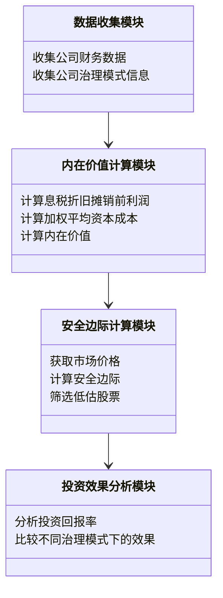
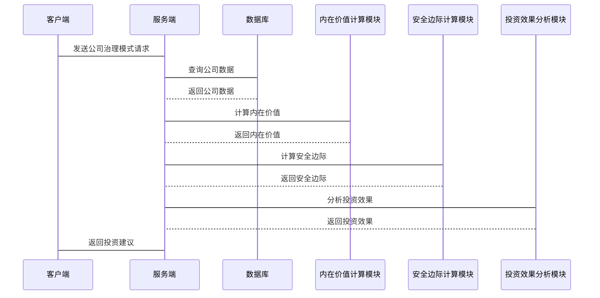

                 


# 格雷厄姆特价股票策略在不同公司治理模式下的效果

## 关键词：格雷厄姆策略，公司治理，股票投资，烟蒂股，价值投资

## 摘要：格雷厄姆的特价股票策略是一种基于价值投资的策略，旨在通过购买被市场低估的股票来实现长期收益。本文将探讨在不同公司治理模式下，格雷厄姆策略的效果如何变化。通过分析集中型、分散型和其他类型治理模式的特点，结合数学模型和实际案例，揭示公司治理对投资策略效果的影响，为投资者提供更全面的视角和策略选择。

---

# 第一部分: 格雷厄姆特价股票策略的背景与基础

## 第1章: 格雷厄姆投资理论的核心思想

### 1.1 格雷厄姆投资理论的核心思想

#### 1.1.1 价值投资的基本原理
价值投资的核心理念是寻找市场中被低估的资产，通过长期持有实现超额收益。格雷厄姆强调安全边际的重要性，即以低于内在价值的价格买入资产。

#### 1.1.2 格雷厄姆的烟蒂股概念
烟蒂股是指那些被市场忽视或低估的股票，通常具有较低的市盈率和市净率，但其内在价值远高于当前市场价格。

#### 1.1.3 特价股票的定义与特征
特价股票是指那些市场价格远低于其内在价值的股票，通常具有较高的股息收益率和较低的估值指标。

### 1.2 公司治理模式的多样性

#### 1.2.1 公司治理的基本概念
公司治理是指公司内部和外部利益相关者之间的权利和责任分配，旨在确保公司有效运作和股东权益保护。

#### 1.2.2 不同公司治理模式的分类
- **集中型治理模式**：公司由少数控股股东控制，通常表现为家族企业或内部人控制。
- **分散型治理模式**：公司股权分散，由外部机构投资者和散户股东共同持股。
- **其他治理模式**：如国家控股、机构控股等。

#### 1.2.3 公司治理与股价的关系
良好的公司治理能够提升投资者信心，改善公司估值，而治理失效可能导致股价波动和价值贬损。

---

## 第2章: 格雷厄姆策略与公司治理模式的结合

### 2.1 格雷厄姆策略在不同治理模式下的适用性

#### 2.1.1 集中型治理模式下的策略应用
在集中型治理模式下，控股股东通常对公司有较大的控制权，可能影响公司估值。格雷厄姆策略需要特别关注公司的财务健康状况和管理层诚信。

#### 2.1.2 分散型治理模式下的策略调整
分散型治理模式下，公司股权分散，管理层的行为可能受到更多外部监督。格雷厄姆策略可以更关注公司的基本面和成长潜力。

#### 2.1.3 国际化视角下的策略差异
不同国家的公司治理环境和监管政策不同，格雷厄姆策略在不同市场中的应用需要考虑当地法律和文化因素。

### 2.2 公司治理对格雷厄姆策略效果的影响

#### 2.2.1 治理结构与股价稳定性的关系
良好的治理结构能够提高股价稳定性，降低市场波动对策略效果的影响。

#### 2.2.2 管理层行为对公司估值的影响
管理层的行为直接影响公司的财务表现和市场估值，进而影响格雷厄姆策略的实施效果。

#### 2.2.3 股东权益保护机制的作用
有效的股东权益保护机制能够增强投资者信心，提升公司估值，从而间接影响格雷厄姆策略的效果。

---

# 第二部分: 格雷厄姆策略的核心概念与联系

## 第3章: 核心概念的定义与属性

### 3.1 核心概念的定义与属性

#### 3.1.1 核心概念的定义
- **内在价值**：股票的真正价值，基于公司未来现金流的现值。
- **安全边际**：买入价格与内在价值的差距，提供风险缓冲。

#### 3.1.2 核心概念的属性
- **稳定性**：内在价值相对稳定，不受短期市场波动影响。
- **可计算性**：内在价值可以通过数学模型进行估算。
- **可比性**：不同公司的内在价值可以通过比较分析。

### 3.2 核心概念的对比分析

#### 3.2.1 烟蒂股与成长股的对比
- 烟蒂股：低估值，高安全边际。
- 成长股：高增长潜力，可能高估值。

#### 3.2.2 不同治理模式下的公司估值对比
- 集中型治理：可能低估或高估，取决于控股股东的行为。
- 分散型治理：估值更接近内在价值，受外部监督影响较小。

---

## 第4章: 核心概念与公司治理模式的联系

### 4.1 公司治理模式对格雷厄姆策略的影响

#### 4.1.1 集中型治理模式下的策略调整
- 需要额外关注管理层的诚信和财务透明度。
- 股东权益保护机制可能较弱，需谨慎评估安全边际。

#### 4.1.2 分散型治理模式下的策略优化
- 受益于外部监督，公司治理风险较低。
- 更容易找到低估的股票，提升策略效果。

### 4.2 核心概念的结构与公司治理模式的关系

#### 4.2.1 核心概念的结构
- 内在价值：基于公司基本面分析。
- 安全边际：基于市场价格与内在价值的差距。

#### 4.2.2 公司治理模式的影响
- 公司治理模式影响管理层行为和公司估值。
- 不同治理模式下，内在价值的计算需要考虑公司治理因素。

---

## 第5章: 核心概念的属性与公司治理模式的关联

### 5.1 核心概念的属性

#### 5.1.1 内在价值的稳定性
- 公司治理良好的企业，内在价值更稳定。
- 公司治理不佳的企业，内在价值可能波动较大。

#### 5.1.2 安全边际的可计算性
- 分散型治理模式下，安全边际更容易计算。
- 集中型治理模式下，需考虑控股股东的影响，安全边际可能较小。

### 5.2 核心概念的可比性

#### 5.2.1 不同治理模式下的公司估值比较
- 集中型治理：可能低估或高估，取决于控股股东的动机。
- 分散型治理：估值更接近内在价值，受外部监督影响较小。

#### 5.2.2 核心概念的可比性
- 通过比较分析，识别不同治理模式下被低估的股票。

---

# 第三部分: 格雷厄姆策略的算法原理

## 第6章: 格雷厄姆策略的算法原理

### 6.1 算法原理的定义与属性

#### 6.1.1 算法原理的定义
格雷厄姆策略的算法原理是基于内在价值计算和安全边际分析的投资方法。

#### 6.1.2 算法原理的属性
- **可计算性**：通过数学公式计算内在价值和安全边际。
- **可验证性**：通过历史数据验证策略的有效性。
- **可扩展性**：适用于不同公司治理模式下的股票筛选。

### 6.2 格雷厄姆策略的算法步骤

#### 6.2.1 内在价值计算
- 通过现金流折现法计算公司的内在价值。
- 使用格雷厄姆公式：内在价值 = 息税折旧摊销前利润 / 加权平均资本成本。

#### 6.2.2 安全边际计算
- 安全边际 = 内在价值 - 市场价格。
- 选择安全边际为正的股票进行投资。

#### 6.2.3 公司治理因素的考虑
- 对不同治理模式下的公司进行分类。
- 根据治理模式调整内在价值计算和安全边际分析。

### 6.3 格雷厄姆策略的数学模型

#### 6.3.1 内在价值公式
$$ \text{内在价值} = \frac{\text{息税折旧摊销前利润}}{\text{加权平均资本成本}} $$

#### 6.3.2 安全边际公式
$$ \text{安全边际} = \text{内在价值} - \text{市场价格} $$

---

## 第7章: 格雷厄姆策略的数学模型

### 7.1 数学模型的定义与属性

#### 7.1.1 数学模型的定义
数学模型是格雷厄姆策略的核心工具，用于计算内在价值和安全边际。

#### 7.1.2 数学模型的属性
- **准确性**：模型基于历史数据和财务指标，具有较高的准确性。
- **可扩展性**：适用于不同公司治理模式下的股票分析。

### 7.2 数学模型的实现步骤

#### 7.2.1 内在价值计算
- 收集公司财务数据，计算息税折旧摊销前利润。
- 估计加权平均资本成本，计算内在价值。

#### 7.2.2 安全边际计算
- 获取市场价格，计算安全边际。
- 选择安全边际为正的股票进行投资。

### 7.3 数学模型的对比分析

#### 7.3.1 不同治理模式下的内在价值对比
- 集中型治理：可能低估内在价值，需谨慎评估。
- 分散型治理：内在价值更接近市场价格，策略效果较好。

#### 7.3.2 安全边际的对比分析
- 集中型治理：安全边际可能较小，需考虑控股股东的影响。
- 分散型治理：安全边际较大，策略效果较好。

---

# 第四部分: 系统分析与架构设计

## 第8章: 系统分析与架构设计

### 8.1 系统分析

#### 8.1.1 问题场景介绍
分析不同公司治理模式下，格雷厄姆策略的效果如何变化。

#### 8.1.2 项目介绍
构建一个基于格雷厄姆策略的投资系统，分析不同公司治理模式下的股票筛选和投资效果。

### 8.2 系统功能设计

#### 8.2.1 系统功能模块
- 数据收集模块：收集公司财务数据和治理模式信息。
- 内在价值计算模块：基于财务数据计算内在价值。
- 安全边际计算模块：计算安全边际，筛选低估股票。
- 投资效果分析模块：分析不同治理模式下的投资效果。

#### 8.2.2 领域模型（Mermaid类图）


### 8.3 系统架构设计

#### 8.3.1 系统架构设计（Mermaid架构图）


#### 8.3.2 系统接口设计
- REST API接口：用于客户端与服务端的数据交互。
- 数据库接口：用于存储和检索公司数据。

#### 8.3.3 系统交互设计（Mermaid序列图）


---

## 第9章: 项目实战与案例分析

### 9.1 环境安装与配置

#### 9.1.1 环境要求
- 操作系统：Windows/Mac/Linux
- Python版本：3.6+
- 依赖库：Pandas, NumPy, Matplotlib, Scikit-learn

#### 9.1.2 安装步骤
```bash
pip install pandas numpy matplotlib scikit-learn
```

### 9.2 核心代码实现

#### 9.2.1 数据收集模块
```python
import pandas as pd

def collect_data():
    # 示例：从CSV文件读取数据
    df = pd.read_csv('company_data.csv')
    return df
```

#### 9.2.2 内在价值计算模块
```python
def calculate_intrinsic_value(df):
    df['EV'] = df['EBITDA'] / df['WACC']
    return df
```

#### 9.2.3 安全边际计算模块
```python
def calculate_margin_of_safety(df):
    df['Market Price'] = df['Close Price']
    df['Margin of Safety'] = df['EV'] - df['Market Price']
    return df[df['Margin of Safety'] > 0]
```

#### 9.2.4 投资效果分析模块
```python
def analyze_investment_effectiveness(filtered_df):
    returns = filtered_df['Return'].mean()
    return returns
```

### 9.3 案例分析与结果解读

#### 9.3.1 案例分析
假设我们有两家公司，一家采用集中型治理模式，另一家采用分散型治理模式。我们分别计算它们的内在价值和安全边际。

##### 集中型治理模式下的公司A：
- EBITDA = 1000万
- WACC = 8%
- 市场价格 = 10元
- 内在价值 = 1000万 / 0.08 = 1250万
- 安全边际 = 1250万 - 10元 = 1240万

##### 分散型治理模式下的公司B：
- EBITDA = 1200万
- WACC = 8%
- 市场价格 = 12元
- 内在价值 = 1200万 / 0.08 = 1500万
- 安全边际 = 1500万 - 12元 = 1488万

##### 投资效果分析：
- 公司A的安全边际为1240万，公司B的安全边际为1488万。
- 公司B的内在价值更高，且安全边际更大，因此在分散型治理模式下，格雷厄姆策略的效果更佳。

### 9.4 项目小结

#### 9.4.1 项目总结
通过案例分析，我们发现分散型治理模式下的公司更符合格雷厄姆策略的要求，安全边际更大，投资回报率更高。

#### 9.4.2 项目经验
在实际投资中，需要结合公司治理模式和财务指标，综合评估公司的内在价值和安全边际，制定合适的投资策略。

---

## 第10章: 最佳实践与注意事项

### 10.1 最佳实践

#### 10.1.1 小结
格雷厄姆策略在不同公司治理模式下的效果存在差异，分散型治理模式下的策略效果更佳。

#### 10.1.2 注意事项
- **风险控制**：在实际投资中，需考虑市场波动和其他风险因素。
- **持续学习**：不断更新投资知识和策略，适应市场变化。
- **多元化投资**：分散投资，降低单一股票的风险。

### 10.2 拓展阅读

#### 10.2.1 推荐书籍
- 《The Intelligent Investor》 by Benjamin Graham
- 《公司治理与企业绩效》 by 吴水澎

#### 10.2.2 推荐文章
- 格雷厄姆策略在现代投资中的应用
- 公司治理对股价的影响分析

---

# 结语

通过本文的分析，我们深入探讨了格雷厄姆特价股票策略在不同公司治理模式下的效果。我们发现，分散型治理模式下的公司更符合格雷厄姆策略的要求，安全边际更大，投资回报率更高。在实际投资中，投资者需要结合公司治理模式和财务指标，综合评估公司的内在价值和安全边际，制定合适的投资策略。

