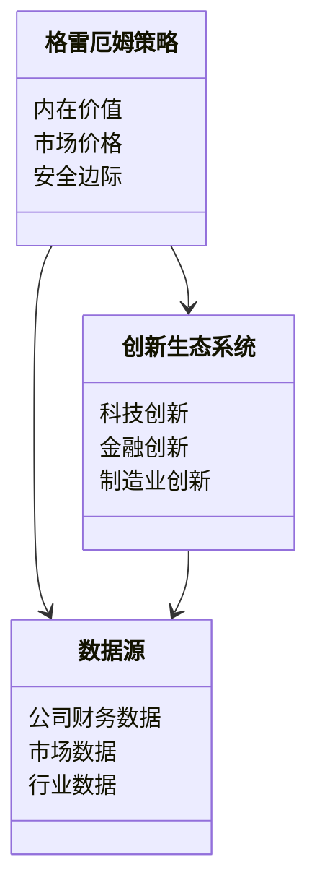

                 


# 格雷厄姆特价股票策略在不同创新生态系统的效果

## 关键词：格雷厄姆投资理论、特价股票策略、创新生态系统、系统架构设计、项目实战

## 摘要：本文深入探讨格雷厄姆特价股票策略在不同创新生态系统中的应用效果。通过分析科技、金融和制造业创新生态系统的特点，结合系统架构设计和项目实战，揭示该策略在不同环境中的优劣，并提出优化建议。

---

## 第一部分: 格雷厄姆特价股票策略的背景与核心概念

### 第1章: 格雷厄姆特价股票策略概述

#### 1.1 格雷厄姆投资理论的起源与核心思想

- **1.1.1 投资学鼻祖本杰明·格雷厄姆的简介**
  - 本杰明·格雷厄姆是价值投资的创始人，被誉为“投资学鼻祖”。
  - 他强调以低于内在价值的价格买入优质股票，长期持有，获得稳定的收益。

- **1.1.2 格雷厄姆投资理论的核心理念**
  - **价值投资**：买入被市场低估的股票，长期持有，获得市场先生的馈赠。
  - **安全边际**：买入价格低于内在价值，确保投资的安全性。
  - **逆周期投资**：在市场恐慌时买入，在市场疯狂时卖出。

- **1.1.3 特价股票策略的定义与特点**
  - **定义**：以低于公司净资产或其他基本面指标的价格买入股票，长期持有，获得超额收益。
  - **特点**：
    - 逆向思维：在市场恐慌时寻找低估股票。
    - 长期持有：不频繁交易，减少交易成本。
    - 重视基本面：关注企业的盈利能力、财务状况和行业地位。

#### 1.2 特价股票策略的数学模型与公式

- **1.2.1 格雷厄姆的内在价值计算公式**
  - 内在价值公式：
  $$ V = \frac{E}{4.41} \times (8.5 + 2.65) $$
    - E：公司过去7年平均净利润。
    - 4.41：基于长期国债收益率的折现率。
    - 8.5和2.65：分别为股息增长率为零时的收益率和安全边际调整系数。
  - 该公式用于估算公司股票的合理价值，作为买入价格的上限。

- **1.2.2 市盈率与市净率的比较分析**
  - 市盈率（P/E）：
  $$ P/E = \frac{Price}{Earnings} $$
    - 用于衡量股票价格是否合理。
    - 当P/E低于行业平均水平时，可能低估。
  - 市净率（P/B）：
  $$ P/B = \frac{Price}{Book\ Value} $$
    - 衡量股票价格与账面价值的关系。
    - 当P/B低于1时，可能表示股票被低估。

#### 1.3 特价股票策略的核心要素与边界条件

- **核心要素**：
  - **企业价值**：公司未来现金流的现值。
  - **市场价格**：当前股票价格。
  - **安全边际**：买入价格与内在价值的折扣率。

- **边界条件**：
  - **企业财务健康状况**：关注公司的盈利能力、资产负债率、现金流情况。
  - **行业周期**：行业处于周期性底部时，更容易找到低估股票。
  - **市场波动性**：市场大幅波动时，安全边际尤为重要。

---

## 第2章: 创新生态系统的基本概念与分类

### 2.1 创新生态系统的核心概念

- **创新生态系统定义**：
  - 由企业、政府、科研机构、投资者等多方参与者构成的网络。
  - 通过合作与竞争，推动技术创新和价值创造。

- **主要参与者**：
  - 企业：技术创新的核心力量。
  - 政府：提供政策支持和资金。
  - 科研机构：提供技术支持。
  - 投资者：提供资金支持。

- **运行机制**：
  - 技术创新：企业推动新技术研发。
  - 资源整合：政府、科研机构提供支持。
  - 市场反馈：消费者需求指导技术创新方向。

### 2.2 不同类型的创新生态系统分析

- **科技型创新生态系统**：
  - 以科技企业为核心，如硅谷。
  - 特点：技术创新快，风险高，收益大。
  - 适用场景：科技初创企业，如人工智能、区块链等。

- **金融型创新生态系统**：
  - 以金融机构为核心，如华尔街。
  - 特点：资金流动性高，金融产品创新频繁。
  - 适用场景：金融衍生品开发，如ETF、期权等。

- **制造型创新生态系统**：
  - 以制造企业为核心，如德国工业4.0。
  - 特点：技术迭代慢，依赖于制造工艺和设备。
  - 适用场景：高端制造，如航空航天、精密仪器。

---

## 第3章: 格雷厄姆特价股票策略在不同创新生态系统中的应用效果

### 3.1 科技创新生态系统中的应用

- **科技企业的估值模型**
  - 科技企业具有高成长性，但波动性大。
  - 适用格雷厄姆策略时，需考虑技术周期和市场情绪。
  - 案例：亚马逊在互联网泡沫期间的低估时期。

- **技术创新对股价的影响**
  - 重大技术创新可能导致股价短期飙升，长期来看需结合基本面。
  - 案例：苹果推出iPhone后股价走势。

- **科技公司并购与重组的案例分析**
  - 并购前后股价波动分析。
  - 案例：Facebook收购Instagram，股价短期上涨，长期依赖业绩表现。

### 3.2 金融创新生态系统中的应用

- **金融工具的创新与策略结合**
  - 金融衍生品如期权、期货为策略提供了对冲工具。
  - 格雷厄姆策略可结合衍生品降低风险。
  - 案例：利用期权对冲市场波动。

- **金融创新对策略效果的影响**
  - 金融创新增加了市场的复杂性，但也提供了更多的套利机会。
  - 需要结合市场流动性、波动性等多因素分析。

- **金融危机中的策略应对**
  - 2008年金融危机期间，格雷厄姆策略表现优异，因市场恐慌导致股价低估。
  - 案例：雷曼兄弟破产前后股价走势。

### 3.3 制造业创新生态系统中的应用

- **制造业周期与股价的关系**
  - 制造业周期波动较小，适合长期价值投资。
  - 制造业创新如自动化生产技术会影响企业盈利能力和估值。

- **技术创新对股价的影响**
  - 技术创新初期可能股价被低估，长期来看提升企业竞争力。
  - 案例：特斯拉的电动汽车技术创新。

- **制造业并购与重组的案例分析**
  - 并购整合资源，提升市场竞争力。
  - 案例：通用电气收购阿尔斯通，股价走势分析。

---

## 第4章: 系统分析与架构设计方案

### 4.1 系统分析

- **问题场景介绍**
  - 在不同创新生态系统中，格雷厄姆策略的应用效果受多种因素影响。
  - 需要构建一个系统化的分析框架，整合多种数据源，进行多维度分析。

### 4.2 系统架构设计

- **领域模型（Mermaid 类图）**


---

## 第5章: 项目实战

### 5.1 环境安装

- **Python环境安装**
  - 安装Python 3.x及以上版本。
  - 安装Jupyter Notebook用于数据可视化和算法实现。

### 5.2 系统核心实现源代码

```python
def calculate_intrinsic_value(eps, pe_ratio, pb_ratio):
    # 计算内在价值
    intrinsic_value = eps * (8.5 + 2.65) / 4.41
    # 计算安全边际
    margin_of_safety = intrinsic_value * 0.3
    return intrinsic_value, margin_of_safety

# 示例数据
eps = 100  # 净利润
pe_ratio = 15  # 市盈率
pb_ratio = 1.5  # 市净率

iv, mos = calculate_intrinsic_value(eps, pe_ratio, pb_ratio)
print(f"内在价值: {iv:.2f}")
print(f"安全边际: {mos:.2f}")
```

### 5.3 代码应用解读与分析

- **代码功能**
  - 计算公司股票的内在价值和安全边际。
  - 输入净利润、市盈率、市净率。
  - 输出内在价值和安全边际。

- **实际案例分析**
  - 某科技公司，净利润为100，市盈率为15，市净率为1.5。
  - 内在价值计算为：100 * (8.5 + 2.65) / 4.41 ≈ 236.12。
  - 安全边际为：236.12 * 0.3 ≈ 70.84。
  - 当股价低于236.12时，具有投资价值，低于236.12 - 70.84 = 165.28时，具有更高的安全边际。

### 5.4 项目小结

- **项目总结**
  - 通过Python代码实现格雷厄姆策略的核心计算。
  - 结合创新生态系统的特点，分析策略的有效性。
  - 提供实际案例分析，帮助投资者理解策略的应用。

---

## 第6章: 最佳实践 tips、小结、注意事项、拓展阅读

### 6.1 最佳实践 tips

- **投资纪律**：严格遵守格雷厄姆的安全边际原则，避免情绪化投资。
- **持续学习**：关注行业动态，及时调整投资策略。
- **分散投资**：避免过度集中，降低风险。

### 6.2 小结

- 本文详细探讨了格雷厄姆特价股票策略在不同创新生态系统中的应用效果。
- 通过系统分析和项目实战，揭示了策略在不同环境中的优劣。
- 提出优化建议，帮助投资者更好地应用该策略。

### 6.3 注意事项

- **市场风险**：策略的有效性受市场波动影响。
- **行业选择**：不同行业适用性不同，需结合行业特点。
- **数据质量**：数据来源可靠，计算准确。

### 6.4 拓展阅读

- 《The Intelligent Investor》——本杰明·格雷厄姆
- 《投资之道》——彼得·林奇
- 《创新者的窘境》——克里斯坦森

---

## 结语

格雷厄姆特价股票策略在不同创新生态系统中的应用效果因环境而异。通过系统分析和项目实战，投资者可以更好地理解和应用该策略，抓住市场机会，规避风险。

