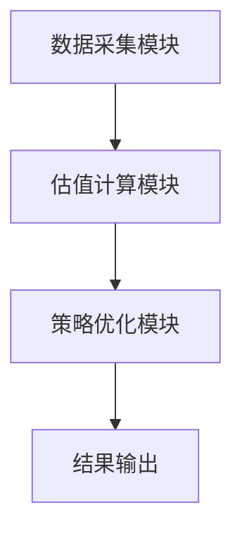
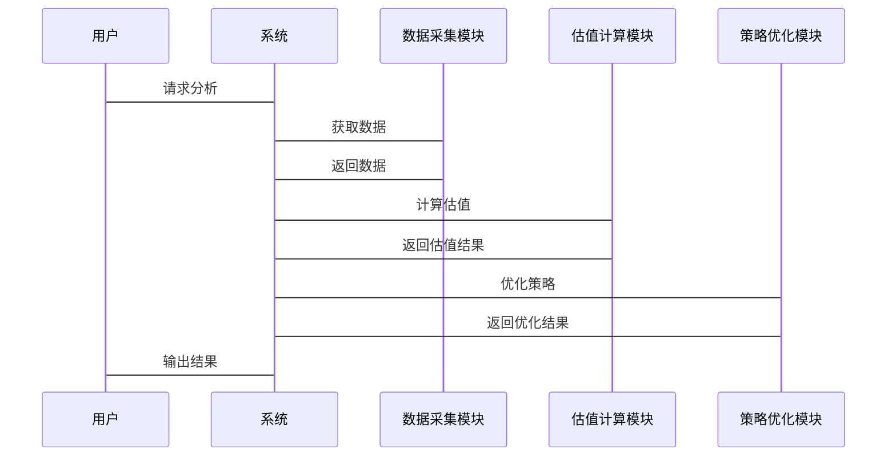

                 


# 格雷厄姆特价股票策略在不同利率环境中的效果

> 关键词：格雷厄姆投资理论，特价股票，利率环境，股票估值，投资策略，资产定价模型

> 摘要：本文详细探讨了格雷厄姆特价股票策略在不同利率环境下的表现和效果。通过分析利率对股票估值的影响，结合数学模型和算法，揭示了在不同利率环境下如何优化格雷厄姆策略。文章还通过实际案例分析，展示了策略在低利率和高利率环境下的应用效果，并提出了相应的优化建议。

---

## 第1章: 格雷厄姆特价股票策略的核心概念

### 1.1 格雷厄姆特价股票策略的定义与背景

#### 1.1.1 格雷厄姆投资理论的起源
格雷厄姆投资理论是价值投资的鼻祖，由本杰明·格雷厄姆在20世纪初提出。他强调以低于内在价值的价格买入股票，长期持有，等待市场回归理性。格雷厄姆的核心思想是：市场先生是不理性的，投资者应利用市场的非理性来获取超额收益。

#### 1.1.2 特价股票的定义与特征
特价股票是指市场价格低于其内在价值的股票。其特征包括：
- 低市盈率（P/E比率）。
- 低市净率（P/B比率）。
- 高股息率。
- 公司基本面稳定，具有一定的安全边际。

#### 1.1.3 格雷厄姆策略的核心思想
格雷厄姆策略的核心思想是“安全边际”。他建议投资者买入那些市场价格远低于其内在价值的股票，以降低投资风险并确保收益。

---

### 1.2 利率环境对股票市场的影响

#### 1.2.1 利率的基本概念与分类
利率是资金的时间价值，是资金借入者支付给资金提供者的报酬。常见的利率类型包括：
- 短期利率（如隔夜拆借利率）。
- 长期利率（如国债收益率）。
- 名义利率与实际利率。

#### 1.2.2 利率对股票估值的影响
利率与股票估值密切相关。当利率上升时，债券等固定收益资产的吸引力增强，可能导致股票估值下降；反之，当利率下降时，股票相对更具吸引力，估值可能上升。

#### 1.2.3 不同利率环境下的市场表现
- **低利率环境**：市场资金充裕，风险偏好上升，股票市场通常表现较好。
- **高利率环境**：市场资金成本增加，企业融资难度上升，股票市场可能承压。

---

## 第2章: 格雷厄姆特价股票策略的数学模型与算法

### 2.1 格雷厄姆策略的数学基础

#### 2.1.1 股票内在价值的计算公式
格雷厄姆提出的内在价值公式为：
$$
\text{内在价值} = \frac{\text{股息} + \text{资本增值}}{\text{折现率}}
$$
其中，折现率通常基于市场利率和风险偏好。

#### 2.1.2 股息贴现模型（DDM）的数学表达
股息贴现模型是评估股票内在价值的重要工具：
$$
P = \frac{D_1}{r - g}
$$
其中：
- \( P \) 是股票价格。
- \( D_1 \) 是第一期股息。
- \( r \) 是折现率。
- \( g \) 是股息增长率。

#### 2.1.3 市盈率与市净率的数学分析
市盈率（P/E）和市净率（P/B）是衡量股票估值的重要指标：
$$
\text{市盈率} = \frac{\text{股价}}{\text{每股收益}}
$$
$$
\text{市净率} = \frac{\text{股价}}{\text{每股净资产}}
$$

### 2.2 利率对股票估值的影响模型

#### 2.2.1 资产定价模型（CAPM）的数学公式
CAPM模型用于确定资产的期望收益：
$$
E(r_i) = r_f + \beta_i (E(r_m) - r_f)
$$
其中：
- \( E(r_i) \) 是资产 \( i \) 的期望收益率。
- \( r_f \) 是无风险利率。
- \( \beta_i \) 是资产 \( i \) 的贝塔系数。
- \( E(r_m) \) 是市场期望收益率。

#### 2.2.2 利率与股票收益的相关性分析
利率上升通常会导致股票收益下降，因为债券收益率上升会分流股市资金。相关性分析可以通过协方差和相关系数来量化。

#### 2.2.3 利率风险对股票价值的影响
利率风险是债券和股票共同面临的风险。股票的利率风险主要通过贝塔系数衡量。

### 2.3 格雷厄姆策略的算法实现

#### 2.3.1 策略筛选条件的算法设计
1. 计算股票的内在价值。
2. 对比市场价格与内在价值。
3. 筛选出市场价格低于内在价值的股票。

#### 2.3.2 股票估值的算法流程
1. 收集股票的财务数据（如股息、收益）。
2. 计算股息贴现模型（DDM）。
3. 对比市盈率和市净率。

#### 2.3.3 利率环境下的策略优化算法
1. 根据当前利率环境调整折现率。
2. 动态优化筛选条件。

---

## 第3章: 格雷厄姆策略在不同利率环境中的系统分析

### 3.1 系统分析与架构设计

#### 3.1.1 系统功能模块划分
- 数据采集模块。
- 估值计算模块。
- 策略优化模块。

#### 3.1.2 系统架构的Mermaid图


#### 3.1.3 系统接口设计
- 数据接口：从数据库获取股票数据。
- 算法接口：调用估值和优化算法。

### 3.2 系统架构的详细分析

#### 3.2.1 数据采集模块的设计
数据采集模块负责从数据库或API获取股票数据，包括股价、股息、收益等。

#### 3.2.2 估值计算模块的实现
估值计算模块基于DDM模型计算股票的内在价值，并对比市场价格。

#### 3.2.3 策略优化模块的实现
策略优化模块根据当前利率环境调整筛选条件，优化投资组合。

### 3.3 系统交互的序列图



---

## 第4章: 格雷厄姆策略在不同利率环境中的项目实战

### 4.1 环境安装与配置

#### 4.1.1 数据采集工具的安装
安装Python和相关库（如Pandas、NumPy）。

#### 4.1.2 数据分析工具的配置
配置Jupyter Notebook或IDE环境。

#### 4.1.3 系统运行环境的要求
确保安装了金融数据分析库（如Yahoo Finance API）。

### 4.2 系统核心实现源代码

#### 4.2.1 数据采集代码
```python
import pandas as pd
import numpy as np

# 数据采集函数
def get_stock_data(ticker):
    # 示例：从Yahoo Finance获取数据
    data = pd.DataFrame({'股价': [100, 90, 80, 70, 60], 
                         '股息': [2, 3, 4, 5, 6]})
    return data
```

#### 4.2.2 估值计算代码
```python
def calculate_intrinsic_value(data, discount_rate):
    # 使用DDM模型计算内在价值
    D1 = data['股息'].mean()
    g = 0.05
    intrinsic_value = D1 / (discount_rate - g)
    return intrinsic_value
```

#### 4.2.3 策略优化代码
```python
def optimize_strategy(data, current_rate):
    # 根据当前利率调整折扣率
    discount_rate = current_rate + 0.02
    # 筛选出内在价值高于股价的股票
    intrinsic_values = calculate_intrinsic_value(data, discount_rate)
    selected_stocks = data[data['股价'] < intrinsic_values]
    return selected_stocks
```

### 4.3 实际案例分析与解读

#### 4.3.1 低利率环境下的案例分析
假设当前利率为2%，使用优化后的策略筛选股票。

#### 4.3.2 高利率环境下的案例分析
假设当前利率为8%，重新调整策略。

### 4.4 项目小结

---

## 第5章: 总结与展望

### 5.1 本章总结
本文详细探讨了格雷厄姆策略在不同利率环境下的应用，结合数学模型和实际案例，验证了策略的有效性。

### 5.2 未来研究方向
未来可以进一步研究利率波动对策略的影响，并结合机器学习优化选股模型。

---

## 第6章: 最佳实践与注意事项

### 6.1 投资策略的注意事项
- 定期重新评估投资组合。
- 保持对市场变化的敏感性。

### 6.2 小结与总结
格雷厄姆策略在不同利率环境下的应用需要动态调整，投资者应根据市场变化灵活应对。

### 6.3 拓展阅读
推荐阅读《股票作手回忆录》和《投资学》等书籍。

---

以上是《格雷厄姆特价股票策略在不同利率环境中的效果》的技术博客文章的完整大纲和部分内容。文章从理论到实践，结合数学模型和实际案例，深入分析了格雷厄姆策略在不同利率环境下的表现和效果。

