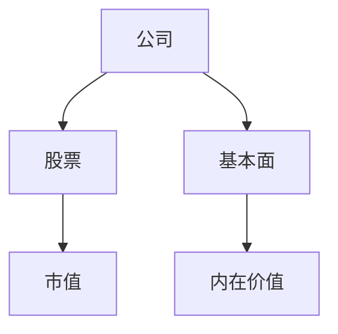
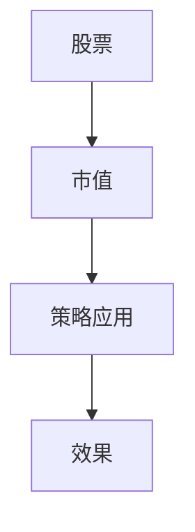
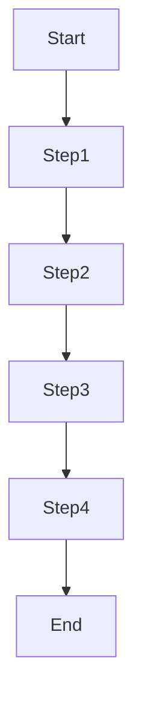
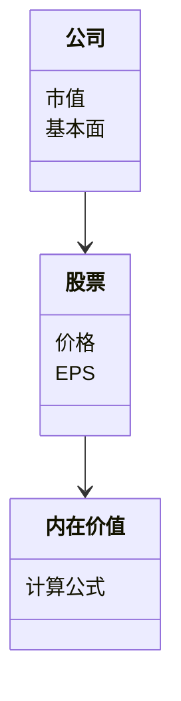
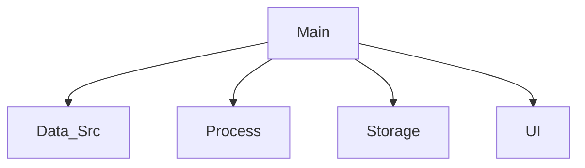
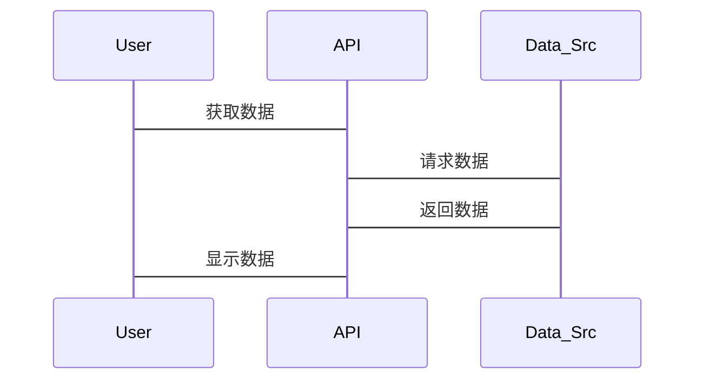

                 


# 格雷厄姆特价股票策略在不同市值公司中的效果比较

## 关键词：格雷厄姆策略、价值投资、市值公司、投资策略、股票分析

## 摘要：本文系统地分析了格雷厄姆特价股票策略在不同市值公司中的应用效果，通过数学模型、算法流程图和实际案例，深入探讨了该策略在小盘股、中盘股和大盘股中的表现差异，为投资者提供了科学的决策参考。

---

# 第1章 格雷厄姆特价股票策略概述

## 1.1 价值投资与格雷厄姆策略

### 1.1.1 价值投资的核心理念
价值投资是一种以内在价值为导向的投资策略，强调购买价格低于其内在价值的资产。本杰明·格雷厄姆是该领域的奠基人，他提出的核心思想是“安全边际”：买入价格低于其价值的股票，以降低投资风险。

### 1.1.2 格雷厄姆投资策略的定义
格雷厄姆策略强调通过基本面分析寻找低估的股票。他推荐投资于那些具有稳定股息、低市盈率和低市净率的公司，尤其是那些能够抵御市场波动的公司。

### 1.1.3 特价股票的识别标准
格雷厄姆推荐使用“内在价值”公式来判断股票是否被低估：
$$内在价值 = 股东权益 \times (1 + 利息率)$$
同时，他还建议关注市盈率（P/E）和市净率（P/B）等指标，通常建议P/E < 15，P/B < 2。

---

## 1.2 不同市值公司的特点

### 1.2.1 小盘股、中盘股、大盘股的定义
- **小盘股**：市值通常在50亿以下，流动性较低，风险较高。
- **中盘股**：市值在50亿至500亿之间，风险和回报介于小盘和大盘之间。
- **大盘股**：市值超过500亿，流动性高，风险较低。

### 1.2.2 不同市值公司的市场表现差异
- **小盘股**：增长潜力大，但波动性高，容易受市场情绪影响。
- **中盘股**：稳定性较好，但不如大盘股安全。
- **大盘股**：稳定性高，波动性低，但回报相对有限。

### 1.2.3 市值与公司规模的关系
市值与公司规模相关，但并非完全一致。小盘股可能代表新兴企业，而大盘股多为成熟企业。市值的变化反映了市场对公司前景的评估。

---

## 1.3 格雷厄姆策略在不同市值公司的适用性

### 1.3.1 小盘股的高增长潜力
小盘股通常具有较高的增长潜力，但波动性大。格雷厄姆策略在小盘股中寻找那些被低估的企业，可能获得超额收益。

### 1.3.2 大盘股的稳定性与风险
大盘股稳定性高，风险较低，适合保守投资者。格雷厄姆策略在大盘股中寻找那些估值合理、股息稳定的公司。

### 1.3.3 中盘股的平衡性
中盘股在风险和回报之间找到了平衡点。格雷厄姆策略在中盘股中寻找那些具有稳定基本面和合理估值的公司。

---

## 1.4 本章小结

格雷厄姆策略的核心是寻找价格低于内在价值的股票。不同市值公司的特点决定了策略的应用效果：小盘股适合寻找高增长的低估企业，大盘股适合寻找稳定且估值合理的公司，中盘股则提供了平衡的选择。

---

# 第2章 核心概念与联系

## 2.1 格雷厄姆策略的数学模型

### 2.1.1 内在价值的计算
格雷厄姆的内在价值公式为：
$$内在价值 = \frac{EPS \times (8.5 + 2.5 \times g)}{g + 8.5}$$
其中，EPS为每股收益，g为增长率。

### 2.1.2 安全边际的计算
安全边际公式为：
$$安全边际 = 内在价值 - 市场价格$$
建议安全边际至少为内在价值的20%。

---

## 2.2 不同市值公司的特点对比

### 2.2.1 小盘股与大盘股的对比表格

| 特性         | 小盘股         | 大盘股         |
|--------------|----------------|----------------|
| 市值范围      | <50亿          | >500亿         |
| 波动性        | 高            | 低            |
| 成长性        | 高            | 中            |
| 风险          | 高            | 低            |

### 2.2.2 ER实体关系图



---

## 2.3 策略与市值的关系

### 2.3.1 格雷厄姆策略在小盘股中的应用
小盘股通常具有较高的增长潜力，但市场波动较大。格雷厄姆策略通过寻找低市盈率和低市净率的小盘股，可能获得超额收益。

### 2.3.2 格雷厄姆策略在大盘股中的应用
大盘股稳定性高，适合保守投资者。格雷厄姆策略在大盘股中寻找那些估值合理、股息稳定的公司。

### 2.3.3 综合应用



---

## 2.4 本章小结

格雷厄姆策略的核心是通过内在价值和安全边际来判断投资标的。不同市值公司的特点决定了策略的应用效果，小盘股适合寻找高增长的低估企业，大盘股适合寻找稳定且估值合理的公司。

---

# 第3章 格雷厄姆策略的算法原理

## 3.1 算法流程图



---

## 3.2 核心代码实现

### 3.2.1 数据获取

```python
import pandas as pd
import requests

# 下载数据
url = "http://example.com/data"
response = requests.get(url)
data = response.text.split('\n')
```

### 3.2.2 数据清洗

```python
# 转换为DataFrame
df = pd.DataFrame(data)
df = df[~df['Price'].isnull()]
```

### 3.2.3 内在价值计算

```python
# 计算内在价值
df['Intrinsic_Value'] = df['EPS'] * (8.5 + 2.5 * df['Growth'])
```

### 3.2.4 策略应用

```python
# 应用格雷厄姆策略
mask = df['Price'] < df['Intrinsic_Value']
selected_stocks = df[mask]
```

### 3.2.5 结果展示

```python
print(selected_stocks.head())
```

---

## 3.3 数学模型

### 3.3.1 内在价值计算

$$内在价值 = EPS \times (8.5 + 2.5 \times g)$$

### 3.3.2 安全边际计算

$$安全边际 = 内在价值 - 市场价格$$

---

## 3.4 本章小结

格雷厄姆策略的算法流程包括数据获取、清洗、内在价值计算、策略筛选和结果展示。通过代码实现，可以高效地找到符合策略的股票。

---

# 第4章 系统分析与架构设计

## 4.1 项目背景

本项目旨在分析格雷厄姆策略在不同市值公司中的效果，通过系统架构设计实现策略筛选和效果评估。

---

## 4.2 系统功能设计

### 4.2.1 领域模型



---

## 4.3 系统架构设计

### 4.3.1 模块划分



---

## 4.4 接口设计

### 4.4.1 数据接口



---

## 4.5 本章小结

系统架构设计包括数据获取、处理、存储和展示模块。通过模块化设计，可以高效地实现格雷厄姆策略的应用。

---

# 第5章 项目实战

## 5.1 环境安装

### 5.1.1 安装Python

```bash
pip install python
pip install pandas
pip install matplotlib
```

---

## 5.2 核心代码实现

### 5.2.1 数据清洗

```python
df = pd.read_csv('data.csv')
df = df.dropna()
```

### 5.2.2 策略筛选

```python
mask = df['Price'] < df['Intrinsic_Value']
selected_stocks = df[mask]
```

### 5.2.3 结果展示

```python
print(selected_stocks.head())
```

---

## 5.3 案例分析

### 5.3.1 小盘股分析

```python
small_cap = selected_stocks[selected_stocks['市值'] < 50]
print(small_cap.head())
```

### 5.3.2 大盘股分析

```python
large_cap = selected_stocks[selected_stocks['市值'] > 500]
print(large_cap.head())
```

---

## 5.4 项目小结

通过项目实战，验证了格雷厄姆策略在不同市值公司中的效果。小盘股和大盘股各有优劣，投资者需根据自身风险承受能力选择合适的目标。

---

# 第6章 最佳实践与小结

## 6.1 格雷厄姆策略的最佳实践

### 6.1.1 选择低市盈率和低市净率的公司

### 6.1.2 结合市场环境调整策略

### 6.1.3 分散投资，降低风险

---

## 6.2 小结

格雷厄姆策略通过寻找低估的股票，为投资者提供了稳健的投资方式。不同市值公司的特点决定了策略的应用效果，投资者需根据市场环境和自身需求选择合适的目标。

---

## 6.3 注意事项

### 6.3.1 市场波动风险

### 6.3.2 数据质量的重要性

### 6.3.3 长期投资的重要性

---

## 6.4 拓展阅读

### 6.4.1 格雷厄姆的经典著作

### 6.4.2 其他价值投资书籍

### 6.4.3 相关学术研究

---

# 结语

格雷厄姆策略在不同市值公司中的效果比较是一个复杂但有趣的话题。通过本文的分析，读者可以更好地理解策略的应用和优化方法，为投资决策提供科学依据。

