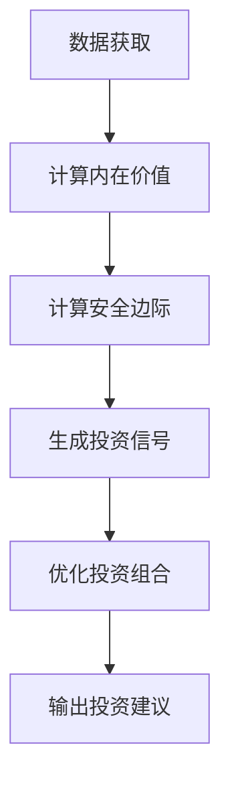

                 


# 格雷厄姆特价股票策略在不同市场周期中的动态调整

---

## 关键词：格雷厄姆投资理论，特价股票策略，市场周期，动态调整，价值投资，安全边际

---

## 摘要

本文深入探讨了格雷厄姆的价值投资策略在不同市场周期中的应用与动态调整方法。文章首先介绍了格雷厄姆特价股票策略的核心概念，包括内在价值、安全边际等关键原理。接着，分析了牛市、熊市和震荡市等不同市场周期的特点，并提出了在不同周期中如何动态调整投资策略的具体方法。随后，从数学模型和算法的角度，详细阐述了格雷厄姆策略的内在价值计算、安全边际评估以及风险控制的实现方式。最后，通过系统架构设计和项目实战案例，展示了如何将格雷厄姆策略应用于实际投资中，并提出了最佳实践建议。

---

## 第一部分: 格雷厄姆特价股票策略概述

### 第1章: 格雷厄姆特价股票策略的核心概念

#### 1.1 格雷厄姆投资理论的背景与起源

格雷厄姆是价值投资的鼻祖，他的投资理念强调以低于内在价值的价格买入优质股票，并在市场恐慌时买入低估股票，以获取长期稳定的收益。格雷厄姆的价值投资理论的核心在于“安全边际”，即买入价格与内在价值之间的差距，用以降低投资风险。

- **关键词**：价值投资，内在价值，安全边际

#### 1.2 格雷厄姆特价股票策略的核心原理

格雷厄姆策略的核心在于寻找市场价格低于内在价值的股票，并通过安全边际来确保投资的安全性。以下是格雷厄姆策略的三个核心原理：

1. **内在价值计算**：通过现金流折现模型（DCF）和股息贴现模型（DDM）计算股票的内在价值。
2. **安全边际评估**：买入价格低于内在价值的一定比例，确保投资的安全性。
3. **市场情绪与周期分析**：根据市场周期的变化调整投资策略。

---

### 第2章: 格雷厄姆特价股票策略在不同市场周期中的应用

#### 2.1 不同市场周期的特点与投资策略

1. **牛市周期**：市场情绪高涨，股票价格被高估，适合防御性投资，即选择低估股票并持有。
2. **熊市周期**：市场情绪恐慌，股票价格被低估，适合进攻性投资，即大量买入低估股票。
3. **震荡市周期**：市场波动较大，适合灵活调整投资组合，分散风险。

#### 2.2 市场周期对格雷厄姆策略的影响

1. **牛市中的防御性投资策略**：在牛市中，市场情绪高涨，股票价格可能高于内在价值，因此需要降低仓位，选择估值合理的股票。
2. **熊市中的进攻性投资策略**：在熊市中，市场情绪恐慌，股票价格可能远低于内在价值，因此可以增加仓位，买入低估股票。
3. **震荡市中的灵活调整策略**：在震荡市中，市场波动较大，需要根据市场变化动态调整投资组合，避免过度集中风险。

---

## 第二部分: 格雷厄姆特价股票策略的数学模型与算法原理

### 第3章: 格雷厄姆策略的数学模型

#### 3.1 股票内在价值的计算模型

1. **现金流折现模型（DCF）**
   $$ \text{内在价值} = \sum_{t=1}^{n} \frac{CF_t}{(1+r)^t} + \frac{TV}{(1+r)^n} $$
   其中，$CF_t$ 是第 $t$ 年的现金流，$r$ 是折现率，$TV$ 是终值。

2. **股息贴现模型（DDM）**
   $$ \text{内在价值} = \frac{D_1}{k - g} $$
   其中，$D_1$ 是第一年的股息，$k$ 是折现率，$g$ 是股息增长率。

#### 3.2 安全边际的计算公式
   $$ \text{安全边际} = \text{内在价值} \times (1 - \text{安全边际比例}) $$
   例如，若安全边际比例为 30%，则：
   $$ \text{买入价格} \leq \text{内在价值} \times 0.7 $$

#### 3.3 风险调整后的内在价值公式
   $$ \text{风险调整后的内在价值} = \text{内在价值} \times (1 - \text{风险调整系数}) $$

---

### 第4章: 格雷厄姆策略的算法实现

#### 4.1 算法原理与流程图



#### 4.2 算法实现的Python代码

```python
import pandas as pd
import numpy as np

def calculate_intrinsic_value(stock_data, discount_rate, growth_rate):
    # 现金流折现模型
    cash_flows = stock_data['cash_flows'].values
    n = len(cash_flows)
    intrinsic_value = 0
    for t in range(n):
        intrinsic_value += cash_flows[t] / (1 + discount_rate)**t
    terminal_value = stock_data['terminal_value'].values[0]
    intrinsic_value += terminal_value / (1 + discount_rate)**n
    return intrinsic_value

def calculate_margin_of_safety(intrinsic_value, stock_price, safety_ratio):
    margin = intrinsic_value * (1 - safety_ratio)
    return margin

# 示例数据
stock_data = pd.DataFrame({
    'cash_flows': [100, 110, 120],
    'terminal_value': [200]
})
discount_rate = 0.08
growth_rate = 0.05
safety_ratio = 0.3

intrinsic_value = calculate_intrinsic_value(stock_data, discount_rate, growth_rate)
margin = calculate_margin_of_safety(intrinsic_value, 80, safety_ratio)
print(f"内在价值: {intrinsic_value:.2f}")
print(f"安全边际: {margin:.2f}")
```

---

## 第三部分: 系统分析与架构设计方案

### 第5章: 系统架构设计

#### 5.1 系统功能设计

- **模块划分**：
  1. 数据获取模块：从数据源获取股票数据。
  2. 内在价值计算模块：使用DCF和DDM模型计算股票的内在价值。
  3. 安全边际评估模块：计算安全边际并生成投资信号。
  4. 投资组合优化模块：根据市场周期调整投资组合。

#### 5.2 系统架构设计


---

## 第四部分: 项目实战

### 第6章: 项目实战

#### 6.1 环境安装

```bash
pip install pandas numpy matplotlib
```

#### 6.2 核心实现代码

```python
import pandas as pd
import numpy as np

def main():
    # 数据获取
    stock_data = pd.read_csv('stock_data.csv')
    
    # 内在价值计算
    def calculate_intrinsic_value(row):
        cash_flows = row['cash_flows']
        discount_rate = 0.08
        n = len(cash_flows)
        intrinsic_value = 0
        for t in range(n):
            intrinsic_value += cash_flows[t] / (1 + discount_rate)**t
        terminal_value = row['terminal_value']
        intrinsic_value += terminal_value / (1 + discount_rate)**n
        return intrinsic_value
    
    stock_data['intrinsic_value'] = stock_data.apply(calculate_intrinsic_value, axis=1)
    
    # 安全边际计算
    def calculate_margin(row):
        iv = row['intrinsic_value']
        price = row['close_price']
        safety_ratio = 0.3
        margin = iv * (1 - safety_ratio)
        return margin if margin > price else price
    
    stock_data['margin'] = stock_data.apply(calculate_margin, axis=1)
    
    # 信号生成
    stock_data['signal'] = np.where(stock_data['margin'] > stock_data['close_price'], 'BUY', 'HOLD')
    
    print(stock_data[['close_price', 'intrinsic_value', 'margin', 'signal']])

if __name__ == '__main__':
    main()
```

---

## 第五部分: 总结与展望

### 7.1 最佳实践 tips

- 定期评估内在价值和安全边际，根据市场变化动态调整投资策略。
- 在牛市中保持防御性，在熊市中保持进攻性，在震荡市中保持灵活性。

### 7.2 小结

本文详细介绍了格雷厄姆特价股票策略在不同市场周期中的应用与动态调整方法，从理论到实践，为投资者提供了一套系统化的投资方案。

### 7.3 注意事项

- 投资者需根据自身风险承受能力调整安全边际比例。
- 市场周期的变化可能会影响策略的有效性，需定期回顾和调整。

### 7.4 拓展阅读

- 格雷厄姆的《聪明的投资者》
- 《投资最重要的简单真理》

---

通过本文的系统分析与实战案例，读者可以更好地理解并应用格雷厄姆特价股票策略，实现长期稳定的超额收益。

