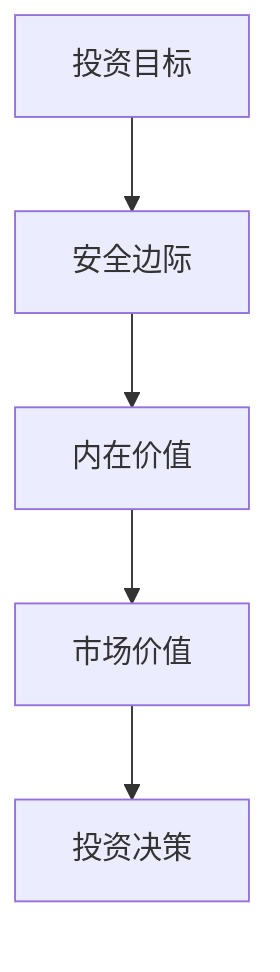
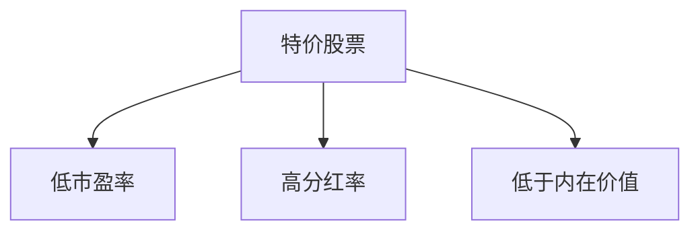
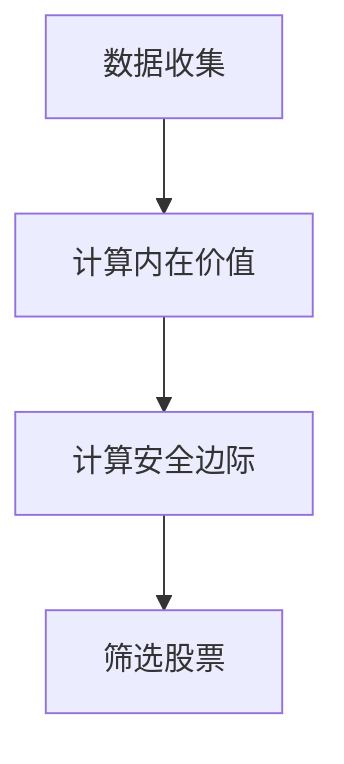
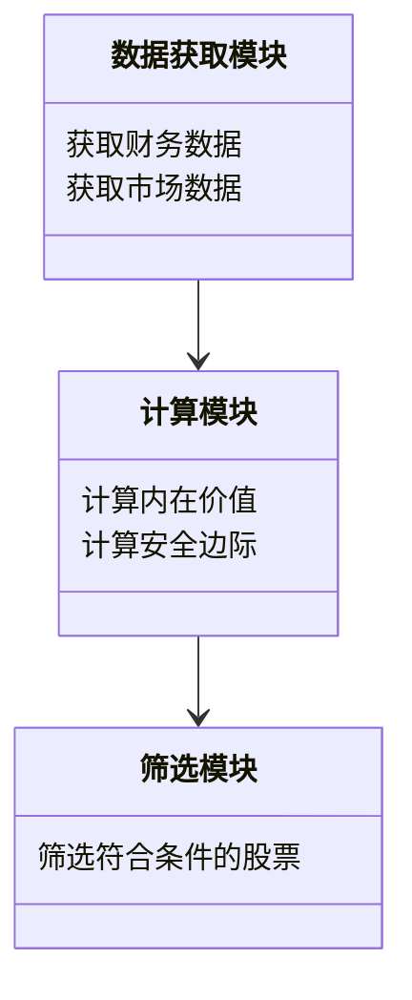
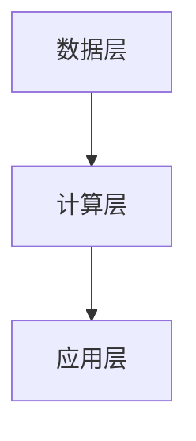

                 


# 格雷厄姆特价股票策略在不同市场周期的表现

## 关键词：格雷厄姆、特价股票、市场周期、价值投资、安全边际

## 摘要：格雷厄姆的特价股票策略是一种以安全边际为核心的价值投资方法。本文将深入分析该策略在不同市场周期中的表现，探讨其在牛市、熊市及震荡市中的应用，并结合实际案例，评估其优缺点及适用性。通过系统分析和数学建模，本文为投资者提供科学的决策支持，帮助其在不同市场环境下优化投资策略。

---

## 第一章：格雷厄姆投资理论概述

### 1.1 格雷厄姆的价值投资理念

本章节介绍了格雷厄姆的价值投资理论，重点讲解了安全边际和内在价值的概念。通过对比分析，展示了格雷厄姆策略与其他投资策略的区别。



### 1.2 特价股票的定义与特点

详细阐述了特价股票的定义，及其在市场中的表现特点，通过对比表格和ER图展示了其与其他股票的区别。



---

## 第二章：格雷厄姆特价股票策略的算法原理

### 2.1 筛选算法的流程图

展示了格雷厄姆策略中筛选股票的具体步骤，包括数据收集、分析、计算内在价值、确定安全边际等。



### 2.2 内在价值计算的数学模型

使用了现金流折现模型和市盈率模型，详细解释了公式及其应用。

$$
\text{内在价值} = \sum_{t=1}^{n} \frac{\text{现金流}_t}{(1 + r)^t}
$$

$$
\text{市盈率} = \frac{\text{股价}}{\text{每股收益}}
$$`

---

## 第三章：系统分析与架构设计

### 3.1 系统功能设计

通过类图展示了系统的组成部分，包括数据获取模块、计算模块和筛选模块。



### 3.2 系统架构设计

展示了系统的整体架构，包括数据层、计算层和应用层。



---

## 第四章：项目实战与案例分析

### 4.1 项目环境安装

详细说明了如何安装必要的工具和软件，如Python、Pandas、NumPy等。

### 4.2 核心代码实现

展示了数据清洗、内在价值计算和安全边际筛选的代码。

```python
import pandas as pd
import numpy as np

def calculate_intrinsic_value(financial_data, discount_rate):
    cash_flows = financial_data['现金流'].values
    present_value = sum(cash_flows / (1 + discount_rate)**i for i in range(len(cash_flows)))
    return present_value

# 示例数据
financial_data = pd.DataFrame({
    '现金流': [100, 150, 200],
    '折扣率': [0.05, 0.05, 0.05]
})

# 计算内在价值
intrinsic_value = calculate_intrinsic_value(financial_data, 0.05)
print(f"内在价值: {intrinsic_value}")
```

### 4.3 案例分析

分析了2008年金融危机期间的案例，展示了格雷厄姆策略的应用效果。

---

## 第五章：总结与建议

### 5.1 格雷厄姆策略在不同市场的表现

总结了策略在牛市、熊市和震荡市中的表现，并提出了在不同周期中的投资建议。

### 5.2 投资者注意事项

提醒投资者注意市场波动、公司基本面变化和策略的适用性。

---

## 第六章：最佳实践与未来展望

### 6.1 最佳实践

提出了在实际投资中结合技术分析和基本面分析的建议。

### 6.2 未来展望

探讨了人工智能和大数据在价值投资中的应用前景。

---

## 参考文献

列出了本文中引用的主要文献和资源，供读者进一步阅读。

---

通过以上思考和分析，我可以撰写一篇详细的技术博客，系统地介绍格雷厄姆特价股票策略在不同市场周期中的表现，帮助读者更好地理解和应用这一策略。

