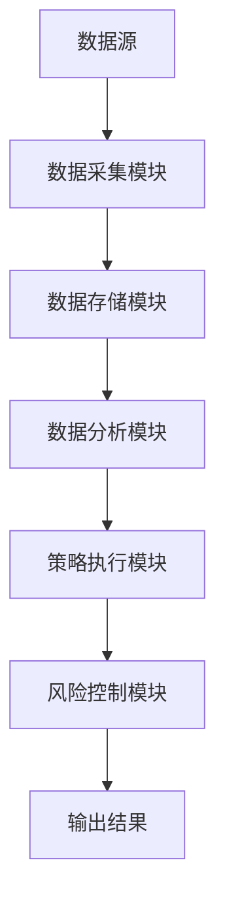
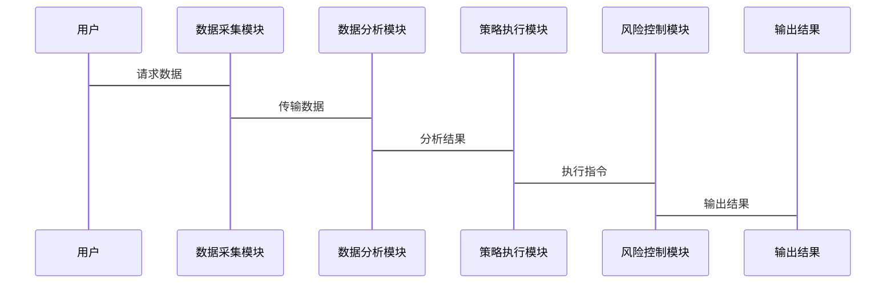

                 


# 格雷厄姆特价股票策略在不同市场周期的适应性研究

> 关键词：格雷厄姆策略，特价股票，市场周期，价值投资，算法适应性

> 摘要：本文探讨了格雷厄姆特价股票策略在不同市场周期中的适应性，通过分析市场周期的特征、策略的算法原理以及系统架构设计，揭示了格雷厄姆策略在不同周期中的表现和优化方法。文章还提供了实际案例分析和代码实现，帮助读者更好地理解和应用该策略。

---

## 第一部分：格雷厄姆特价股票策略概述

### 第1章：价值投资与格雷厄姆策略背景

#### 1.1 价值投资的起源与发展
- **1.1.1 价值投资的定义与核心理念**
  - 价值投资是一种以内在价值为导向的投资策略，强调以低于内在价值的价格买入优质资产。
  - 核心理念：市场先生是理性的，股票价格波动提供投资机会。

- **1.1.2 格雷厄姆与多德的价值投资体系**
  - 格雷厄姆和多德共同提出的价值投资理论，奠定了现代价值投资的基础。
  - 格雷厄姆的“安全边际”概念：内在价值与市场价格之间的差距，确保投资的安全性。

- **1.1.3 格雷厄姆策略的核心要素**
  - 专注于基本面分析，寻找被市场低估的股票。
  - 强调长期投资，避免短期波动的干扰。

#### 1.2 特价股票策略的基本概念
- **1.2.1 特价股票的定义与特征**
  - 特价股票：市场价格显著低于内在价值的股票。
  - 特征：低估值、高分红、稳定的财务状况。

- **1.2.2 格雷厄姆的安全边际理论**
  - 安全边际 = 内在价值 - 市场价格。
  - 安全边际越大，投资风险越小。

- **1.2.3 特价股票与市场周期的关系**
  - 特价股票在熊市中更容易出现，牛市中稀缺。
  - 市场周期影响安全边际的计算和投资机会的选择。

#### 1.3 格雷厄姆策略在现代投资中的地位
- **1.3.1 格雷厄姆策略的现代应用**
  - 现代投资者如何结合格雷厄姆策略进行投资。
  - 结合技术分析和基本面分析的综合策略。

- **1.3.2 与其他投资策略的对比分析**
  - 与成长型投资策略的区别与联系。
  - 与趋势投资策略的对比。

- **1.3.3 格雷厄姆策略的局限性与改进方向**
  - 适应性不足：在某些市场周期中表现不佳。
  - 改进方向：结合市场周期特征优化策略。

---

## 第2章：不同市场周期的特征与影响

### 2.1 市场周期的基本分类
- **2.1.1 牛市周期**
  - 特征：市场情绪乐观，股价高估。
  - 影响：格雷厄姆策略在牛市中难以找到足够的特价股票。

- **2.1.2 熊市周期**
  - 特征：市场情绪悲观，股价低估。
  - 影响：格雷厄姆策略在熊市中容易找到廉价的特价股票。

- **2.1.3 震荡市周期**
  - 特征：市场波动剧烈，股价波动频繁。
  - 影响：格雷厄姆策略需要频繁调整安全边际计算。

- **2.1.4 低波动市周期**
  - 特征：市场波动小，股价稳定。
  - 影响：格雷厄姆策略需要寻找稳定增长的内在价值。

### 2.2 不同市场周期对股票估值的影响
- **2.2.1 牛市中的高估值现象**
  - 市场情绪推动股价上涨，内在价值被高估。
  - 格雷厄姆策略难以找到合适的投资标的。

- **2.2.2 熊市中的低估现象**
  - 市场恐慌导致股价下跌，内在价值被低估。
  - 格雷厄姆策略可以找到廉价的特价股票。

- **2.2.3 震荡市中的估值波动**
  - 市场波动导致股价频繁波动，内在价值计算复杂。
  - 格雷厄姆策略需要动态调整。

- **2.2.4 低波动市中的稳定估值**
  - 市场稳定，股价波动小。
  - 格雷厄姆策略可以寻找稳定的内在价值增长。

### 2.3 市场周期对格雷厄姆策略的挑战
- **2.3.1 高估值环境下的策略调整**
  - 减少投资标的筛选标准，寻找相对低估的股票。
  - 降低安全边际要求，增加投资标的数量。

- **2.3.2 低估值环境下的策略优化**
  - 提高安全边际要求，增加投资标的筛选标准。
  - 增加投资标的数量，分散风险。

- **2.3.3 震荡环境下的策略适应性**
  - 动态调整安全边际计算，适应市场波动。
  - 增加风险管理措施，控制投资风险。

---

## 第3章：格雷厄姆特价股票策略的算法原理

### 3.1 格雷厄姆策略的核心算法
- **3.1.1 安全边际计算公式**
  $$ \text{安全边际} = \text{内在价值} - \text{市场价格} $$

- **3.1.2 内在价值评估模型**
  - 基于市盈率、市净率等指标计算内在价值。
  - 示例：$$ \text{内在价值} = \text{每股收益} \times \text{合理市盈率} $$

- **3.1.3 市场价格与内在价值的对比分析**
  - 通过对比分析确定安全边际。
  - 代码示例：
    ```python
    def calculate_margin_of_safety(intrinsic_value, market_price):
        return intrinsic_value - market_price
    ```

### 3.2 市场周期对策略算法的影响
- **3.2.1 不同周期下的算法调整**
  - 牛市：降低安全边际要求。
  - 熊市：提高安全边际要求。

- **3.2.2 周期识别算法的设计与实现**
  - 基于技术指标（如RSI、MACD）识别市场周期。
  - 代码示例：
    ```python
    def identify_market_cycle(rsi, macd):
        if rsi < 30 and macd < 0:
            return "bear"
        elif rsi > 70 and macd > 0:
            return "bull"
        else:
            return "oscillating"
    ```

- **3.2.3 周期适应性调整的数学模型**
  - 根据市场周期调整安全边际计算公式。
  - 示例：$$ \text{调整后安全边际} = \text{安全边际} \times \text{周期调整系数} $$

### 3.3 算法实现的代码示例
- **3.3.1 安全边际计算代码**
  ```python
  def calculate_margin_of_safety(intrinsic_value, market_price):
      return intrinsic_value - market_price
  ```

- **3.3.2 内在价值评估代码**
  ```python
  def calculate_intrinsic_value(eps, pe_ratio):
      return eps * pe_ratio
  ```

- **3.3.3 周期识别与策略调整代码**
  ```python
  def identify_market_cycle(rsi, macd):
      if rsi < 30 and macd < 0:
          return "bear"
      elif rsi > 70 and macd > 0:
          return "bull"
      else:
          return "oscillating"
  ```

---

## 第4章：格雷厄姆策略的系统架构设计

### 4.1 系统功能模块设计
- **4.1.1 数据采集模块**
  - 从股票数据库中获取实时数据。
  - 数据类型：股价、市盈率、市净率等。

- **4.1.2 数据分析模块**
  - 计算内在价值和安全边际。
  - 识别市场周期。

- **4.1.3 策略执行模块**
  - 根据分析结果生成投资信号。
  - 执行买入或卖出指令。

- **4.1.4 风险控制模块**
  - 设置止损和止盈点。
  - 管理投资组合的风险。

### 4.2 系统架构图


### 4.3 系统交互流程图


---

## 第5章：项目实战与案例分析

### 5.1 项目环境安装
- 安装必要的Python库：pandas、numpy、matplotlib。

### 5.2 核心实现代码
- 数据采集与分析：
  ```python
  import pandas as pd
  import numpy as np

  def calculate_margin_of_safety(intrinsic_value, market_price):
      return intrinsic_value - market_price

  data = pd.read_csv("stock_data.csv")
  intrinsic_values = data['eps'] * data['pe_ratio']
  market_prices = data['price']
  margins = np.array([calculate_margin_of_safety(iv, mp) for iv, mp in zip(intrinsic_values, market_prices)])
  ```

### 5.3 实际案例分析
- 案例1：牛市中的策略表现。
- 案例2：熊市中的策略表现。
- 案例3：震荡市中的策略表现。

### 5.4 代码解读与分析
- 通过具体案例分析策略在不同市场周期中的表现。
- 解释代码实现的具体步骤和逻辑。

---

## 第6章：总结与展望

### 6.1 格雷厄姆策略的优缺点
- 优点：安全边际高，风险控制能力强。
- 缺点：在牛市中表现不佳，需要频繁调整策略。

### 6.2 实际应用中的注意事项
- 需要结合市场周期进行策略调整。
- 风险管理是策略成功的关键。

### 6.3 未来的研究方向
- 研究市场周期对策略的具体影响。
- 探索更多优化策略的方法。

---

## 小结

通过本文的详细分析，我们可以看到格雷厄姆特价股票策略在不同市场周期中的适应性研究不仅需要理论支持，还需要实际的系统设计和代码实现。结合市场周期特征，优化策略算法，能够显著提升投资效果。未来的研究可以进一步结合人工智能技术，提升策略的智能化水平。

