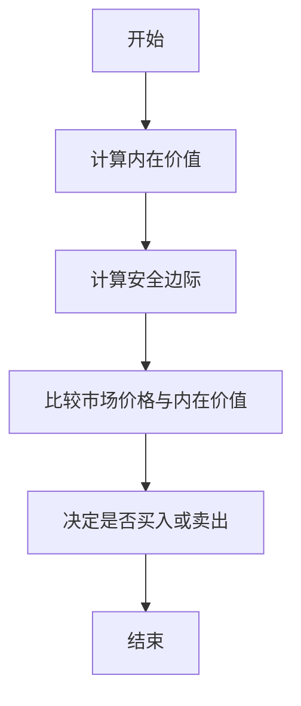
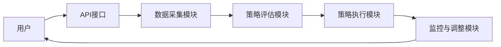

                 


# 格雷厄姆特价股票策略在不同市场成熟度中的动态调整

## 关键词：
- 格雷厄姆投资理论
- 特价股票
- 市场成熟度
- 动态调整
- 价值投资
- 安全边际
- 算法模型

## 摘要：
本文详细探讨了格雷厄姆特价股票策略在不同市场成熟度中的应用与调整。通过对市场成熟度的分类与分析，结合格雷厄姆的安全边际和内在价值理论，构建了动态调整的数学模型和算法流程。文章还通过实际案例和系统架构图，展示了策略在不同市场环境下的实施步骤与监控方法，为投资者提供了切实可行的操作指南。

---

# 第一部分: 格雷厄姆特价股票策略概述

## 第1章: 格雷厄姆投资理论的核心思想

### 1.1 格雷厄姆投资理论的起源与发展
- **1.1.1 价值投资的起源与发展**  
  价值投资的鼻祖本杰明·格雷厄姆在20世纪初提出了“安全边际”和“内在价值”理论，奠定了现代价值投资的基础。本文将介绍格雷厄姆的投资理念及其对后世的影响。

- **1.1.2 格雷厄姆的安全边际概念**  
  安全边际是格雷厄姆策略的核心，它通过比较市场价格与内在价值的差异，确保投资的安全性。本文将详细阐述安全边际的计算方法及其在不同市场中的应用。

- **1.1.3 特价股票的定义与特征**  
  特价股票是指市场价格低于内在价值的股票，是价值投资者重点关注的对象。本文将分析特价股票的特征及其在不同市场中的表现。

### 1.2 市场成熟度的定义与分类
- **1.2.1 市场成熟度的衡量标准**  
  市场成熟度通常通过市场规模、流动性、参与者结构等因素来衡量。本文将介绍这些衡量标准及其对投资策略的影响。

- **1.2.2 不同市场成熟度下的投资策略差异**  
  在新兴市场和成熟市场中，投资者需要采取不同的策略。本文将对比这两种市场环境下的策略差异，并分析其原因。

- **1.2.3 特价股票在不同市场环境中的表现**  
  在不同市场成熟度下，特价股票的表现有所不同。本文将分析其在新兴市场和成熟市场中的表现差异及原因。

## 第2章: 格雷厄姆策略在不同市场环境中的适用性

### 2.1 不同市场成熟度下的投资机会分析
- **2.1.1 新兴市场与成熟市场的对比**  
  本文将对比新兴市场和成熟市场的特点，分析其对投资策略的影响。

- **2.1.2 不同市场周期中的策略调整**  
  市场周期的变化需要投资者动态调整策略。本文将介绍如何根据市场周期调整格雷厄姆策略。

- **2.1.3 市场波动性对策略的影响**  
  市场波动性是影响策略实施的重要因素。本文将分析波动性对策略的影响及应对方法。

### 2.2 格雷厄姆策略的动态调整原则
- **2.2.1 策略调整的核心要素**  
  动态调整需要关注市场变化、公司基本面等因素。本文将详细阐述这些要素及其影响。

- **2.2.2 不同市场环境下的策略优化**  
  根据市场环境的不同，策略需要进行优化调整。本文将介绍如何在不同市场环境中优化格雷厄姆策略。

- **2.2.3 动态调整的实施步骤与方法**  
  本文将详细描述动态调整的实施步骤，包括数据采集、模型计算、策略执行等。

---

# 第二部分: 格雷厄姆策略的核心算法与数学模型

## 第3章: 格雷厄姆策略的数学模型与公式

### 3.1 内在价值的计算公式
- **3.1.1 内在价值的定义与公式**  
  内在价值是格雷厄姆策略的核心，本文将介绍其计算公式：  
  $$ V = \frac{E}{k} $$  
  其中，V为内在价值，E为预期收益，k为折现率。

### 3.2 安全边际的计算与应用
- **3.2.1 安全边际的计算公式**  
  安全边际是内在价值与市场价格的差额：  
  $$ M = V - P $$  
  其中，M为安全边际，V为内在价值，P为市场价格。

### 3.3 市场成熟度对策略参数的影响
- **3.3.1 策略参数的动态调整公式**  
  根据市场成熟度调整折现率：  
  $$ k = k_0 \times (1 + \alpha \times S) $$  
  其中，k为折现率，S为市场成熟度指数，α为调整系数。

## 第4章: 格雷厄姆策略的算法实现

### 4.1 算法流程图


### 4.2 Python代码实现
```python
def calculate_intrinsic_value(enterprise_value, discount_rate):
    return enterprise_value / discount_rate

def calculate_margin_of_safety(intrinsic_value, market_price):
    return intrinsic_value - market_price

def dynamic_adjustment(discount_rate, market_maturity):
    adjustment_factor = 1 + alpha * market_maturity
    new_discount_rate = discount_rate * adjustment_factor
    return new_discount_rate
```

---

# 第三部分: 系统分析与架构设计

## 第5章: 系统分析与架构设计方案

### 5.1 系统功能设计
- **5.1.1 数据采集模块**  
  包括市场数据、公司财务数据的采集与处理。

- **5.1.2 策略评估模块**  
  计算内在价值、安全边际，评估投资机会。

- **5.1.3 策略执行模块**  
  根据评估结果执行买入、卖出或持有操作。

- **5.1.4 监控与调整模块**  
  实时监控市场变化，动态调整策略参数。

### 5.2 系统架构设计


### 5.3 系统接口设计
- **API接口**  
  提供RESTful API，用于数据获取和策略执行。

### 5.4 系统交互设计


---

# 第四部分: 项目实战与最佳实践

## 第6章: 项目实战

### 6.1 环境安装与配置
- **6.1.1 安装Python与相关库**  
  需要安装numpy、pandas、scikit-learn等库。

### 6.2 核心代码实现
```python
import numpy as np
import pandas as pd

def calculatePEG(ratios, market_maturity):
    peg_ratio = ratios['PE'] / (1 + market_maturity * 0.2)
    return peg_ratio

# 示例数据
data = pd.DataFrame({
    'PE': [15, 20, 25],
    'Market Maturity': [0.8, 1.0, 1.2]
})

# 计算PEG
pegs = data.apply(lambda x: calculatePEG(x, x['Market Maturity']), axis=1)
print(pegs)
```

### 6.3 实际案例分析
- **案例：某新兴市场中的策略应用**  
  本文将以一个新兴市场的案例，展示如何应用格雷厄姆策略进行投资。

## 第7章: 最佳实践与注意事项

### 7.1 投资策略的优缺点
- **优点**  
  价值稳定，风险较低。
- **缺点**  
  短期表现可能不佳，需要长期持有。

### 7.2 风险管理与控制
- **分散投资**  
  避免过度集中。
- **定期调整**  
  根据市场变化及时调整。

### 7.3 长期投资的重要性
- **长期视角**  
  价值投资需要耐心和长期持有。

### 7.4 拓展阅读
- 推荐书籍：《格雷厄姆投资哲学》、《价值投资实战》。

---

通过以上目录结构，本文系统地介绍了格雷厄姆特价股票策略在不同市场成熟度中的应用与调整，结合理论分析、算法实现和项目实战，为投资者提供了全面的指导和实践参考。

