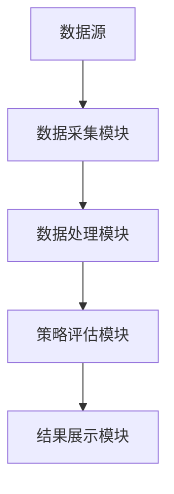
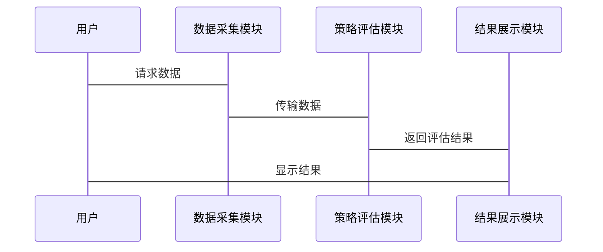

                 


# 格雷厄姆特价股票策略在不同市场效率下的表现

## 关键词
- 格雷厄姆投资策略
- 市场效率
- 价值投资
- 股票策略
- 证券分析

## 摘要
本文深入探讨格雷厄姆特价股票策略在不同市场效率下的表现。首先，介绍投资的基本概念和市场效率的背景，分析格雷厄姆策略的核心思想及其与现代投资理论的对比。接着，构建数学模型评估策略在不同市场环境下的收益和风险，探讨其在有效、弱有效和半强有效市场中的表现差异。通过实际案例分析，验证策略的有效性，并总结最佳实践，为投资者提供理论支持和实际指导。

---

# 第一部分: 引言

## 第1章: 投资的基础概念与市场效率

### 1.1 投资的基本概念

#### 1.1.1 什么是投资
投资是指将资金投入到某个项目或资产中，期望在未来获得超过初始投入的收益。投资可以是股票、债券、房地产等多种形式。

#### 1.1.2 投资的分类与特点
投资可以分为长期投资和短期投资。长期投资注重资产的增值，短期投资则关注价格波动。投资具有风险性、收益性、流动性等特点。

#### 1.1.3 市场效率的定义与分类
市场效率指的是市场中信息传播的速度和价格反映信息的程度。市场效率可分为有效市场、弱有效市场和半强有效市场。

### 1.2 市场效率的背景与影响

#### 1.2.1 有效市场假说的提出与争议
有效市场假说认为，市场价格反映了所有可用信息，因此在有效市场中，投资者无法通过分析获得超额收益。该假说引发了广泛的讨论和争议。

#### 1.2.2 不同市场效率下的投资者行为
在有效市场中，投资者行为趋于理性，而在弱有效市场中，存在一定的市场无效性和套利机会。

#### 1.2.3 市场效率与投资策略的关系
市场效率影响投资策略的有效性。在高效率市场中，价值投资策略可能面临挑战，而在低效率市场中，该策略可能表现更好。

### 1.3 格雷厄姆投资策略的核心思想

#### 1.3.1 价值投资的定义与特点
价值投资是寻找市场价格低于内在价值的股票，注重长期收益，而非短期价格波动。

#### 1.3.2 格雷厄姆的选股原则
格雷厄姆强调安全边际，即买入价格远低于内在价值的股票，以降低投资风险。

#### 1.3.3 格雷厄姆策略的历史表现
历史数据显示，格雷厄姆策略在长期表现优异，尤其是在市场效率较低的环境下。

### 1.4 格雷厄姆策略与现代投资理论的对比

#### 1.4.1 格雷厄姆策略的优缺点
优点：注重安全边际，风险较低；缺点：在高效市场中可能表现不佳。

#### 1.4.2 现代投资理论与格雷厄姆策略的异同
现代投资理论强调资产配置和分散投资，而格雷厄姆策略更注重个股选择和价值评估。

#### 1.4.3 不同市场环境下策略的适用性
在低效市场中，格雷厄姆策略表现良好；在高效市场中，策略可能面临挑战。

---

## 第2章: 格雷厄姆特价股票策略的数学模型

### 2.1 格雷厄姆策略的核心公式

#### 2.1.1 内在价值的计算公式
$$
\text{内在价值} = \frac{\text{净利润} \times (1 + g)}{r - g}
$$
其中，g为增长率，r为折现率。

#### 2.1.2 市场价格与内在价值的差异
$$
\text{安全边际} = \text{内在价值} - \text{市场价格}
$$

#### 2.1.3 格雷厄姆的“安全边际”公式
$$
\text{安全边际比例} = \frac{\text{内在价值} - \text{市场价格}}{\text{市场价格}}
$$

### 2.2 市场效率与策略效果的关系

#### 2.2.1 市场效率对策略效果的影响
在低效市场中，策略表现优于高效市场。

#### 2.2.2 不同市场效率下的策略收益模型
$$
\text{收益} = \text{安全边际} \times \text{市场效率}
$$

### 2.3 策略收益的评估指标

#### 2.3.1 投资回报率的计算
$$
\text{回报率} = \frac{\text{最终价值} - \text{初始价值}}{\text{初始价值}} \times 100\%
$$

#### 2.3.2 风险调整后的收益指标
夏普比率用于衡量风险调整后的收益：
$$
\text{夏普比率} = \frac{\text{收益} - \text{无风险收益率}}{\text{收益波动率}}
$$

#### 2.3.3 策略的有效性检验方法
通过历史数据回测，计算策略的平均收益、最大回撤等指标。

---

## 第3章: 格雷厄姆策略在不同市场效率下的表现分析

### 3.1 有效市场环境下的策略表现

#### 3.1.1 有效市场环境的定义与特征
市场价格反映所有信息，投资者无法通过分析获得超额收益。

#### 3.1.2 格雷厄姆策略在有效市场中的表现
策略表现不佳，因市场有效难以找到低估股票。

### 3.2 弱有效市场环境下的策略表现

#### 3.2.1 弱有效市场环境的定义与特征
市场价格部分反映信息，存在套利机会。

#### 3.2.2 格雷厄姆策略在弱有效市场中的表现
策略表现较好，因市场存在低估股票。

### 3.3 半强有效市场环境下的策略表现

#### 3.3.1 半强有效市场环境的定义与特征
市场价格反映历史信息，但未完全反映新信息。

#### 3.3.2 格雷厄姆策略在半强有效市场中的表现
策略表现一般，因部分信息已被市场反映。

---

## 第4章: 格雷厄姆策略的系统架构设计

### 4.1 系统功能设计

#### 4.1.1 数据采集模块
采集股票价格、财务数据等信息。

#### 4.1.2 策略评估模块
计算内在价值、安全边际等指标。

#### 4.1.3 结果展示模块
可视化策略表现，生成报告。

### 4.2 系统架构设计

#### 4.2.1 系统架构图


### 4.3 系统接口设计

#### 4.3.1 数据接口
API用于数据获取和传输。

#### 4.3.2 策略接口
API用于策略评估和结果输出。

### 4.4 系统交互设计

#### 4.4.1 交互流程图


---

## 第5章: 项目实战与案例分析

### 5.1 项目实战

#### 5.1.1 环境安装
安装Python、Pandas、Matplotlib等工具。

#### 5.1.2 核心实现代码
```python
import pandas as pd
import matplotlib.pyplot as plt

def calculate_intrinsic_value(eps, growth_rate, discount_rate):
    return eps * (1 + growth_rate) / (discount_rate - growth_rate)

def calculate_margin_of_safety(current_price, intrinsic_value):
    return intrinsic_value - current_price

data = pd.read_csv('stock_data.csv')
data['内在价值'] = data['EPS'] * (1 + 0.05) / (0.1 - 0.05)
data['安全边际'] = data['内在价值'] - data['收盘价']
data.to_csv('results.csv')
plt.plot(data['安全边际'])
plt.show()
```

### 5.2 案例分析

#### 5.2.1 案例选择
选择多个市场环境下的股票进行分析。

#### 5.2.2 结果解读
分析策略在不同市场中的表现，总结经验教训。

---

## 第6章: 最佳实践与小结

### 6.1 最佳实践

#### 6.1.1 策略选择
根据市场效率选择合适的策略。

#### 6.1.2 风险管理
合理配置资产，控制风险。

### 6.2 小结

格雷厄姆策略在低效市场中表现优异，但在高效市场中可能面临挑战。投资者需根据市场环境调整策略，合理配置资产，注重风险管理。

---

# 结语

本文系统分析了格雷厄姆特价股票策略在不同市场效率下的表现，提供了理论支持和实际指导。通过数学模型、系统设计和案例分析，为投资者在不同市场环境下选择合适的投资策略提供了参考。

---

# 参考文献

（此处列出相关书籍和文献资料）

