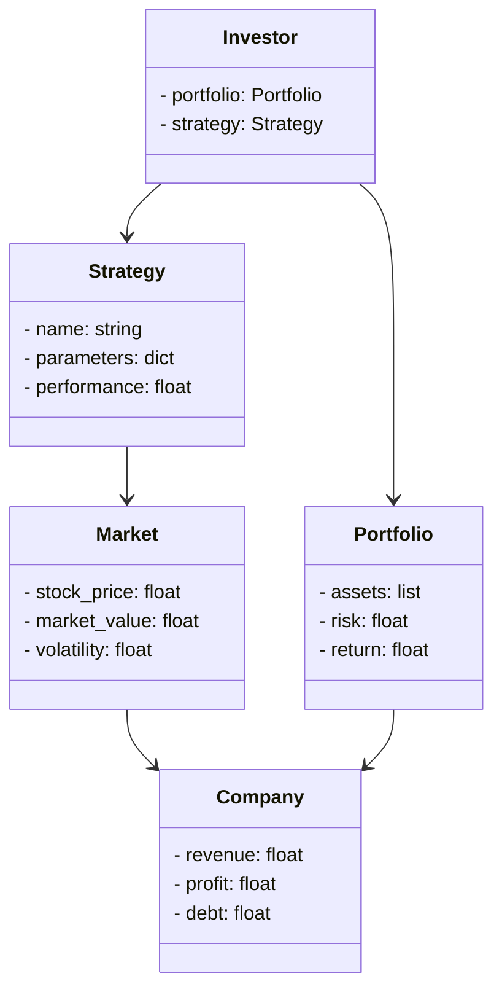
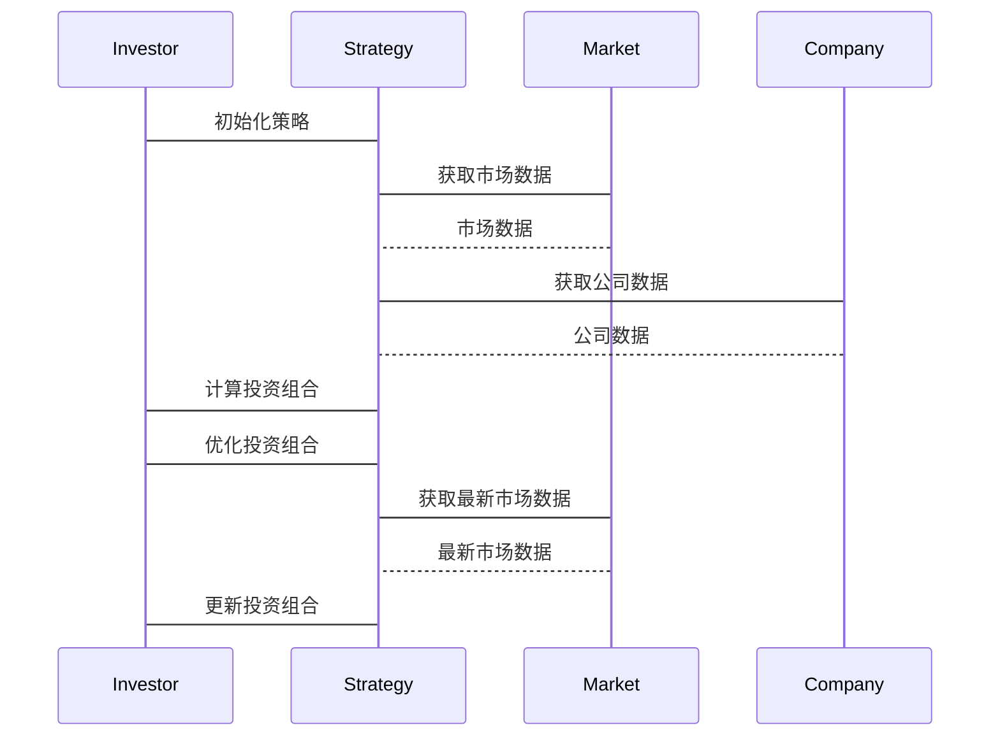

                 


# 格雷厄姆特价股票策略在不同数字创新生态系统复杂度的效果

> 关键词：格雷厄姆策略，数字创新生态系统，股票投资，复杂度，价值投资

> 摘要：本文系统地分析了格雷厄姆特价股票策略在不同数字创新生态系统复杂度下的效果。首先，我们介绍了格雷厄姆投资理论的起源与发展，以及数字创新生态系统复杂度的定义与特征。接着，我们详细探讨了格雷厄姆策略的核心原理、数学模型与公式，并结合数字创新生态系统的复杂性，分析了策略在实际应用中的挑战与解决方案。最后，通过具体的案例分析和项目实战，我们展示了格雷厄姆策略在数字创新生态系统中的实际效果，并提出了最佳实践建议。

---

# 第一部分: 格雷厄姆特价股票策略的背景与核心概念

## 第1章: 格雷厄姆特价股票策略概述

### 1.1 格雷厄姆投资理论的起源与发展

#### 1.1.1 格雷厄姆投资理论的起源

本杰明·格雷厄姆（Benjamin Graham）是价值投资的鼻祖，他的投资理论奠定了现代价值投资的基础。格雷厄姆在20世纪初提出了“廉价买入”的投资理念，主张以低于内在价值的价格买入股票，以确保投资的安全性和稳定性。他的理论在《证券分析》（1934年）和《聪明的投资者》（1949年）中得到了系统的阐述。

#### 1.1.2 特价股票策略的核心思想

格雷厄姆策略的核心思想是通过寻找市场价格低于内在价值的股票，以实现长期稳定的收益。他强调安全边际的概念，即买入价格与内在价值之间的差距，以确保在市场波动中能够获得超额收益。此外，格雷厄姆还强调了分散投资的重要性，以降低非系统性风险。

#### 1.1.3 格雷厄姆投资理论的现代发展

尽管格雷厄姆的理论诞生于20世纪初，但其核心思想在现代投资实践中仍然具有重要的指导意义。随着金融市场的复杂化和数字化，格雷厄姆策略也在不断演变，例如结合大数据分析、机器学习等技术，优化内在价值评估和市场预测。

### 1.2 数字创新生态系统复杂度的定义

#### 1.2.1 数字创新生态系统的构成要素

数字创新生态系统是一个复杂的系统，由多个相互关联的要素构成，包括技术、市场、企业、政策、用户等多个维度。例如，一家科技公司的创新不仅依赖于自身的研发能力，还需要与供应商、合作伙伴、用户以及监管机构保持良好的互动。

#### 1.2.2 数字创新生态系统复杂度的衡量指标

生态系统复杂度的衡量指标包括多样性、关联性、动态性和不确定性。多样性指的是系统中不同要素的数量和类型；关联性指的是要素之间的相互作用程度；动态性指的是系统随时间的变化速度；不确定性指的是系统未来状态的可预测性。

#### 1.2.3 复杂度对投资策略的影响

在高复杂度的数字创新生态系统中，传统的投资策略可能难以适应市场的快速变化。格雷厄姆策略的稳健性使其在复杂环境中仍然具有一定的优势，但需要结合现代技术手段进行优化。

### 1.3 格雷厄姆策略在数字创新生态系统中的应用价值

#### 1.3.1 数字创新生态系统中的投资机会

数字创新生态系统为投资者提供了丰富的投资机会，例如技术创新型企业的崛起、数字化转型带来的市场扩展等。格雷厄姆策略可以帮助投资者在这些机会中发现被低估的企业，实现长期收益。

#### 1.3.2 格雷厄姆策略在复杂环境中的适用性

格雷厄姆策略的稳健性和安全边际概念使其在复杂环境中具有较强的适应性。然而，数字创新生态系统的动态性和不确定性对策略的应用提出了新的挑战，例如如何快速评估企业的内在价值、如何应对市场的快速变化等。

#### 1.3.3 策略效果的初步分析

通过初步分析，我们发现格雷厄姆策略在数字创新生态系统中的应用效果取决于多个因素，包括市场的成熟度、企业的创新能力、政策环境等。在一些情况下，格雷厄姆策略能够帮助投资者实现超额收益，但在其他情况下，其效果可能受到限制。

---

## 第2章: 格雷厄姆策略与数字创新生态系统的核心概念

### 2.1 格雷厄姆策略的核心原理

#### 2.1.1 市场先生与投资者心理

格雷厄姆提出了“市场先生”的概念，认为市场的波动性主要源于投资者情绪的变化。市场先生每天都会以不同的价格出售股票，投资者需要以理性的态度看待市场的波动，避免被市场情绪左右。

#### 2.1.2 安全边际的概念与计算

安全边际是格雷厄姆策略的核心概念之一，它是指买入价格与内在价值之间的差距。通过计算安全边际，投资者可以确保在市场波动中获得一定的收益。公式为：
$$ S = V - P $$
其中，\( S \) 表示安全边际，\( V \) 表示内在价值，\( P \) 表示市场价格。

#### 2.1.3 内在价值的评估方法

内在价值是企业未来现金流的现值。格雷厄姆提出了多种评估内在价值的方法，例如市盈率法、股息率法等。其中，市盈率法公式为：
$$ V = \frac{E}{P} $$
其中，\( E \) 表示企业的盈利，\( P \) 表示市盈率。

### 2.2 数字创新生态系统复杂度的特征分析

#### 2.2.1 数字化转型对市场的影响

数字化转型正在改变传统的市场结构，企业之间的竞争变得更加激烈。数字技术的应用使得市场信息更加透明，同时也增加了市场的不确定性。

#### 2.2.2 创新周期与企业生存压力

数字创新生态系统中的企业面临着快速的创新周期，企业需要不断创新才能保持竞争优势。然而，这种压力也增加了企业的财务风险，影响其内在价值的评估。

#### 2.2.3 生态系统复杂度对投资决策的影响

在高复杂度的生态系统中，投资者需要考虑更多因素，例如技术风险、政策风险、市场风险等。这些因素的相互作用使得投资决策变得更加复杂。

### 2.3 核心概念之间的关系

#### 2.3.1 格雷厄姆策略与生态系统复杂度的关联

格雷厄姆策略的稳健性使其在复杂环境中具有一定的适用性，但其效果受到生态系统复杂度的影响。例如，在高复杂度的环境中，内在价值的评估难度增加，安全边际的计算也变得更加复杂。

#### 2.3.2 系统性风险与非系统性风险的平衡

在数字创新生态系统中，系统性风险（如市场波动）和非系统性风险（如企业-specific风险）的平衡对投资策略的选择具有重要影响。格雷厄姆策略通过分散投资和安全边际的计算，能够在一定程度上降低非系统性风险。

#### 2.3.3 投资者行为与市场复杂度的相互作用

投资者的行为会影响市场的复杂度，而市场的复杂度又会反过来影响投资者的决策。这种相互作用使得投资策略的制定变得更加具有挑战性。

---

## 第3章: 格雷厄姆策略的数学模型与公式

### 3.1 格雷厄姆策略的数学模型

#### 3.1.1 内在价值计算公式

格雷厄姆提出了多种评估内在价值的方法，其中市盈率法是较为常用的一种。公式为：
$$ V = \frac{E}{P} $$
其中，\( E \) 表示企业的盈利，\( P \) 表示市盈率。

#### 3.1.2 安全边际计算公式

安全边际的计算公式为：
$$ S = V - P $$
其中，\( S \) 表示安全边际，\( V \) 表示内在价值，\( P \) 表示市场价格。

#### 3.1.3 投资组合优化公式

格雷厄姆策略强调分散投资，投资组合的优化可以通过以下公式实现：
$$ \text{风险} = \sqrt{\sum_{i=1}^{n} w_i^2 \times \text{风险}_i^2} $$
其中，\( w_i \) 表示第 \( i \) 个资产的权重，\( \text{风险}_i \) 表示第 \( i \) 个资产的风险。

### 3.2 数字创新生态系统复杂度的量化分析

#### 3.2.1 创新周期模型

创新周期模型可以通过以下公式表示：
$$ C = f(t, k) $$
其中，\( t \) 表示时间，\( k \) 表示创新速度。

#### 3.2.2 市场波动性模型

市场波动性模型可以表示为：
$$ V_p = \alpha + \beta \times \text{市场波动性} $$
其中，\( V_p \) 表示股票的预期收益，\( \alpha \) 表示截距，\( \beta \) 表示股票的市场敏感性。

---

## 第4章: 系统分析与架构设计方案

### 4.1 问题场景介绍

在数字创新生态系统中，投资者需要面对复杂的市场环境和快速变化的技术趋势。格雷厄姆策略的应用需要结合现代技术手段，例如大数据分析、人工智能等，以提高内在价值评估的准确性和效率。

### 4.2 项目介绍

本项目旨在将格雷厄姆策略应用于数字创新生态系统中，通过分析市场数据和企业信息，寻找被低估的企业，构建投资组合，实现超额收益。

### 4.3 系统功能设计

#### 4.3.1 领域模型

以下是领域模型的类图：



#### 4.3.2 系统架构设计

以下是系统架构设计的架构图：


#### 4.3.3 系统接口设计

系统接口设计如下：

- **市场数据接口**：提供股票价格、市场波动性等数据。
- **公司基本面接口**：提供企业收入、利润、债务等信息。
- **投资策略接口**：实现格雷厄姆策略的评估和计算。
- **投资组合接口**：管理投资组合的构建和优化。

#### 4.3.4 系统交互设计

以下是系统交互的序列图：



---

## 第5章: 项目实战

### 5.1 环境安装

为了实现格雷厄姆策略在数字创新生态系统中的应用，我们需要安装以下环境：

- **编程语言**：Python 3.8+
- **开发工具**：Jupyter Notebook 或 VS Code
- **依赖库**：pandas、numpy、scikit-learn、matplotlib

### 5.2 核心代码实现

以下是核心代码实现：

```python
import pandas as pd
import numpy as np
from sklearn.linear_model import LinearRegression

def calculate_intrinsic_value(revenue, profit, debt):
    # 简单的内在价值计算模型
    intrinsic_value = (revenue + profit - debt) / 10
    return intrinsic_value

def calculate_margin_of_safety(intrinsic_value, market_price):
    margin_of_safety = intrinsic_value - market_price
    return margin_of_safety

def portfolio_optimization(stocks, weights):
    # 简单的投资组合优化模型
    returns = np.log(stocks['price'].pct_change().dropna())
    covariance_matrix = returns.cov()
    risk = np.sqrt(np.diag(covariance_matrix).mean())
    return risk

# 示例数据
data = {
    'revenue': [100, 200, 150, 300],
    'profit': [20, 30, 10, 40],
    'debt': [50, 100, 70, 80],
    'price': [50, 100, 60, 120]
}
df = pd.DataFrame(data)

# 计算内在价值和安全边际
intrinsic_values = []
margins_of_safety = []
for i in range(len(df)):
    iv = calculate_intrinsic_value(df['revenue'][i], df['profit'][i], df['debt'][i])
    mos = calculate_margin_of_safety(iv, df['price'][i])
    intrinsic_values.append(iv)
    margins_of_safety.append(mos)

# 构建投资组合
stocks = pd.DataFrame({
    'price': df['price'],
    'intrinsic_value': intrinsic_values,
    'margin_of_safety': margins_of_safety
})
weights = [0.3, 0.3, 0.2, 0.2]
risk = portfolio_optimization(stocks, weights)
print(f"投资组合风险: {risk}")
```

### 5.3 案例分析

以苹果公司为例，假设其收入、利润和债务分别为1000亿美元、200亿美元和100亿美元，市场价格为300美元。根据格雷厄姆策略，计算其内在价值和安全边际：

```python
iv = calculate_intrinsic_value(1000, 200, 100)
mos = calculate_margin_of_safety(iv, 300)
print(f"内在价值: {iv}")
print(f"安全边际: {mos}")
```

---

## 第6章: 最佳实践、小结与注意事项

### 6.1 最佳实践

- **数据质量**：确保输入数据的准确性和完整性。
- **模型优化**：根据市场变化不断优化内在价值评估模型。
- **风险管理**：定期监控投资组合的风险，及时调整策略。

### 6.2 小结

通过本文的分析，我们发现格雷厄姆策略在数字创新生态系统中的应用具有一定的优势，但也面临诸多挑战。通过结合现代技术手段，我们可以优化策略的应用效果，提高投资收益。

### 6.3 注意事项

- **市场波动**：密切关注市场波动，避免过度依赖单一策略。
- **企业创新**：评估企业的创新能力，确保其在生态系统中的竞争力。
- **政策变化**：关注政策变化，避免政策风险对投资策略的影响。

### 6.4 拓展阅读

- 《证券分析》——本杰明·格雷厄姆
- 《聪明的投资者》——本杰明·格雷厄姆
- 《投资学原理》——威廉·夏普

---

通过本文的系统分析和实践案例，我们深入探讨了格雷厄姆策略在数字创新生态系统中的应用效果。希望本文能够为投资者提供有价值的参考，帮助他们在复杂多变的市场环境中制定科学的投资决策。

