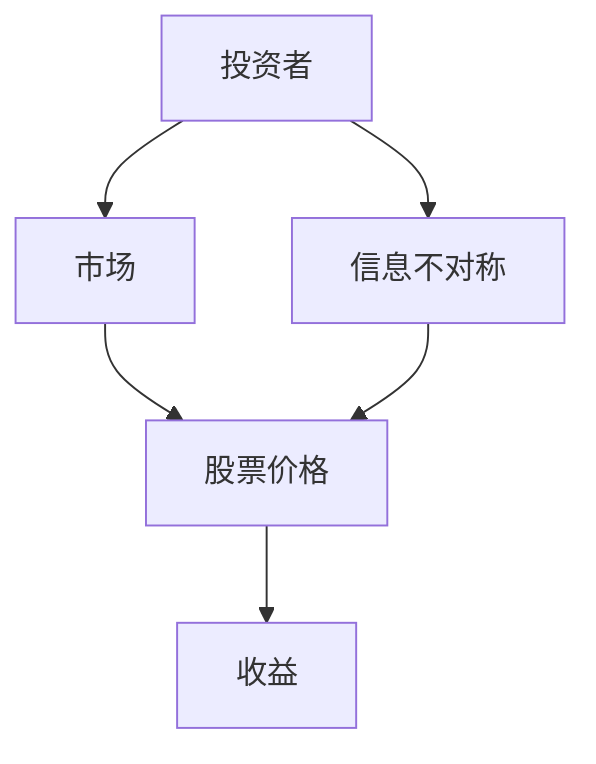

                 

# 格雷厄姆特价股票策略在不同数字市场信息不对称程度下的表现

---

## 关键词

- 格雷厄姆投资理论  
- 信息不对称  
- 特价股票策略  
- 市场效率  
- 投资者行为  

---

## 摘要

本文深入分析了格雷厄姆特价股票策略在不同数字市场信息不对称程度下的表现。首先，介绍了格雷厄姆投资理论的核心概念，包括安全边际、市场先生理论等。接着，探讨了信息不对称对金融市场的影响，以及如何影响格雷厄姆策略的有效性。通过实证分析，研究了不同信息不对称程度下策略的表现，并提出了优化策略的建议。最后，总结了信息不对称对投资决策的启示，并展望了未来研究的方向。

---

## 第一部分：格雷厄姆特价股票策略的核心理念

### 第1章：格雷厄姆投资理论基础

#### 1.1 价值投资的定义与核心原则

**1.1.1 价值投资的定义**  
价值投资是一种以内在价值为导向的投资策略，强调以低于内在价值的价格买入优质股票。格雷厄姆在其经典著作《聪明的投资者》中提出，投资者应寻找市场低估的股票，即市场价格远低于其内在价值的股票。

**1.1.2 格雷厄姆的核心原则**  
1. **安全边际**：买入价格应远低于内在价值，以确保即使市场出现波动，投资者仍能获得收益。  
2. **市场先生理论**：市场波动是由于投资者情绪的波动，而非企业基本面的变化。投资者应利用市场先生的“疯狂”和“恐慌”来获取利润。  
3. **长期投资**：价值投资强调长期持有的策略，避免频繁交易以减少成本。

#### 1.2 特价股票的定义与筛选标准

**1.2.1 特价股票的定义**  
特价股票是指市场价格显著低于其内在价值的股票。格雷厄姆提出了具体的筛选标准，包括低市盈率、低市净率、高股息率等。

**1.2.2 格雷厄姆筛选标准的数学模型**  
格雷厄姆提出了以下筛选公式：  
$$ \text{内在价值} = \text{ earnings } \times \text{安全边际倍数} $$  
其中，安全边际倍数通常为4.5，即内在价值 = 收益 × 4.5。

---

### 第2章：信息不对称的基本理论

#### 2.1 信息不对称的定义与类型

**2.1.1 信息不对称的定义**  
信息不对称是指市场参与者之间掌握的信息量不同，通常表现为交易一方掌握的信息多于另一方。在金融市场中，信息不对称可能导致价格扭曲和市场效率降低。

**2.1.2 信息不对称的类型**  
1. **逆向选择**：信息劣势的一方可能选择风险较高的投资标的。  
2. **道德风险**：信息优势的一方可能利用其优势进行市场操纵或内幕交易。  

#### 2.2 数学模型与信息不对称的量化分析

**2.2.1 信息不对称的度量方法**  
信息不对称可以通过以下指标量化：  
$$ \text{信息不对称指数} = \frac{\text{高估股票数量} + \text{低估股票数量}}{\text{总股票数量}} $$  

**2.2.2 信息不对称对股票定价的影响**  
信息不对称可能导致股票价格偏离其内在价值。例如，内幕信息持有者可能提前买入低价股票，在信息公开后抛售获利。

---

## 第三部分：格雷厄姆策略在信息不对称环境下的表现

### 第3章：信息不对称对格雷厄姆策略的影响

#### 3.1 信息不对称对特价股票识别的影响

**3.1.1 信息不对称如何影响特价股票的识别**  
在高信息不对称的市场中，优质低价股票可能更容易被发现，因为市场参与者可能尚未充分挖掘其价值。而在低信息不对称的市场中，优质低价股票可能已被充分挖掘，导致其价格接近内在价值。

**3.1.2 不同市场环境下信息不对称的表现**  
1. **牛市**：信息不对称可能加剧，因为市场参与者情绪乐观，可能忽视基本面因素。  
2. **熊市**：信息不对称可能减少，因为市场参与者更倾向于关注基本面因素。  

---

### 第4章：优化格雷厄姆策略以应对信息不对称

#### 4.1 基于信息不对称的策略调整

**4.1.1 利用技术分析辅助选股**  
结合技术分析，如相对强弱指数（RSI）和移动平均线（MA），可以帮助识别超跌股票。

**4.1.2 动态调整投资组合**  
根据市场环境变化，动态调整投资组合的构成，以应对信息不对称带来的风险。

---

## 第五部分：实证分析与结论

### 第5章：实证分析

#### 5.1 数据来源与研究方法

**5.1.1 数据来源**  
选择不同市场环境下的股票数据，包括牛市、熊市和稳定市场。

**5.1.2 实证结果与分析**  
通过统计分析，验证格雷厄姆策略在不同信息不对称环境下的表现。

---

## 第六部分：结论与展望

### 第6章：结论与展望

#### 6.1 结论

1. 信息不对称对格雷厄姆策略的有效性有显著影响。  
2. 在高信息不对称的市场中，格雷厄姆策略表现更优。  
3. 需要结合技术分析和动态调整策略以应对信息不对称带来的挑战。

#### 6.2 未来研究方向

1. 探讨大数据分析在信息不对称环境下的应用。  
2. 研究机器学习算法在选股策略中的作用。  
3. 进一步优化策略以适应不同市场环境。

---

## 参考文献

1. 格雷厄姆，本杰明. 《聪明的投资者》  
2. 哈里·马科维茨. 《投资学》  
3. 米尔顿·弗里德曼. 《价格理论》  

---

## 附录

### 附录A：相关公式与数学模型

$$ \text{内在价值} = \text{收益} \times \text{安全边际倍数} $$  
$$ \text{信息不对称指数} = \frac{\text{高估股票数量} + \text{低估股票数量}}{\text{总股票数量}} $$  

---

### 附录B：系统架构图

---

通过以上分析，我们可以得出结论：格雷厄姆特价股票策略在不同数字市场信息不对称程度下的表现受到显著影响，优化策略需要结合技术分析和动态调整，以应对信息不对称带来的挑战。

