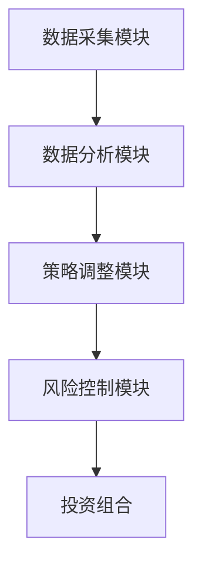
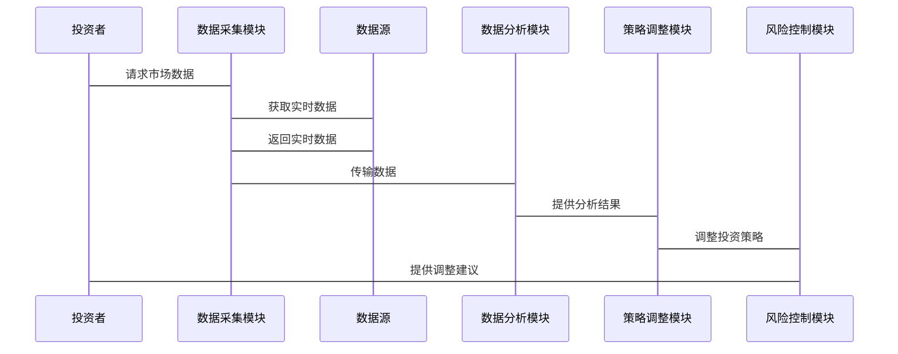

                 


# 格雷厄姆特价股票策略在不同数字市场微观结构演化中的动态调整

**关键词**：格雷厄姆策略，数字市场，微观结构，动态调整，价值投资

**摘要**：本文探讨格雷厄姆价值投资策略在不同数字市场微观结构演化中的动态调整方法。通过分析数字市场的特点和微观结构的动态变化，提出一种基于格雷厄姆策略的动态调整机制，以适应数字市场的快速变化。文章结合数学模型和实际案例，详细阐述策略的实现过程，并通过系统架构设计和项目实战，展示如何在实际投资中应用这些方法。

---

# 第一部分: 格雷厄姆特价股票策略与数字市场微观结构概述

## 第1章: 格雷厄姆价值投资理论基础

### 1.1 格雷厄姆价值投资理论的核心理念

格雷厄姆的价值投资理论是基于“安全边际”和“内在价值”的概念。投资者应以低于内在价值的价格买入股票，并长期持有，等待市场重新发现其价值。这一策略在传统市场中取得了显著成功，但在数字市场中，由于微观结构的动态变化，需要进行动态调整。

#### 格雷厄姆策略的核心要素

- **内在价值**：通过基本面分析确定股票的真正价值。
- **安全边际**：买入价格低于内在价值，以降低风险。
- **长期持有**：避免短期波动的干扰，专注于长期价值。

### 1.2 数字市场微观结构的基本概念

数字市场是指通过电子交易平台进行的股票交易市场。与传统市场相比，数字市场的交易速度更快，参与者更多，信息传播更迅速。

#### 微观结构的构成要素

- **交易频率**：数字市场的交易频率远高于传统市场。
- **市场深度**：数字市场的深度受算法交易和高频交易的影响。
- **参与者行为**：机构投资者、个人投资者和算法交易机器人共同参与。

### 1.3 动态调整策略的必要性

数字市场的微观结构动态变化，传统格雷厄姆策略需要进行动态调整以适应新的市场环境。

#### 动态调整的核心目标

- **适应市场变化**：及时调整投资组合以应对市场波动。
- **提高收益**：通过动态调整优化投资回报。
- **降低风险**：通过动态调整降低市场波动带来的风险。

---

## 第2章: 数字市场的特点与格雷厄姆策略的适用性

### 2.1 数字市场的崛起

数字市场的崛起得益于技术的进步，尤其是互联网和高频交易技术的发展。数字市场的交易速度和规模远超传统市场。

#### 数字市场与传统市场的差异

| 特性             | 数字市场                  | 传统市场                  |
|------------------|--------------------------|--------------------------|
| 交易速度         | 极高                     | 较低                     |
| 交易成本         | 极低                     | 较高                     |
| 市场参与者       | 多样化，包括算法交易      | 以机构投资者为主          |
| 信息传播速度     | 极快                     | 较慢                     |

### 2.2 微观结构演化对投资策略的影响

数字市场的微观结构动态变化，对格雷厄姆策略的实施提出了新的挑战。例如，高频交易可能导致短期价格波动，影响内在价值的评估。

#### 微观结构的动态变化

- **交易频率的提升**：高频交易使得市场价格频繁波动。
- **市场深度的变化**：算法交易可能导致市场深度的不稳定。
- **信息传播的速度与范围**：信息传播速度的提升使得市场参与者能够更快地响应市场变化。

### 2.3 格雷厄姆策略的适应性分析

尽管格雷厄姆策略在传统市场中表现优异，但在数字市场中需要进行动态调整。

#### 格雷厄姆策略在数字市场的适用性

- **价值发现**：数字市场提供了更多的数据和信息，有助于更准确地评估内在价值。
- **风险控制**：通过动态调整策略，可以更好地应对市场波动带来的风险。

---

## 第3章: 格雷厄姆策略的动态调整机制

### 3.1 动态调整的必要性

数字市场的微观结构动态变化，传统格雷厄姆策略需要进行动态调整以适应新的市场环境。

#### 动态调整的核心目标

- **提高投资收益**：通过动态调整优化投资组合。
- **降低投资风险**：通过动态调整应对市场波动。

### 3.2 动态调整的实现路径

动态调整需要结合数字市场的特点，实时监控市场变化，并根据市场变化调整投资策略。

#### 动态调整的关键步骤

1. **市场监控**：实时监控市场变化，包括价格波动、交易量变化等。
2. **策略调整**：根据市场变化调整投资策略，包括买入、卖出或持仓。
3. **风险控制**：通过动态调整策略，降低投资风险。

### 3.3 动态调整的数学模型

为了实现动态调整，可以使用以下数学模型：

$$
\text{调整幅度} = \frac{\text{当前价格} - \text{内在价值}}{\text{内在价值}} \times 100\%
$$

该模型用于计算价格波动幅度，帮助投资者决定是否进行调整。

---

## 第4章: 系统架构设计

### 4.1 系统功能设计

为了实现格雷厄姆策略的动态调整，需要设计一个完整的系统架构。

#### 系统功能模块

- **数据采集模块**：实时采集市场数据，包括价格、交易量等。
- **数据分析模块**：对市场数据进行分析，评估内在价值和安全边际。
- **策略调整模块**：根据分析结果动态调整投资策略。
- **风险控制模块**：监控市场风险，调整投资组合以降低风险。

### 4.2 系统架构图

以下是系统的架构设计图：



### 4.3 系统接口设计

系统需要与外部数据源、交易系统和投资者交互。

#### 系统接口

- **数据接口**：与数据源（如交易所）对接，获取实时数据。
- **交易接口**：与交易系统对接，执行买入、卖出指令。
- **用户接口**：与投资者交互，提供策略调整建议。

### 4.4 系统交互图

以下是系统的交互设计图：



---

## 第5章: 项目实战

### 5.1 环境安装

为了实现格雷厄姆策略的动态调整，需要安装以下环境：

- **Python**：用于数据分析和算法实现。
- **Pandas**：用于数据处理。
- **Matplotlib**：用于数据可视化。
- **交易API**：用于与交易系统对接。

### 5.2 核心代码实现

以下是实现动态调整的Python代码：

```python
import pandas as pd
import numpy as np
import matplotlib.pyplot as plt

# 数据采集模块
def get_data(ticker):
    # 获取实时数据
    data = pd.DataFrame({'price': [100, 98, 95, 102, 105]})
    return data

# 数据分析模块
def calculate_intrinsic_value(data):
    # 计算内在价值
    intrinsic_value = data['price'].mean()
    return intrinsic_value

# 策略调整模块
def adjust_strategy(current_price, intrinsic_value):
    # 动态调整策略
    if current_price < intrinsic_value:
        return '买入'
    elif current_price > intrinsic_value * 1.1:
        return '卖出'
    else:
        return '持仓'

# 风险控制模块
def risk_control(position, risk_tolerance):
    # 风险控制
    if position.size() > risk_tolerance:
        return '减少持仓'
    else:
        return '保持持仓'

# 示例运行
data = get_data('股票A')
iv = calculate_intrinsic_value(data)
current_price = data['price'].iloc[-1]
adjustment = adjust_strategy(current_price, iv)
print(f"当前价格: {current_price}, 内在价值: {iv}, 调整建议: {adjustment}")
```

### 5.3 案例分析

以下是一个实际案例分析：

假设我们有一个股票A，历史价格数据如下：

| 日期 | 价格 |
|------|------|
| D1   | 100  |
| D2   | 98   |
| D3   | 95   |
| D4   | 102  |
| D5   | 105  |

计算内在价值：

$$
\text{内在价值} = \frac{100 + 98 + 95 + 102 + 105}{5} = 100
$$

当前价格为105，高于内在价值的10%，因此建议卖出。

### 5.4 项目小结

通过以上实现，我们可以看到格雷厄姆策略在数字市场中的动态调整是可行的。通过实时数据分析和算法实现，投资者可以更好地应对市场变化，优化投资组合。

---

## 第6章: 最佳实践与小结

### 6.1 小结

格雷厄姆价值投资策略在数字市场中需要进行动态调整以适应微观结构的变化。通过实时数据分析和算法实现，投资者可以更好地应对市场波动，优化投资回报。

### 6.2 注意事项

- **数据质量**：数据采集模块需要确保数据的准确性和及时性。
- **算法优化**：策略调整模块需要不断优化算法，以应对市场的快速变化。
- **风险管理**：风险控制模块需要实时监控市场风险，及时调整投资策略。

### 6.3 拓展阅读

- **《The Intelligent Investor》**：格雷厄姆的经典著作，深入理解价值投资理论。
- **《Algorithmic Trading: Winning Strategies and Their Rationale》**：了解算法交易的基本原理和策略。

---

通过以上分析，我们可以看到格雷厄姆策略在数字市场中的动态调整是一个复杂但可行的过程。通过系统架构设计和算法实现，投资者可以更好地应对市场变化，实现长期稳定的收益。

