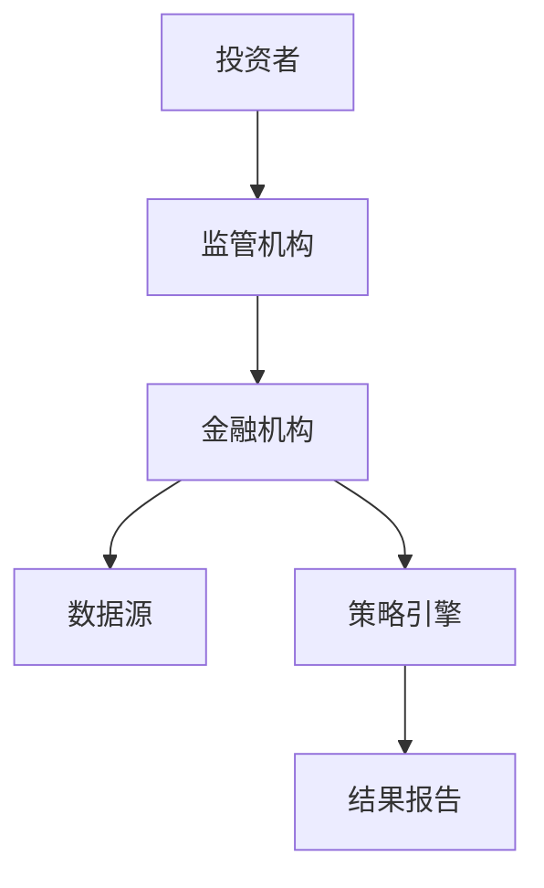

                 


# 格雷厄姆特价股票策略在不同数字监管沙盒环境中的表现

> 关键词：格雷厄姆策略，特价股票，数字监管沙盒，投资策略，系统架构

> 摘要：本文深入分析了格雷厄姆特价股票策略在不同数字监管沙盒环境中的表现，探讨了策略的核心原理、数学模型、系统架构，并通过实际案例展示了其在不同监管环境下的应用效果。文章还提供了最佳实践建议，帮助投资者更好地理解和应用该策略。

---

## 第一部分：概述与背景

### 第1章：格雷厄姆特价股票策略概述

#### 1.1 格雷厄姆投资理念的核心思想
- **安全边际**：投资时，购买价格低于内在价值，以降低风险。
- **低市盈率策略**：寻找市盈率低于市场平均水平的股票，避免高估值风险。
- **价值投资**：长期关注企业的基本面，而非短期市场波动。

#### 1.2 特价股票的定义与特征
- **定义**：市场价格低于内在价值的股票。
- **特征**：低市盈率、低市净率、高股息率。
- **对比分析**：与非特价股票相比，特价股票通常具有更高的安全边际和更大的上涨潜力。

#### 1.3 数字监管沙盒的基本概念
- **定义**：一种受监管的虚拟环境，允许金融机构在安全的环境中测试新产品和服务。
- **分类**：根据监管机构的不同，分为国家和地区级别的沙盒。
- **应用场景**：测试金融科技创新，评估投资策略在不同监管环境下的表现。

---

## 第二部分：核心概念与原理

### 第2章：格雷厄姆策略的核心原理

#### 2.1 格雷厄姆策略的数学模型
- **内在价值公式**：
  $$ V = \frac{E}{P} $$
  其中，$V$ 是内在价值，$E$ 是企业未来现金流的现值，$P$ 是折现率。

- **安全边际计算**：
  $$ \text{安全边际} = \text{内在价值} - \text{市场价格} $$

#### 2.2 监管沙盒的实体关系图
```mermaid
er
actor 投资者
actor 监管机构
actor 金融机构
```

#### 2.3 格雷厄姆策略的筛选标准
- **低市盈率策略**：P/E < 市场平均市盈率。
- **低市净率策略**：P/B < 市场平均市净率。
- **高股息率策略**：股息率 > 市场平均股息率。

---

## 第三部分：算法与数学模型

### 第3章：格雷厄姆策略的算法实现

#### 3.1 算法流程图
```mermaid
graph TD
A[开始] -> B[计算内在价值]
B -> C[确定市场价格]
C -> D[计算安全边际]
D -> E[判断安全边际是否为正]
E -> F[如果是，执行买入；否则，继续观察]
F -> G[结束]
```

#### 3.2 Python代码实现
```python
def calculate_intrinsic_value(enterprise_value, discount_rate):
    return enterprise_value / discount_rate

def greiner_strategy(screened_stocks):
    selected_stocks = []
    for stock in screened_stocks:
        iv = calculate_intrinsic_value(stock.enterprise_value, stock.discount_rate)
        sm = iv - stock.market_price
        if sm > 0:
            selected_stocks.append(stock)
    return selected_stocks
```

---

## 第四部分：系统分析与架构设计

### 第4章：系统架构设计

#### 4.1 功能设计
- **数据采集**：收集股票数据和监管信息。
- **策略执行**：根据监管环境调整策略参数。
- **结果分析**：评估策略表现并生成报告。

#### 4.2 系统架构图


#### 4.3 接口设计
- **API接口**：用于数据传输和策略执行。
- **RESTful API**：提供标准接口，方便不同环境下的调用。

---

## 第五部分：项目实战与案例分析

### 第5章：项目实战

#### 5.1 环境配置
- **工具安装**：安装Python和相关库（如Pandas、NumPy）。
- **数据源选择**：选择可靠的金融数据源。

#### 5.2 核心代码实现
```python
import pandas as pd

def main():
    data = pd.read_csv('stocks.csv')
    selected_stocks = greiner_strategy(data)
    print(selected_stocks)

if __name__ == "__main__":
    main()
```

#### 5.3 案例分析
- **美国市场**：应用格雷厄姆策略，筛选出具有高安全边际的股票。
- **欧盟市场**：考虑不同监管政策，调整策略参数。

---

## 第六部分：最佳实践与总结

### 第6章：最佳实践

#### 6.1 注意事项
- **数据准确性**：确保数据来源可靠。
- **监管变化**：及时调整策略以适应监管变化。

#### 6.2 小结
格雷厄姆策略在不同监管沙盒环境中的表现因市场条件和监管政策而异，但其核心思想仍具有重要的指导意义。

#### 6.3 拓展阅读
建议进一步研究其他投资策略，如成长型投资和价值型投资的结合。

---

通过以上目录，文章系统地分析了格雷厄姆特价股票策略在不同数字监管沙盒环境中的表现，结合理论、算法和实际案例，为投资者提供了有价值的参考。

