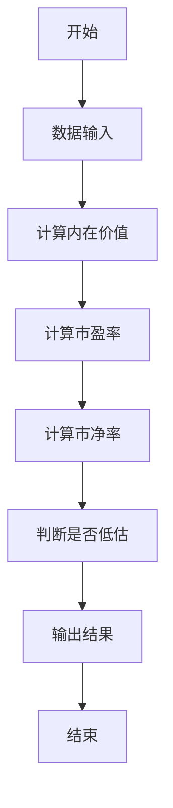
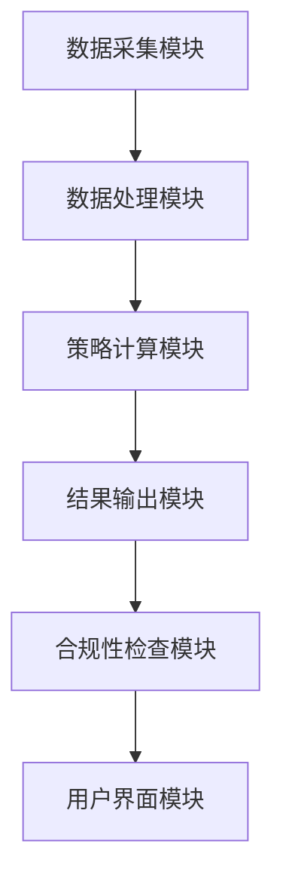
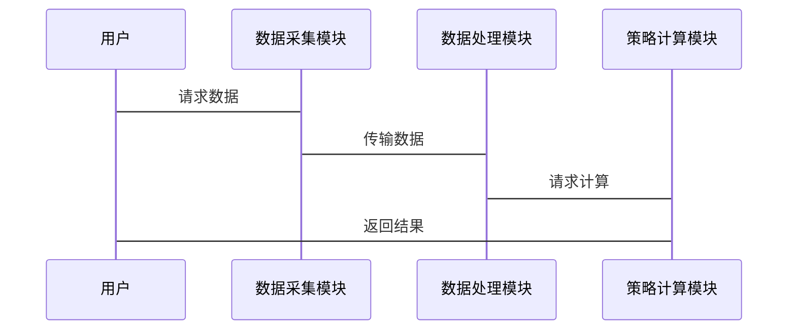

                 


# 格雷厄姆特价股票策略在不同数字监管科技环境中的表现

**关键词**：格雷厄姆策略、数字监管科技、价值投资、股票分析、投资策略、金融监管

**摘要**：本文探讨格雷厄姆特价股票策略在不同数字监管科技环境中的表现，分析其在现代金融市场中的适应性。通过数学模型、系统架构和实际案例，详细阐述数字监管科技对策略执行的影响，提出优化建议。

---

## 第一部分: 格雷厄姆特价股票策略与数字监管科技的背景

### 第1章: 格雷厄姆特价股票策略概述

#### 1.1 格雷厄姆投资理论的核心原则

- **价值投资的基本概念**：寻找市场低估的股票，注重安全边际。
- **格雷厄姆的“特价”股票定义**：市场价格远低于内在价值的股票。
- **格雷厄姆策略的历史表现分析**：长期表现优异，但在市场波动中可能面临短期压力。

#### 1.2 数字监管科技的现状与趋势

- **数字监管科技的定义与范围**：利用数字技术监管金融市场，包括合规性、透明度等方面。
- **数字监管科技的发展历程**：从传统监管到数字化、智能化监管的演变。
- **数字监管科技对金融市场的深远影响**：提高效率，降低风险，推动金融创新。

#### 1.3 格雷厄姆策略与数字监管科技的结合

- **数字化对投资策略的影响**：数据处理效率提升，模型优化。
- **格雷厄姆策略在现代环境中的适应性**：需要结合数字工具和监管要求。
- **数字监管科技对策略执行的影响**：合规性增强，数据质量提升。

---

### 第2章: 格雷厄姆特价股票策略的数学模型

#### 2.1 格雷厄姆策略的核心数学公式

- **内在价值计算公式**：$$\text{内在价值} = \frac{\text{股息}}{\text{折现率}}$$
- **市盈率与市净率分析**：$$\text{市盈率} = \frac{\text{股价}}{\text{每股收益}}$$
  $$\text{市净率} = \frac{\text{股价}}{\text{每股净资产}}$$

#### 2.2 数字监管科技对模型的影响

- **数据质量对模型准确性的影响**：高质量数据提升模型可靠性。
- **监管规则变化对模型参数的调整**：及时更新参数以符合新法规。
- **数字化工具对模型计算效率的提升**：使用大数据和AI优化计算。

#### 2.3 算法实现与优化

- **算法流程图（Mermaid）**：


---

### 第3章: 数字监管科技对格雷厄姆策略的影响

#### 3.1 监管合规性对策略执行的影响

- **数字监管对投资合规性的要求**：确保交易符合法规。
- **格雷厄姆策略在不同监管环境中的适用性**：需调整策略以适应不同监管要求。
- **合规性对策略收益的潜在影响**：合规可能导致收益下降，但风险降低。

#### 3.2 数据质量与策略表现

- **数据完整性对策略准确性的影响**：缺失或错误数据可能导致错误判断。
- **数据实时性对策略执行效率的影响**：实时数据有助于及时决策。
- **数据偏差对策略结果的潜在影响**：偏差可能导致误判。

#### 3.3 技术实现对策略优化的推动

- **大数据技术在策略分析中的应用**：处理海量数据，发现潜在机会。
- **人工智能对策略预测的辅助作用**：提升预测精度，优化投资组合。
- **区块链技术对数据可信度的提升**：确保数据不可篡改，增强信任。

---

### 第4章: 系统架构与实现方案

#### 4.1 系统架构设计

- **系统功能模块划分**：数据采集、处理、策略计算、合规检查、结果输出。
- **系统架构图（Mermaid）**：


#### 4.2 系统功能实现

- **数据采集与预处理**：收集市场数据，清洗处理。
- **策略计算与优化**：基于模型计算股票价值，优化参数。
- **结果可视化与报告生成**：生成报告，展示策略表现。

#### 4.3 系统接口设计

- **接口描述**：定义API，确保模块间通信。
- **系统交互序列图（Mermaid）**：


---

## 第五部分: 项目实战与最佳实践

### 第5章: 项目实战

#### 5.1 环境配置

- **安装Python和相关库**：numpy, pandas, matplotlib。
- **安装监管科技工具**：API接口，数据处理工具。

#### 5.2 核心代码实现

- **数据处理代码**：
```python
import pandas as pd
data = pd.read_csv('stock_data.csv')
```

- **策略计算代码**：
```python
def calculate_intrinsic_value(dividends, discount_rate):
    return dividends / discount_rate
```

- **结果可视化代码**：
```python
import matplotlib.pyplot as plt
plt.plot(values)
plt.show()
```

#### 5.3 案例分析

- **案例背景**：选择特定市场环境下的股票。
- **策略执行步骤**：数据采集、计算、判断、执行。
- **结果分析**：评估策略表现，调整参数。

#### 5.4 实际案例分析

- **案例选择**：分析某行业内的股票。
- **策略执行过程**：详细步骤说明。
- **结果解读**：策略在该环境下的表现。

### 第6章: 最佳实践与小结

#### 6.1 最佳实践 tips

- **数据源选择**：确保数据可靠。
- **模型优化**：定期更新参数。
- **合规性检查**：确保交易合法。

#### 6.2 小结

- **总结全文**：格雷厄姆策略在数字监管环境中的表现。
- **未来展望**：技术进步对策略优化的推动。

#### 6.3 注意事项

- **风险提示**：市场波动风险。
- **操作建议**：结合多种策略。

#### 6.4 拓展阅读

- **推荐书籍**：《证券分析》、《投资学》。
- **在线资源**：相关研究报告、博客文章。

---

通过以上结构，文章详细探讨了格雷厄姆策略在不同数字监管环境中的表现，结合理论分析和实际案例，为读者提供了全面的视角和深入的见解。

