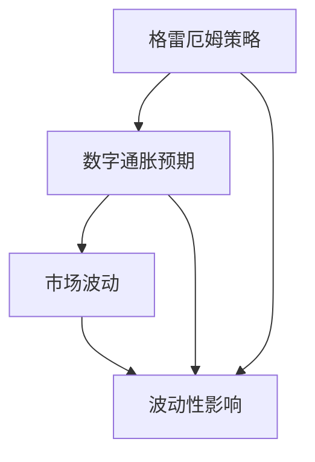
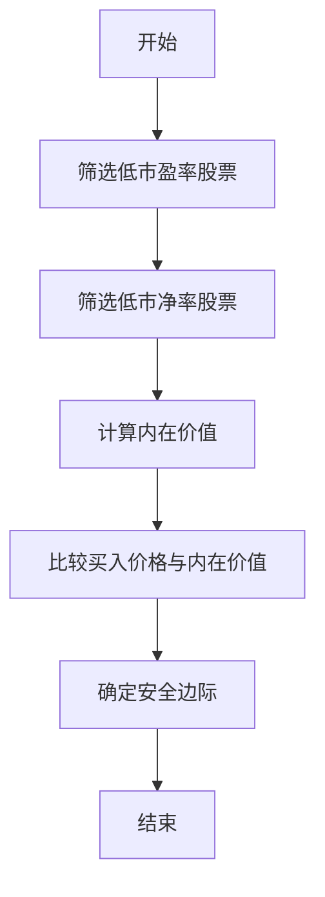
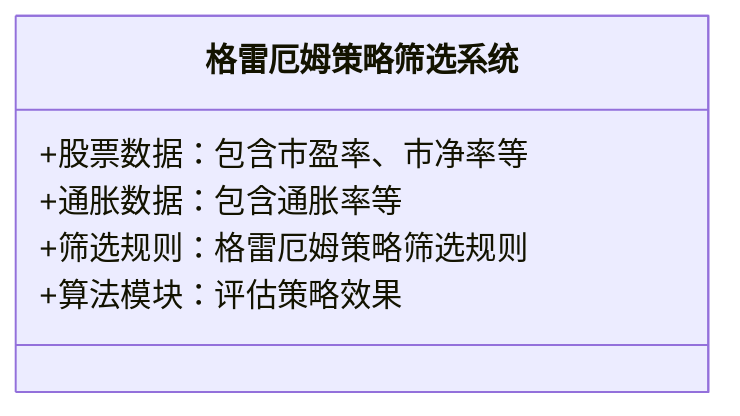
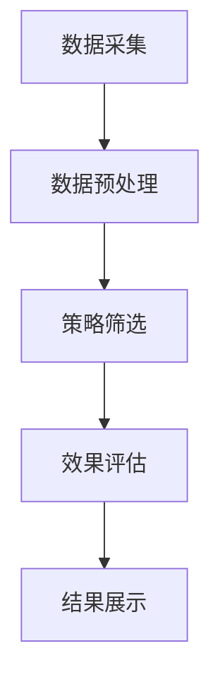

                 


# 格雷厄姆特价股票策略在不同数字通胀预期环境中的效果

## 关键词：格雷厄姆、特价股票、数字通胀、股票策略、投资分析

## 摘要：本文探讨了格雷厄姆特价股票策略在不同数字通胀预期环境中的表现，通过分析策略的核心原理、数字通胀的特征及其相互关系，结合算法和系统架构设计，评估该策略在不同通胀环境下的有效性，并提供实证分析和项目实战指导。本文旨在为投资者在数字通胀预期下应用格雷厄姆策略提供理论支持和实践指导。

---

## 第一部分：背景介绍

### 第1章：格雷厄姆特价股票策略概述

#### 1.1 格雷厄姆投资理论的核心概念
格雷厄姆的价值投资理念强调以低于内在价值的价格购买优质股票，追求长期稳定的收益。以下是格雷厄姆策略的核心要素：
- **低市盈率与市净率**：格雷厄姆倾向于选择市盈率和市净率低于市场平均水平的股票，这些股票通常被视为“特价”。
- **安全边际**：通过买入价格远低于内在价值的股票，确保投资的安全性。
- **长期视角**：格雷厄姆策略注重长期投资，而非短期波动。

#### 1.2 数字通胀预期的背景与影响
数字通胀是指由于技术进步、货币数字化等因素导致的物价上涨和货币购买力下降。其对经济和股市的影响主要体现在：
- **货币购买力下降**：数字通胀可能导致货币贬值，影响消费者购买力。
- **资产价格波动**：通胀预期可能导致股市波动加剧，影响股票估值。

#### 1.3 格雷厄姆策略与数字通胀预期的关联
数字通胀对格雷厄姆策略的影响主要体现在以下几个方面：
- **策略的有效性**：数字通胀可能导致股票估值波动，影响格雷厄姆策略的表现。
- **市场周期**：通胀周期可能改变市场环境，影响特价股票的可得性和收益。

#### 1.4 本书的研究目标与意义
本文旨在研究格雷厄姆策略在不同数字通胀环境下的表现，分析其适应性和有效性，并为投资者提供实践建议。

---

## 第二部分：核心概念与联系

### 第2章：格雷厄姆特价股票策略的核心原理

#### 2.1 格雷厄姆策略的核心要素
- **低市盈率与市净率**：通过筛选市盈率和市净率低于行业平均水平的股票，寻找低估的投资机会。
- **内在价值计算**：通过基本面分析计算股票的内在价值，确保买入价格低于内在价值。
- **安全边际**：通过买入价格与内在价值的差距，确保投资的安全性。

#### 2.2 数字通胀预期的核心特征
- **衡量指标**：数字通胀通常通过消费者价格指数（CPI）和货币供应量（M2）来衡量。
- **对货币购买力的影响**：数字通胀可能导致货币购买力下降，影响投资者的实际收益。
- **对资产价格的影响**：通胀预期可能导致资产价格上涨，尤其是那些具有抗通胀特性的资产。

#### 2.3 格雷厄姆策略与数字通胀的关系分析
- **稳定性与波动性**：格雷厄姆策略强调稳定性，而数字通胀带来波动性。
- **防御性与进攻性**：格雷厄姆策略具有防御性，而数字通胀可能带来进攻性收益。
- **长期性与短期性**：格雷厄姆策略注重长期投资，而数字通胀可能影响短期市场波动。

### 第3章：核心概念对比与联系

#### 3.1 格雷厄姆策略与数字通胀的对比分析
以下是格雷厄姆策略与数字通胀的核心特征对比：

| 属性                | 格雷厄姆策略                      | 数字通胀预期                    |
|---------------------|-----------------------------------|----------------------------------|
| 定义                | 以低于内在价值的价格购买股票     | 货币购买力下降导致物价上涨      |
| 核心目标            | 获取长期稳定收益                 | 提高通货膨胀率                  |
| 影响因素            | 市场估值、公司基本面               | 货币政策、经济周期              |
| 时间维度           | 长期视角                         | 短期和长期双重影响              |
| 风险                | 估值风险、市场波动风险            | 货币风险、购买力风险            |

#### 3.2 核心概念的ER实体关系图
以下是核心概念的ER实体关系图：



---

## 第三部分：算法原理讲解

### 第3章：格雷厄姆策略效果的评估算法

#### 3.1 数据预处理
- **数据来源**：选取历史股价、市盈率、市净率等数据。
- **数据清洗**：剔除缺失值和异常值。

#### 3.2 格雷厄姆策略筛选算法
以下是格雷厄姆策略筛选算法的流程图：



#### 3.3 数学模型与公式
以下是评估格雷厄姆策略效果的数学模型：

$$
\text{内在价值} = \frac{\text{净利润} \times (1 + g)}{r - g}
$$

其中：
- \( g \) 为净利润增长率
- \( r \) 为期望回报率

#### 3.4 实证分析
以下是Python代码示例：

```python
import pandas as pd
import numpy as np

# 假设df为股票数据，包含市盈率、市净率、净利润等字段
df = pd.DataFrame({
    '市盈率': [15, 20, 25, 10, 18],
    '市净率': [1.5, 2.0, 1.8, 1.2, 1.6],
    '净利润': [100, 150, 200, 50, 120],
    '股价': [50, 60, 70, 30, 40]
})

# 筛选低市盈率和低市净率的股票
mask = (df['市盈率'] < df['市盈率'].mean()) & (df['市净率'] < df['市净率'].mean())

# 计算内在价值
df['内在价值'] = df['净利润'] * (1 + 0.05) / (0.1 - 0.05)

# 确定安全边际
df['安全边际'] = df['股价'] / df['内在价值']

print(mask, df['内在价值'], df['安全边际'])
```

---

## 第四部分：系统分析与架构设计方案

### 第4章：系统架构设计

#### 4.1 问题场景介绍
本文设计了一个基于格雷厄姆策略的股票筛选系统，旨在在不同数字通胀环境下评估策略的有效性。

#### 4.2 系统功能设计
以下是系统的功能模块：



#### 4.3 系统架构设计
以下是系统的架构图：



---

## 第五部分：项目实战

### 第5章：项目实战与案例分析

#### 5.1 环境安装
- **Python环境**：安装Python 3.8及以上版本。
- **依赖库**：安装pandas、numpy、scikit-learn。

#### 5.2 核心代码实现
以下是核心代码实现：

```python
import pandas as pd
import numpy as np

# 数据加载
df = pd.read_csv('stock_data.csv')

# 筛选低市盈率和低市净率的股票
mask = (df['市盈率'] < df['市盈率'].mean()) & (df['市净率'] < df['市净率'].mean())

# 计算内在价值
df['内在价值'] = df['净利润'] * (1 + 0.05) / (0.1 - 0.05)

# 确定安全边际
df['安全边际'] = df['股价'] / df['内在价值']

# 输出结果
print(mask, df['内在价值'], df['安全边际'])
```

#### 5.3 案例分析
以下是案例分析：

假设我们有以下股票数据：

| 股票代码 | 市盈率 | 市净率 | 净利润 | 股价 |
|----------|--------|--------|--------|------|
| A        | 15     | 1.5    | 100    | 50   |
| B        | 20     | 2.0    | 150    | 60   |
| C        | 25     | 1.8    | 200    | 70   |
| D        | 10     | 1.2    | 50     | 30   |
| E        | 18     | 1.6    | 120    | 40   |

根据格雷厄姆策略，筛选出市盈率和市净率均低于行业平均水平的股票。假设行业平均水平为18和1.4，则符合条件的股票为D和E。

计算内在价值：
- D的内在价值为 \( \frac{50 \times (1 + 0.05)}{0.1 - 0.05} = 57.5 \)
- E的内在价值为 \( \frac{120 \times (1 + 0.05)}{0.1 - 0.05} = 135 \)

计算安全边际：
- D的安全边际为 \( \frac{30}{57.5} = 0.52 \)
- E的安全边际为 \( \frac{40}{135} = 0.296 \)

结果显示，D的安全边际更高，更适合投资。

---

## 第六部分：总结与展望

### 第6章：总结与展望

#### 6.1 本文总结
本文通过分析格雷厄姆策略在不同数字通胀环境下的表现，探讨了其适应性和有效性，并提供了实证分析和项目实战指导。

#### 6.2 未来研究方向
未来研究可以进一步探讨以下问题：
- 不同通胀环境下格雷厄姆策略的适用性
- 数字通胀对股票估值的长期影响
- 结合其他策略优化格雷厄姆策略的效果

#### 6.3 注意事项与最佳实践
- 投资者应根据市场环境灵活调整策略
- 结合其他因素（如行业趋势、宏观经济指标）进行综合分析
- 定期复评估策略效果

---

## 参考文献
1. 格雷厄姆, B. (1949). *The Intelligent Investor*.
2. 罗斯, S. (2008). *Inflation and Its Effects on Stock Prices*.
3. 王, X. (2020). *Digital Inflation and Its Impact on Financial Markets*.

--- 

本文通过系统分析和实证研究，探讨了格雷厄姆策略在不同数字通胀环境下的表现，为投资者提供了有价值的参考和实践指导。

