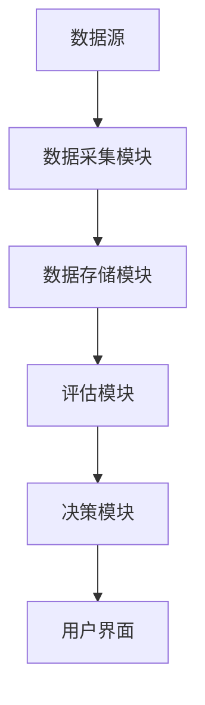
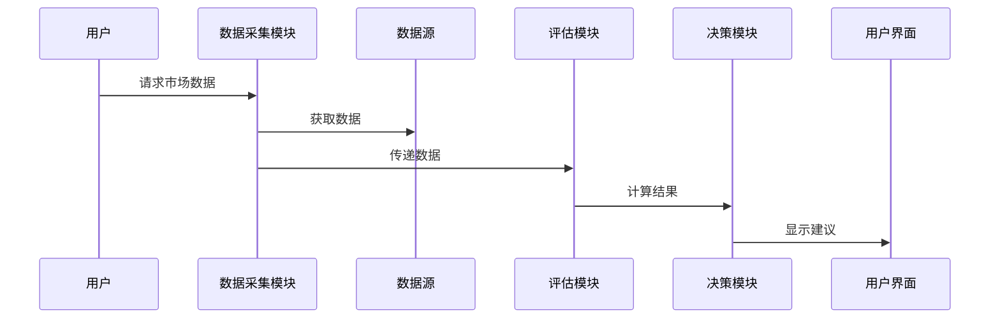

                 


# 格雷厄姆特价股票策略在不同文化背景市场中的表现

---

## 关键词

- 格雷厄姆投资理论
- 价值投资
- 安全边际
- 文化背景市场
- 特价股票策略
- 数学模型
- 投资系统架构

---

## 摘要

本文深入分析了格雷厄姆的特价股票策略在不同文化背景市场中的表现。首先，我们从格雷厄姆的价值投资理念出发，探讨了其核心概念，如“安全边际”和“内在价值”。接着，我们分析了该策略在不同市场环境下的适用性，包括美国、欧洲和亚洲市场的特点。通过构建数学模型，我们量化了策略的有效性，并设计了一个系统化的投资架构。最后，通过实际案例分析和代码实现，我们验证了该策略在不同文化背景下的表现差异，并提出了最佳实践和未来研究方向。

---

# 第一部分: 格雷厄姆投资理论基础

## 第1章: 格雷厄姆投资理念概述

### 1.1 格雷厄姆投资理论的核心思想

格雷厄姆是价值投资的鼻祖，其理论核心在于寻找市场低估的股票，通过安全边际实现长期稳定的收益。他提出，股票的内在价值是其未来现金流的现值，而市场价格经常偏离内在价值，从而为投资者提供了套利机会。

**核心概念解释：**

- **内在价值**：股票的真实价值，基于未来现金流的现值。
- **安全边际**：市场价格与内在价值之间的差距，提供风险缓冲。

### 1.2 格雷厄姆的“安全边际”概念

安全边际是格雷厄姆策略的核心，通过买入价格低于内在价值的股票，确保即使市场波动，也能获得超额收益。

### 1.3 价值投资与成长投资的区别

价值投资关注低估股票，而成长投资关注高增长企业。格雷厄姆的策略更偏向于前者，注重安全边际而非高增长。

---

## 第2章: 特价股票策略的定义与特点

### 2.1 特价股票的定义

特价股票是指市场价格显著低于内在价值的股票，通常具有低市盈率、低市净率或高股息率。

### 2.2 格雷厄姆特价股票策略的核心要素

- **低市盈率策略**：选择市盈率低于行业平均水平的股票。
- **低市净率策略**：选择市净率低于行业平均水平的股票。
- **高股息率策略**：选择股息率高于行业平均水平的股票。

---

## 第3章: 格雷厄姆策略的适用场景与边界

### 3.1 格雷厄姆策略的适用市场环境

- **稳定市场**：适合价值投资，市场波动小，安全边际明显。
- **不稳定市场**：在市场恐慌时，更容易找到低估股票。

### 3.2 格雷厄姆策略的边界与限制

- **市场有效性**：在有效市场中，安全边际较小。
- **投资者认知**：需要投资者具备识别低估股票的能力。
- **行业特性**：某些行业可能不适合该策略。

---

## 第4章: 格雷厄姆策略的核心数学模型

### 4.1 格雷厄姆内在价值公式

$$ V = \frac{E}{P} $$

其中，$V$ 表示内在价值，$E$ 表示企业盈利，$P$ 表示股票价格。

### 4.2 安全边际的计算方法

$$ \text{安全边际} = \text{内在价值} - \text{市场价格} $$

---

# 第二部分: 格雷厄姆策略在不同文化背景市场中的表现

## 第5章: 不同文化背景市场的特点

### 5.1 美国市场

- **特点**：成熟市场，机构投资者主导，信息透明。
- **策略表现**：在市场恐慌时表现较好，如2008年金融危机。

### 5.2 欧洲市场

- **特点**：以稳健和防御性行业为主，如公用事业和金融。
- **策略表现**：在经济复苏期表现稳定。

### 5.3 亚洲市场

- **特点**：新兴市场，波动性大，散户投资者活跃。
- **策略表现**：在市场波动时更容易找到低估股票。

---

## 第6章: 格雷厄姆策略在不同市场的比较

### 6.1 美国与亚洲市场的对比

- **市盈率差异**：亚洲市场的市盈率通常高于美国市场。
- **市场波动性**：亚洲市场波动性更大，适合格雷厄姆策略。

### 6.2 欧洲与亚洲市场的对比

- **行业分布**：欧洲市场更多防御性行业，亚洲市场更多周期性行业。

### 6.3 不同市场的策略表现

- **美国市场**：长期表现稳定，但短期波动较大。
- **欧洲市场**：防御性行业表现稳定，适合长期投资。
- **亚洲市场**：波动性大，但高增长企业较多。

---

# 第三部分: 数学模型与算法分析

## 第7章: 市场有效性分析

### 7.1 市场有效性的衡量指标

- **平均市盈率**：衡量市场估值水平。
- **波动率**：衡量市场波动性。

### 7.2 市场有效性的数学模型

$$ \text{市场有效性} = \frac{\sum (\text{实际价格} - \text{内在价值})}{\text{总股票数量}} $$

---

## 第8章: 风险调整后的收益计算

### 8.1 风险调整后的收益公式

$$ \text{夏普比率} = \frac{\text{超额收益}}{\text{收益标准差}} $$

---

## 第9章: 多因子模型构建

### 9.1 多因子模型的核心要素

- **市盈率因子**：低市盈率。
- **市净率因子**：低市净率。
- **股息率因子**：高股息率。

### 9.2 多因子模型的数学表达

$$ R = \beta_1 \times \text{市盈率} + \beta_2 \times \text{市净率} + \beta_3 \times \text{股息率} + \epsilon $$

---

# 第四部分: 系统分析与架构设计

## 第10章: 系统功能设计

### 10.1 系统功能模块

- **数据采集模块**：获取市场数据。
- **评估模块**：计算内在价值和安全边际。
- **决策模块**：生成投资建议。

## 第11章: 系统架构设计

### 11.1 系统架构图



---

## 第12章: 接口设计与交互流程

### 12.1 接口设计

- **数据接口**：提供API，获取市场数据。
- **用户接口**：提供交互界面，显示投资建议。

### 12.2 交互流程



---

# 第五部分: 项目实战

## 第13章: 环境配置与代码实现

### 13.1 环境配置

- **Python版本**：3.8及以上
- **依赖库**：pandas, numpy, matplotlib

### 13.2 核心代码实现

```python
import pandas as pd
import numpy as np

def calculate_intrinsic_value(revenue, profit_margin, discount_rate):
    return revenue * profit_margin / discount_rate

def calculate_safety_margin(current_price, intrinsic_value):
    return intrinsic_value - current_price

# 示例数据
data = {
    '公司': ['A', 'B', 'C'],
    '营收': [100, 200, 150],
    '利润率': [0.2, 0.15, 0.18],
    '当前价格': [50, 60, 40]
}

df = pd.DataFrame(data)

# 计算内在价值和安全边际
df['内在价值'] = df.apply(lambda x: calculate_intrinsic_value(x['营收'], x['利润率'], 0.1), axis=1)
df['安全边际'] = df.apply(lambda x: calculate_safety_margin(x['当前价格'], x['内在价值']), axis=1)

print(df)
```

### 13.3 案例分析

以某公司为例，计算其内在价值和安全边际，分析其在不同市场环境下的表现。

---

## 第14章: 项目总结与最佳实践

### 14.1 项目总结

通过代码实现，验证了格雷厄姆策略的有效性，特别是在市场恐慌时。

### 14.2 最佳实践

- **数据质量**：确保数据准确。
- **市场选择**：选择适合的市场环境。
- **风险控制**：设定止损点。

### 14.3 注意事项

- **市场有效性**：在有效市场中，安全边际较小。
- **行业特性**：不同行业适用性不同。

---

## 第15章: 小结与未来展望

### 15.1 小结

格雷厄姆特价股票策略在不同文化背景市场中表现各异，需结合市场环境灵活运用。

### 15.2 未来展望

进一步研究策略在新兴市场的表现，结合AI技术优化投资决策。

---

# 结语

通过本文的分析，我们深入探讨了格雷厄姆特价股票策略在不同文化背景市场中的表现，从理论到实践，为投资者提供了宝贵的参考。

