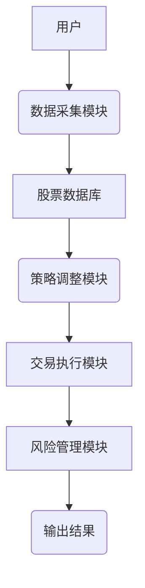
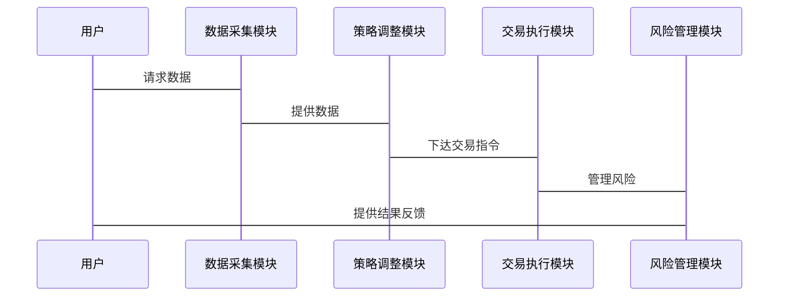

                 


# 格雷厄姆特价股票策略在不同监管环境下的调整

> 关键词：格雷厄姆投资理论，价值投资，监管环境，股票策略，安全边际，数学模型，系统架构

> 摘要：本文详细探讨了格雷厄姆特价股票策略在不同监管环境下的调整方法。首先，我们介绍了格雷厄姆投资理论的核心概念，包括安全边际和内在价值的计算。然后，我们分析了不同监管环境下的股票市场特点，如流动性、波动性和监管框架的差异。接下来，我们提出了在不同监管环境下调整策略的具体方法，并通过实际案例进行了详细分析。最后，我们设计了一个支持策略调整的系统架构，并提供了系统的实现方案和优化建议。

---

# 第一部分: 格雷厄姆特价股票策略概述

## 第1章: 格雷厄姆投资理论的核心概念

### 1.1 格雷厄姆投资理论的背景与起源

格雷厄姆投资理论是价值投资的鼻祖，其核心思想是寻找市场中被低估的股票，即所谓的“特价股票”。该理论强调安全边际的重要性，即以低于内在价值的价格买入股票，从而在市场波动中获得超额收益。

#### 核心概念与属性对比

| 概念          | 定义与特征                                | 示例场景                     |
|---------------|------------------------------------------|------------------------------|
| 内在价值      | 股票的合理价值，基于基本面分析             | 公司净利润除以合理市盈率       |
| 安全边际      | 市场价格与内在价值之间的差距               | 买入价格低于内在价值         |
| 投资策略      | 基于价值的投资方法，而非市场情绪           | 选择低市盈率、低市净率的股票   |

### 1.2 格雷厄姆策略的数学模型

格雷厄姆策略的核心是通过数学模型计算股票的内在价值和安全边际。以下是两个关键公式：

1. **内在价值公式**：
   $$ V = \frac{E}{P} $$
   其中，\( V \) 表示内在价值，\( E \) 表示企业收益，\( P \) 表示市盈率。

2. **安全边际公式**：
   $$ \text{安全边际} = \frac{\text{内在价值} - \text{市场价格}}{\text{内在价值}} $$

   当安全边际为正时，股票具有投资价值。

### 1.3 策略的边界与外延

格雷厄姆策略适用于以下场景：
- 市场处于低估状态。
- 投资者具备基本面分析能力。
- 长期投资，而非短期交易。

其局限性包括：
- 忽略了市场波动性和流动性对股票价格的影响。
- 未考虑宏观经济环境的变化。

---

## 第2章: 不同监管环境下的股票市场特点

### 2.1 全球主要股票市场的监管框架

全球主要股票市场分为三类：美国、欧洲和亚洲。不同市场的监管框架对格雷厄姆策略的影响如下：

#### 2.1.1 美国市场的监管特点

- **特征**：
  - 市场流动性高。
  - 监管透明度高。
  - 机构投资者占比高。

- **对格雷厄姆策略的影响**：
  - 流动性高，有利于快速买卖，但也可能导致价格波动。
  - 透明度高，有利于基本面分析。

#### 2.1.2 欧洲市场的监管特点

- **特征**：
  - 市场流动性相对较低。
  - 监管严格，尤其是在信息披露方面。
  - 个人投资者占比高。

- **对格雷厄姆策略的影响**：
  - 流动性低，可能导致买卖价差较大。
  - 监管严格，有利于长期投资者。

#### 2.1.3 亚洲市场的监管特点

- **特征**：
  - 市场流动性高。
  - 监管框架相对新，变化快。
  - 机构投资者占比低。

- **对格雷厄姆策略的影响**：
  - 流动性高，但市场波动性大。
  - 监管变化快，需及时调整策略。

### 2.2 不同监管环境下的市场流动性分析

#### 2.2.1 流动性对股票价格的影响

- **流动性高的市场**：
  - 价格波动小。
  - 买卖价差小。

- **流动性低的市场**：
  - 价格波动大。
  - 买卖价差大。

### 2.2.2 不同市场流动性差异的成因

- **流动性差异的成因**：
  - 市场规模：大市场流动性高。
  - 投资者结构：机构投资者多的市场流动性高。
  - 监管政策：透明度高的市场流动性高。

### 2.2.3 流动性对格雷厄姆策略的影响

- **影响**：
  - 流动性高：有利于快速进出市场。
  - 流动性低：可能导致买卖价差大，影响策略收益。

### 2.3 不同监管环境下的市场波动性分析

#### 2.3.1 市场波动性的定义与衡量

- **波动性**：股票价格短期波动的程度。
- **衡量指标**：标准差、波动率。

#### 2.3.2 不同市场波动性的对比

- **美国市场**：波动率较低。
- **欧洲市场**：波动率中等。
- **亚洲市场**：波动率较高。

#### 2.3.3 波动性对格雷厄姆策略的影响

- **影响**：
  - 波动率高：可能导致短期亏损，但长期收益可能更高。
  - 波动率低：适合短期交易。

---

## 第3章: 格雷厄姆策略在不同监管环境下的调整方法

### 3.1 美国市场环境下的策略调整

#### 3.1.1 美国市场的监管特点对策略的影响

- **影响**：
  - 透明度高，适合基本面分析。
  - 机构投资者多，市场流动性高。

#### 3.1.2 美国市场下的策略优化

- **优化方法**：
  - 增加对低市盈率股票的关注。
  - 降低交易成本。

#### 3.1.3 典型案例分析

- **案例**：2008年金融危机后，美国市场的复苏过程中，许多被低估的股票被发现，符合格雷厄姆策略。

### 3.2 欧洲市场环境下的策略调整

#### 3.2.1 欧洲市场的监管特点对策略的影响

- **影响**：
  - 监管严格，适合长期投资。
  - 市场流动性低，买卖价差大。

#### 3.2.2 欧洲市场下的策略优化

- **优化方法**：
  - 选择流动性较高的股票。
  - 考虑交易成本。

#### 3.2.3 典型案例分析

- **案例**：2010年欧债危机期间，许多欧洲股票被低估，适合格雷厄姆策略。

### 3.3 亚洲市场环境下的策略调整

#### 3.3.1 亚洲市场的监管特点对策略的影响

- **影响**：
  - 市场流动性高，波动率大。
  - 监管变化快，需及时调整。

#### 3.3.2 亚洲市场下的策略优化

- **优化方法**：
  - 选择具有稳定基本面的股票。
  - 灵活应对监管变化。

#### 3.3.3 典型案例分析

- **案例**：2020年新冠疫情后，许多亚洲股票被低估，适合格雷厄姆策略。

---

## 第4章: 系统分析与架构设计方案

### 4.1 系统功能设计

- **目标**：设计一个支持格雷厄姆策略调整的系统。
- **功能模块**：
  1. 数据采集模块：采集股票数据。
  2. 策略调整模块：根据监管环境调整策略。
  3. 交易执行模块：执行买卖操作。
  4. 风险管理模块：管理投资风险。

### 4.2 系统架构设计



### 4.3 系统接口设计

- **数据接口**：
  - 数据源：Yahoo Finance API。
  - 数据格式：JSON。

### 4.4 系统交互流程



---

## 第5章: 项目实战

### 5.1 环境安装

- **工具**：Python、Pandas、Matplotlib。

### 5.2 核心代码实现

```python
import pandas as pd
import numpy as np

def calculate_intrinsic_value(enterprise_value, p_ratio):
    return enterprise_value / p_ratio

def calculate_margin_of_safety(intrinsic_value, market_price):
    return (intrinsic_value - market_price) / intrinsic_value

# 示例数据
data = {
    'enterprise_value': [100, 200, 300],
    'p_ratio': [10, 15, 20],
    'market_price': [50, 80, 100]
}

df = pd.DataFrame(data)

# 计算内在价值和安全边际
df['intrinsic_value'] = df.apply(lambda x: calculate_intrinsic_value(x['enterprise_value'], x['p_ratio']), axis=1)
df['margin_of_safety'] = df.apply(lambda x: calculate_margin_of_safety(x['intrinsic_value'], x['market_price']), axis=1)

print(df)
```

### 5.3 案例分析与结果解读

- **案例分析**：
  - 股票A：企业价值100，市盈率10，市场价格50。
  - 内在价值=10，安全边际=0.5。

- **结果解读**：
  - 安全边际为正，适合买入。

---

## 第6章: 总结与展望

### 6.1 本章小结

格雷厄姆策略在不同监管环境下的调整方法，需要结合市场特点和监管环境进行优化。通过系统设计和实战分析，我们可以更好地应对不同市场环境下的投资挑战。

### 6.2 最佳实践 Tips

- 保持对市场的敏感性。
- 灵活调整策略。
- 降低交易成本。

### 6.3 未来研究方向

- 更复杂的市场环境下的策略调整。
- 结合人工智能技术优化策略。

---

## 附录

### 附录A: 监管法规汇编

- 美国证券交易委员会（SEC）法规。
- 欧洲证券和市场管理局（ESMA）法规。
- 亚洲证券交易所协会（ASX）法规。

### 附录B: 代码库

- 格雷厄姆策略调整的Python代码库。

---

通过以上分析，我们可以清晰地看到格雷厄姆策略在不同监管环境下的调整方法，以及如何通过系统设计和实战应用来优化策略。希望本文能为投资者提供有价值的参考。

