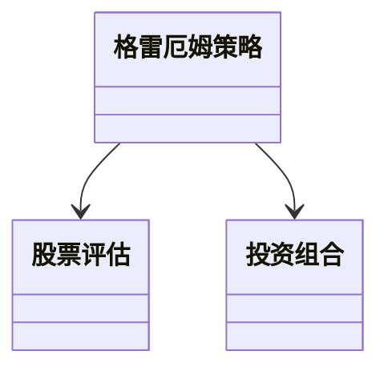
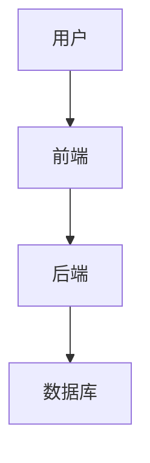
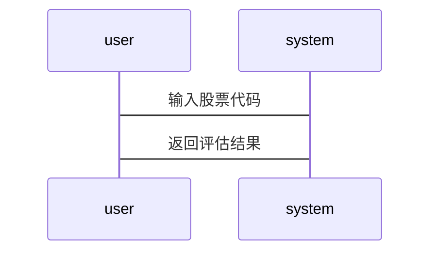

                 


# 格雷厄姆特价股票策略在不同监管环境下的调整

## 关键词：格雷厄姆策略、特价股票、监管环境、价值评估、安全边际、投资策略、市场分析

## 摘要：
本文系统地探讨了格雷厄姆特价股票策略在不同监管环境下的调整方法。首先，我们介绍了格雷厄姆投资理论的核心概念，包括内在价值、安全边际和市场先生理论。接着，我们分析了监管环境对策略实施的影响，包括不同市场环境下的策略调整和监管框架的变化。然后，我们详细讲解了格雷厄姆策略的数学模型和算法实现，包括内在价值计算、安全边际评估和投资组合优化。最后，我们通过实际案例分析了策略在不同监管环境下的应用效果，并总结了最佳实践和注意事项。

---

# 正文

## 第一部分: 格雷厄姆特价股票策略的背景与核心概念

### 第1章: 格雷厄姆特价股票策略的起源与核心理念

#### 1.1 格雷厄姆投资理论的起源

**1.1.1 本杰明·格雷厄姆的生平简介**
本杰明·格雷厄姆（Benjamin Graham）是20世纪著名的投资学家，被誉为“价值投资之父”。他于1894年出生于伦敦，后随家人移民美国。格雷厄姆在哥伦比亚大学学习经济学，毕业后进入华尔街工作，逐渐发展出一套独特的投资理论。

**1.1.2 格雷厄姆投资理论的核心思想**
格雷厄姆的投资理论以“价值投资”为核心，强调以低于股票内在价值的价格买入股票，并长期持有，等待其价值回归。他认为市场波动反映的是投资者情绪，而非股票的真正价值。

**1.1.3 特价股票策略的定义与特点**
格雷厄姆提出的“特价股票”策略是指在市场低迷时期，寻找那些市场价格远低于其内在价值的股票进行投资。这种策略的核心在于利用市场的非理性波动，捕捉低估的投资机会。

#### 1.2 格雷厄姆特价股票策略的核心概念

**1.2.1 特价股票的定义与标准**
特价股票是指市场价格低于其内在价值的股票。内在价值的计算基于公司财务状况、盈利能力、行业地位等因素。

**1.2.2 市场先生理论与投资者心态**
格雷厄姆提出“市场先生”理论，认为市场波动反映了投资者情绪的变化。投资者应以理性应对市场的非理性波动，避免被市场情绪左右。

**1.2.3 安全边际的概念与计算**
安全边际是指股票的市场价格与内在价值之间的差距。计算公式为：
$$ \text{安全边际} = \text{内在价值} - \text{市场价格} $$

#### 1.3 格雷厄姆策略在现代投资中的应用

**1.3.1 现代市场环境对格雷厄姆策略的影响**
现代市场环境的变化，如高频交易、算法交易等，对格雷厄姆策略的实施提出了新的挑战。传统策略需要结合现代市场环境进行调整。

**1.3.2 格雷厄姆策略的优缺点分析**
- **优点**：风险较低，收益稳定。
- **缺点**：需要较长的投资周期，对市场波动的适应能力较弱。

**1.3.3 格雷厄姆策略的适用场景与边界**
格雷厄姆策略适用于市场低迷时期，但需要根据市场环境动态调整。

---

### 第2章: 格雷厄姆特价股票策略的核心模型与方法

#### 2.1 格雷厄姆价值评估模型

**2.1.1 股票内在价值的计算公式**
$$ V = \frac{E}{1 + r} $$
其中，\( E \) 是公司未来现金流的总和，\( r \) 是折现率。

**2.1.2 负债与股东权益的分析**
通过分析公司的负债和股东权益，评估公司的财务健康状况。

**2.1.3 市盈率与市净率的比较**
市盈率（P/E）和市净率（P/B）是常用的估值指标：
$$ P/E = \frac{\text{股价}}{\text{每股收益}} $$
$$ P/B = \frac{\text{股价}}{\text{每股净资产}} $$

#### 2.2 格雷厄姆安全边际计算方法

**2.2.1 安全边际的公式与应用**
$$ S = V - P $$
其中，\( S \) 是安全边际，\( V \) 是内在价值，\( P \) 是市场价格。

**2.2.2 市场价格与内在价值的对比**
通过对比市场价格和内在价值，确定是否具备安全边际。

**2.2.3 安全边际的动态调整**
根据市场环境变化，动态调整安全边际的计算方法。

#### 2.3 格雷厄姆策略的实施步骤

**2.3.1 确定投资目标与筛选标准**
- 确定投资目标：寻找那些市场价格低于内在价值的股票。
- 筛选标准：市盈率、市净率、股息率等。

**2.3.2 财务报表分析与估值计算**
通过分析公司财务报表，计算内在价值，评估是否具备安全边际。

**2.3.3 投资组合构建与风险控制**
根据市场环境和个股情况，构建投资组合，分散风险。

---

### 第3章: 格雷厄姆策略在不同监管环境下的调整

#### 3.1 不同监管环境下的策略调整

**3.1.1 不同市场环境的监管框架**
- 美国市场：严格监管，注重信息披露。
- 中国市场：监管力度较大，注重合规性。

**3.1.2 监管环境对策略的影响**
- 市场监管政策的变化会影响股票价格。
- 监管力度的差异会影响安全边际的计算。

**3.1.3 动态调整策略的方法**
- 根据监管环境变化，调整投资策略。
- 优化安全边际计算模型。

#### 3.2 格雷厄姆策略的监管适应性分析

**3.2.1 不同市场环境下的策略调整**
- 在高监管环境下，注重合规性。
- 在低监管环境下，注重风险控制。

**3.2.2 监管政策对安全边际的影响**
- 监管政策的变化会影响股票的内在价值。
- 需要根据监管环境变化，动态调整安全边际。

---

## 第二部分: 系统分析与架构设计

### 第4章: 系统分析与架构设计方案

#### 4.1 问题场景介绍

**4.1.1 系统需求**
- 实现格雷厄姆策略的自动化评估。
- 能够根据监管环境动态调整策略。

**4.1.2 项目目标**
- 开发一个基于格雷厄姆策略的投资管理系统。

#### 4.2 系统功能设计

**4.2.1 领域模型设计**
使用Mermaid绘制领域模型类图：


**4.2.2 系统架构设计**
使用Mermaid绘制系统架构图：


#### 4.3 接口设计与交互流程

**4.3.1 系统接口设计**
- 用户输入股票代码。
- 系统返回评估结果。

**4.3.2 交互流程设计**
使用Mermaid绘制交互流程图：


---

## 第三部分: 项目实战

### 第5章: 项目实战

#### 5.1 环境安装与配置

**5.1.1 安装Python环境**
- 安装Python 3.x
- 安装必要的库：pandas, numpy, matplotlib

**5.1.2 配置开发环境**
- 安装Jupyter Notebook

#### 5.2 核心代码实现

**5.2.1 格雷厄姆策略的核心算法**
```python
def calculate_intrinsic_value(revenue, profit_margin, discount_rate):
    return revenue * profit_margin / (1 + discount_rate)
```

**5.2.2 安全边际计算**
```python
def calculate_margin_of_safety(intrinsic_value, market_price):
    return intrinsic_value - market_price
```

#### 5.3 案例分析与结果解读

**5.3.1 案例分析**
假设某公司 revenue 为1000万元，profit_margin 为10%，discount_rate 为5%。计算内在价值：
$$ V = \frac{1000 \times 0.1}{1.05} = 9.5238 \text{元} $$

**5.3.2 结果解读**
如果市场价格为9元，安全边际为：
$$ S = 9.5238 - 9 = 0.5238 \text{元} $$

---

## 第四部分: 最佳实践与总结

### 第6章: 最佳实践与总结

#### 6.1 最佳实践

**6.1.1 定期评估与调整**
- 定期评估股票的内在价值和市场价格。
- 根据市场环境变化，动态调整策略。

**6.1.2 风险控制**
- 设置止损点。
- 分散投资组合。

#### 6.2 小结

格雷厄姆特价股票策略在不同监管环境下的调整需要结合市场环境和监管政策，动态优化策略。本文通过系统分析和实际案例，展示了如何在不同监管环境下实施格雷厄姆策略。

---

### 附录: 格雷厄姆策略相关工具与资源

- Python代码库：pandas, numpy
- 数据源：Yahoo Finance, Bloomberg
- 进一步阅读：《The Intelligent Investor》

---

通过以上结构，我们可以系统地探讨格雷厄姆特价股票策略在不同监管环境下的调整方法，并提供实际操作的指导和建议。

