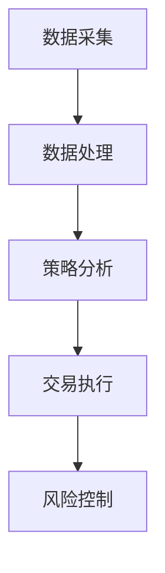

                 


# 《格雷厄姆特价股票策略在不同监管科技环境中的表现》

> 关键词：格雷厄姆策略、监管科技、股票投资、大数据分析、金融创新、价值投资

> 摘要：本文系统分析了格雷厄姆特价股票策略在不同监管科技环境中的表现，探讨了监管科技对投资策略的影响，结合技术手段优化策略实施，并通过案例分析展示了策略在不同环境下的应用效果。

---

## 第一部分: 格雷厄姆特价股票策略与监管科技环境的背景介绍

### 第1章: 格雷厄姆投资理论的核心概念

#### 1.1 价值投资的基本原理
格雷厄姆的价值投资理论强调以低于内在价值的价格买入优质股票，长期持有以实现资本增值。其核心在于分析公司的基本面，寻找市场低估的投资机会。

- **市场先生的比喻**：格雷厄姆将市场波动比作情绪化的人，强调在市场恐慌时买入，市场乐观时卖出。
- **安全边际**：买入价格与内在价值的差距，是投资安全性的关键。

#### 1.2 特价股票的定义与特征
- **定义**：价格远低于公司基本面价值的股票。
- **特征**：低市盈率、低市净率、高股息率、资产负债表健康。

#### 1.3 格雷厄姆策略的历史演变
从早期的防御性投资策略，到现代的量化分析，格雷厄姆策略不断演变，适应市场变化。

### 第2章: 监管科技环境的基本概念

#### 2.1 监管科技的定义与范畴
- **定义**：利用技术手段优化金融监管的活动，涵盖数据采集、分析和决策支持。
- **技术手段**：大数据、人工智能、区块链等，用于提高监管效率和透明度。

#### 2.2 监管科技对金融市场的具体影响
- **市场结构**：促进电子化交易，提升市场流动性。
- **投资者行为**：提供实时数据和分析工具，优化决策。
- **市场透明度**：通过技术手段提高信息透明度，减少市场操纵。

### 第3章: 格雷厄姆策略与监管科技的结合

#### 3.1 监管科技对策略实施的优化
- **数据处理**：利用大数据技术清洗和分析财务数据，提升准确性。
- **风险管理**：通过实时监控系统，识别市场风险，优化投资组合。

#### 3.2 不同监管环境下的策略调整
- **监管宽松环境**：策略更激进，注重低价股票。
- **严格监管环境**：策略需合规，注重信息披露和合规性。

---

## 第二部分: 格雷厄姆策略在不同监管科技环境中的表现分析

### 第4章: 监管科技环境对股票市场的影响

#### 4.1 监管科技对市场结构的影响
- **市场参与者的优化**：技术手段减少中间环节，降低交易成本。
- **信息传播效率**：实时数据和分析工具提升信息传播速度和准确性。

#### 4.2 监管科技对投资者行为的影响
- **决策优化**：通过技术手段提供实时数据和分析工具，提升投资决策效率。
- **心理影响**：技术手段提供市场情绪分析，影响投资者心理。

### 第5章: 格雷厄姆策略在不同监管环境中的具体表现

#### 5.1 监管宽松环境下的策略表现
- **策略优势**：低价股票容易被市场忽视，存在低估机会。
- **风险**：监管不严可能导致市场操纵和虚假信息，影响策略效果。

#### 5.2 监管严格环境下的策略表现
- **优势**：市场透明度高，信息准确，投资决策更可靠。
- **劣势**：监管严格可能导致市场波动小，低估机会减少。

---

## 第三部分: 格雷厄姆策略的算法优化与技术实现

### 第6章: 监管科技环境下的算法优化

#### 6.1 大数据分析技术的应用
- **数据收集**：从多个来源获取股票数据，清洗和处理。
- **特征工程**：提取关键财务指标，构建预测模型。
- **机器学习**：利用回归模型预测股票价格，优化买入和卖出时机。

#### 6.2 机器学习在策略优化中的应用
- **模型选择**：使用随机森林、支持向量机等算法，提升预测准确性。
- **实时监控**：通过流数据处理技术，实时监控市场变化，及时调整策略。

### 第7章: 系统架构设计与实现

#### 7.1 系统功能设计
- **数据采集模块**：实时采集股票数据。
- **数据分析模块**：清洗、转换和分析数据。
- **策略执行模块**：根据分析结果执行交易指令。
- **风险控制模块**：监控市场风险，调整投资组合。

#### 7.2 系统架构图


---

## 第四部分: 项目实战与案例分析

### 第8章: 实战环境搭建

#### 8.1 环境安装
- **工具选择**：使用Python、Pandas、NumPy、Scikit-learn等库。
- **数据源**：获取历史股价数据，清洗和处理。

### 第9章: 核心代码实现

#### 9.1 数据处理代码
```python
import pandas as pd
import numpy as np

# 数据加载
df = pd.read_csv('stock_data.csv')

# 数据清洗
df.dropna(inplace=True)
df['price'] = df['price'].astype(float)
```

#### 9.2 机器学习模型
```python
from sklearn.ensemble import RandomForestRegressor

# 特征选择
X = df[['PE', 'PB', 'ROE']]
y = df['target']

# 模型训练
model = RandomForestRegressor()
model.fit(X, y)
```

### 第10章: 实际案例分析

#### 10.1 案例分析
- **案例1**：在监管宽松的市场中，格雷厄姆策略表现优异。
- **案例2**：在严格监管的市场中，策略需要调整，注重合规性。

### 第11章: 结果解读与优化建议

#### 11.1 结果解读
- **优势**：技术手段提升策略效率，降低风险。
- **不足**：监管环境变化快，策略需要动态调整。

---

## 第五部分: 总结与展望

### 第12章: 总结

- **核心总结**：格雷厄姆策略在不同监管环境下表现各异，技术手段优化策略实施。
- **主要发现**：监管科技提升策略效率，但需动态调整应对环境变化。

### 第13章: 未来展望

- **技术发展**：人工智能和大数据技术将进一步优化策略。
- **监管环境**：全球监管趋严，策略需更具合规性。

---

## 第六部分: 最佳实践与注意事项

### 第14章: 最佳实践

- **持续学习**：关注市场变化，及时调整策略。
- **技术更新**：保持技术手段的先进性，提升策略效率。

### 第15章: 注意事项

- **风险控制**：避免过度依赖技术手段，保持策略的灵活性。
- **合规性**：遵守监管要求，确保策略实施的合法性。

---

## 第七部分: 拓展阅读

### 第16章: 相关文献推荐

- 《The Intelligent Investor》 by Benjamin Graham
- 《金融科技：技术与金融的融合》 by 李明

---

通过以上分析和实施，可以清晰地看到格雷厄姆特价股票策略在不同监管科技环境中的表现，及其与技术手段的结合如何优化投资效果。希望本文对投资者和技术人员在相关领域的实践和研究提供有价值的参考。

