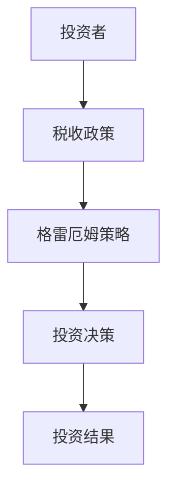
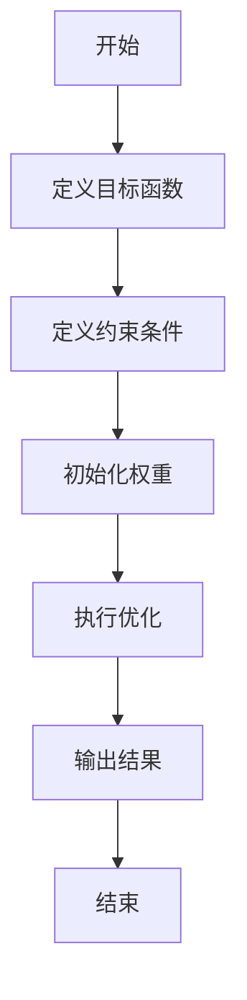
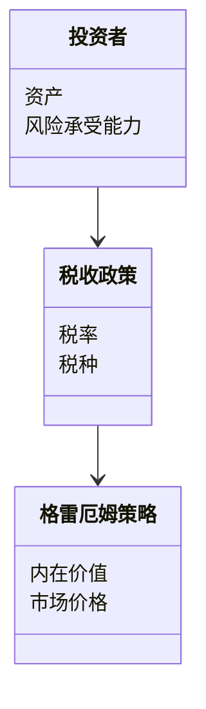
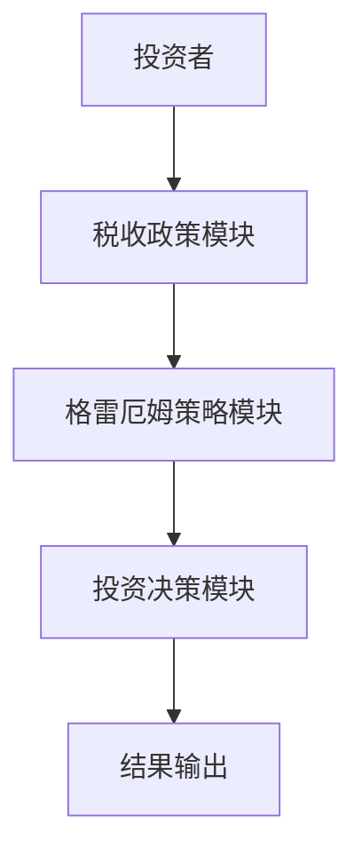

                 


# 格雷厄姆特价股票策略在不同税收环境下的调整

## 关键词：格雷厄姆策略，税收环境，投资优化，股票策略，价值投资

## 摘要：格雷厄姆特价股票策略是一种经典的价值投资方法，但随着税收政策的变化，其在不同国家和地区的应用需要进行调整。本文详细分析了格雷厄姆策略在不同税收环境下的优化方法，探讨了如何在考虑税收影响的情况下制定最优投资策略。文章从背景介绍、核心概念、算法原理、数学模型、系统分析、项目实战等多方面进行深入探讨，为投资者提供实用的指导。

---

# 第一部分: 格雷厄姆特价股票策略与税收环境的背景介绍

## 第1章: 投资环境与税收政策概述

### 1.1 投资环境的基本概念

#### 1.1.1 投资环境的定义与分类
投资环境是指投资者在进行股票投资时所面临的所有外部条件，包括经济状况、市场结构、政策法规等。其中，税收政策是影响投资决策的重要因素之一。

- **定义**：投资环境由多个因素组成，如经济周期、市场流动性、政策法规等，其中税收政策对投资者的收益和决策有直接影响。
- **分类**：投资环境可以分为国内环境和国际环境。国内环境包括本国的经济政策、税收法规等，而国际环境则涉及跨国投资时的税收政策差异。

#### 1.1.2 不同国家的税收政策对比
不同国家的税收政策存在显著差异，这些差异直接影响投资者的收益和投资策略。

- **美国**：美国的资本利得税分为短期和长期，长期资本利得税较低，鼓励长期投资。
- **中国**：中国的股票交易印花税单向征收，卖出时按交易额的0.1%征收，对买入不征税。
- **欧盟**：欧盟国家通常对资本利得税采取累进税率，部分国家对长期资本利得税有优惠。

#### 1.1.3 税收政策对投资决策的影响
税收政策通过影响投资收益和成本，改变投资者的决策。例如，较低的资本利得税会增加投资收益，从而吸引更多投资者。

---

### 1.2 格雷厄姆特价股票策略的基本原理

#### 1.2.1 格雷厄姆投资理论的核心思想
本杰明·格雷厄姆是价值投资的鼻祖，他的投资策略强调寻找市场低估的股票。

- **核心思想**：格雷厄姆认为，股票的价值应基于其内在价值，而非市场波动。投资者应寻找那些市场价格低于内在价值的股票。
- **安全边际**：格雷厄姆强调在投资时留有安全边际，即市场价格与内在价值之间的差距，以降低投资风险。

#### 1.2.2 特价股票的定义与识别标准
特价股票是指市场价格低于其内在价值的股票，识别标准包括：

- **低市盈率（P/E）**：市盈率低于行业平均水平。
- **低市净率（P/B）**：市净率低于行业平均水平。
- **股息率高**：股息收益率较高，表明股票估值可能较低。

#### 1.2.3 税收环境对格雷厄姆策略的影响
税收政策会影响投资收益，从而影响投资者是否选择特价股票。

- **资本利得税**：资本利得税的高低会影响投资者的净收益，税率越高，投资回报率越低。
- **股息税**：股息收入的税率也会影响投资者的选择，高税率可能降低投资吸引力。

---

### 1.3 本书的研究背景与意义

#### 1.3.1 当前投资环境的复杂性
当前全球经济不确定性增加，税收政策变化频繁，投资者需要灵活调整策略。

#### 1.3.2 税收政策变化对企业投资的影响
税收政策的变化直接影响企业的盈利能力，进而影响股票价值。

#### 1.3.3 研究格雷厄姆策略在不同税收环境下的调整的必要性
随着全球化的深入，投资者面临的税收环境日益复杂，如何在不同税收环境下优化格雷厄姆策略成为一个重要课题。

---

## 第2章: 核心概念与联系

### 2.1 核心概念的定义与属性

#### 2.1.1 投资收益与税收的关系
投资收益与税收密切相关，税收政策影响投资者的实际收益。

- **税后收益公式**：$ \text{税后收益} = \text{投资收益} - \text{税款} $
- **税款计算**：税款取决于税率和应纳税所得额。

#### 2.1.2 格雷厄姆策略的核心要素
格雷厄姆策略的核心要素包括内在价值、市场价格、安全边际等。

- **内在价值**：股票的真实价值，与市场价格可能不同。
- **市场价格**：股票在市场上的交易价格。
- **安全边际**：市场价格与内在价值的差异，提供额外的保护。

#### 2.1.3 税收环境的变量与影响
税收环境的变量包括税率、征税方式等，这些变量会影响投资者的收益和风险。

---

### 2.2 核心概念的对比分析

#### 2.2.1 不同税收环境下的收益计算公式
在不同税收环境下，收益计算公式有所不同。

- **高税率环境**：税后收益较低，可能降低投资吸引力。
- **低税率环境**：税后收益较高，可能吸引更多投资者。

#### 2.2.2 税收政策对投资决策的影响
税收政策通过影响收益和成本，改变投资者的决策。

- **高税率**：可能降低投资回报率，投资者可能转向其他投资渠道。
- **低税率**：可能增加投资回报率，吸引更多投资者。

#### 2.2.3 格雷厄姆策略在不同税收环境下的差异
不同税收环境下，格雷厄姆策略的实施需要进行调整。

- **税率差异**：不同国家的税率差异需要在策略中进行调整。
- **税种差异**：不同国家的税种不同，需要根据具体情况调整策略。

---

### 2.3 实体关系图与流程图

#### 2.3.1 核心概念的ER实体关系图
```mermaid
erd
    管理员 -->> 税收政策
    投资者 -->> 税收政策
    税收政策 -->> 格雷厄姆策略
    格雷厄姆策略 -->> 投资决策
```

#### 2.3.2 格雷厄姆策略优化流程图


---

## 第3章: 算法原理与数学模型

### 3.1 算法原理概述

#### 3.1.1 投资组合优化算法
投资组合优化算法用于在考虑税收的情况下，找到最优的投资组合。

- **步骤**：
  1. 确定投资目标和风险承受能力。
  2. 分析不同税收环境下的股票收益。
  3. 优化投资组合，以最大化收益并最小化税收影响。

#### 3.1.2 数学模型
投资组合优化模型可以表示为：

$$
\text{最大化} \quad \sum_{i=1}^{n} w_i r_i - \lambda \sum_{i=1}^{n} w_i^2 \sigma_i^2 - \mu \sum_{i=1}^{n} w_i t_i
$$

其中：
- $w_i$ 是第 $i$ 只股票的投资权重。
- $r_i$ 是第 $i$ 只股票的预期收益。
- $\sigma_i$ 是第 $i$ 只股票的风险。
- $\lambda$ 是风险惩罚系数。
- $\mu$ 是税率系数。
- $t_i$ 是第 $i$ 只股票的税率。

---

### 3.2 算法实现

#### 3.2.1 Python代码实现
以下是投资组合优化的Python代码示例：

```python
import numpy as np
import pandas as pd
from scipy.optimize import minimize

# 示例数据
returns = pd.DataFrame({'r1': [0.1], 'r2': [0.15], 'r3': [0.08]})
tax_rates = pd.DataFrame({'t1': [0.1], 't2': [0.15], 't3': [0.1]})

# 定义优化目标函数
def objective(weights, returns, tax_rates):
    return -sum(weights * (returns.values.flatten() * (1 - tax_rates.values.flatten())))

# 约束条件
cons = ({'type': 'eq', 'fun': lambda w: sum(w) - 1})

# 初始权重
initial_guess = [1/3, 1/3, 1/3]

# 优化
result = minimize(objective, initial_guess, args=(returns, tax_rates), constraints=cons)

# 输出结果
print("优化结果：", result)
print("最优权重：", result.x)
```

#### 3.2.2 算法流程图


---

## 第4章: 系统分析与架构设计

### 4.1 问题场景介绍
投资者需要在不同税收环境下优化投资组合，以最大化收益并最小化税收影响。

### 4.2 系统功能设计

#### 4.2.1 领域模型


#### 4.2.2 系统架构设计


---

## 第5章: 项目实战

### 5.1 环境配置
需要安装Python、Pandas、NumPy等库。

### 5.2 核心实现代码
以下是优化后的代码示例：

```python
import numpy as np
import pandas as pd
from scipy.optimize import minimize

# 示例数据
returns = pd.DataFrame({'r1': [0.1], 'r2': [0.15], 'r3': [0.08]})
tax_rates = pd.DataFrame({'t1': [0.1], 't2': [0.15], 't3': [0.1]})

# 定义优化目标函数
def objective(weights, returns, tax_rates):
    return -sum(weights * (returns.values.flatten() * (1 - tax_rates.values.flatten())))

# 约束条件
cons = ({'type': 'eq', 'fun': lambda w: sum(w) - 1})

# 初始权重
initial_guess = [1/3, 1/3, 1/3]

# 优化
result = minimize(objective, initial_guess, args=(returns, tax_rates), constraints=cons)

# 输出结果
print("优化结果：", result)
print("最优权重：", result.x)
```

### 5.3 实际案例分析
以美国和中国为例，分析不同税收环境下的投资策略。

---

## 第6章: 总结与展望

### 6.1 小结
本文详细探讨了格雷厄姆特价股票策略在不同税收环境下的调整方法，提出了在考虑税收政策的情况下优化投资组合的算法和模型。

### 6.2 投资建议
投资者在不同税收环境下，应根据税率和税种差异，调整投资策略，选择最优的投资组合。

### 6.3 注意事项
- 及时关注税收政策的变化。
- 分散投资，降低风险。
- 结合市场环境，灵活调整策略。

### 6.4 拓展阅读
推荐阅读《证券分析》（本杰明·格雷厄姆著）和相关税收政策书籍，以深入理解格雷厄姆策略和税收政策的结合应用。

---

通过本文的分析和实践，读者可以更好地理解如何在不同税收环境下优化格雷厄姆特价股票策略，制定更有效的投资决策。

