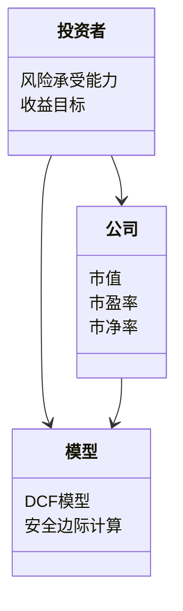

                 


# 格雷厄姆特价股票策略在不同规模公司中的应用

> 关键词：格雷厄姆策略，价值投资，小盘股，中盘股，大盘股，安全边际

> 摘要：本文将探讨格雷厄姆的价值投资策略在不同规模公司中的应用。通过分析小盘股、中盘股和大盘股的特点，结合格雷厄姆的安全边际和内在价值理论，提出适用于不同规模公司的投资策略，并通过实际案例分析验证其有效性。

---

## 第1章: 格雷厄姆策略概述

### 1.1 价值投资的核心理念

#### 1.1.1 投资的定义与分类

投资是通过将资金投入各种资产（如股票、债券、房地产等）以期望获得未来收益的行为。根据资产规模和市场流动性，股票可以分为小盘股、中盘股和大盘股。

| 分类标准 | 小盘股 | 中盘股 | 大盘股 |
|----------|--------|--------|--------|
| 市值范围 | 小于10亿美元 | 10亿至50亿美元 | 大于50亿美元 |
| 流动性   | 低     | 中等   | 高     |
| 波动性   | 高     | 中等   | 低     |

#### 1.1.2 价值投资的起源与发展

价值投资由本杰明·格雷厄姆在20世纪初提出，强调以低于内在价值的价格买入股票，长期持有以获得收益。其核心思想是市场先生的非理性导致短期波动，而企业内在价值才是长期投资的依据。

#### 1.1.3 格雷厄姆的价值投资理论

格雷厄姆的策略基于以下原则：
1. **安全边际**：买入价格应远低于内在价值，以降低风险。
2. **内在价值**：企业未来现金流的现值，可通过DCF模型计算。
3. **非理性市场**：利用市场波动寻找低估机会。

### 1.2 格雷厄姆策略的适用性分析

#### 1.2.1 小盘股、中盘股与大盘股的定义

- **小盘股**：市值较低，流动性差，波动性高，通常为成长型企业。
- **中盘股**：市值中等，流动性适中，风险和回报介于小盘和大盘之间。
- **大盘股**：市值高，流动性好，稳定性强，多为成熟企业。

#### 1.2.2 不同规模公司股票的特点对比

| 特性      | 小盘股       | 中盘股       | 大盘股       |
|-----------|--------------|--------------|--------------|
| 市值范围   | 小于10亿     | 10亿至50亿   | 大于50亿     |
| 波动性     | 高           | 中等         | 低           |
| 成长性     | 高           | 中等         | 低           |
| 风险       | 高           | 中等         | 低           |
| 流动性     | 低           | 中等         | 高           |

#### 1.2.3 格雷厄姆策略在不同规模公司的适用性

- **小盘股**：波动性高，但成长潜力大，适合寻找安全边际的投资者。
- **中盘股**：稳定性与成长性兼具，适合中长期投资。
- **大盘股**：稳定性高，适合追求稳定收益的投资者。

---

## 第2章: 格雷厄姆策略的核心原理

### 2.1 格雷厄姆策略的数学模型

#### 内在价值公式

$$ V = \frac{E}{(1 + r)^n} $$

其中：
- \( V \)：内在价值
- \( E \)：未来现金流
- \( r \)：折现率
- \( n \)：现金流的持续年限

#### 安全边际计算

$$ \text{安全边际} = \frac{\text{内在价值} - \text{市场价格}}{\text{市场价格}} \times 100\% $$

### 2.2 格雷厄姆策略的决策流程

1. 确定投资目标：根据风险承受能力和收益目标选择公司规模。
2. 筛选候选公司：基于估值指标（如市盈率、市净率）筛选。
3. 计算内在价值：使用DCF模型评估公司价值。
4. 确定安全边际：比较市场价格与内在价值，确保安全边际为正值。
5. 调整投资组合：分散投资以降低风险。

---

## 第3章: 格雷厄姆策略在小盘股中的应用

### 3.1 小盘股的特点与投资机会

小盘股市场波动性高，但潜在回报也大。由于市场关注度低，许多小盘股可能被低估。

#### 投资机会

- **案例分析：XYZ公司**
  - **行业**：科技
  - **市值**：5亿美元
  - **市盈率**：15
  - **DCF模型计算**：内在价值为20美元，市场价格为15美元，安全边际为33%。

---

## 第4章: 格雷厄姆策略在中盘股中的应用

### 4.1 中盘股的特点与投资机会

中盘股兼具小盘股的成长性和大盘股的稳定性，风险和回报适中。

#### 投资机会

- **案例分析：ABC公司**
  - **行业**：制造业
  - **市值**：30亿美元
  - **市盈率**：18
  - **DCF模型计算**：内在价值为30美元，市场价格为25美元，安全边际为16%。

---

## 第5章: 格雷厄姆策略在大盘股中的应用

### 5.1 大盘股的特点与投资机会

大盘股稳定性高，适合追求稳定收益的投资者。由于市值大，分析更为复杂。

#### 投资机会

- **案例分析：GHI公司**
  - **行业**：金融
  - **市值**：70亿美元
  - **市盈率**：12
  - **DCF模型计算**：内在价值为40美元，市场价格为35美元，安全边际为14%。

---

## 第6章: 格雷厄姆策略的系统分析与架构设计

### 6.1 问题场景介绍

投资者需要根据公司规模和市场环境选择合适的股票。格雷厄姆策略通过安全边际和内在价值帮助投资者做出决策。

### 6.2 系统功能设计

- **领域模型类图**



---

## 第7章: 项目实战

### 7.1 环境安装

- **工具**：Excel、Python（Pandas、NumPy）
- **数据源**：Yahoo Finance API

### 7.2 核心实现

```python
import pandas as pd
import numpy as np

def calculate_intrinsic_value(cash_flows, discount_rate):
    return np.sum(cash_flows / (1 + discount_rate)**range(len(cash_flows)))

def calculate_margin_of_safety(intrinsic_value, market_price):
    return (intrinsic_value - market_price) / market_price * 100

# 示例数据
cash_flows = [10, 12, 15, 20]  # 单位：百万美元
discount_rate = 0.08
market_price = 50

intrinsic_value = calculate_intrinsic_value(cash_flows, discount_rate)
margin_of_safety = calculate_margin_of_safety(intrinsic_value, market_price)

print(f"内在价值：{intrinsic_value:.2f}美元")
print(f"安全边际：{margin_of_safety:.2f}%")
```

---

## 第8章: 最佳实践与小结

### 8.1 最佳实践

- **分散投资**：避免过度集中。
- **定期复评**：市场变化需及时调整。
- **长期持有**：避免频繁交易。

### 8.2 小结

格雷厄姆策略适用于不同规模公司，但需根据公司特点调整策略。通过安全边际和内在价值分析，投资者可以在不同规模公司中找到低估机会。

### 8.3 注意事项

- **数据准确性**：DCF模型依赖于准确的现金流预测。
- **市场变化**：需关注宏观经济因素。
- **风险控制**：设定止损点以降低损失。

### 8.4 拓展阅读

- 格雷厄姆的《聪明的投资者》
- 巴菲特的股东大会讲话
- 现代投资组合理论

---

通过以上步骤，您可以系统地应用格雷厄姆策略在不同规模公司中，找到优质投资机会，实现长期稳定收益。

