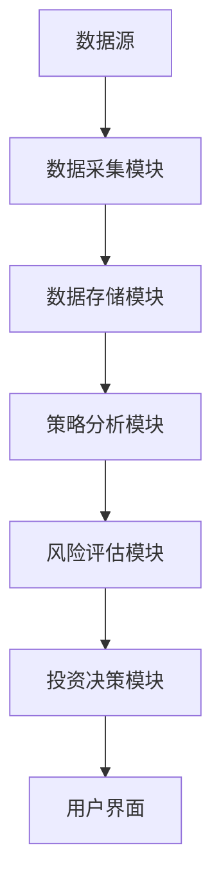

                 


```markdown
# 格雷厄姆特价股票策略在不同货币政策环境下的调整

> 关键词：格雷厄姆投资策略、货币政策、股票投资、投资组合优化、风险管理

> 摘要：本文详细探讨了格雷厄姆特价股票策略在不同货币政策环境下的调整方法。通过分析货币政策对市场的影响，结合格雷厄姆的投资理念，提出在紧缩和宽松货币政策下的具体调整策略。本文还提供了数学模型、算法流程图和Python代码实现，帮助投资者更好地理解和应用该策略。

---

## 第1章: 格雷厄姆特价股票策略的核心概念

### 1.1 格雷厄姆特价股票策略的定义

#### 1.1.1 什么是特价股票
特价股票是指那些市场价格低于其内在价值的股票。格雷厄姆认为，这些股票具有安全边际，能够在市场波动中为投资者提供保护。

#### 1.1.2 格雷厄姆投资理念的核心
- **价值投资**：寻找市场价格低于内在价值的股票。
- **安全边际**：通过比较市场价格与内在价值，确保投资的安全性。
- **防御性分析**：通过基本面分析，选择具有稳定收益和低风险的股票。

#### 1.1.3 特价股票的特征与优势
- **低市盈率（P/E）**：市盈率低于行业平均水平。
- **低市净率（P/B）**：市净率低于行业平均水平。
- **高股息率**：股息率高于行业平均水平。

### 1.2 格雷厄姆策略的应用背景

#### 1.2.1 现代金融市场的特点
- **全球化**：市场更加国际化，企业跨国经营。
- **信息透明**：投资者可以获取更多的信息，但信息过载问题也存在。
- **技术驱动**：大数据和人工智能在投资中的应用日益广泛。

#### 1.2.2 股票投资的基本原理
- **内在价值**：股票的价值取决于公司的基本面，包括盈利能力、成长性、财务状况等。
- **市场价值**：股票的市场价格由市场供需决定，可能高于或低于内在价值。

#### 1.2.3 特价股票在投资组合中的作用
- **降低风险**：通过选择具有安全边际的股票，减少市场波动的影响。
- **长期收益**：在长期持有中，内在价值的回归将带来收益。

---

## 第2章: 不同货币政策环境下的市场影响

### 2.1 货币政策的基本概念

#### 2.1.1 货币政策的定义与目标
货币政策是由中央银行制定的，通过调整货币供应量和利率，影响经济活动的政策。其目标包括控制通货膨胀、促进就业和经济增长。

#### 2.1.2 主要货币政策工具的介绍
- **利率**：中央银行设定基准利率，影响市场利率和借贷成本。
- **货币供应量**：通过调整货币供应量，影响市场流动性。
- **量化宽松**：通过购买政府债券或其他资产，增加市场流动性。

#### 2.1.3 货币政策对股市的影响
- **利率上升**：债券收益率上升，资金从股市流向债市，导致股价下跌。
- **货币宽松**：增加市场流动性，推高股价。

### 2.2 不同货币政策环境的特点

#### 2.2.1 紧缩货币政策下的市场表现
- **利率上升**：企业融资成本增加，利润下降。
- **货币供应减少**：市场流动性下降，股价可能下跌。

#### 2.2.2 宽松货币政策下的市场表现
- **利率下降**：企业融资成本降低，利润增加。
- **货币供应增加**：市场流动性增加，股价可能上涨。

#### 2.2.3 中性货币政策下的市场表现
- **利率稳定**：市场处于均衡状态，股价波动较小。

---

## 第3章: 格雷厄姆策略在不同货币政策环境下的调整

### 3.1 货币政策变化对投资策略的影响

#### 3.1.1 货币政策变化对股票估值的影响
- **估值调整**：货币政策变化会影响市场利率，从而影响股票的市盈率和市净率。
- **风险偏好**：宽松货币政策下，投资者风险偏好上升，可能选择高成长性股票。

#### 3.1.2 货币政策变化对股票流动性的影响
- **流动性增加**：宽松货币政策下，市场流动性增加，股票交易活跃。
- **流动性减少**：紧缩货币政策下，市场流动性减少，股票交易量下降。

#### 3.1.3 货币政策变化对投资风险的影响
- **系统性风险**：货币政策变化可能引发系统性风险，影响整个市场的表现。

### 3.2 格雷厄姆策略的调整方法

#### 3.2.1 确定当前货币政策环境
- **分析利率趋势**：关注央行的利率政策。
- **分析货币供应量**：观察货币供应量的变化。

#### 3.2.2 调整选股标准
- **市盈率调整**：在紧缩货币政策下，选择市盈率较低的股票。
- **市净率调整**：在宽松货币政策下，选择市净率较低的股票。

#### 3.2.3 调整投资组合配置
- **资产配置**：根据货币政策环境调整股票、债券和其他资产的比例。
- **行业选择**：在紧缩货币政策下，选择防御性行业；在宽松货币政策下，选择周期性行业。

---

## 第4章: 格雷厄姆策略在紧缩货币政策下的应用

### 4.1 紧缩货币政策的特点

#### 4.1.1 利率上升的影响
- **企业利润下降**：高利率增加了企业的融资成本。
- **股价下跌**：高利率可能导致股市整体下跌。

#### 4.1.2 货币供应减少的影响
- **市场流动性下降**：资金从股市流向其他领域。
- **股价波动加剧**：市场流动性减少可能导致股价波动加剧。

#### 4.1.3 市场情绪的变化
- **投资者信心下降**：紧缩货币政策可能导致投资者信心下降。
- **风险厌恶情绪上升**：投资者更倾向于低风险投资。

### 4.2 格雷厄姆策略的调整措施

#### 4.2.1 选择防御性股票
- **防御性行业**：如公用事业、消费品等。
- **低市盈率股票**：选择市盈率较低的股票，降低风险。

#### 4.2.2 提高安全边际要求
- **增加安全边际**：选择市场价格远低于内在价值的股票。
- **严格筛选股票**：提高选股标准，确保投资的安全性。

#### 4.2.3 降低杠杆使用
- **减少杠杆**：降低投资组合的杠杆比例，减少风险。

---

## 第5章: 格雷厄姆策略在宽松货币政策下的应用

### 5.1 宽松货币政策的特点

#### 5.1.1 利率下降的影响
- **企业利润上升**：低利率降低了企业的融资成本。
- **股价上涨**：低利率可能导致股市整体上涨。

#### 5.1.2 货币供应增加的影响
- **市场流动性增加**：资金大量流入股市。
- **股价波动较小**：市场流动性增加可能导致股价波动较小。

#### 5.1.3 市场情绪的变化
- **投资者信心上升**：宽松货币政策可能导致投资者信心上升。
- **风险偏好上升**：投资者更倾向于高风险高收益投资。

### 5.2 格雷厄姆策略的调整措施

#### 5.2.1 选择周期性股票
- **周期性行业**：如科技、金融等。
- **高成长性股票**：选择市盈率较高但成长性好的股票。

#### 5.2.2 降低安全边际要求
- **适度降低安全边际**：在宽松货币政策下，适当降低安全边际要求。
- **灵活筛选股票**：根据市场情况调整选股标准。

#### 5.2.3 增加杠杆使用
- **适度增加杠杆**：在市场流动性充足的环境下，适度增加杠杆比例。

---

## 第6章: 格雷厄姆策略在货币政策变化中的风险管理

### 6.1 货币政策变化对投资组合的影响
- **系统性风险**：货币政策变化可能引发系统性风险。
- **非系统性风险**：货币政策变化可能影响特定行业或公司的风险。

### 6.2 格雷厄姆策略的风险管理措施
- **分散投资**：通过分散投资降低风险。
- **定期再平衡**：根据市场变化定期调整投资组合。
- **监控市场变化**：密切关注货币政策变化，及时调整投资策略。

---

## 第7章: 格雷厄姆策略在货币政策变化中的实施步骤

### 7.1 确定当前货币政策环境
- **分析利率和货币供应量**：判断当前货币政策环境是紧缩、宽松还是中性。
- **评估市场情绪**：通过市场指标（如成交量、投资者情绪指数）评估市场情绪。

### 7.2 调整选股标准
- **根据货币政策环境调整市盈率和市净率要求**：在紧缩货币政策下，选择市盈率和市净率较低的股票；在宽松货币政策下，选择市盈率和市净率较高的股票。
- **选择行业**：在紧缩货币政策下，选择防御性行业；在宽松货币政策下，选择周期性行业。

### 7.3 调整投资组合配置
- **资产配置**：根据货币政策环境调整股票、债券和其他资产的比例。
- **行业配置**：根据货币政策环境调整投资组合中各行业的权重。

---

## 第8章: 格雷厄姆策略在货币政策变化中的数学模型

### 8.1 格雷厄姆策略的基本数学模型

#### 8.1.1 安全边际计算公式
$$ \text{安全边际} = \frac{\text{内在价值}}{\text{市场价格}} $$

#### 8.1.2 市盈率计算公式
$$ \text{市盈率} = \frac{\text{股价}}{\text{每股收益}} $$

#### 8.1.3 市净率计算公式
$$ \text{市净率} = \frac{\text{股价}}{\text{每股净资产}} $$

### 8.2 根据货币政策调整的数学模型

#### 8.2.1 紧缩货币政策下的调整
$$ \text{调整后的市盈率} = \text{原始市盈率} \times (1 - \Delta \text{利率}) $$

#### 8.2.2 宽松货币政策下的调整
$$ \text{调整后的市盈率} = \text{原始市盈率} \times (1 + \Delta \text{利率}) $$

---

## 第9章: 格雷厄姆策略在货币政策变化中的系统架构设计

### 9.1 系统功能设计
- **数据采集**：采集股票的基本面数据和市场数据。
- **策略分析**：根据货币政策环境调整选股标准。
- **风险评估**：评估投资组合的风险。
- **投资决策**：根据分析结果做出投资决策。

### 9.2 系统架构设计



### 9.3 系统接口设计
- **数据接口**：与数据源（如金融数据库）对接，获取股票数据。
- **策略接口**：与策略模块对接，获取调整后的选股标准。
- **决策接口**：与投资决策模块对接，获取投资建议。

---

## 第10章: 格雷厄姆策略在货币政策变化中的项目实战

### 10.1 环境安装
- **Python**：安装Python 3.8及以上版本。
- **Pandas**：用于数据处理。
- **Matplotlib**：用于数据可视化。

### 10.2 核心代码实现

#### 10.2.1 数据采集
```python
import pandas as pd
import requests

def get_stock_data(ticker):
    url = f"https://api.example.com/stock/{ticker}"
    response = requests.get(url)
    data = response.json()
    return pd.DataFrame(data)
```

#### 10.2.2 策略分析
```python
def graham_strategy(data, policy):
    if policy == "紧缩":
        data = data[data['市盈率'] < 15]
    elif policy == "宽松":
        data = data[data['市盈率'] < 20]
    return data
```

#### 10.2.3 风险评估
```python
import numpy as np

def calculate_risk(data):
    returns = data['收益率'].dropna()
    volatility = returns.std()
    return volatility
```

### 10.3 案例分析
- **案例1**：在紧缩货币政策下，选择市盈率低于15的股票。
- **案例2**：在宽松货币政策下，选择市盈率低于20的股票。

### 10.4 项目总结
- **成功经验**：通过调整选股标准，有效降低了投资风险。
- **失败教训**：在某些情况下，策略可能无法完全适应市场变化。

---

## 第11章: 格雷厄姆策略在货币政策变化中的最佳实践

### 11.1 小结
- **货币政策变化对投资策略的影响**：需要根据货币政策环境调整投资策略。
- **格雷厄姆策略的灵活性**：通过调整选股标准和投资组合配置，适应不同货币政策环境。

### 11.2 注意事项
- **市场变化的不确定性**：货币政策变化可能带来不可预测的市场波动。
- **风险管理的重要性**：无论在何种货币政策环境下，风险管理都是投资成功的关键。

### 11.3 拓展阅读
- **《The Intelligent Investor》**：格雷厄姆的经典著作，深入理解价值投资的核心理念。
- **《投资学》**：了解货币政策对经济和市场的影响。

---

## 第12章: 结论与展望

### 12.1 结论
格雷厄姆特价股票策略在不同货币政策环境下的调整，能够有效降低投资风险，提高投资收益。通过结合货币政策环境和市场变化，投资者可以更好地应用该策略。

### 12.2 展望
未来，随着金融市场的发展和技术的进步，格雷厄姆策略将更加智能化和个性化。投资者可以通过大数据和人工智能技术，进一步优化投资策略，实现更好的投资收益。

---

## 致谢
感谢读者的耐心阅读，感谢格雷厄姆的投资理念对我的启发。

---

## 参考文献
1. 格雷厄姆，本杰明. 《The Intelligent Investor》
2. 米勒，戴维. 《投资学》
3. 巴菲特，沃伦. 《巴菲特致股东的信》
4. 罗伯特，清崎. 《富爸爸穷爸爸》
```

