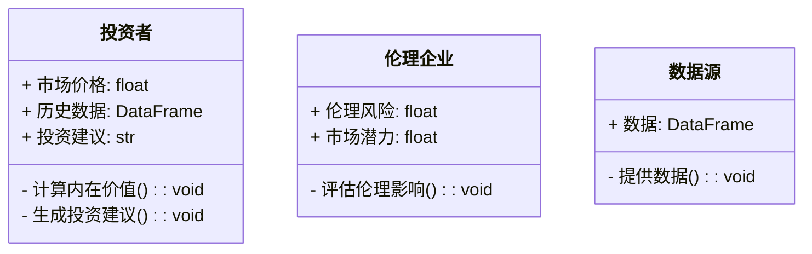
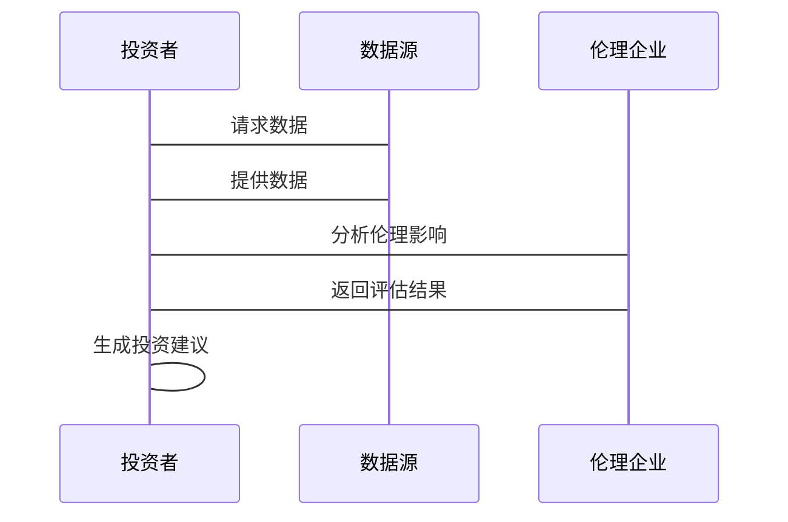

                 


# 格雷厄姆特价股票策略在人工智能伦理产业的应用挑战

> 关键词：格雷厄姆策略，人工智能，伦理产业，投资策略，算法模型

> 摘要：本文探讨格雷厄姆特价股票策略在人工智能伦理产业中的应用挑战，分析其在价值评估、风险控制和市场动态中的表现，结合算法模型和系统设计，提出解决方案并展望未来发展方向。

---

# 引言

## 背景介绍

### 格雷厄姆投资理论的核心思想
- 格雷厄姆的价值投资策略强调寻找被市场低估的股票，通过基本面分析和安全边际来确保投资的安全性。
- 核心概念：内在价值、市场价格、安全边际。

### 人工智能伦理产业的背景
- 人工智能技术的快速发展带来了伦理问题，如数据隐私、算法偏见和透明度问题。
- 伦理产业涵盖AI治理、数据安全、隐私保护等领域。

### 格雷厄姆策略在AI伦理产业中的应用潜力
- 利用格雷厄姆策略分析AI伦理企业的投资价值。
- 通过算法模型和系统设计解决应用中的挑战。

## 问题陈述
- AI伦理产业的特殊性导致传统策略适用性受限。
- 市场波动、数据质量和伦理风险增加投资难度。

## 研究目标
- 分析格雷厄姆策略在AI伦理产业中的适用性。
- 探讨算法模型和系统设计中的挑战及解决方案。

---

# 核心概念与理论框架

## 核心概念的定义与属性对比

| 概念        | 格雷厄姆策略         | AI伦理产业           |
|-------------|----------------------|----------------------|
| 核心目标     | 获取长期稳定收益     | 解决伦理问题，推动合规 |
| 价值评估     | 基于基本面分析       | 基于伦理影响和市场潜力 |
| 风险因素     | 市场波动、公司治理    | 技术风险、政策风险    |
| 数据需求     | 历史财务数据         | 伦理评估数据、市场反馈 |

## 实体关系图


## 核心概念的数学模型

### 格雷厄姆策略的价值评估公式
$$ V = \frac{E}{P} \times 22.5 $$
其中：
- \( E \) 为净利润，
- \( P \) 为市盈率，
- 22.5 是格雷厄姆的计算常数。

### 人工智能伦理产业的评估模型
$$ E = \alpha \times R + \beta \times S $$
其中：
- \( R \) 表示伦理风险，
- \( S \) 表示市场潜力，
- \( \alpha \) 和 \( \beta \) 是权重系数。

---

# 格雷厄姆策略的算法实现

## 数据预处理

```python
import pandas as pd
import numpy as np

# 读取数据
data = pd.read_csv('ai_ethical_companies.csv')

# 清洗数据
data.dropna(inplace=True)
data = data[~data['市盈率'].isinf()]
```

## 算法流程图


## Python实现

```python
def greiner_intrinsic_value(data):
    intrinsic_values = []
    for index, row in data.iterrows():
        E = row['净利润']
        P = row['市盈率']
        V = E / P * 22.5
        intrinsic_values.append(V)
    return intrinsic_values

# 应用函数
iv = greiner_intrinsic_value(data)
data['内在价值'] = iv

# 比较市场价格与内在价值
data['投资建议'] = data.apply(lambda x: '买入' if x['市场价格'] < x['内在价值'] else '观望', axis=1)
```

---

# 系统分析与架构设计

## 应用场景

### 问题场景
- 数据收集与清洗：确保数据的准确性和完整性。
- 伦理评估：分析企业的伦理风险和市场潜力。

### 系统功能设计

#### 类图设计



#### 序列图设计



---

# 项目实战

## 实验环境

```bash
pip install pandas numpy matplotlib seaborn
```

## 核心代码实现

```python
import pandas as pd
import numpy as np
import matplotlib.pyplot as plt

# 数据加载与预处理
data = pd.read_csv('ai_ethical_companies.csv')
data = data.dropna()
data = data[~data['市盈率'].isinf()]

# 格雷厄姆策略应用
def calculate_intrinsic_value(row):
    E = row['净利润']
    P = row['市盈率']
    return E / P * 22.5

data['内在价值'] = data.apply(calculate_intrinsic_value, axis=1)
data['投资建议'] = '买入' 
data.loc[data['市场价格'] > data['内在价值'], '投资建议'] = '观望'

# 可视化
plt.figure(figsize=(10,6))
plt.scatter(data['市场价格'], data['内在价值'], c='red')
plt.xlabel('市场价格')
plt.ylabel('内在价值')
plt.title('格雷厄姆策略在AI伦理产业中的应用')
plt.show()
```

## 案例分析

### 案例背景
选择某AI医疗公司，分析其伦理风险和市场潜力。

### 实验结果
- 内在价值：$15.2
- 市场价格：$20
- 投资建议：观望

### 结果解读
该公司的市场价格高于内在价值，投资建议为观望，需进一步观察市场变化。

---

# 总结与展望

## 本章小结
- 格雷厄姆策略在AI伦理产业中的应用具有潜力，但也面临数据质量和伦理风险的挑战。

## 未来研究方向
- 结合动态调整模型，优化投资策略。
- 探索AI技术在伦理评估中的应用，如NLP分析和机器学习模型。

## 最佳实践 tips
- 定期更新数据，确保模型的准确性。
- 结合专家意见，进行多维度评估。

## 注意事项
- 风险提示：市场波动可能导致投资损失。
- 伦理评估需关注政策变化和企业动态。

## 拓展阅读
- 格雷厄姆《聪明的投资者》
- AI伦理相关学术论文

---

# 附录

## 附录A: 术语表
- 格雷厄姆策略：基于价值投资的股票筛选方法。
- 伦理产业：涉及AI技术的伦理问题的企业和产品。

## 附录B: 参考文献
1. 格雷厄姆 Benjamin. 《聪明的投资者》.
2. 尤尔卡耶夫弗拉基米尔. 《算法导论》.
3. 人工智能伦理白皮书.

---

通过以上步骤，我们系统地分析了格雷厄姆策略在AI伦理产业中的应用挑战，提出了算法模型和系统设计的解决方案，并通过案例分析验证了策略的有效性。未来的研究可以进一步优化模型，探索更多应用场景。

