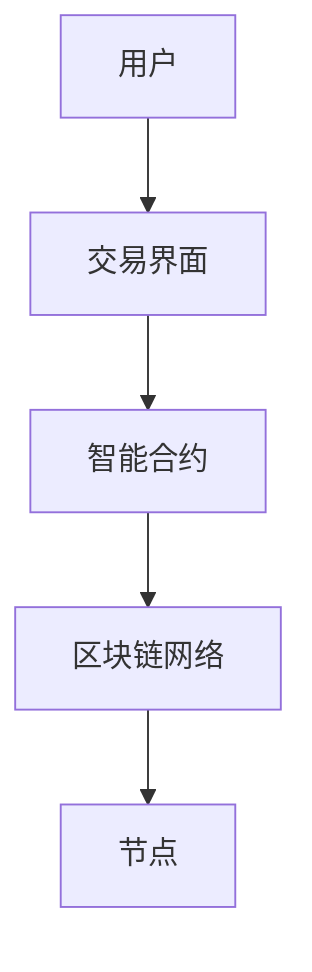

                 


# 格雷厄姆特价股票策略在区块链驱动的金融市场中的应用

> 关键词：格雷厄姆投资策略、区块链技术、智能合约、金融市场、价值投资

> 摘要：本文探讨了格雷厄姆价值投资策略在区块链技术驱动的金融市场中的应用。通过分析区块链技术的特点及其对金融市场的潜在影响，本文详细阐述了如何将格雷厄姆策略与区块链技术相结合，以实现更高效、更透明的股票交易。文章从区块链技术的基本原理、智能合约的应用、价值投资策略的数字化实现等方面展开，探讨了区块链技术如何提升格雷厄姆策略的执行效率和准确性，并对未来金融市场的智能化发展进行了展望。

---

## 第1章 格雷厄姆价值投资策略与区块链技术概述

### 1.1 格雷厄姆价值投资策略的背景与核心思想

格雷厄姆价值投资策略是20世纪最著名的投资策略之一，由本杰明·格雷厄姆提出。其核心思想是寻找市场价值低于内在价值的股票进行投资。以下是格雷厄姆策略的核心要素：

- **安全边际**：买入价格低于内在价值的股票，以确保投资的安全性。
- **基本面分析**：通过分析公司的财务数据（如市盈率、市净率等）来评估其内在价值。
- **长期投资**：避免短期市场波动的干扰，坚持长期持有优质资产。

### 1.2 区块链技术的基本概念与特点

区块链是一种去中心化的分布式账本技术，具有以下核心特点：

- **去中心化**：数据不依赖于单一中心节点，而是分布在网络中的多个节点上。
- **不可篡改性**：通过加密算法和共识机制确保数据的完整性和真实性。
- **透明性**：所有交易记录在区块链上公开可见，但参与者身份可以匿名化。
- **智能合约**：基于区块链的自动化执行合同，无需中介参与。

### 1.3 区块链驱动金融市场的必要性与优势

传统金融市场存在以下问题：

- **信息不对称**：投资者难以获取真实的企业信息，容易被误导。
- **交易成本高**：中介机构的存在增加了交易成本和时间。
- **效率低下**：复杂的审批流程和中间环节降低了交易效率。

区块链技术可以解决这些问题：

- **降低交易成本**：通过智能合约自动化执行交易，减少中介参与。
- **提高透明度**：所有交易记录在区块链上，投资者可以实时查看。
- **增强信任**：通过去中心化和不可篡改性确保数据的真实性和安全性。

---

## 第2章 格雷厄姆策略与区块链技术的结合

### 2.1 格雷厄姆策略在现代金融市场的适用性

格雷厄姆策略的核心是寻找被低估的股票，这在传统金融市场中需要大量的人工分析。区块链技术可以通过以下方式提升格雷厄姆策略的执行效率：

- **自动化分析**：利用智能合约和大数据技术自动筛选符合条件的股票。
- **实时数据更新**：区块链上的实时数据更新可以确保分析的及时性。
- **降低信息不对称**：通过区块链的透明性，投资者可以更轻松地获取真实的企业信息。

### 2.2 区块链技术在股票交易中的应用场景

#### 2.2.1 智能合约在股票交易中的应用

智能合约是区块链技术的核心创新之一，它可以自动执行预设的交易规则。例如：

- **自动触发交易**：当股票价格达到预设的阈值时，智能合约自动执行买入或卖出操作。
- **自动结算**：交易完成后，智能合约自动完成资金和股票的结算。

#### 2.2.2 区块链如何实现透明化与去中心化的股票市场

通过区块链技术，股票交易可以实现完全去中心化：

- **分布式账本**：所有交易记录在区块链上，投资者可以实时查看。
- **去中心化交易所**：投资者可以直接在区块链上进行交易，无需依赖传统交易所。

#### 2.2.3 区块链在股票发行与交易中的创新模式

区块链技术还可以支持以下创新模式：

- **代币化股票**：将股票转化为数字代币，便于分割和转让。
- **首次代币发行（ICO）**：企业可以通过区块链技术直接发行股票，吸引投资者。

### 2.3 格雷厄姆策略与区块链技术的协同效应

#### 2.3.1 格雷厄姆策略的数字化与智能化

通过区块链技术，格雷厄姆策略可以实现数字化和智能化：

- **自动化筛选**：利用智能合约和大数据分析，自动筛选出符合条件的股票。
- **实时监控**：区块链上的实时数据可以用于监控股票价格和市场趋势。

#### 2.3.2 区块链技术如何增强策略的执行能力

区块链技术可以通过以下方式增强格雷厄姆策略的执行能力：

- **提高交易效率**：通过智能合约实现自动化交易，减少人工干预。
- **降低交易成本**：去中心化的交易模式可以降低交易成本和时间。

#### 2.3.3 两者的结合对金融市场的深远影响

格雷厄姆策略与区块链技术的结合将对金融市场产生深远影响：

- **推动价值投资的普及**：通过技术手段降低投资门槛，让更多投资者能够参与价值投资。
- **提升市场的透明度和效率**：区块链技术可以提高市场的透明度和交易效率，减少信息不对称。

---

## 第3章 区块链技术的核心原理与实现

### 3.1 区块链的基本结构与工作原理

区块链的基本结构包括以下几个部分：

- **区块**：存储交易数据，每个区块包含一个随机数、时间戳和前一个区块的哈希值。
- **链式结构**：区块通过哈希值连接成链式结构，确保数据的完整性和不可篡改性。
- **节点**：网络中的计算机节点负责验证和传播交易数据。

区块链的工作原理如下：

1. **交易发生**：交易发起人向网络发送交易请求。
2. **验证交易**：节点通过共识机制验证交易的合法性。
3. **生成区块**：验证通过的交易被封装成区块。
4. **添加到链**：区块被添加到区块链中，形成链式结构。

### 3.2 智能合约的原理与实现

智能合约是一种基于区块链的自动化程序，用于执行预设的交易规则。以下是智能合约的实现流程：

1. **编写合约**：使用智能合约编程语言（如Solidity）编写合约代码。
2. **部署合约**：将合约部署到区块链网络中。
3. **触发合约**：通过交易触发合约的执行。

以下是智能合约的代码示例：

```solidity
// SPDX-License-Identifier: MIT
pragma solidity ^0.8.0;

contract GreedyStock {
    // 存储股票信息
    mapping(address => uint256) public balances;

    // 代币发行函数
    function mint(address recipient, uint256 amount) public {
        balances[recipient] += amount;
    }

    // 代币销毁函数
    function burn(address recipient, uint256 amount) public {
        balances[recipient] -= amount;
    }
}
```

### 3.3 区块链的去中心化与分布式账本技术

区块链的去中心化和分布式账本技术是其核心优势。以下是其工作原理：

1. **分布式账本**：所有交易记录在多个节点上，确保数据的完整性和一致性。
2. **共识机制**：通过共识机制（如PoW、PoS）确保所有节点达成一致。
3. **数据加密**：通过加密算法确保数据的安全性。

---

## 第4章 区块链在金融市场的系统架构设计

### 4.1 区块链金融系统的整体架构

区块链金融系统的整体架构包括以下几个部分：

- **用户层**：包括投资者、交易者等用户。
- **智能合约层**：用于执行交易规则。
- **区块链网络层**：包括节点和区块链数据结构。
- **应用层**：包括交易界面、数据分析等应用。

### 4.2 区块链金融系统的功能设计

以下是区块链金融系统的功能模块：

1. **智能合约管理**：用于部署和管理智能合约。
2. **交易执行**：用于执行和结算交易。
3. **数据分析**：用于分析市场趋势和股票价值。

### 4.3 区块链金融系统的架构图

以下是区块链金融系统的架构图：



### 4.4 区块链金融系统的接口设计

以下是区块链金融系统的接口设计：

- **API接口**：用于与其他系统（如数据分析系统）进行交互。
- **智能合约接口**：用于执行交易规则。

### 4.5 区块链金融系统的交互流程

以下是区块链金融系统的交互流程：

1. **用户发起交易**：用户通过交易界面发起交易请求。
2. **智能合约验证**：智能合约验证交易的合法性。
3. **交易执行**：交易被执行并记录在区块链上。
4. **交易结算**：交易完成后，资金和股票完成结算。

---

## 第5章 项目实战

### 5.1 环境搭建

以下是搭建区块链开发环境的步骤：

1. **安装以太坊客户端**：如Geth或 remix。
2. **安装智能合约开发工具**：如Solidity和web3.js。
3. **配置区块链网络**：如以太坊测试网。

### 5.2 系统核心实现

以下是智能合约的实现代码：

```solidity
// SPDX-License-Identifier: MIT
pragma solidity ^0.8.0;

contract GreedyStock {
    mapping(address => uint256) public balances;

    function buyStock(address recipient, uint256 amount) public {
        balances[recipient] += amount;
    }

    function sellStock(address recipient, uint256 amount) public {
        balances[recipient] -= amount;
    }
}
```

### 5.3 案例分析与项目总结

通过上述实现，我们可以看到区块链技术如何提升格雷厄姆策略的执行效率和准确性。以下是案例分析：

1. **智能合约的应用**：通过智能合约自动执行交易规则，减少人工干预。
2. **实时数据分析**：通过区块链的实时数据更新，投资者可以快速获取市场信息。

---

## 第6章 总结与展望

### 6.1 总结

本文探讨了格雷厄姆价值投资策略在区块链技术驱动的金融市场中的应用。通过分析区块链技术的特点及其对金融市场的潜在影响，本文详细阐述了如何将格雷厄姆策略与区块链技术相结合，以实现更高效、更透明的股票交易。

### 6.2 展望

未来，区块链技术将继续推动金融市场的智能化发展。以下是未来的发展方向：

1. **智能合约的优化**：进一步优化智能合约的功能和性能。
2. **去中心化金融（DeFi）的发展**：推动DeFi的普及和应用。
3. **区块链技术的创新**：探索区块链技术的更多应用场景。

---

通过本文的探讨，我们可以看到，格雷厄姆价值投资策略与区块链技术的结合将为金融市场带来深远的影响。未来，随着区块链技术的不断发展，我们将看到更多创新的应用场景，推动金融市场的智能化和高效化。

