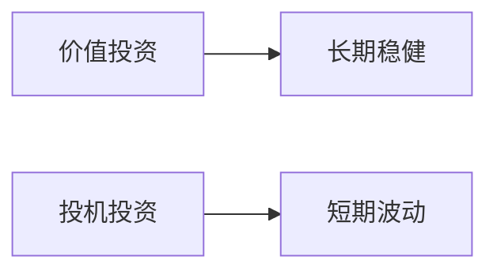

                 

# 格雷厄姆特价股票策略在新兴产业中的适应性

> **关键词**：格雷厄姆投资策略、价值投资、新兴产业、股票分析、投资策略、投资风险  
> **摘要**：本文探讨了格雷厄姆的价值投资策略在新兴产业中的适应性，通过分析新兴产业的特点和投资机会，结合格雷厄姆的核心理念，提出了优化策略的建议，并通过实际案例展示了策略在新兴产业中的应用。

---

# 第一部分: 格雷厄姆特价股票策略概述

## 第1章: 格雷厄姆特价股票策略的核心理念

### 1.1 价值投资的基本原理

#### 1.1.1 价值投资的定义与核心理念
价值投资是一种以企业内在价值为基础的投资策略，强调以低于内在价值的价格买入优质资产。格雷厄姆在其经典著作《聪明的投资者》中提出，投资者应关注企业的基本面，寻找被市场低估的投资标的。

**公式**：  
$$\text{内在价值} = \frac{\text{年收益}}{\text{预期收益率}}$$

**图1.1 价值投资与投机投资的对比**  

#### 1.1.2 格雷厄姆投资策略的起源与发展
格雷厄姆的投资策略起源于20世纪30年代，经历了多次演变。其核心思想是通过分析企业的财务数据，识别出那些具有安全边际（即市场价格低于内在价值）的股票。

#### 1.1.3 特价股票的定义与特征
特价股票是指市场价格显著低于其内在价值的股票。格雷厄姆通常选择那些市盈率（P/E）低于某个阈值（如15）的股票。

### 1.2 格雷厄姆投资策略的关键指标

#### 1.2.1 市盈率（P/E）的计算与应用
$$\text{市盈率} = \frac{\text{股价}}{\text{每股收益}}$$

#### 1.2.2 市净率（P/B）的计算与应用
$$\text{市净率} = \frac{\text{股价}}{\text{每股净资产}}$$

#### 1.2.3 股东权益收益率（ROE）的计算与应用
$$\text{股东权益收益率} = \frac{\text{净利润}}{\text{股东权益}}$$

### 1.3 格雷厄姆策略在不同市场环境下的表现

#### 1.3.1 牛市环境中的策略应用
在牛市中，格雷厄姆策略可能表现不佳，因为市场情绪较高，投机性较强。投资者应选择那些估值合理的股票，避免追涨。

#### 1.3.2 熊市环境中的策略应用
在熊市中，格雷厄姆策略表现较好，因为市场恐慌导致许多优质股票被低估，提供了买入机会。

#### 1.3.3 震荡市环境中的策略应用
在震荡市中，投资者应灵活调整策略，结合技术分析和基本面分析，寻找短期波动中的价值机会。

---

# 第二部分: 新兴产业的特点与投资机会

## 第2章: 新兴产业的定义与发展趋势

### 2.1 新兴产业的定义与分类

#### 2.1.1 新兴产业的定义
新兴产业是指基于技术创新或需求变化而迅速发展的产业，通常具有高增长、高风险的特征。

#### 2.1.2 新兴产业的主要分类
- **技术驱动型**：如人工智能、大数据、区块链。
- **需求驱动型**：如健康医疗、环保产业。

#### 2.1.3 新兴产业与传统产业的对比分析
| 特征      | 新兴产业                | 传统产业                |
|-----------|-------------------------|-------------------------|
| 增长速度  | 快速                    | 缓慢                    |
| 技术依赖  | 高                     | 低                     |

### 2.2 新兴产业的发展趋势

#### 2.2.1 技术驱动型新兴产业的崛起
技术创新是新兴产业发展的核心驱动力。例如，人工智能技术的快速发展推动了相关产业的增长。

#### 2.2.2 市场需求驱动型新兴产业的发展
消费者需求的变化也推动了新兴产业的发展，例如环保产业的需求增加。

#### 2.2.3 政策支持对新兴产业的影响
政府政策对新兴产业的发展有重要影响，例如新能源产业受政策支持较大。

### 2.3 新兴产业中的投资机会

#### 2.3.1 高增长行业的识别与选择
投资者应关注那些具有高增长潜力的行业，例如人工智能、5G通信等。

#### 2.3.2 创新驱动型企业的投资价值
创新型企业在新兴产业中具有较大的潜力，例如科技初创公司。

#### 2.3.3 新兴产业周期中的投资策略
投资者应关注新兴产业的生命周期，选择成长期和成熟期的股票进行投资。

---

# 第三部分: 格雷厄姆策略在新兴产业中的应用

## 第3章: 格雷厄姆策略在新兴产业中的适应性分析

### 3.1 格雷厄姆策略在新兴产业中的优势

#### 3.1.1 价值投资理念与新兴产业的契合点
格雷厄姆的价值投资理念与新兴产业的高增长潜力相契合，可以帮助投资者在新兴产业中找到低估的股票。

#### 3.1.2 格雷厄姆策略在新兴产业中的风险控制作用
格雷厄姆策略注重安全边际，能够在新兴产业中帮助投资者控制风险。

#### 3.1.3 特价股票识别在新兴产业中的应用价值
通过识别特价股票，投资者可以在新兴产业中发现潜在的高增长机会。

### 3.2 格雷厄姆策略在新兴产业中的挑战

#### 3.2.1 新兴产业的高波动性对策略的影响
新兴产业股票价格波动较大，可能影响格雷厄姆策略的有效性。

#### 3.2.2 新兴产业中的信息不对称问题
新兴产业中信息不透明，可能影响投资者对股票价值的准确判断。

#### 3.2.3 新兴产业中的技术创新对策略的挑战
技术创新可能导致企业价值快速变化，影响格雷厄姆策略的应用。

### 3.3 格雷厄姆策略在新兴产业中的优化建议

#### 3.3.1 结合技术分析的策略优化
投资者可以结合技术分析，如移动平均线、MACD等指标，辅助判断股票价格走势。

#### 3.3.2 结合行业周期分析的策略优化
通过分析新兴产业的生命周期，投资者可以选择处于成长期的股票进行投资。

#### 3.3.3 结合企业基本面分析的策略优化
投资者应深入分析企业的财务数据，选择具有较强盈利能力和成长性的企业。

---

# 第四部分: 格雷厄姆策略在新兴产业中的实战案例

## 第4章: 实战案例分析

### 4.1 选择新兴产业
以人工智能行业为例，分析格雷厄姆策略的应用。

### 4.2 选择目标公司
选择一家在人工智能领域具有潜力的公司，例如某人工智能初创公司。

### 4.3 格雷厄姆指标分析

#### 4.3.1 市盈率（P/E）
$$\text{P/E} = \frac{\text{股价}}{\text{每股收益}}$$

#### 4.3.2 市净率（P/B）
$$\text{P/B} = \frac{\text{股价}}{\text{每股净资产}}$$

#### 4.3.3 股东权益收益率（ROE）
$$\text{ROE} = \frac{\text{净利润}}{\text{股东权益}}$$

### 4.4 投资决策

#### 4.4.1 判断是否低估
通过对比市盈率、市净率等指标，判断该股票是否低估。

#### 4.4.2 确定投资金额
根据风险承受能力和资金规模，确定投资金额。

#### 4.4.3 实施投资
在股票价格低于内在价值时，逐步建仓。

### 4.5 监控与调整

#### 4.5.1 定期复盘
每季度复盘投资组合，评估表现。

#### 4.5.2 根据市场变化调整
当市场环境变化时，及时调整投资策略。

---

# 第五部分: 总结与展望

## 第5章: 总结与展望

### 5.1 本章总结
格雷厄姆策略在新兴产业中具有一定的适应性，但需要结合行业特点和市场环境进行优化。

### 5.2 未来展望
随着技术进步和市场发展，格雷厄姆策略在新兴产业中的应用将更加广泛，但也需要不断创新和优化。

### 5.3 最佳实践 tips
- **长期投资**：新兴产业具有高增长潜力，投资者应保持长期视角。
- **分散投资**：避免过度集中，分散投资风险。
- **持续学习**：新兴产业变化快，投资者需不断学习新知识。

---

通过以上分析，格雷厄姆策略在新兴产业中的适应性得到了较为全面的探讨。投资者在实际操作中，应结合市场环境和企业基本面，灵活运用格雷厄姆策略，以实现稳健投资收益。

