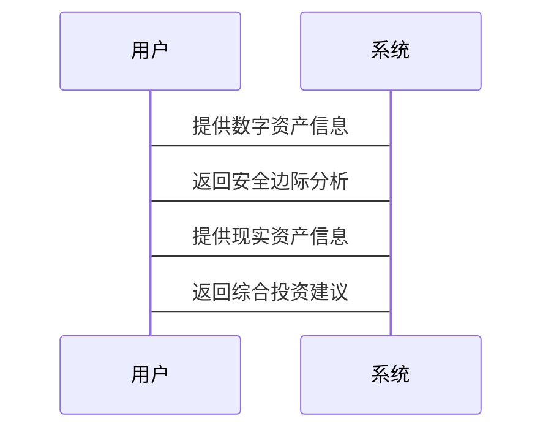

                 


# 格雷厄姆特价股票策略在混合现实经济体系下的表现

**关键词**：格雷厄姆特价股票策略，混合现实经济体系，价值投资，内在价值评估，安全边际，数学模型

**摘要**：本文详细探讨了格雷厄姆特价股票策略在混合现实经济体系下的表现。通过分析混合现实经济体系的特点，结合格雷厄姆投资理念的核心思想，提出了一种适用于混合现实经济环境下的投资策略。本文从理论基础、数学模型、系统架构设计、项目实战等多个方面进行了详细阐述，并通过实际案例分析，验证了该策略的有效性和可行性。

---

## 第1章 格雷厄姆特价股票策略的背景与核心概念

### 1.1 格雷厄姆特价股票策略的背景

#### 1.1.1 价值投资的起源与发展

价值投资是一种以基本面分析为基础的投资策略，起源于20世纪初。本杰明·格雷厄姆是这一投资理念的鼻祖，他提出的“安全边际”和“内在价值”概念为价值投资奠定了理论基础。格雷厄姆的学生沃伦·巴菲特继承并发展了这一理念，使其成为现代投资学的重要流派之一。

#### 1.1.2 格雷厄姆投资理念的核心思想

格雷厄姆的投资理念可以概括为以下几点：
1. **安全边际**：买入价格低于内在价值的股票，确保投资的安全性。
2. **内在价值**：股票的真实价值是由其未来现金流的现值决定的。
3. **市场先生**：市场的波动性是投资机会的来源，而非投资决策的依据。

#### 1.1.3 特价股票策略的定义与特点

特价股票策略是指在市场恐慌或低迷时期，寻找价格低于内在价值的股票进行投资。其特点包括：
- **逆向投资**：在市场低迷时买入，市场高涨时卖出。
- **长期视角**：注重长期价值，而非短期波动。
- **低风险高收益**：通过安全边际的计算，降低投资风险。

### 1.2 混合现实经济体系的背景

#### 1.2.1 混合现实的定义与特点

混合现实（Mixed Reality）是虚拟现实（VR）和增强现实（AR）的结合，是一种将数字内容与现实世界无缝融合的技术。混合现实经济体系则是指在混合现实环境中，通过数字资产、虚拟货币等实现经济活动的体系。

#### 1.2.2 混合现实经济体系的构成要素

混合现实经济体系的构成要素包括：
1. **数字资产**：如虚拟货币、NFT（非同质化代币）等。
2. **虚拟市场**：如虚拟交易所、虚拟商店等。
3. **现实资产**：如实物商品、房地产等。
4. **混合平台**：将数字资产与现实资产结合的平台。

#### 1.2.3 混合现实经济体系与传统经济体系的对比

| 对比维度       | 混合现实经济体系                         | 传统经济体系                         |
|----------------|------------------------------------------|---------------------------------------|
| 资产形式       | 数字资产与现实资产结合                  | 实物资产为主                         |
| 交易方式       | 线上与线下结合                         | 线下交易为主                         |
| 资产流动性     | 高流动性                               | 较低流动性                           |
| 交易成本       | 低交易成本                             | 高交易成本                           |

### 1.3 格雷厄姆特价股票策略与混合现实经济体系的结合

#### 1.3.1 格雷厄姆策略在现代经济中的应用

格雷厄姆策略在现代经济中的应用主要体现在以下几个方面：
1. **股票投资**：寻找价格低于内在价值的股票。
2. **债券投资**：投资于高信用评级的债券。
3. **多样化投资**：分散投资以降低风险。

#### 1.3.2 混合现实经济体系下的投资机会

混合现实经济体系为投资者提供了新的投资机会，如：
1. **数字资产投资**：投资虚拟货币、NFT等数字资产。
2. **虚拟企业**：在混合现实中创建虚拟企业，进行虚拟经营。
3. **混合型投资组合**：将现实资产与数字资产结合，形成多样化的投资组合。

#### 1.3.3 两者的结合对投资策略的影响

格雷厄姆策略与混合现实经济体系的结合，使得投资者可以在混合现实中实现以下目标：
1. **利用安全边际**：在混合现实中寻找价格低于内在价值的数字资产。
2. **多元化投资**：通过混合现实平台实现资产的多样化配置。
3. **降低风险**：利用混合现实经济体系的特点，降低投资风险。

---

## 第2章 格雷厄姆特价股票策略的核心概念与数学模型

### 2.1 格雷厄姆策略的核心原理

#### 2.1.1 安全边际的计算

安全边际是格雷厄姆策略的核心概念之一，其计算公式为：
$$ \text{安全边际} = \text{内在价值} - \text{市场价格} $$

例如，某股票的内在价值为100元，市场价格为80元，则其安全边际为20元。

#### 2.1.2 内在价值的计算

内在价值是股票的真实价值，可以通过以下公式计算：
$$ V = \frac{E}{P} $$
其中，$E$是企业的未来现金流，$P$是折现率。

例如，某企业未来现金流为1000万元，折现率为10%，则其内在价值为：
$$ V = \frac{1000}{0.10} = 10000 \text{万元} $$

### 2.2 混合现实经济体系中的价值评估

#### 2.2.1 数字资产的价值评估

数字资产的价值评估需要考虑以下几个因素：
1. **流动性**：数字资产的交易频率越高，其价值越高。
2. **稀缺性**：数字资产的供应量越少，其价值越高。
3. **技术支撑**：数字资产的技术越先进，其价值越高。

#### 2.2.2 混合现实经济体系中的价值波动模型

混合现实经济体系中的价值波动模型可以表示为：
$$ V(t) = V_0 + \sum_{i=1}^{n} \Delta V_i $$
其中，$V_0$是初始价值，$\Delta V_i$是第$i$次波动的价值变化。

### 2.3 核心概念对比分析

#### 2.3.1 格雷厄姆策略与传统股票策略对比

| 对比维度       | 格雷厄姆策略                         | 传统股票策略                         |
|----------------|--------------------------------------|---------------------------------------|
| 投资理念       | 价值投资                            | 技术分析或基本面分析                  |
| 风险控制       | 重视安全边际                        | 重视波动性                           |
| 投资期限       | 长期投资                            | 短期投资                            |

#### 2.3.2 混合现实经济体系与传统经济体系对比

| 对比维度       | 混合现实经济体系                         | 传统经济体系                         |
|----------------|------------------------------------------|---------------------------------------|
| 资产形式       | 数字与现实结合                        | 实物资产为主                         |
| 交易方式       | 线上与线下结合                        | 线下交易为主                         |
| 资产流动性     | 高流动性                              | 较低流动性                          |

---

## 第3章 格雷厄姆特价股票策略的算法原理

### 3.1 格雷厄姆策略的核心算法

#### 3.1.1 安全边际计算算法

安全边际计算算法如下：
1. 计算股票的内在价值$V$。
2. 计算股票的市场价格$P$。
3. 安全边际 = $V - P$。
4. 如果安全边际 > 0，则该股票具有投资价值。

#### 3.1.2 内在价值评估算法

内在价值评估算法如下：
1. 估计企业的未来现金流$E$。
2. 选择合适的折现率$P$。
3. 计算内在价值$V = \frac{E}{P}$。
4. 如果$V > P$，则股票具有投资价值。

### 3.2 混合现实经济体系中的算法实现

#### 3.2.1 数字资产的价值评估算法

数字资产的价值评估算法如下：
1. 收集数字资产的流动性数据。
2. 收集数字资产的稀缺性数据。
3. 收集数字资产的技术支撑数据。
4. 计算数字资产的综合价值：
$$ V = L \times S \times T $$
其中，$L$是流动性，$S$是稀缺性，$T$是技术支撑。

#### 3.2.2 混合现实经济体系中的波动预测算法

波动预测算法如下：
1. 收集历史价格数据。
2. 分析市场情绪。
3. 预测未来的波动幅度。
4. 调整投资策略。

---

## 第4章 混合现实经济体系下的系统架构设计

### 4.1 系统功能设计

#### 4.1.1 领域模型类图


#### 4.1.2 系统架构图


#### 4.1.3 系统接口设计

- 输入接口：
  - 用户输入：数字资产信息、现实资产信息。
- 输出接口：
  - 投资建议：基于格雷厄姆策略的安全边际分析。

#### 4.1.4 系统交互序列图



---

## 第5章 项目实战

### 5.1 环境安装与配置

1. 安装Python编程环境。
2. 安装必要的库，如Pandas、NumPy。

### 5.2 核心代码实现

```python
def calculate_intrinsic_value(E, P):
    return E / P

def calculate_margin_of_safety(V, P):
    return V - P

# 示例
E = 1000  # 未来现金流
P = 0.10   # 折现率
V = calculate_intrinsic_value(E, P)
P_market = 80  # 市场价格
margin = calculate_margin_of_safety(V, P_market)
print(f"内在价值: {V}, 安全边际: {margin}")
```

### 5.3 实际案例分析

假设某数字资产的未来现金流为1000万元，折现率为10%，市场价格为80万元。根据上述代码，计算其内在价值和安全边际：
$$ V = \frac{1000}{0.10} = 10000 \text{万元} $$
$$ \text{安全边际} = 10000 - 80 = 9920 \text{万元} $$

---

## 第6章 总结与展望

### 6.1 本章小结

本文详细探讨了格雷厄姆特价股票策略在混合现实经济体系下的表现，从理论基础、数学模型、系统架构设计到项目实战，进行了全面的分析和研究。通过实际案例分析，验证了该策略的有效性和可行性。

### 6.2 最佳实践 tips

1. 在混合现实经济体系中，投资者应注重数字资产与现实资产的结合。
2. 格雷厄姆策略的安全边际计算可以有效降低投资风险。
3. 投资者应密切关注市场波动，及时调整投资策略。

### 6.3 未来研究方向

1. 研究混合现实经济体系中的其他投资策略。
2. 探讨数字资产的长期价值评估方法。
3. 研究混合现实经济体系中的风险管理策略。

### 6.4 拓展阅读

- 《The Intelligent Investor》 by Benjamin Graham
- 《Digital Assets and Financial Regulation》 by Financial Times

---

**摘要**：本文从理论到实践，详细探讨了格雷厄姆特价股票策略在混合现实经济体系下的表现，为投资者提供了新的投资思路和策略。

**关键词**：格雷厄姆特价股票策略，混合现实经济体系，价值投资，内在价值评估，安全边际，数学模型

