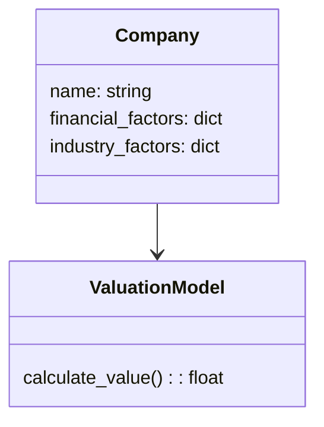

                 


# 格雷厄姆特价股票策略在清洁能源行业的应用挑战

> 关键词：格雷厄姆价值投资，清洁能源行业，股票估值，投资策略，行业挑战，投资机会

> 摘要：本文探讨了格雷厄姆价值投资策略在清洁能源行业的应用，分析了行业特点、投资机会以及面临的挑战，并提出了应对策略和解决方案。

---

## 第一部分: 格雷厄姆价值投资策略概述

### 第1章: 格雷厄姆价值投资策略的核心理念

#### 1.1 价值投资的基本概念

价值投资是一种以低于内在价值的价格买入优质股票的投资策略，核心在于寻找市场低估的公司。格雷厄姆强调安全边际，即买入价格远低于内在价值，以降低风险。

#### 1.2 清洁能源行业的特点与投资机会

清洁能源行业涵盖太阳能、风能等领域，具有高成长性和技术驱动的特点。政策支持和技术进步是推动行业发展的主要因素，但也带来了市场波动和政策变化的风险。

#### 1.3 格雷厄姆策略在清洁能源行业的适用性

尽管清洁能源行业波动较大，但其高成长性和技术创新使其成为价值投资的潜在机会。通过分析财务状况和竞争优势，可以识别出具有长期增长潜力的公司。

---

## 第二部分: 清洁能源行业价值投资策略的应用

### 第2章: 清洁能源行业中的价值投资策略

#### 2.1 清洁能源行业的估值方法

常用的估值方法包括市盈率、市净率等，但需考虑行业特点。格雷厄姆模型在清洁能源行业的应用需调整，以反映行业高成长性和技术风险。

#### 2.2 清洁能源行业的财务分析

分析财务指标时，需关注收入增长、利润率和现金流。安全边际的计算需考虑行业波动，确保买入价格低于内在价值。

#### 2.3 清洁能源行业的竞争优势分析

竞争优势包括技术壁垒、成本优势和市场地位。通过量化评估这些因素，可以识别出具有可持续竞争优势的公司。

---

## 第三部分: 清洁能源行业价值投资的挑战与解决方案

### 第3章: 清洁能源行业价值投资的挑战

#### 3.1 清洁能源行业的技术风险

技术创新可能改变行业格局，技术路线的变化会影响公司价值。投资者需动态调整估值模型，关注技术创新带来的机会。

#### 3.2 清洁能源行业的政策影响

政策变化对行业影响重大，需密切关注政策动向，评估其对行业和公司的影响，调整投资策略。

#### 3.3 清洁能源行业的市场波动

行业波动性较高，需制定长期投资策略，避免短期波动影响决策。

### 第4章: 应对挑战的解决方案

#### 4.1 动态调整估值模型

根据行业和技术变化，定期更新估值模型，确保其准确性。采用加权模型，平衡财务、行业和技术指标。

#### 4.2 关注技术创新与政策变化

建立动态监控机制，及时评估技术创新和政策变化的影响，调整投资组合。

#### 4.3 长期投资策略

制定长期投资计划，分散投资，降低波动性影响。

---

## 第四部分: 数学模型与系统架构设计

### 第5章: 数学模型

#### 5.1 清洁能源行业股票估值模型

模型公式：
$$ V = \sum_{i=1}^{n} w_i \cdot f_i $$
其中，$w_i$是指标权重，$f_i$是指标值。

#### 5.2 算法实现

Python代码示例：
```python
def calculate_value(company_data):
    financial_factors = company_data['financial']
    industry_factors = company_data['industry']
    weights = {'financial': 0.6, 'industry': 0.4}
    value = financial_factors * weights['financial'] + industry_factors * weights['industry']
    return value
```

### 第6章: 系统架构设计

#### 6.1 系统功能设计

Mermaid类图：


#### 6.2 系统架构

Mermaid架构图：


---

## 第五部分: 项目实战

### 第7章: 项目实战

#### 7.1 环境配置

安装Python和相关库：
```bash
pip install numpy pandas
```

#### 7.2 数据收集

收集目标公司的财务数据和行业指标。

#### 7.3 模型实现

编写估值模型代码：
```python
import pandas as pd
import numpy as np

def calculate_value(company_data):
    financial = company_data['financial']
    industry = company_data['industry']
    weights = {'financial': 0.6, 'industry': 0.4}
    value = financial * weights['financial'] + industry * weights['industry']
    return value

data = {'financial': [100, 200], 'industry': [80, 120]}
df = pd.DataFrame(data)
result = df.apply(lambda x: calculate_value(x), axis=1)
print(result)
```

#### 7.4 结果分析

解释结果，识别低估股票，评估投资价值。

---

## 第六部分: 总结与展望

### 第8章: 总结

格雷厄姆价值投资策略在清洁能源行业具有潜力，但需应对技术风险和政策变化。动态调整模型和长期投资策略是关键。

### 第9章: 展望

随着技术进步和政策支持，清洁能源行业将继续增长。未来，投资者需更关注技术创新和全球市场趋势。

---

## 第七部分: 最佳实践与小结

### 第10章: 最佳实践

- 定期评估模型，更新权重。
- 关注行业动态，调整投资组合。
- 长期投资，分散风险。

### 第11章: 小结

本文系统分析了格雷厄姆策略在清洁能源行业的应用，提出了应对挑战的解决方案，为投资者提供了实用的指导。

---

通过以上结构，文章详细探讨了格雷厄姆策略在清洁能源行业的应用，结合理论分析和实际案例，为投资者提供了有价值的见解。

