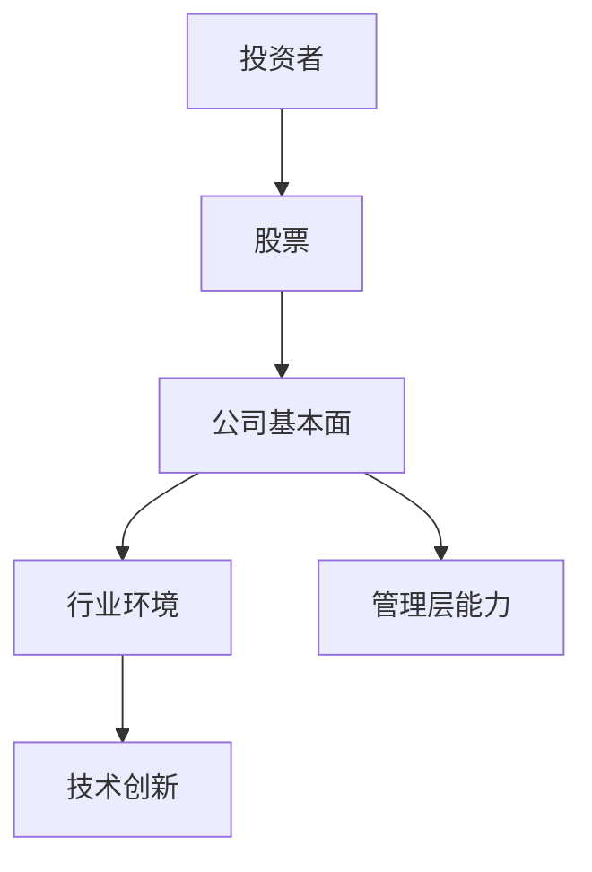

                 

# 格雷厄姆特价股票策略在高科技行业的应用挑战

> 关键词：格雷厄姆投资策略、高科技行业、股票估值、价值投资、投资挑战

> 摘要：本文探讨了格雷厄姆特价股票策略在高科技行业中的应用挑战，从理论基础、分析框架、算法模型、系统设计、项目实战等方面，全面分析了该策略在高科技行业的适用性、优劣势及实现路径。通过详细的分析和实际案例，本文揭示了在高科技行业应用格雷厄姆策略的关键因素和应对策略。

---

# 第1章 格雷厄姆特价股票策略概述

## 1.1 格雷厄姆投资理论的核心原则

### 1.1.1 安全边际的概念
格雷厄姆强调“安全边际”是价值投资的核心，即股票的内在价值高于其市场价格时，投资具有安全边际。安全边际越大，投资风险越小。

### 1.1.2 价值投资的基本原理
价值投资的核心在于寻找市场价格低于内在价值的股票。格雷厄姆认为，市场先生（市场的非理性波动）为投资者提供了廉价买入优质资产的机会。

### 1.1.3 格雷厄姆策略在股票选择中的应用
格雷厄姆提出了多 criteria的选股标准，包括低市盈率、低市净率、高股息率等，旨在筛选出被市场低估的股票。

## 1.2 高科技行业的特点与挑战

### 1.2.1 高科技行业的定义与范围
高科技行业通常指以技术创新为核心驱动力的行业，包括半导体、人工智能、云计算、生物技术等领域。

### 1.2.2 高科技行业的高增长与高风险
高科技行业具有高增长潜力，但同时也伴随着高风险，如技术迭代快、竞争激烈、政策变化频繁等。

### 1.2.3 高科技行业的估值难题
高科技公司的价值往往依赖于未来现金流的预测，而这些预测具有高度不确定性。此外，高科技公司可能处于亏损状态，传统的估值指标（如市盈率）可能失效。

## 1.3 格雷厄姆策略在高科技行业的适用性

### 1.3.1 高科技行业与传统行业的估值差异
| 行业类型 | 估值指标 | 核心影响因素 |
|----------|----------|--------------|
| 高科技   | 市盈率、市销率 | 技术创新、研发投入 |
| 传统     | 市盈率、市净率 | 资产规模、盈利能力 |

### 1.3.2 格雷厄姆策略在高科技行业的潜在应用
格雷厄姆策略在高科技行业的应用需要结合行业特点，如关注技术创新、竞争优势、管理层能力等。

### 1.3.3 高科技行业中的价值投资机会
尽管高科技行业波动较大，但通过深度研究和筛选，仍然可以找到被市场低估的优质高科技公司。

---

## 1.4 本章小结
本章介绍了格雷厄姆投资理论的核心原则，并分析了高科技行业的特点与挑战。尽管格雷厄姆策略在高科技行业的应用面临估值难题，但通过结合行业特点，仍然可以在高科技行业中找到价值投资的机会。

---

# 第2章 格雷厄姆策略的核心概念与分析框架

## 2.1 核心概念与联系

### 2.1.1 格雷厄姆策略的核心概念
格雷厄姆策略的核心概念包括内在价值、安全边际、市场先生等。

### 2.1.2 高科技行业与格雷厄姆策略的实体关系图

## 2.2 核心概念的数学模型与公式

### 2.2.1 格雷厄姆策略的数学模型
$$ V = \frac{E}{P} $$
其中，$V$ 为股票的内在价值，$E$ 为公司未来现金流的现值，$P$ 为股票价格。

### 2.2.2 高科技行业的估值公式
$$ V_{tech} = \frac{E_{tech}}{P_{tech}} $$
其中，$E_{tech}$ 为高科技公司的未来现金流，$P_{tech}$ 为高科技股票的价格。

## 2.3 核心概念的对比分析

### 2.3.1 格雷厄姆策略与现代投资理论的对比
| 理论 | 核心观点 |
|------|----------|
| 格雷厄姆策略 | 以内在价值为基础，寻找被低估的股票 |
| 现代投资理论 | 以市场定价为基础，关注资产组合的风险与收益 |

### 2.3.2 高科技行业与传统行业的估值差异对比
| 行业类型 | 估值指标 | 核心影响因素 |
|----------|----------|--------------|
| 高科技   | 市盈率、市销率 | 技术创新、研发投入 |
| 传统     | 市盈率、市净率 | 资产规模、盈利能力 |

---

## 2.4 本章小结
本章详细分析了格雷厄姆策略的核心概念，并通过数学模型和对比分析，揭示了格雷厄姆策略在高科技行业的适用性与挑战。

---

接下来，我们将深入探讨格雷厄姆策略在高科技行业的算法实现、系统设计与项目实战，结合具体案例分析其在实际投资中的应用与挑战。

---

