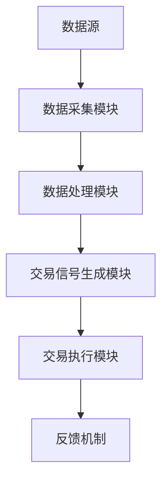

                 


# 格雷厄姆特价股票策略在高频交易环境下的适应性研究

## 关键词：
- 格雷厄姆策略
- 高频交易
- 价值投资
- 算法优化
- 数据分析

## 摘要：
本文探讨了格雷厄姆的价值投资策略在高频交易环境下的适应性。通过分析高频交易的特点，结合格雷厄姆策略的核心原理，提出了一种优化的算法实现方法。文章详细介绍了策略的数学模型、系统架构设计以及实际案例分析，为投资者提供了在高频环境下应用格雷厄姆策略的指导和建议。

---

## 第一部分：背景与概述

### 第1章：格雷厄姆特价股票策略的基本概念

#### 1.1 格雷厄姆投资理论的起源与发展
- **1.1.1 价值投资的起源**  
  价值投资起源于20世纪20年代，由本杰明·格雷厄姆和戴维·多德提出。格雷厄姆强调购买低于其内在价值的股票，以获得长期稳定的收益。

- **1.1.2 格雷厄姆的投资理念**  
  格雷厄姆认为市场波动是投资机会的来源，而非反映公司的真实价值。他提倡通过基本面分析，寻找具有安全边际的股票。

- **1.1.3 格雷厄姆策略的核心要素**  
  格雷厄姆策略的核心包括：  
  1. **安全边际**：买入价格低于内在价值的股票。  
  2. **内在价值计算**：通过市盈率、市净率等指标估算股票的真正价值。  
  3. **分散投资**：降低风险，避免过度依赖单一股票。

#### 1.2 格雷厄姆策略与高频交易的结合
- **1.2.1 格雷厄姆策略的特点**  
  格雷厄姆策略依赖于长期分析和基本面研究，适合价值投资者。

- **1.2.2 高频交易的特点**  
  高频交易强调快速决策和算法执行，依赖技术分析和数学模型。

- **1.2.3 两者的结合意义**  
  将格雷厄姆的长期价值分析与高频交易的快速执行能力结合，可以在市场波动中捕捉短期机会。

---

### 第2章：高频交易环境的特点与挑战

#### 2.1 高频交易的基本概念
- **2.1.1 高频交易的定义与特点**  
  高频交易是指在极短时间内进行大量的交易，依赖于算法和高性能交易系统。

- **2.1.2 高频交易的技术要求**  
  高频交易需要低延迟的网络、高性能的硬件和高效的算法。

- **2.1.3 高频交易的市场影响**  
  高频交易可能导致市场的短期波动增加，但也能提高市场的流动性。

#### 2.2 高频交易中的主要策略
- **2.2.1 市场微观结构分析**  
  通过分析订单簿和市场深度，寻找套利机会。

- **2.2.2 统计套利策略**  
  利用统计方法发现市场中的异常价格，进行套利。

- **2.2.3 预测性交易策略**  
  基于技术指标和机器学习模型预测市场走势。

---

## 第二部分：格雷厄姆策略的理论基础

### 第3章：格雷厄姆策略的核心原理

#### 3.1 格雷厄姆策略的核心公式
- **内在价值计算**  
  格雷厄姆的内在价值公式：  
  $$ V = \text{收益} \times \text{市盈率} $$  
  其中，收益是公司的净利润，市盈率是基于历史数据的平均值。

- **安全边际计算**  
  安全边际 = 内在价值 - 市场价格  
  $$ \text{安全边际} = V - P $$  
  其中，V是内在价值，P是市场价格。

#### 3.2 格雷厄姆策略与现代金融学的结合
- **现代金融学中的CAPM模型**  
  资产定价模型（CAPM）将风险与收益结合起来，为内在价值计算提供了新的视角。

- **风险调整后的内在价值**  
  通过CAPM计算出的无风险收益率和市场预期收益率，可以调整内在价值的计算公式。

---

## 第三部分：格雷厄姆策略在高频交易环境下的适应性分析

### 第4章：格雷厄姆策略在高频交易中的优势与劣势

#### 4.1 优势分析
- **长期收益稳定**  
  格雷厄姆策略注重长期价值，适合长期投资者。

- **防御性强**  
  通过安全边际的计算，减少了市场的波动风险。

#### 4.2 劣势分析
- **对市场短期波动的适应性不足**  
  高频交易需要快速反应，而格雷厄姆策略强调长期价值，可能错过短期机会。

- **计算复杂性**  
  格雷厄姆策略需要大量的数据处理和计算，适合高频交易的快速执行要求。

---

## 第四部分：系统分析与架构设计

### 第5章：系统架构设计

#### 5.1 系统功能设计
- **数据采集模块**  
  实时采集股票数据，包括价格、成交量等。

- **数据处理模块**  
  计算内在价值和安全边际，生成交易信号。

- **交易执行模块**  
  根据交易信号执行买卖操作，确保低延迟。

#### 5.2 系统架构图（Mermaid）


---

## 第五部分：项目实战

### 第6章：项目实现

#### 6.1 环境安装
- **安装Python环境**  
  使用Anaconda或Miniconda安装Python 3.8及以上版本。

- **安装依赖库**  
  ```bash
  pip install numpy pandas matplotlib
  ```

#### 6.2 核心代码实现
- **数据获取与处理**
  ```python
  import pandas as pd
  import numpy as np

  # 获取数据
  def get_data(ticker):
      # 数据获取逻辑
      pass

  # 计算内在价值
  def calculate_intrinsic_value(data):
      revenue = data['revenue'].mean()
      pe_ratio = data['pe_ratio'].mean()
      return revenue * pe_ratio

  # 计算安全边际
  def calculate_margin_of_safety(price, intrinsic_value):
      return intrinsic_value - price
  ```

- **交易信号生成**
  ```python
  def generate_trading_signal(price, intrinsic_value):
      margin_of_safety = calculate_margin_of_safety(price, intrinsic_value)
      if margin_of_safety > 0:
          return 'BUY'
      else:
          return 'SELL'
  ```

#### 6.3 案例分析
- **案例：某股票的分析与交易信号生成**  
  假设某股票价格为50美元，内在价值为60美元，安全边际为10美元，交易信号为“BUY”。

---

## 第六部分：总结与展望

### 第7章：总结与展望

#### 7.1 总结
- 格雷厄姆策略在高频交易环境下具有一定的适应性，但需要结合现代技术手段进行优化。

#### 7.2 展望
- 未来的研究可以进一步优化算法，提高计算效率，降低交易成本。

#### 7.3 最佳实践
- 投资者应根据市场环境调整策略参数，结合技术分析和基本面分析，制定合理的投资策略。

---

通过以上分析和设计，本文为投资者提供了在高频交易环境下应用格雷厄姆策略的理论基础和实践指导，帮助投资者在快速变化的市场中捕捉投资机会，实现长期稳定的收益。

