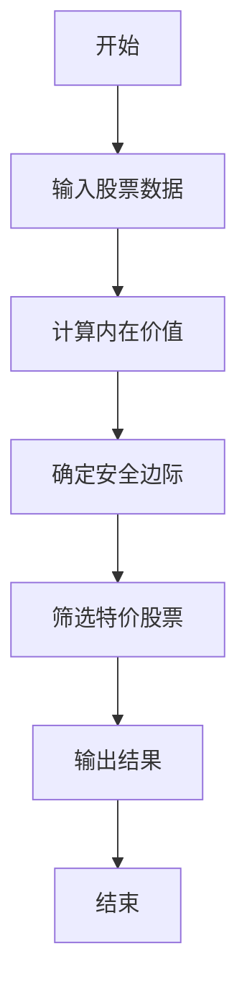
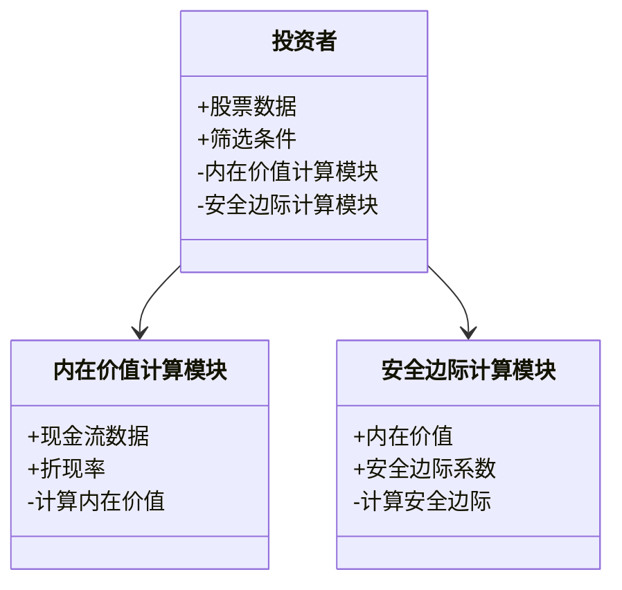

                 


# 格雷厄姆特价股票策略的历史表现分析

## 关键词
格雷厄姆、特价股票、价值投资、内在价值、安全边际、投资策略

## 摘要
本文深入分析了格雷厄姆特价股票策略的历史表现，从理论基础、算法原理到系统实现，详细阐述了该策略的核心思想和实际应用。通过案例分析和数学模型，展示了如何利用格雷厄姆的安全边际理论筛选出具有投资价值的特价股票，并对策略的优缺点进行了全面评估。

---

## 第一部分: 格雷厄姆特价股票策略的背景介绍

### 第1章: 格雷厄姆特价股票策略概述

#### 1.1 格雷厄姆投资理论的核心思想
- **价值投资的基本概念**：格雷厄姆认为，股票的内在价值是其未来现金流的现值，而市场价格围绕内在价值波动。
- **安全边际的理论基础**：通过买入低于内在价值的股票，利用安全边际来降低投资风险。
- **特价股票的定义与特征**：特价股票是指市场价格远低于内在价值的股票，通常具有低市盈率、低市净率等特点。

#### 1.2 特价股票策略的历史发展
- **策略的起源**：格雷厄姆在20世纪初提出，强调以低于内在价值的价格买入股票。
- **策略的演变**：从早期的低市盈率策略发展到现代的多因子筛选模型。
- **策略的现状**：当前仍被广泛应用于价值投资，但在实践中结合了更多的量化指标。

---

### 第2章: 特价股票策略的理论基础

#### 2.1 股票定价的内在价值模型
- **内在价值的计算公式**：
  $$ V = \frac{CF_1}{(1+r)^1} + \frac{CF_2}{(1+r)^2} + \cdots + \frac{CF_n}{(1+r)^n} $$
  其中，$CF_i$为第i年的现金流，$r$为折现率。
- **安全边际的计算方法**：
  $$ \text{安全边际} = V \times \text{安全边际系数} $$
  通常，安全边际系数为1.5至2.0。

#### 2.2 股票市场的周期性分析
- **市场周期的定义与特征**：
  - 牛市：市场价格高于内在价值。
  - 熊市：市场价格低于内在价值。
- **特价股票在不同周期的表现**：
  - 在熊市中，特价股票更容易出现。
  - 在牛市中，特价股票可能被高估。

#### 2.3 特价股票策略的核心要素
- **内在价值**：股票的真正价值。
- **市场价格**：股票的当前交易价格。
- **安全边际**：内在价值与市场价格的差异。

---

## 第二部分: 格雷厄姆特价股票策略的算法原理

### 第3章: 特价股票筛选算法

#### 3.1 算法原理概述
- **目标**：筛选出市场价格低于内在价值的股票。
- **步骤**：
  1. 计算股票的内在价值。
  2. 确定安全边际。
  3. 筛选出市场价格低于内在价值 × 安全边际系数的股票。

#### 3.2 算法实现流程图



#### 3.3 算法实现的数学模型
- **内在价值计算公式**：
  $$ V = \frac{CF}{r - g} $$
  其中，$CF$为现金流，$g$为增长率。
- **安全边际计算公式**：
  $$ \text{安全边际} = V \times \text{安全边际系数} $$

---

## 第三部分: 格雷厄姆特价股票策略的系统分析

### 第4章: 系统功能设计

#### 4.1 系统架构设计


#### 4.2 系统接口设计
- **输入接口**：
  - 股票数据：包括市盈率、市净率、现金流等。
- **输出接口**：
  - 特价股票列表：包括股票名称、市场价格、内在价值、安全边际。

#### 4.3 系统交互流程图

```mermaid
sequenceDiagram
    投资者 -> 内在价值计算模块: 提供股票数据
    内在价值计算模块 -> 安全边际计算模块: 提供内在价值
    安全边际计算模块 -> 投资者: 返回安全边际
    投资者 -> 筛选出特价股票
```

---

## 第四部分: 格雷厄姆特价股票策略的项目实战

### 第5章: 项目实战

#### 5.1 环境安装
- **工具**：Python、Pandas、Matplotlib、Scikit-learn。
- **数据源**：Yahoo Finance API。

#### 5.2 核心代码实现

```python
import pandas as pd
import numpy as np

def calculate_intrinsic_value(cash_flow, discount_rate, growth_rate):
    return cash_flow / (discount_rate - growth_rate)

def calculate_margin_of_safety(intrinsic_value, safety_coefficient):
    return intrinsic_value * safety_coefficient

# 示例数据
cash_flow = 100
discount_rate = 0.1
growth_rate = 0.05
safety_coefficient = 1.5

intrinsic_value = calculate_intrinsic_value(cash_flow, discount_rate, growth_rate)
margin_of_safety = calculate_margin_of_safety(intrinsic_value, safety_coefficient)

print(f"内在价值: {intrinsic_value}")
print(f"安全边际: {margin_of_safety}")
```

#### 5.3 数据分析与可视化

```python
import matplotlib.pyplot as plt

data = {
    '股票名称': ['股票A', '股票B', '股票C'],
    '内在价值': [100, 150, 200],
    '市场价格': [80, 120, 180]
}

df = pd.DataFrame(data)
plt.bar(df['股票名称'], df['内在价值'], label='内在价值')
plt.bar(df['股票名称'], df['市场价格'], label='市场价格')
plt.legend()
plt.show()
```

---

## 第五部分: 格雷厄姆特价股票策略的总结与展望

### 第6章: 总结与展望

#### 6.1 策略的历史表现分析
- **优点**：能够在熊市中发现低估股票，长期收益稳定。
- **缺点**：在牛市中可能错过上涨机会，需要耐心持有。

#### 6.2 策略的优缺点分析
- **优势**：
  - 稳定的长期收益。
  - 低风险投资策略。
- **劣势**：
  - 短期表现可能不佳。
  - 需要较高的市场判断能力。

#### 6.3 策略的未来展望
- **量化分析**：结合大数据和机器学习，优化筛选模型。
- **风险管理**：引入动态调整机制，降低市场波动影响。

---

## 第六部分: 附录

### 附录A: 格雷厄姆特价股票策略的数学公式

#### A.1 内在价值计算公式
$$ V = \frac{CF}{r - g} $$

#### A.2 安全边际计算公式
$$ \text{安全边际} = V \times \text{安全边际系数} $$

### 附录B: 格雷厄姆特价股票策略的代码示例

```python
import pandas as pd
import numpy as np

def calculate_intrinsic_value(cash_flow, discount_rate, growth_rate):
    return cash_flow / (discount_rate - growth_rate)

def calculate_margin_of_safety(intrinsic_value, safety_coefficient):
    return intrinsic_value * safety_coefficient

# 示例数据
cash_flow = 100
discount_rate = 0.1
growth_rate = 0.05
safety_coefficient = 1.5

intrinsic_value = calculate_intrinsic_value(cash_flow, discount_rate, growth_rate)
margin_of_safety = calculate_margin_of_safety(intrinsic_value, safety_coefficient)

print(f"内在价值: {intrinsic_value}")
print(f"安全边际: {margin_of_safety}")
```

### 附录C: 格雷厄姆特价股票策略的参考文献
- 格雷厄姆，本杰明. 《证券分析》
- 葛拉汉姆，大卫. 《价值投资入门》
- 纳斯，彼得. 《投资策略实战指南》

---

## 结语

通过本文的详细分析，我们可以看到格雷厄姆特价股票策略在历史上的卓越表现，以及其在现代投资中的重要地位。尽管该策略存在一定的局限性，但通过不断的优化和创新，仍然可以在当前市场中发挥重要作用。希望本文能够为投资者提供有价值的参考，帮助他们在投资道路上走得更稳更远。

