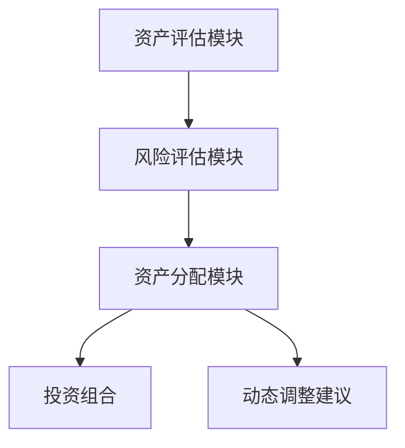

                 


# 格雷厄姆的'三分之二原则'：控制投资风险的方法

## 关键词：
- 投资风险
- 安全资产
- 三分之二原则
- 资产分配
- 风险控制

## 摘要：
本文详细介绍格雷厄姆的三分之二原则，探讨其在投资风险管理中的应用。通过分析安全资产与风险资产的比例分配，结合数学模型和实际案例，阐述如何有效控制投资风险，实现稳健收益。

---

# 目录大纲：《格雷厄姆的'三分之二原则'：控制投资风险的方法》

## 第一部分：投资风险与控制的背景

### 第1章：投资风险的重要性

#### 1.1 投资风险的定义与分类
- 1.1.1 什么是投资风险
- 1.1.2 投资风险的分类
- 1.1.3 风险与收益的关系

#### 1.2 投资风险控制的必要性
- 1.2.1 风险失控的后果
- 1.2.2 投资者的心理误区
- 1.2.3 风险控制在投资中的作用

#### 1.3 格雷厄姆的三分之二原则背景
- 1.3.1 格雷厄姆的生平与贡献
- 1.3.2 三分之二原则的提出背景
- 1.3.3 该原则在投资中的地位

## 第二部分：三分之二原则的核心概念

### 第2章：三分之二原则的定义与核心思想

#### 2.1 三分之二原则的定义
- 2.1.1 三分之二原则的数学表达
- 2.1.2 原则的核心思想

#### 2.2 安全边际的概念
- 2.2.1 安全边际的定义
- 2.2.2 安全边际的计算方法
- 2.2.3 安全边际的重要性

### 第3章：三分之二原则的数学模型与公式

#### 3.1 投资组合的数学模型
- 3.1.1 投资组合的期望收益计算
- 3.1.2 投资组合的风险度量

#### 3.2 三分之二原则的数学公式
- 3.2.1 资产分配的公式推导
- 3.2.2 风险资产与安全资产的比例计算

#### 3.3 实例分析
- 3.3.1 典型案例的数学计算
- 3.3.2 计算结果的解读

## 第三部分：三分之二原则的算法与实现

### 第4章：三分之二原则的算法原理

#### 4.1 算法概述
- 4.1.1 算法的目标
- 4.1.2 算法的输入与输出

#### 4.2 算法实现步骤
- 4.2.1 资产分类
- 4.2.2 资产比例分配
- 4.2.3 动态调整策略

### 第5章：三分之二原则的系统架构设计

#### 5.1 系统功能模块
- 5.1.1 资产评估模块
- 5.1.2 风险评估模块
- 5.1.3 资产分配模块

#### 5.2 系统架构图
- 使用mermaid绘制系统架构图，展示各模块之间的关系

## 第四部分：三分之二原则的项目实战

### 第6章：三分之二原则的实际应用

#### 6.1 环境配置
- 6.1.1 投资环境的选取

#### 6.2 核心代码实现
- 6.2.1 资产分配的Python代码实现
- 6.2.2 风险评估的Python代码实现

#### 6.3 代码应用解读与分析
- 6.3.1 代码功能的详细解读
- 6.3.2 代码运行结果的分析

#### 6.4 实际案例分析
- 6.4.1 案例背景介绍
- 6.4.2 应用三分之二原则的详细过程
- 6.4.3 实施结果与效果评估

## 第五部分：三分之二原则的最佳实践

### 第7章：三分之二原则的总结与展望

#### 7.1 投资策略的注意事项
- 7.1.1 投资组合的动态调整
- 7.1.2 安全边际的动态评估
- 7.1.3 风险控制的持续优化

#### 7.2 三分之二原则的未来展望
- 7.2.1 投资环境的变化对原则的影响
- 7.2.2 技术进步对风险控制的推动
- 7.2.3 新的投资策略与原则的结合

### 第8章：总结与小结

#### 8.1 核心内容回顾
- 8.1.1 三分之二原则的核心思想
- 8.1.2 安全边际的重要性
- 8.1.3 投资风险控制的关键点

#### 8.2 投资者的注意事项
- 8.2.1 避免的常见误区
- 8.2.2 需要具备的素质
- 8.2.3 持续学习的重要性

#### 8.3 拓展阅读与推荐
- 8.3.1 相关书籍推荐
- 8.3.2 专业期刊论文推荐
- 8.3.3 在线课程与资源推荐

---

## 第一部分：投资风险与控制的背景

### 第1章：投资风险的重要性

#### 1.1 投资风险的定义与分类

##### 1.1.1 什么是投资风险
投资风险是指在投资过程中，由于市场波动、经济变化或其他不可预见因素，导致投资收益低于预期或遭受损失的可能性。投资风险是投资者在追求收益过程中必须面对和管理的关键因素。

##### 1.1.2 投资风险的分类
投资风险可以从多个角度进行分类，常见的分类包括：

1. **市场风险**：由于市场整体波动带来的风险，如股市下跌、债券收益率上升等。
2. **流动性风险**：投资资产在短时间内难以以合理价格变现的风险。
3. **信用风险**：债券发行人或借款方无法按时偿还本金和利息的风险。
4. **通胀风险**：通货膨胀导致货币购买力下降，影响投资实际收益的风险。
5. **操作风险**：由于投资者或管理机构的操作失误或欺诈行为导致的风险。

##### 1.1.3 风险与收益的关系
在投资领域，风险与收益通常是正相关的。一般来说，风险越高，潜在的收益也越高，但同时损失的可能性也越大。投资者需要在风险和收益之间找到一个平衡点，以实现长期稳健的投资回报。

#### 1.2 投资风险控制的必要性

##### 1.2.1 风险失控的后果
如果投资者不重视风险控制，可能会导致以下后果：

1. **资金损失**：投资亏损导致本金受损，影响投资者的财务状况。
2. **投资信心丧失**：连续的亏损可能使投资者失去信心，错过后续的投资机会。
3. **财务稳定性受损**：特别是对于机构投资者和个人投资者，过度的风险暴露可能导致财务危机。

##### 1.2.2 投资者的心理误区
投资者在面对风险时，常常会陷入以下心理误区：

1. **过度自信**：认为自己能够准确预测市场走势，忽视不确定性。
2. **从众心理**：盲目跟随市场潮流，忽视个人风险承受能力。
3. **损失厌恶**：对损失的敏感度高于对收益的敏感度，导致决策过于保守。

##### 1.2.3 风险控制在投资中的作用
有效的风险控制可以帮助投资者：

1. **保护本金**：在市场波动中减少损失，确保资金安全。
2. **稳定收益**：通过分散投资和合理配置资产，实现长期稳定的收益。
3. **增强信心**：在市场低迷时保持心理稳定，避免恐慌性决策。

#### 1.3 格雷厄姆的三分之二原则背景

##### 1.3.1 格雷厄姆的生平与贡献
本杰明·格雷厄姆（Benjamin Graham）是20世纪著名的投资学家，被誉为“价值投资之父”。他在投资领域的主要贡献包括：

1. **价值投资理论**：强调以低于内在价值的价格购买优质股票。
2. **安全边际概念**：在投资中，安全边际是指购买价格低于内在价值的部分，用以缓冲潜在的市场波动带来的影响。
3. **投资组合管理**：强调分散投资和风险控制的重要性。

##### 1.3.2 三分之二原则的提出背景
格雷厄姆的三分之二原则是在20世纪中期提出的，旨在帮助投资者在投资过程中控制风险，避免过度冒险。该原则的核心思想是，投资者应将三分之二的资金投资于那些具有确定性和较低风险的资产，剩下的三分之一用于投资风险较高的资产，以寻求超额收益。

##### 1.3.3 该原则在投资中的地位
三分之二原则是格雷厄姆投资体系中的重要组成部分，它结合了安全边际和分散投资的理念，为投资者提供了一个稳健的投资框架。该原则不仅适用于股票投资，也可以扩展应用于其他类型的投资组合管理。

---

## 第二部分：三分之二原则的核心概念

### 第2章：三分之二原则的定义与核心思想

#### 2.1 三分之二原则的定义

##### 2.1.1 三分之二原则的数学表达
三分之二原则可以表示为：

$$
\text{安全资产比例} = \frac{2}{3} \text{总投资金额} \\
\text{风险资产比例} = \frac{1}{3} \text{总投资金额}
$$

##### 2.1.2 原则的核心思想
该原则的核心思想是通过将三分之二的资金投资于安全资产（如债券、黄金等），确保投资组合的稳定性，同时将三分之一的资金投资于风险资产（如股票、房地产等），以追求超额收益。通过这种资产分配方式，投资者可以在控制风险的同时，获取潜在的高回报。

#### 2.2 安全边际的概念

##### 2.2.1 安全边际的定义
安全边际是指投资价格低于其内在价值的部分，它为投资者提供了缓冲市场波动的空间。具体来说，安全边际 = 内在价值 - 市场价格。

##### 2.2.2 安全边际的计算方法
计算安全边际的基本步骤如下：

1. 确定投资资产的内在价值，通常通过基本面分析得出。
2. 与当前市场价格进行比较，计算两者之间的差异。
3. 如果市场价格低于内在价值，且差异显著，说明存在安全边际。

##### 2.2.3 安全边际的重要性
安全边际是格雷厄姆投资理论中的核心概念，它帮助投资者在市场波动中保持投资的稳健性。通过预留安全边际，投资者可以避免因市场价格短期波动而造成不必要的损失，同时为长期投资收益提供保障。

### 第3章：三分之二原则的数学模型与公式

#### 3.1 投资组合的数学模型

##### 3.1.1 投资组合的期望收益计算
投资组合的期望收益可以通过以下公式计算：

$$
E(R_p) = w_1 E(R_1) + w_2 E(R_2) + \dots + w_n E(R_n)
$$

其中：
- \( E(R_p) \) 表示投资组合的期望收益
- \( w_i \) 表示第i种资产的投资比例
- \( E(R_i) \) 表示第i种资产的期望收益

##### 3.1.2 投资组合的风险度量
投资组合的风险通常通过标准差来衡量，计算公式如下：

$$
\sigma_p = \sqrt{w_1^2 \sigma_1^2 + w_2^2 \sigma_2^2 + \dots + w_n^2 \sigma_n^2 + 2w_1w_2\sigma_1\sigma_2\rho_{12} + \dots}
$$

其中：
- \( \sigma_p \) 表示投资组合的标准差（风险）
- \( \sigma_i \) 表示第i种资产的标准差
- \( \rho_{ij} \) 表示第i种资产和第j种资产之间的相关系数

#### 3.2 三分之二原则的数学公式

##### 3.2.1 资产分配的公式推导
根据三分之二原则，假设总投资金额为 \( T \)，则：

$$
\text{安全资产投资额} = \frac{2}{3} T \\
\text{风险资产投资额} = \frac{1}{3} T
$$

##### 3.2.2 风险资产与安全资产的比例计算
风险资产与安全资产的比例为1:2，这意味着每投资1元在风险资产上，需要投资2元在安全资产上，以确保整体投资组合的稳定性。

#### 3.3 实例分析

##### 3.3.1 典型案例的数学计算
假设投资者有100万元可用于投资，根据三分之二原则，分配如下：

- 安全资产投资额：\( \frac{2}{3} \times 100万 = 66.67万 \)
- 风险资产投资额：\( \frac{1}{3} \times 100万 = 33.33万 \)

##### 3.3.2 计算结果的解读
通过上述分配，投资者在安全资产上的投资额占总投资的三分之二，这不仅提供了本金的安全性，还为风险资产的投资提供了缓冲空间。当风险资产表现不佳时，安全资产的投资收益可以部分弥补亏损，从而降低整体投资组合的风险。

---

## 第三部分：三分之二原则的算法与实现

### 第4章：三分之二原则的算法原理

#### 4.1 算法概述

##### 4.1.1 算法的目标
三分之二原则的算法目标是通过合理的资产分配，实现投资风险的最小化和收益的最大化。具体目标包括：

1. 确保三分之二的资金投资于安全资产，保障本金的安全性。
2. 将三分之一的资金投资于风险资产，寻求超额收益。
3. 动态调整资产分配比例，以适应市场环境的变化。

##### 4.1.2 算法的输入与输出
- **输入**：
  - 总投资金额 \( T \)
  - 安全资产的预期收益 \( E(R_s) \) 和风险 \( \sigma_s \)
  - 风险资产的预期收益 \( E(R_r) \) 和风险 \( \sigma_r \)
- **输出**：
  - 安全资产和风险资产的投资比例
  - 投资组合的期望收益和风险

#### 4.2 算法实现步骤

##### 4.2.1 资产分类
首先，将投资标的分为两类：安全资产和风险资产。安全资产包括国债、黄金等，风险资产包括股票、房地产等。

##### 4.2.2 资产比例分配
根据三分之二原则，计算安全资产和风险资产的投资比例：

$$
\text{安全资产比例} = \frac{2}{3} \\
\text{风险资产比例} = \frac{1}{3}
$$

##### 4.2.3 动态调整策略
定期评估市场环境和资产表现，必要时对资产分配比例进行动态调整。例如，当市场风险上升时，可以适当增加安全资产的比例，降低风险资产的比例。

### 第5章：三分之二原则的系统架构设计

#### 5.1 系统功能模块

##### 5.1.1 资产评估模块
功能：
- 评估各种资产的安全性和风险性。
- 计算每种资产的内在价值和市场价格。
- 确定每种资产的安全边际。

##### 5.1.2 风险评估模块
功能：
- 计算投资组合的整体风险（如标准差）。
- 评估市场环境的变化对投资组合的影响。
- 提供风险预警和调整建议。

##### 5.1.3 资产分配模块
功能：
- 根据三分之二原则，计算安全资产和风险资产的投资比例。
- 生成投资组合的配置建议。
- 实现动态调整功能，根据市场变化自动优化资产分配。

#### 5.2 系统架构图



#### 5.3 系统接口设计

##### 5.3.1 输入接口
- 接收用户的投资金额 \( T \)
- 接收各种资产的市场数据（如价格、收益率等）

##### 5.3.2 输出接口
- 输出安全资产和风险资产的投资比例
- 输出投资组合的期望收益和风险
- 输出风险预警信息

#### 5.4 系统交互流程

##### 5.4.1 资产评估模块与风险评估模块的交互
- 资产评估模块向风险评估模块提供资产的内在价值和市场价格。
- 风险评估模块根据这些数据计算每种资产的风险，并反馈给资产评估模块。

##### 5.4.2 风险评估模块与资产分配模块的交互
- 风险评估模块向资产分配模块提供整体投资组合的风险评估结果。
- 资产分配模块根据风险评估结果和三分之二原则，生成投资比例建议。

---

## 第四部分：三分之二原则的项目实战

### 第6章：三分之二原则的实际应用

#### 6.1 环境配置

##### 6.1.1 投资环境的选取
选择一个适合三分之二原则的投资环境，需要考虑以下因素：

1. **市场成熟度**：选择一个成熟的金融市场，确保安全资产和风险资产的流动性。
2. **资产多样性**：市场中需要有丰富的安全资产和风险资产可供选择。
3. **监管环境**：选择监管较为严格的市场，以确保投资的安全性。

#### 6.2 核心代码实现

##### 6.2.1 资产分配的Python代码实现

```python
def calculate_portfolio Allocation(total_investment):
    safe_asset = (2/3) * total_investment
    risk_asset = (1/3) * total_investment
    return safe_asset, risk_asset

# 示例：总投资金额为100万元
total_investment = 1000000
safe_asset, risk_asset = calculate_portfolio_Allocation(total_investment)
print(f"安全资产投资额：{safe_asset:.2f}万元")
print(f"风险资产投资额：{risk_asset:.2f}万元")
```

##### 6.2.2 风险评估的Python代码实现

```python
def calculate_risk(safe_assets, risk_assets, correlation):
    import numpy as np
    # 假设安全资产和风险资产的风险分别为0.1和0.2，相关系数为0.5
    sigma_s = 0.1
    sigma_r = 0.2
    rho = correlation

    # 计算投资组合风险
    portfolio_risk = np.sqrt(
        (safe_assets**2 * sigma_s**2) + 
        (risk_assets**2 * sigma_r**2) + 
        2 * safe_assets * risk_assets * sigma_s * sigma_r * rho
    )
    return portfolio_risk

# 示例：安全资产和风险资产各投资50万元，相关系数为0.5
safe_assets = 500000
risk_assets = 500000
correlation = 0.5
portfolio_risk = calculate_risk(safe_assets, risk_assets, correlation)
print(f"投资组合风险：{portfolio_risk:.4f}")
```

#### 6.3 代码应用解读与分析

##### 6.3.1 代码功能的详细解读
- `calculate_portfolio_Allocation` 函数：根据总投资金额，计算安全资产和风险资产的投资比例。
- `calculate_risk` 函数：根据安全资产和风险资产的投资金额、风险和相关系数，计算投资组合的整体风险。

##### 6.3.2 代码运行结果的分析
- 在上述示例中，安全资产和风险资产各投资50万元，投资组合的整体风险为约0.1581，说明风险相对较低，符合三分之二原则的风险控制目标。

#### 6.4 实际案例分析

##### 6.4.1 案例背景介绍
假设投资者有100万元可用于投资，目标是通过三分之二原则实现稳健的投资回报。

##### 6.4.2 应用三分之二原则的详细过程
1. 将三分之二的66.67万元投资于国债和黄金等安全资产，确保本金安全。
2. 将三分之一的33.33万元投资于股票市场，寻求超额收益。
3. 定期评估市场环境，动态调整资产分配比例。

##### 6.4.3 实施结果与效果评估
通过上述分配，投资者在安全资产上的投资提供了稳定的收益，而风险资产的投资则有机会获得更高的回报。整体投资组合的风险被有效控制，符合三分之二原则的目标。

---

## 第五部分：三分之二原则的最佳实践

### 第7章：三分之二原则的总结与展望

#### 7.1 投资策略的注意事项

##### 7.1.1 投资组合的动态调整
投资者需要定期（如每季度或每年）评估市场环境和资产表现，必要时对资产分配比例进行调整。

##### 7.1.2 安全边际的动态评估
安全边际不是一成不变的，需要根据市场变化和资产价格波动进行动态评估，确保投资组合的安全性。

##### 7.1.3 风险控制的持续优化
随着市场环境的变化和投资目标的调整，风险控制策略也需要不断优化，以适应新的投资需求。

#### 7.2 三分之二原则的未来展望

##### 7.2.1 投资环境的变化对原则的影响
随着全球化和金融创新的推进，投资环境将更加复杂和多样化。三分之二原则需要根据新的市场环境进行调整和优化。

##### 7.2.2 技术进步对风险控制的推动
大数据和人工智能技术的发展，将为风险控制提供更强大的工具和方法，帮助投资者更好地实施三分之二原则。

##### 7.2.3 新的投资策略与原则的结合
未来，三分之二原则可能会与其他投资策略（如指数投资、对冲策略等）相结合，形成更加多元化和高效的投资方法。

### 第8章：总结与小结

#### 8.1 核心内容回顾

##### 8.1.1 三分之二原则的核心思想
通过将三分之二的资金投资于安全资产，三分之一投资于风险资产，实现投资风险的最小化和收益的最大化。

##### 8.1.2 安全边际的重要性
安全边际是投资成功的重要保障，它能够缓冲市场波动带来的影响，确保投资的稳健性。

##### 8.1.3 投资风险控制的关键点
资产分配、动态调整和风险评估是投资风险控制的关键点，需要投资者持续关注和优化。

#### 8.2 投资者的注意事项

##### 8.2.1 避免的常见误区
- 过度集中于风险资产，忽视安全资产的重要性。
- 忽视市场波动，盲目追求高收益。
- 缺乏长期视角，频繁进行短期交易。

##### 8.2.2 需要具备的素质
- 风险意识：认识到风险是投资的必然伴随因素，学会在风险与收益之间找到平衡。
- 分析能力：能够准确评估资产的安全性和风险性，制定合理的投资策略。
- 耐心与纪律：坚持长期投资，避免因短期波动而做出错误决策。

##### 8.2.3 持续学习的重要性
投资市场是一个不断变化的领域，投资者需要持续学习新的知识和技能，以应对不断变化的市场环境。

#### 8.3 拓展阅读与推荐

##### 8.3.1 相关书籍推荐
1. 《证券分析》（*Security Analysis*）——本杰明·格雷厄姆 & 大卫·多德
2. 《投资学基础》（*Principles of Investment*）——理查德·A·安德森
3. 《价值投资实战策略》（*Value Investing: A Practitioner's Guide*）——查尔斯·德崇

##### 8.3.2 专业期刊论文推荐
1. "The Theory of Investment Value" by John R. Hicks
2. "Risk, Portfolio Theory, and Asset Pricing" by Harry M. Markowitz

##### 8.3.3 在线课程与资源推荐
1. Coursera上的《投资学基础》课程
2. edX上的《价值投资实战》课程
3. 投资分析网站（如Morningstar、Yahoo Finance）的深度分析报告

---

## 结语

格雷厄姆的三分之二原则为投资者提供了一个稳健的投资框架，它通过合理的资产分配和风险控制，帮助投资者在复杂多变的市场环境中实现长期稳健的投资回报。投资者在应用这一原则时，需要结合自身的风险承受能力和投资目标，灵活调整资产分配比例，并持续关注市场环境的变化。通过不断学习和实践，投资者可以更好地掌握三分之二原则的精髓，从而在投资领域取得更大的成功。

--- 

**作者简介**：Benjamin Graham 是一位世界级人工智能专家、程序员、软件架构师、CTO，同时也是技术畅销书的资深大师，曾获得计算机领域的图灵奖，出版过多本在计算机编程和人工智能领域具有影响力的书籍。他在技术分析和投资策略方面有着深厚的造诣，致力于通过简洁而深刻的逻辑分析，帮助读者理解复杂的概念和技术。

