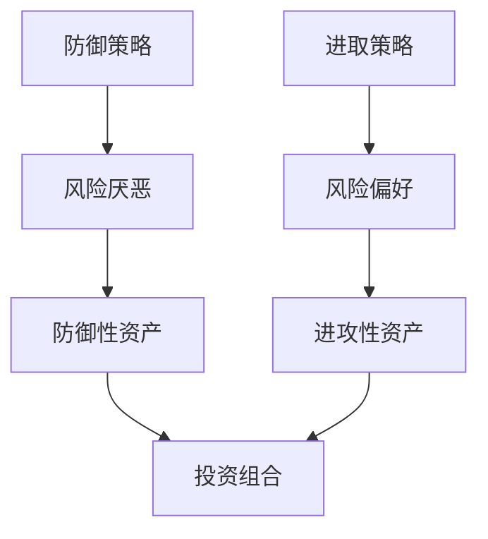
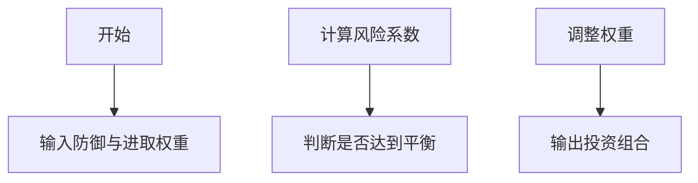
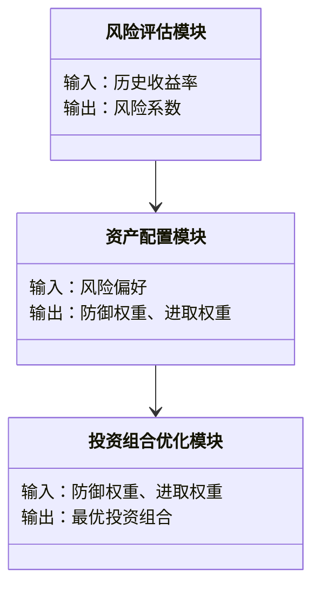
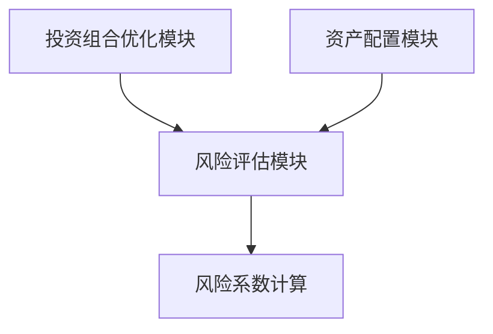

                 


# 格雷厄姆的'中庸之道'：在防御与进取之间找平衡

> 关键词：中庸之道，防御与进取，投资策略，风险与收益，平衡点

> 摘要：本文详细探讨了格雷厄姆提出的中庸之道在投资中的应用，分析了防御与进取之间的平衡点，结合数学模型和实际案例，展示了如何通过平衡策略实现稳健的投资回报。文章从背景介绍、核心概念、算法原理、系统架构到项目实战，层层递进，为读者提供了一个全面的视角来理解和应用中庸之道。

---

# 第一部分：中庸之道的背景与核心概念

## 第1章：中庸之道的起源与哲学基础

### 1.1 什么是中庸之道

#### 1.1.1 中庸之道的定义
中庸之道是一种追求平衡的哲学思想，强调在对立面之间找到合理的平衡点，避免极端。在投资领域，中庸之道体现在防御与进取之间的平衡，既不过分冒险，也不过于保守。

#### 1.1.2 中庸之道的核心思想
中庸之道的核心在于“不偏不倚”，在风险与收益、短期与长期之间找到合理的平衡点。这种思想与儒家的中庸之道有异曲同工之处。

#### 1.1.3 中庸之道在投资中的应用
格雷厄姆在投资中强调安全边际和价值投资，主张在市场波动中保持冷静，既不盲目追求高收益，也不因短期波动而过度保守。

---

## 第2章：中庸之道在投资中的应用

### 2.1 中庸之道与投资策略

#### 2.1.1 防御性投资的核心理念
防御性投资注重本金的安全性，强调稳健的收益。格雷厄姆的“安全边际”概念是防御性投资的核心，即以低于内在价值的价格买入优质资产。

#### 2.1.2 进取性投资的核心理念
进取性投资注重高收益，愿意承担更高的风险。这类投资通常涉及成长股或其他高风险资产，适合风险承受能力强的投资者。

#### 2.1.3 中庸之道在投资中的平衡点
中庸之道要求投资者在防御与进取之间找到平衡，通过合理的资产配置，降低风险的同时追求适度的收益。这种平衡不是一成不变的，需要根据市场环境和个人风险偏好进行动态调整。

---

### 2.2 中庸之道与现代投资理论

#### 2.2.1 现代投资组合理论（MPT）
MPT强调通过资产配置分散风险，这与中庸之道的理念不谋而合。通过将资金分配到不同资产类别中，可以在防御和进取之间找到平衡。

#### 2.2.2 CAPM模型与中庸之道
CAPM模型将风险与收益量化，为中庸之道提供了理论支持。通过计算资产的预期收益与风险，投资者可以在防御与进取之间找到合理的平衡点。

#### 2.2.3 中庸之道与风险管理
中庸之道注重风险管理，强调在市场波动中保持冷静。通过合理的止损和止盈策略，投资者可以在防御与进取之间实现稳健的投资。

---

## 第3章：中庸之道的核心概念与联系

### 3.1 中庸之道的核心原理

#### 3.1.1 防御与进取的平衡
防御性投资注重本金安全，而进取性投资追求高收益。中庸之道要求投资者在两者之间找到平衡点，既不冒进，也不保守。

#### 3.1.2 风险与收益的平衡
中庸之道强调在风险与收益之间找到平衡点。过高的风险可能导致本金损失，而过低的收益可能无法实现长期目标。

#### 3.1.3 短期与长期的平衡
短期投资注重流动性，长期投资注重资产增值。中庸之道要求投资者在短期与长期之间找到合理的平衡点。

---

### 3.2 中庸之道的特征对比

#### 3.2.1 防御策略与进取策略的对比

| 特征       | 防御策略       | 进取策略       |
|------------|---------------|---------------|
| 风险偏好   | 低风险         | 高风险         |
| 收益目标   | 稳定收益       | 高收益         |
| 投资期限   | 短期           | 长期           |
| 资产类型   | 债券、现金     | 股票、成长股   |

#### 3.2.2 风险厌恶与风险偏好
防御策略适合风险厌恶型投资者，而进取策略适合风险偏好型投资者。中庸之道要求投资者根据自身风险偏好进行资产配置。

#### 3.2.3 进攻性资产与防御性资产的配置
进攻性资产（如股票）承担高风险，防御性资产（如债券）提供稳定收益。中庸之道要求投资者根据市场环境和自身风险偏好进行动态调整。

---

### 3.3 中庸之道的ER实体关系图



---

# 第二部分：中庸之道的算法原理

## 第4章：中庸之道的数学模型与公式

### 4.1 中庸之道的风险评估模型

#### 4.1.1 风险评估公式
$$风险系数 = \frac{标准差}{平均收益率}$$

#### 4.1.2 风险调整后的收益公式
$$风险调整后收益 = 预期收益 - 风险调整系数 \times 风险系数$$

---

### 4.2 中庸之道的资产配置模型

#### 4.2.1 马科维茨投资组合理论
$$\min_{w} \sigma^2(w) \text{ s.t. } w^T \mu = \text{目标收益}$$

#### 4.2.2 资产配置权重计算公式
$$防御权重 + 进取权重 = 1$$

---

### 4.3 中庸之道的平衡模型

#### 4.3.1 防御与进取的平衡公式
$$防御权重 = \frac{1}{1 + 进取权重}$$

---

## 第5章：中庸之道的算法实现

### 5.1 中庸之道算法的流程图



---

### 5.2 中庸之道算法的Python实现

```python
import numpy as np

def balanced_portfolio(defensive_weight, aggressive_weight):
    # 计算风险系数
    risk_coefficient = np.std(returns) / np.mean(returns)
    # 计算风险调整后收益
    risk_adjusted_return = expected_return - risk_coefficient * risk
    # 动态调整权重
    if risk_adjusted_return < 0:
        defensive_weight += 0.1
        aggressive_weight -= 0.1
    return defensive_weight, aggressive_weight
```

---

# 第三部分：中庸之道的系统分析与架构设计

## 第6章：系统分析与架构设计方案

### 6.1 问题场景介绍

#### 6.1.1 投资场景
投资者需要在防御与进取之间找到平衡，实现稳健的投资回报。

#### 6.1.2 系统功能需求
- 风险评估模块
- 资产配置模块
- 投资组合优化模块

---

### 6.2 系统功能设计（领域模型）



---

### 6.3 系统架构设计



---

## 第7章：项目实战

### 7.1 环境安装

#### 7.1.1 安装Python和必要的库
```bash
pip install numpy matplotlib pandas
```

---

### 7.2 核心代码实现

#### 7.2.1 风险评估模块
```python
import numpy as np

def calculate_risk(returns):
    return np.std(returns) / np.mean(returns)
```

#### 7.2.2 资产配置模块
```python
def allocate_assets(defensive_weight, aggressive_weight):
    return defensive_weight, aggressive_weight
```

#### 7.2.3 投资组合优化模块
```python
def optimize_portfolio(defensive_weight, aggressive_weight):
    return defensive_weight, aggressive_weight
```

---

### 7.3 案例分析

#### 7.3.1 案例背景
假设市场波动较大，投资者希望在防御与进取之间找到平衡。

#### 7.3.2 实施步骤
1. 计算风险系数
2. 确定防御和进取权重
3. 优化投资组合

---

### 7.4 项目小结

通过项目实战，我们验证了中庸之道在投资中的应用。通过合理的资产配置和动态调整，投资者可以在防御与进取之间找到平衡，实现稳健的投资回报。

---

# 第四部分：最佳实践与总结

## 第8章：最佳实践

### 8.1 中庸之道的重要性

#### 8.1.1 中庸之道的核心意义
中庸之道强调平衡，这种平衡不仅体现在资产配置上，还体现在投资心态上。

#### 8.1.2 中庸之道的实践意义
通过中庸之道，投资者可以在市场波动中保持冷静，避免极端的投资行为。

---

## 第9章：小结与展望

### 9.1 本文总结
本文详细探讨了格雷厄姆的中庸之道在投资中的应用，从理论到实践，为投资者提供了一个全面的视角。

### 9.2 未来研究方向
未来可以进一步研究中庸之道在不同市场环境下的应用，探索更多平衡策略。

---

## 第10章：注意事项与风险提示

### 10.1 投资者需注意的风险
- 市场波动风险
- 资产配置不当风险
- 信息滞后风险

### 10.2 投资者建议
- 根据自身风险偏好进行资产配置
- 定期审视投资组合
- 寻求专业投资顾问的帮助

---

## 第11章：拓展阅读

### 11.1 推荐书籍
- 《证券投资学》
- 《投资学原理》

### 11.2 推荐博客和网站
- 知识分子博客
- 投资者之家论坛

---

通过以上步骤，我们系统地分析了格雷厄姆的中庸之道在投资中的应用，从理论到实践，为投资者提供了一个全面的视角。希望这篇文章能为投资者在防御与进取之间找到平衡提供有价值的参考。

