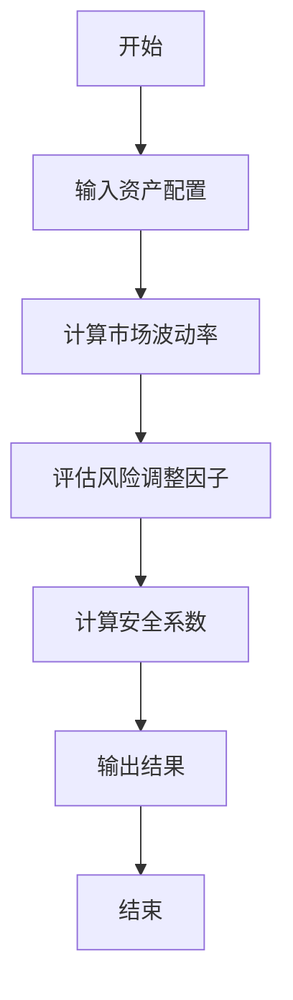
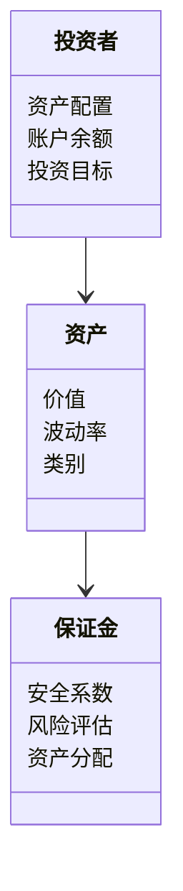
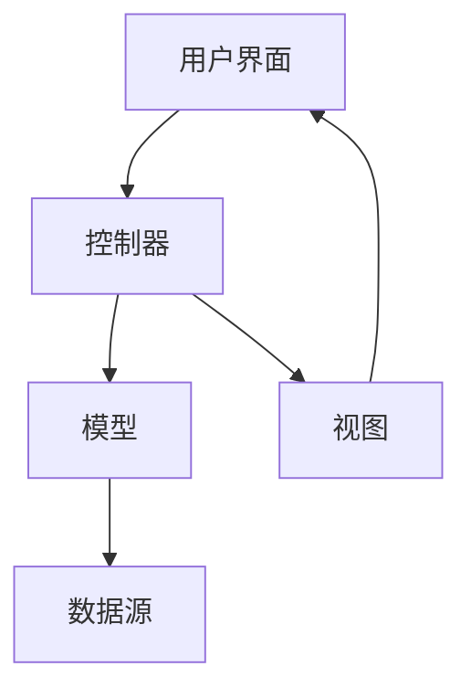
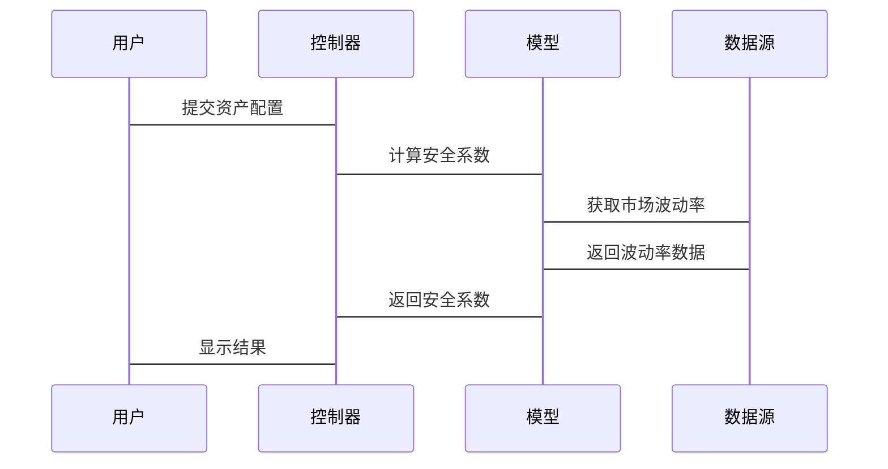

                 


# 《格雷厄姆的'保证金安全'概念：确保投资本金安全》

**关键词**：保证金安全、投资本金安全、风险管理、格雷厄姆投资理念、数学模型、系统设计、算法原理

**摘要**：本文将深入探讨格雷厄姆的保证金安全概念，从理论基础到实际应用，系统性地分析如何确保投资本金的安全。通过数学模型、算法原理、系统设计和项目实战等多维度的探讨，帮助投资者全面理解保证金安全的核心思想，并提供实际操作的指导和建议。

---

# 第一部分: 背景介绍

## 第1章: 核心概念与背景

### 1.1 保证金安全的定义与背景
#### 1.1.1 保证金安全的核心概念
保证金安全是投资领域中的一个重要概念，旨在确保投资者的本金不受损失。格雷厄姆作为价值投资的鼻祖，提出保证金安全的策略，即通过合理的资产配置和风险管理，确保在市场波动中本金的安全。

#### 1.1.2 投资本金安全的重要性
在投资过程中，本金的安全性是投资者最关注的问题之一。没有本金的安全，任何收益都无从谈起。格雷厄姆强调，在市场下跌时，保证本金不遭受损失是投资的第一要务。

#### 1.1.3 格雷厄姆投资理念的起源与发展
格雷厄姆的投资理念起源于20世纪初的美国经济危机时期。他通过研究市场的波动性和投资者的心理，提出了以价值投资为核心的策略，其中保证金安全是其思想的重要组成部分。

### 1.2 保证金安全的核心要素
#### 1.2.1 本金安全的核心要素
保证金安全的核心要素包括资产的质量、市场的波动性、投资者的心理因素等。这些要素共同决定了保证金安全的实现方式。

#### 1.2.2 保证金安全的边界与外延
保证金安全的边界是指在何种市场条件下，本金可以得到保障；外延则包括如何在不同市场环境下应用保证金安全策略。

#### 1.2.3 核心概念的结构与组成
保证金安全的结构包括市场分析、资产配置、风险管理三个主要部分，每个部分又包含多个子要素。

---

# 第二部分: 核心概念与联系

## 第2章: 保证金安全的核心原理

### 2.1 核心原理分析
#### 2.1.1 保证金安全的数学模型
保证金安全可以通过数学模型进行量化。例如，使用概率论模型评估不同投资策略下的本金安全概率。

#### 2.1.2 核心原理的属性特征对比
以下是保证金安全与风险之间的对比分析：

| 属性 | 保证金安全 | 风险管理 |
|------|------------|----------|
| 目标 | 保护本金 | 减少损失 |
| 方法 | 资产配置 | 投资分散 |
| 工具 | 价值评估 | 财务指标 |

#### 2.1.3 核心概念的ER实体关系图
以下是保证金安全的核心概念的ER实体关系图：

```mermaid
erd
    客户(CUSTOMER) -[1..n]-> 账户(ACCOUNT)
    账户(ACCOUNT) -[1..n]-> 保证金(GUARANTEE)
    保证金(GUARANTEE) -[1..n]-> 安全资产(SAFE_ASSET)
```

---

# 第三部分: 算法原理讲解

## 第3章: 保证金安全的算法原理

### 3.1 算法原理分析
#### 3.1.1 保证金安全的数学模型
以下是一个用于评估保证金安全的数学模型：

$$
\text{安全系数} = \frac{\text{资产价值}}{\text{市场波动率}} \times \text{风险调整因子}
$$

#### 3.1.2 核心算法的流程
以下是保证金安全算法的流程图：



#### 3.1.3 算法实现的Python代码
以下是实现保证金安全算法的Python代码：

```python
import numpy as np

def calculate_security_coefficient(asset_value, market_volatility, risk_adjustment_factor):
    return (asset_value / market_volatility) * risk_adjustment_factor

# 示例数据
asset_value = 1000000
market_volatility = 0.2
risk_adjustment_factor = 1.5

# 计算安全系数
security_coefficient = calculate_security_coefficient(asset_value, market_volatility, risk_adjustment_factor)
print(f"安全系数: {security_coefficient}")
```

---

# 第四部分: 系统分析与架构设计

## 第4章: 系统分析与架构设计

### 4.1 系统功能设计
#### 4.1.1 领域模型设计
以下是保证金安全系统的领域模型：



#### 4.1.2 系统架构设计
以下是保证金安全系统的架构图：



#### 4.1.3 系统接口设计
以下是系统的主要接口：

1. 用户输入接口：接收投资者的资产配置信息。
2. 数据处理接口：计算市场波动率和风险调整因子。
3. 输出接口：显示安全系数和投资建议。

#### 4.1.4 系统交互设计
以下是系统交互流程图：



---

# 第五部分: 项目实战

## 第5章: 项目实战

### 5.1 项目介绍
本项目旨在设计一个基于格雷厄姆保证金安全理念的投资决策支持系统，帮助投资者实现本金的安全。

### 5.2 核心代码实现
以下是系统的核心代码：

```python
import numpy as np

class SecuritySystem:
    def __init__(self, asset_value, market_volatility, risk_adjustment_factor):
        self.asset_value = asset_value
        self.market_volatility = market_volatility
        self.risk_adjustment_factor = risk_adjustment_factor

    def calculate_security_coefficient(self):
        return (self.asset_value / self.market_volatility) * self.risk_adjustment_factor

# 示例应用
system = SecuritySystem(1000000, 0.2, 1.5)
print(f"安全系数: {system.calculate_security_coefficient()}")
```

### 5.3 项目小结
通过本项目的实现，我们可以看到保证金安全理念在实际投资中的应用。通过数学模型和系统设计，投资者可以更好地管理和保护自己的本金。

---

# 第六部分: 最佳实践与小结

## 第6章: 最佳实践

### 6.1 投资建议
根据格雷厄姆的保证金安全理念，投资者应优先考虑本金的安全，避免高风险的投资，选择稳定的资产配置。

### 6.2 注意事项
在实际投资中，应根据市场变化及时调整资产配置，确保保证金安全策略的有效性。

### 6.3 拓展阅读
推荐阅读格雷厄姆的《证券分析》和《智慧的投资者》，深入了解保证金安全理念的细节。

---

# 总结

通过本文的系统性分析，我们深入探讨了格雷厄姆的保证金安全概念，并从理论到实践进行了全面阐述。希望本文能够为投资者提供有价值的参考，帮助他们在投资过程中更好地保护本金，实现稳健的投资收益。

