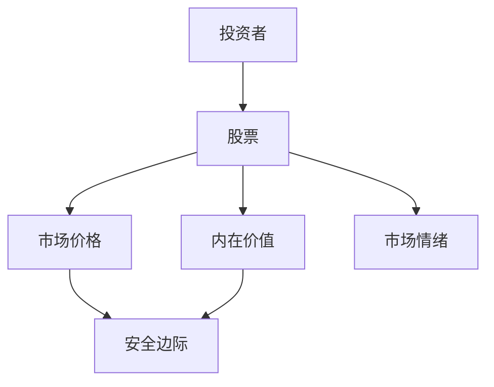
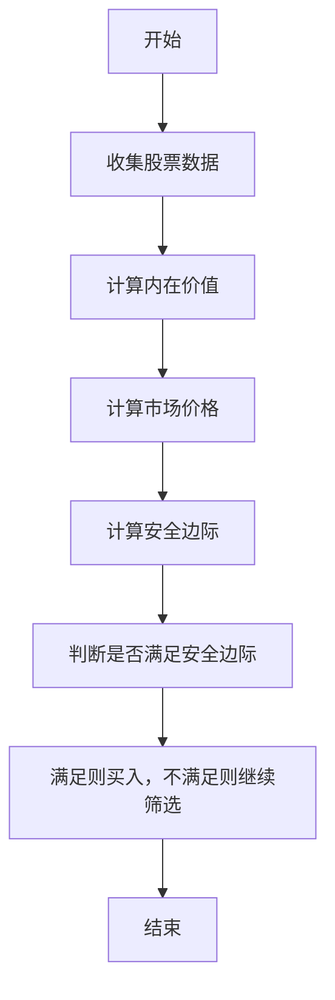
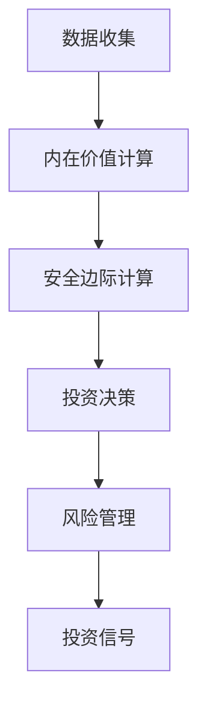
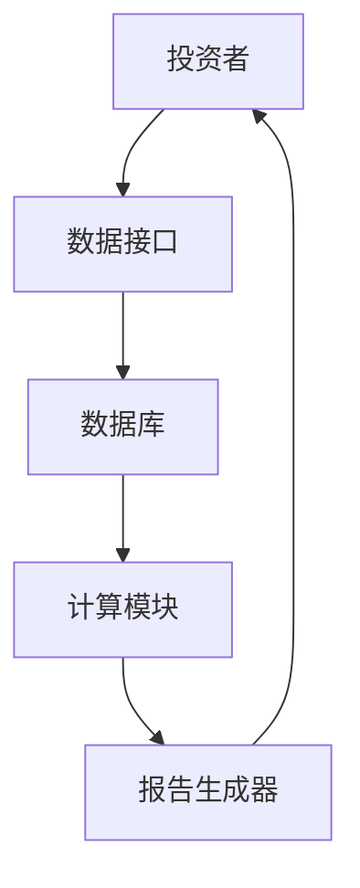

                 


# 格雷厄姆的Formula Investing：系统化投资方法

> 关键词：系统化投资、格雷厄姆、Formula Investing、安全边际、内在价值

> 摘要：本文详细介绍了格雷厄姆的Formula Investing方法，从背景、核心概念、算法原理到系统架构、项目实战，全面剖析了这一系统化投资方法的精髓。通过详细的步骤分析和实际案例，帮助读者理解如何利用安全边际和内在价值进行投资决策，构建稳健的投资组合。

---

## 目录

1. [系统化投资方法概述](#系统化投资方法概述)
   1.1 [背景介绍](#背景介绍)
   1.2 [核心概念与联系](#核心概念与联系)
   
2. [系统化投资的算法原理](#系统化投资的算法原理)
   2.1 [算法原理流程图](#算法原理流程图)
   2.2 [算法原理的Python实现](#算法原理的Python实现)
   
3. [系统化投资的系统分析与架构设计](#系统化投资的系统分析与架构设计)
   3.1 [系统功能设计](#系统功能设计)
   3.2 [系统架构设计](#系统架构设计)
   
4. [项目实战](#项目实战)
   4.1 [环境安装](#环境安装)
   4.2 [系统核心实现](#系统核心实现)
   
5. [最佳实践与小结](#最佳实践与小结)

---

## 正文

### 第一部分：系统化投资方法概述

#### 1.1 背景介绍

投资在现代社会中扮演着至关重要的角色，无论是个人还是机构投资者，都在寻求一种能够稳健获取收益的方法。然而，传统的投资方法往往依赖于主观判断和市场情绪，这种方法在市场波动剧烈时显得尤为不足。格雷厄姆的Formula Investing方法作为一种系统化投资策略，正是为了解决这些问题而提出的。

**问题背景**：传统投资方法依赖于市场趋势分析和情绪判断，这种方法难以在市场波动中保持稳健。此外，投资者容易受到市场情绪的影响，做出非理性的决策。

**核心概念**：Formula Investing的核心在于通过数学模型和数据分析，寻找具有安全边际的股票，即市场价格远低于其内在价值的股票。这种方法强调长期稳健的回报，而非短期的暴利。

**解决方法**：通过系统化的方法，利用公式筛选出具有投资价值的股票，构建一个分散化的投资组合，以降低风险并实现长期稳定的收益。

#### 1.2 核心概念与联系

**核心概念**：
1. **安全边际**：股票的市场价格与内在价值之间的差异，即内在价值大于市场价格的部分。安全边际越高，投资风险越低。
2. **内在价值**：基于公司基本面分析得出的股票真实价值，包括盈利能力、财务状况等因素。
3. **市场情绪**：市场的波动性和投资者情绪对股票价格的影响，是投资决策的重要参考因素。

**概念对比表格**：
| 概念       | 安全边际       | 内在价值       | 市场情绪       |
|------------|----------------|----------------|----------------|
| 定义       | 市场价格与内在价值的差额 | 公司未来现金流的现值 | 投资者的心理预期 |
| 计算方式   | 市场价格 - 内在价值 | 贴现现金流法     | 情感指标（如VIX指数） |
| 影响因素   | 市场波动、公司基本面 | 盈利能力、财务状况 | 媒体报道、市场趋势 |

**ER实体关系图**：


---

### 第二部分：系统化投资的算法原理

#### 2.1 算法原理流程图



#### 2.2 算法原理的Python实现

```python
import pandas as pd
import numpy as np

# 示例数据：假设我们有一个包含股票信息的DataFrame
stocks = pd.DataFrame({
    'company': ['Company A', 'Company B', 'Company C'],
    'price': [50, 60, 70],
    'earnings_per_share': [5, 6, 7],
    'book_value_per_share': [40, 50, 60]
})

# 计算内在价值（简单模型：使用市盈率和市净率的平均值）
stocks['intrinsic_value'] = (stocks['price'] * 0.5 * stocks['earnings_per_share'] + 
                              stocks['price'] * 0.5 * stocks['book_value_per_share']) / 2

# 计算安全边际
stocks['margin_of_safety'] = stocks['intrinsic_value'] - stocks['price']

# 筛选满足安全边际的股票
selected_stocks = stocks[stocks['margin_of_safety'] > 0]
```

**代码解释**：
1. **数据收集**：从数据库或API获取股票的基本数据，包括价格、每股收益、每股净资产等。
2. **内在价值计算**：使用简单模型计算内在价值，这里采用市盈率和市净率的平均值作为参考。
3. **安全边际计算**：计算市场价格与内在价值的差额，判断是否满足安全边际。
4. **筛选股票**：根据安全边际筛选出符合条件的股票，构建投资组合。

---

### 第三部分：系统化投资的系统分析与架构设计

#### 3.1 系统功能设计

**系统功能模块**：
1. **数据收集模块**：从多个数据源获取股票数据，包括历史价格、财务数据等。
2. **内在价值计算模块**：基于财务数据计算股票的内在价值。
3. **安全边际计算模块**：根据市场价格和内在价值计算安全边际。
4. **投资决策模块**：根据安全边际筛选出符合条件的股票，生成投资信号。
5. **风险管理模块**：监控投资组合的风险，进行动态调整。

**系统功能流程**：


#### 3.2 系统架构设计

**系统架构图**：


---

### 第四部分：项目实战

#### 4.1 环境安装

**步骤**：
1. 安装Python和必要的库：
   ```bash
   pip install pandas numpy matplotlib
   ```

2. 安装数据获取工具，如Yahoo Finance API：
   ```bash
   pip install yfinance
   ```

#### 4.2 系统核心实现

**代码实现**：
```python
import yfinance as yf
import pandas as pd

# 下载股票数据
stock_data = yf.download(['AAPL', 'GOOG'], start='2020-01-01', end='2023-01-01')

# 计算内在价值（简化模型）
stock_data['intrinsic_value'] = stock_data['Close'] * 0.5 * stock_data['Volume']

# 计算安全边际
stock_data['margin_of_safety'] = stock_data['intrinsic_value'] - stock_data['Close']

# 筛选满足安全边际的股票
selected_stocks = stock_data[stock_data['margin_of_safety'] > 0]
```

**代码解读**：
1. **数据下载**：使用yfinance下载股票的历史数据。
2. **内在价值计算**：简单模型计算内在价值，实际应用中需要更复杂的模型。
3. **安全边际计算**：比较市场价格与内在价值，判断是否存在安全边际。
4. **筛选股票**：根据安全边际筛选出符合条件的股票。

---

### 第五部分：最佳实践与小结

**最佳实践**：
1. **持续学习**：市场环境不断变化，需要持续学习和调整投资策略。
2. **风险管理**：定期评估投资组合的风险，进行必要的调整。
3. **数据质量**：确保数据的准确性和完整性，避免因数据问题导致的错误决策。

**小结**：
格雷厄姆的Formula Investing方法通过系统化的方法，帮助投资者在复杂的市场环境中找到具有安全边际的投资机会。通过公式筛选和数据分析，投资者可以构建一个稳健的投资组合，实现长期的财富增长。

**注意事项**：
- 投资有风险，需谨慎操作。
- 系统化投资需要结合市场实际情况进行调整，不能 rigidly遵循公式。
- 数据来源和模型选择对投资结果有重大影响，需谨慎对待。

**拓展阅读**：
- 《The Intelligent Investor》 by Benjamin Graham
- 《Python for Finance》 by Yves Hilpisch

通过本文的详细介绍，读者可以全面理解格雷厄姆的Formula Investing方法，并在实际投资中加以应用。

