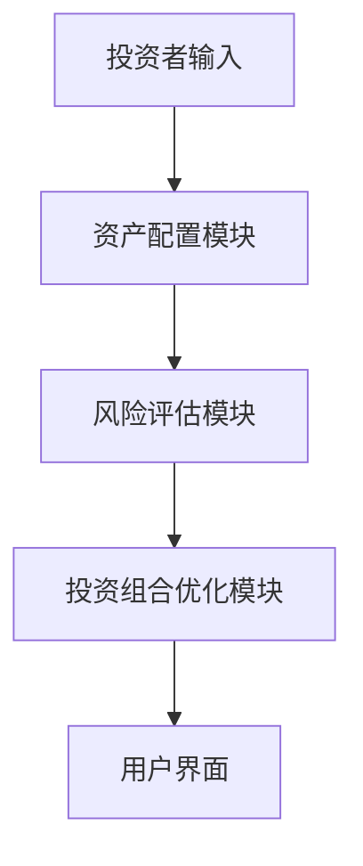
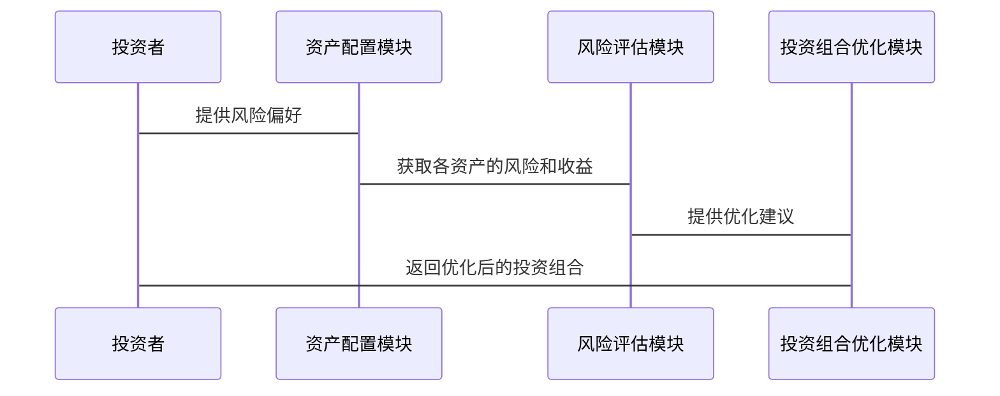

                 


# 格雷厄姆的Group Approach：分散投资的智慧

> 关键词：格雷厄姆，分散投资，Group Approach，投资组合，风险控制

> 摘要：本文深入探讨了格雷厄姆的Group Approach投资策略，分析其背后的数学原理和系统架构，通过实际案例展示了如何在现代投资管理中应用这种方法来实现风险控制和收益最大化。

---

# 第一部分: 格雷厄姆投资理论概述

## 第1章: 本杰明·格雷厄姆与价值投资

### 1.1 本杰明·格雷厄姆的生平简介
本杰明·格雷厄姆（Benjamin Graham）是20世纪最伟大的投资思想家之一，被誉为“价值投资之父”。他出生于1894年，早年在金融领域积累了丰富的经验，并在1926年出版了《新興的Bond分析家》一书，奠定了他在投资领域的地位。他在哥伦比亚大学教授投资课程，培养了包括沃伦·巴菲特在内的许多著名投资者。

### 1.2 格雷厄姆的价值投资理论
格雷厄姆的价值投资理论强调以低于内在价值的价格买入股票，并长期持有。他认为市场波动是投资者的敌人，而分散投资是降低风险的关键。他提出的Group Approach策略，将投资组合分散到多个不同的资产类别和行业中，以实现风险最小化和收益最大化。

---

## 第2章: 分散投资的核心概念

### 2.1 分散投资的基本原理
分散投资是一种通过将资金分配到不同的资产类别、行业或地理位置来降低投资组合风险的策略。其核心思想是“不要把所有鸡蛋放在一个篮子里”。通过分散投资，投资者可以减少特定资产或市场的波动对整体投资组合的影响。

### 2.2 格雷厄姆的Group Approach
格雷厄姆的Group Approach是一种具体的分散投资策略，强调将资金分成多个小组（Group），每个小组投资于不同的资产类别或行业。例如，一个投资组合可以分为股票、债券、房地产信托基金（REITs）和 commodities，每个小组的投资比例根据风险承受能力和市场环境进行调整。

---

# 第二部分: 格雷厄姆Group Approach的数学模型与风险评估

## 第3章: 投资组合的风险与收益分析

### 3.1 投资组合的期望收益计算
投资组合的期望收益是各资产期望收益的加权平均值：
$$ E(r_p) = \sum_{i=1}^{n} w_i E(r_i) $$
其中，$w_i$是资产i的权重，$E(r_i)$是资产i的期望收益。

### 3.2 投资组合的风险度量（方差与标准差）
投资组合的方差计算公式为：
$$ \sigma_p^2 = \sum_{i=1}^{n} w_i^2 \sigma_i^2 + 2 \sum_{i<j} w_i w_j \sigma_{ij} $$
标准差则是方差的平方根：
$$ \sigma_p = \sqrt{\sigma_p^2} $$

### 3.3 标准差与风险的关系
标准差是衡量投资组合风险的重要指标。标准差越小，投资组合的风险越低；标准差越大，风险越高。

---

## 第4章: 格雷厄姆Group Approach的数学模型

### 4.1 分组投资的数学表达
将投资组合分成k个小组，每个小组的投资比例为$w_1, w_2, ..., w_k$，每个小组的期望收益和标准差分别为$E(r_1), \sigma_1, ..., E(r_k), \sigma_k$。

### 4.2 分组投资的风险分散公式
分组投资的总体方差为：
$$ \sigma_p^2 = \sum_{i=1}^{k} w_i^2 \sigma_i^2 + 2 \sum_{i<j} w_i w_j \sigma_{ij} $$

### 4.3 分组投资的收益分配模型
通过分组投资，投资者可以在保持总体收益的同时，降低整体投资组合的风险。

---

# 第三部分: 系统分析与架构设计

## 第5章: 投资管理系统概述

### 5.1 系统目标与功能模块
系统目标：实现格雷厄姆Group Approach的投资策略，帮助投资者进行分散投资。
功能模块：资产配置模块、风险评估模块、投资组合优化模块。

### 5.2 系统架构的总体设计
采用分层架构，包括数据层、业务逻辑层和用户界面层。

---

## 第6章: 系统功能设计

### 6.1 资产配置模块
根据投资者的风险偏好，将资金分配到不同的资产类别中。

### 6.2 风险评估模块
计算每个资产组的风险和收益，评估总体投资组合的风险。

### 6.3 投资组合优化模块
调整各资产组的权重，以实现风险最小化和收益最大化。

---

## 第7章: 系统架构图



---

## 第8章: 系统接口设计

### 8.1 接口描述
- 资产配置模块接口：接收投资者的资产分配比例。
- 风险评估模块接口：计算各资产组的风险和收益。
- 投资组合优化模块接口：调整投资组合的权重。

---

## 第9章: 系统交互流程图



---

# 第四部分: 项目实战

## 第10章: 环境安装与核心实现

### 10.1 环境安装
- Python 3.8及以上版本
- Jupyter Notebook
- 导入必要的库：numpy、pandas、matplotlib

---

## 第11章: 核心实现源代码

### 11.1 分组投资的Python实现

```python
import numpy as np
import pandas as pd
import matplotlib.pyplot as plt

# 示例数据：各资产的历史收益率
assets = ['股票', '债券', 'REITs', '大宗商品']
returns = {'股票': [10, 15, 5, 20],
           '债券': [5, 7, 8, 6],
           'REITs': [8, 10, 12, 9],
           '大宗商品': [12, 6, 8, 15]}

df = pd.DataFrame(returns)

# 计算各资产的期望收益和标准差
expected_returns = df.mean()
std_deviation = df.std()

print("期望收益：\n", expected_returns)
print("标准差：\n", std_deviation)
```

---

## 第12章: 案例分析与实际应用

### 12.1 投资组合优化案例
假设投资者有100万元资金，计划按照40%股票、30%债券、20% REITs、10% 大宗商品的比例进行投资。

计算各资产的权重和风险：
- 股票：权重40%，标准差15%
- 债券：权重30%，标准差8%
- REITs：权重20%，标准差12%
- 大宗商品：权重10%，标准差18%

总体标准差计算：
$$ \sigma_p = \sqrt{(0.4^2 \times 0.15^2) + (0.3^2 \times 0.08^2) + (0.2^2 \times 0.12^2) + (0.1^2 \times 0.18^2) + 2 \times (0.4 \times 0.3 \times 0.15 \times 0.08) + ... } $$

---

## 第13章: 项目小结

通过实际案例分析，我们可以看到格雷厄姆的Group Approach在分散投资中的有效性。通过合理的资产分配和风险评估，投资者可以在保持收益的同时，有效降低投资风险。

---

# 第五部分: 总结与展望

## 第14章: 最佳实践与注意事项

### 14.1 最佳实践
- 定期评估和调整投资组合
- 根据市场环境动态调整资产分配比例
- 使用工具辅助计算和优化

### 14.2 注意事项
- 分散投资并不能完全消除风险
- 需要根据个人风险承受能力进行调整
- 市场波动可能影响分组投资的效果

---

## 第15章: 小结

格雷厄姆的Group Approach是一种科学的分散投资方法，通过合理的资产分配和风险控制，投资者可以实现长期稳定的收益。本文通过理论分析和实际案例，详细介绍了这种方法的实现过程和应用价值。

---

## 第16章: 拓展阅读

### 16.1 推荐书籍
- 《证券分析》（Security Analysis）—— 本杰明·格雷厄姆与戴维·多德合著
- 《投资学》（ Investments）—— 弗雷德里克·S·雷温顿

### 16.2 推荐在线资源
- 网络课程：Coursera上的“投资学基础”课程
- 投资工具：Morningstar、 Yahoo Finance

---

通过本文的分析和实践，我们深刻体会到格雷厄姆Group Approach的智慧和价值。希望读者能够将这些理论和方法应用到实际投资中，实现稳健的财务增长。

