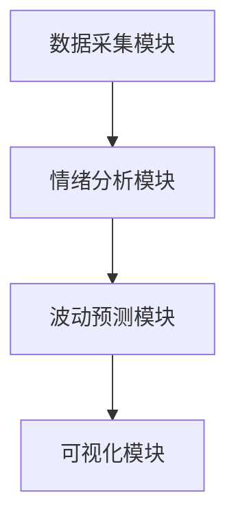

                 

# 格雷厄姆的Mr. Market比喻及其现代意义

## 关键词：
- Mr. Market比喻
- 市场情绪
- 投资者心理
- 算法交易
- 社交媒体影响

## 摘要：
本文深入探讨了本杰明·格雷厄姆提出的Mr. Market比喻，分析其核心概念、现代意义及其在投资中的应用。通过数学建模和系统架构设计，展示了如何量化市场情绪，并结合实际案例，说明了在现代金融市场中如何利用这一理论优化投资策略。

---

# 第一部分: 格雷厄姆的Mr. Market比喻及其现代意义

## 第1章: Mr. Market比喻的背景与起源

### 1.1 格雷厄姆与价值投资概述
#### 1.1.1 格雷厄姆的生平简介
本杰明·格雷厄姆（Benjamin Graham）是20世纪著名的投资学家，被誉为“价值投资之父”。他出生于1894年，曾在哥伦比亚大学教授金融学，著有《证券分析》和《聪明的投资者》等经典著作。格雷厄姆的投资理念深刻影响了巴菲特等一代投资者。

#### 1.1.2 价值投资的核心理念
价值投资的核心是寻找市场价低于内在价值的股票。格雷厄姆认为，市场先生（Mr. Market）的情绪波动为理性投资者提供了套利机会。他强调安全边际的重要性，即以低于内在价值的价格买入股票，以减少风险。

#### 1.1.3 Mr. Market比喻的提出背景
格雷厄姆在《聪明的投资者》中提出，市场就像一个情绪波动的市场先生（Mr. Market），每天在市场中出售他所持有的股票。市场先生的情绪波动会影响股票价格，但理性投资者应忽略短期波动，专注于长期价值。

### 1.2 Mr. Market比喻的核心思想
#### 1.2.1 市场情绪的波动性
市场先生的情绪波动是价值投资理论的重要组成部分。当市场情绪乐观时，股票价格上涨，反之则下跌。这种波动性为理性投资者提供了以合理价格买入优质资产的机会。

#### 1.2.2 投资者心理的双重性
投资者在市场中表现出两种极端心理：贪婪和恐惧。当市场上涨时，投资者容易贪婪，忽视风险；当市场下跌时，投资者容易恐惧，错失买入机会。

#### 1.2.3 市场价格与内在价值的分离
市场价格与内在价值的分离是投资机会的来源。当市场价格低于内在价值时，理性投资者应买入；当市场价格高于内在价值时，理性投资者应卖出。

---

## 第2章: Mr. Market比喻的核心概念与联系

### 2.1 市场情绪的量化模型
#### 2.1.1 市场情绪的定义与属性
市场情绪是指投资者对市场未来走势的心理预期，通常通过市场参与者的交易行为、媒体情绪分析等手段进行衡量。市场情绪具有波动性、传染性和周期性等特点。

#### 2.1.2 市场情绪与价格波动的关系
市场情绪与价格波动密切相关。当市场情绪乐观时，投资者倾向于买入，推动价格上涨；当市场情绪悲观时，投资者倾向于卖出，导致价格下跌。

#### 2.1.3 市场情绪的数学模型
我们可以将市场情绪量化为一个指标，例如市场情绪指数（Market Sentiment Index, MSI）。通过分析投资者的行为数据、媒体情绪和市场指标，构建市场情绪的数学模型。

$$ MSI = \alpha \cdot \text{投资者行为} + \beta \cdot \text{媒体情绪} + \gamma \cdot \text{市场指标} $$

其中，$\alpha, \beta, \gamma$是模型的系数，投资者行为包括交易量、买卖比等，媒体情绪通过自然语言处理技术分析新闻和社交媒体情绪。

#### 2.1.4 市场情绪的传播机制
市场情绪的传播具有传染性。当一部分投资者情绪乐观时，会带动更多投资者加入，进一步加剧市场的乐观情绪，形成正反馈循环。

### 2.2 投资者心理的ER实体关系图
为了更好地理解投资者心理与市场情绪的关系，我们可以通过ER实体关系图来分析。

---

## 第3章: Mr. Market比喻的现代意义

### 3.1 现代市场的复杂性
#### 3.1.1 算法交易的兴起
现代市场中，算法交易占比越来越大。算法交易通过计算机程序自动执行交易决策，其行为往往基于复杂的数据分析和模型预测，进一步加剧了市场的波动性。

#### 3.1.2 社交媒体对市场情绪的影响
社交媒体的兴起使得市场情绪的传播速度和范围大大增加。投资者通过社交媒体获取信息、表达观点，社交媒体上的情绪分析已成为市场情绪量化的重要数据来源。

#### 3.1.3 机构投资者的行为变化
机构投资者的行为越来越受到市场情绪的影响。例如，当市场情绪悲观时，机构投资者可能加速卖出，加剧市场的下跌趋势。

### 3.2 Mr. Market比喻在现代投资中的应用
#### 3.2.1 市场情绪的实时监测
通过实时监测市场情绪，投资者可以更好地把握市场的短期波动，优化投资决策。例如，当市场情绪过度乐观时，投资者可以考虑卖出部分头寸，规避风险。

#### 3.2.2 投资者心理的预测模型
基于历史数据，我们可以构建投资者心理的预测模型，帮助预测市场情绪的变化趋势。例如，使用时间序列分析模型预测市场情绪的未来走势。

#### 3.2.3 现代市场波动的应对策略
在现代市场中，投资者应更加注重风险管理和分散投资。通过分析市场情绪和内在价值，投资者可以制定更加科学的投资策略。

---

## 第4章: Mr. Market比喻的数学模型与算法原理

### 4.1 市场情绪的量化算法
#### 4.1.1 基于文本挖掘的情绪分析
通过自然语言处理技术，分析新闻、社交媒体等文本数据，提取市场情绪。例如，使用情感分析算法对社交媒体上的帖子进行分类，判断情绪是积极、消极还是中性。

#### 4.1.2 基于时间序列的波动预测
通过分析历史市场数据，构建时间序列模型，预测市场情绪的变化趋势。例如，使用ARIMA模型预测市场情绪的未来走势。

#### 4.1.3 市场情绪指数的构建
将多种市场情绪指标（如交易量、买卖比、媒体情绪等）进行加权平均，构建市场情绪指数。例如：

$$ MSI = 0.4 \cdot \text{交易量指标} + 0.3 \cdot \text{买卖比指标} + 0.3 \cdot \text{媒体情绪指标} $$

---

## 第5章: Mr. Market比喻的系统分析与架构设计

### 5.1 系统分析
#### 5.1.1 问题场景介绍
我们需要构建一个实时市场情绪监控系统，帮助投资者分析市场情绪的变化，优化投资决策。

#### 5.1.2 系统功能设计
系统功能包括数据采集、情绪分析、波动预测和可视化展示。

#### 5.1.3 系统架构设计
系统架构包括数据采集模块、情绪分析模块、波动预测模块和可视化模块。

### 5.2 系统架构图

---

## 第6章: Mr. Market比喻的项目实战

### 6.1 项目环境安装
#### 6.1.1 开发环境搭建
使用Python作为开发语言，安装必要的库，如pandas、numpy、scikit-learn、textblob等。

#### 6.1.2 数据采集工具安装
使用Twitter API和新闻爬虫采集市场相关的文本数据。

#### 6.1.3 算法库安装
安装自然语言处理库（如TextBlob）和时间序列分析库（如statsmodels）。

### 6.2 系统核心实现
#### 6.2.1 数据采集与预处理
通过Twitter API采集社交媒体上的帖子，清洗数据，提取有用的信息。

#### 6.2.2 情绪分析
使用TextBlob对文本进行情感分析，分类为积极、消极或中性。

#### 6.2.3 波动预测
使用ARIMA模型对市场情绪进行预测，生成市场情绪指数。

#### 6.2.4 可视化展示
将市场情绪指数绘制为时间序列图，展示市场情绪的变化趋势。

---

## 第7章: 最佳实践与小结

### 7.1 最佳实践
投资者应结合市场情绪和内在价值进行决策，避免盲目跟风。同时，应注重风险管理，制定科学的投资策略。

### 7.2 小结
通过分析格雷厄姆的Mr. Market比喻，我们认识到市场情绪的波动性对投资决策的重要性。在现代市场中，投资者应利用技术手段实时监测市场情绪，优化投资策略。

### 7.3 注意事项
市场情绪分析仅为辅助工具，投资者应结合市场基本面进行综合判断，避免过度依赖市场情绪指标。

### 7.4 拓展阅读
推荐阅读《证券分析》和《聪明的投资者》，深入理解价值投资理论。

---

通过以上分析，我们全面探讨了格雷厄姆的Mr. Market比喻及其现代意义，结合技术手段和实际案例，帮助投资者更好地理解市场情绪的波动性，并优化投资策略。

