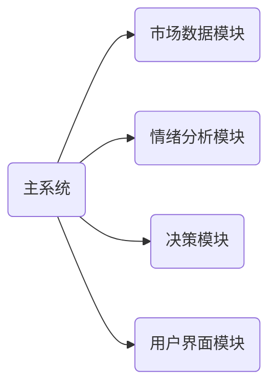
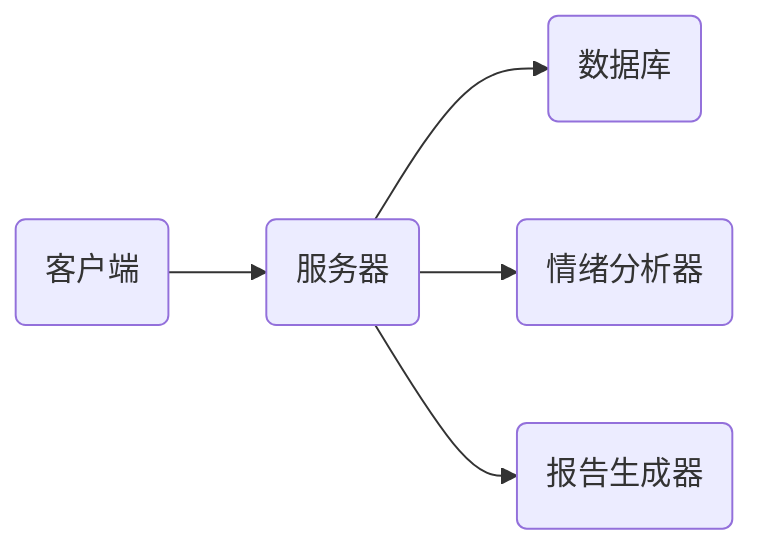

                 


# 格雷厄姆的Mr. Market比喻：洞察市场心理

> 关键词：市场心理，投资心理学，Mr. Market，价值投资，情绪分析，市场波动，投资者行为

> 摘要：本文通过分析格雷厄姆的Mr. Market比喻，深入探讨市场心理和投资者行为。文章从投资心理学的基石出发，逐步解析Mr. Market的核心概念与应用，结合情绪分析算法和系统设计，提供实践指导。

---

## 第一部分: 格雷厄姆的Mr. Market比喻与市场心理概述

### 第1章: Mr. Market比喻的背景与意义

#### 1.1 投资心理学的基石
- 1.1.1 投资者心理的复杂性
- 1.1.2 Mr. Market比喻的提出背景
- 1.1.3 市场情绪与投资决策的关系

#### 1.2 格雷厄姆的价值投资理念
- 1.2.1 价值投资的核心思想
- 1.2.2 Mr. Market比喻在价值投资中的作用
- 1.2.3 市场波动与理性决策的平衡

#### 1.3 市场心理的周期性与波动性
- 1.3.1 市场情绪的周期性特征
- 1.3.2 投资者行为的常见偏差
- 1.3.3 市场波动对投资策略的影响

### 第2章: Mr. Market比喻的核心概念与应用

#### 2.1 Mr. Market的定义与属性
- 2.1.1 Mr. Market的定义
- 2.1.2 Mr. Market的核心属性对比表
- 2.1.3 Mr. Market与现实市场的关系

#### 2.2 投资者心理与市场行为的关系
- 2.2.1 投资者心理的实体关系图


#### 2.3 Mr. Market比喻在投资决策中的应用
- 2.3.1 市场情绪分析
- 2.3.2 投资者心理预测
- 2.3.3 市场波动的预警机制

---

## 第二部分: 市场情绪分析的算法原理

### 第3章: 情绪分析的基本概念与算法原理

#### 3.1 情绪分析的核心算法
- 3.1.1 情绪分析的定义
- 3.1.2 基于文本挖掘的情绪分析流程
- 3.1.3 情绪分析的数学模型

#### 3.2 情绪分析的数学模型
- 3.2.1 情绪指数的计算公式
$$ 情绪指数 = \frac{\text{积极词汇数} - \text{消极词汇数}}{\text{总词汇数}} $$

- 3.2.2 情绪强度的度量
$$ 情绪强度 = \sum (\text{积极权重} \times \text{积极词汇数}) - \sum (\text{消极权重} \times \text{消极词汇数}) $$

#### 3.3 情绪分析的流程图


---

## 第三部分: 市场情绪监控系统的系统分析

### 第4章: 系统架构与功能设计

#### 4.1 系统功能设计
- 4.1.1 系统功能模块图


#### 4.2 系统架构设计


#### 4.3 系统接口设计
- 4.3.1 接口1：市场数据接口
- 4.3.2 接口2：情绪分析接口
- 4.3.3 接口3：结果输出接口

#### 4.4 系统交互流程图


---

## 第四部分: 项目实战与情绪分析工具开发

### 第5章: 情绪分析工具开发

#### 5.1 项目环境安装
- 5.1.1 安装Python
- 5.1.2 安装Numpy和Pandas
- 5.1.3 安装自然语言处理库（如NLTK或spaCy）

#### 5.2 情绪分析工具实现
- 5.2.1 数据预处理代码
```python
import pandas as pd
import numpy as np

# 读取数据
data = pd.read_csv('market_comments.csv')
```

- 5.2.2 情感特征提取代码
```python
from sklearn.feature_extraction.text import TfidfVectorizer

vectorizer = TfidfVectorizer(max_features=100)
X = vectorizer.fit_transform(data['comments'])
```

- 5.2.3 情感分类代码
```python
from sklearn.svm import SVC
model = SVC()
model.fit(X, data['sentiment'])
```

#### 5.3 项目实战案例分析
- 5.3.1 数据集准备
- 5.3.2 情绪分析结果展示
- 5.3.3 案例分析与解读

---

## 第五部分: 最佳实践与小结

### 第6章: 最佳实践与小结

#### 6.1 投资者的心理调节策略
- 保持理性，避免情绪化决策
- 定期复盘，反思投资行为
- 建立长期视角，忽略短期波动

#### 6.2 情绪分析工具的实际应用
- 监测市场情绪变化
- 辅助投资决策
- 提高投资效率

#### 6.3 小结与注意事项
- 小结：通过Mr. Market比喻和情绪分析工具，投资者可以更好地理解市场心理，做出更明智的投资决策。
- 注意事项：情绪分析工具是辅助工具，需结合基本面分析使用
- 拓展阅读：推荐相关书籍和资源

---

### 总结

通过本文的详细讲解，读者可以全面理解格雷厄姆的Mr. Market比喻，并将其应用于实际投资中。从理论分析到算法实现，再到系统设计和项目实战，本文为投资者提供了从理解到实践的完整指南。希望读者能够通过本文，更好地洞察市场心理，提升投资决策的科学性和有效性。

