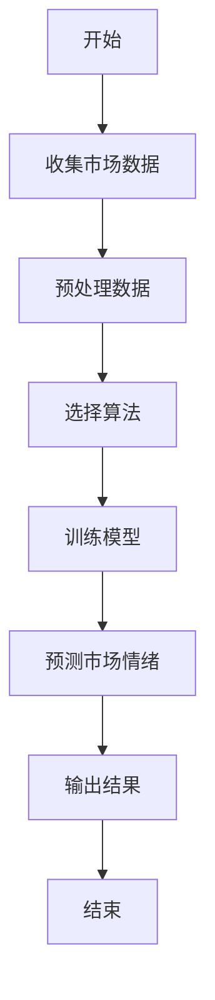
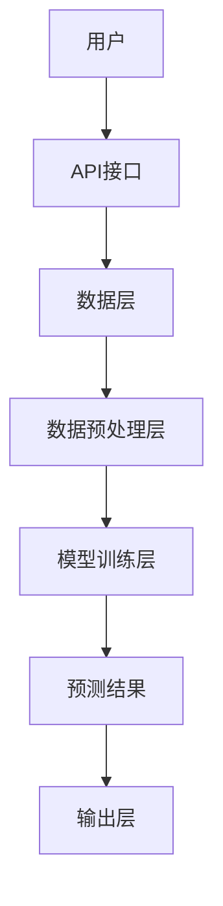
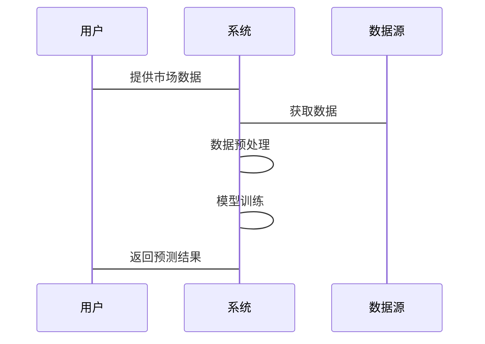

                 


# 格雷厄姆的Mr. Market比喻：理解市场心理

> 关键词：格雷厄姆，市场心理，Mr. Market，投资心理学，情绪分析，市场波动，风险管理

> 摘要：本文通过格雷厄姆的Mr. Market比喻，深入分析市场心理，探讨投资者如何通过理解市场情绪和心理偏差做出更明智的投资决策。文章从市场心理的基础知识、Mr. Market比喻的背景与意义、市场情绪的周期性分析、市场情绪分析的算法原理、市场情绪预测的系统架构设计，到基于Mr. Market的市场监控系统实战，全面阐述了市场心理与投资决策的关系，帮助投资者更好地理解市场波动的本质。

---

## 第一部分: 格雷厄姆的Mr. Market比喻基础

### # 第1章: Mr. Market比喻的背景与意义

#### ## 1.1 格雷厄姆投资理论概述

##### ### 1.1.1 格雷厄姆的生平与贡献  
本杰明·格雷厄姆（Benjamin Graham）是20世纪最伟大的投资思想家之一，被誉为“价值投资之父”。他提出了许多影响深远的投资理念，其中包括“Mr. Market”（市场先生）的比喻。格雷厄姆的学生包括沃伦·巴菲特（Warren Buffett），他的投资理念至今仍被广泛应用于全球资本市场。

##### ### 1.1.2 投资心理学的重要性  
投资不仅仅是对市场的分析，更是对人性的理解。投资者的心理偏差、情绪波动以及行为模式往往会对投资决策产生重大影响。格雷厄姆通过Mr. Market的比喻，揭示了市场情绪的波动性和非理性，强调了投资者在面对市场波动时应保持冷静和理性。

##### ### 1.1.3 Mr. Market比喻的提出背景  
在20世纪30年代，格雷厄姆通过“Mr. Market”这个虚拟人物，生动地描述了市场的波动性和非理性。他指出，市场就像一个情绪多变的人，时而乐观，时而悲观，投资者需要学会与市场情绪共处，而不是被市场情绪左右。

#### ## 1.2 市场心理的基础知识

##### ### 1.2.1 市场情绪的定义与分类  
市场情绪是指投资者在市场中的整体情绪状态，通常分为乐观、悲观、贪婪和恐惧等类型。市场情绪可以通过投资者的行为、交易量、市场波动性等多种指标来衡量。

##### ### 1.2.2 投资者心理偏差的常见类型  
投资者心理偏差包括确认偏差、过度自信、损失厌恶、从众心理等。这些偏差会影响投资者的决策，导致非理性的投资行为。

##### ### 1.2.3 市场心理与价格波动的关系  
市场情绪和价格波动之间存在密切关系。当市场情绪高涨时，资产价格可能被高估；当市场情绪低落时，资产价格可能被低估。

#### ## 1.3 Mr. Market比喻的核心概念

##### ### 1.3.1 Mr. Market的定义与特征  
Mr. Market是格雷厄姆用来描述市场的波动性和非理性的虚拟人物。他代表了市场的短期情绪和行为，投资者需要理解并利用Mr. Market的特点来做出更明智的投资决策。

##### ### 1.3.2 市场情绪的周期性  
市场情绪具有周期性，通常表现为市场的波动和周期性变化。投资者需要理解市场情绪的周期性，避免在市场高点过度乐观或在市场低点过度悲观。

##### ### 1.3.3 投资者与市场的关系  
投资者与市场的关系是互动的。投资者的行为会影响市场情绪，而市场情绪又会反过来影响投资者的决策。格雷厄姆通过Mr. Market的比喻，强调了投资者应保持独立思考，避免被市场情绪左右。

---

### # 第2章: 市场心理的核心概念与联系

#### ## 2.1 市场情绪的周期性分析

##### ### 2.1.1 市场情绪的波动周期  
市场情绪通常呈现出周期性波动，包括繁荣、衰退、萧条和复苏四个阶段。投资者需要识别这些周期性变化，从而做出更明智的投资决策。

##### ### 2.1.2 不同市场阶段的情绪特征  
在不同的市场阶段，市场情绪表现出不同的特征。例如，在牛市中，市场情绪通常高涨；在熊市中，市场情绪通常低落。

##### ### 2.1.3 市场情绪与资产价格的关系  
市场情绪与资产价格密切相关。当市场情绪高涨时，资产价格可能被高估；当市场情绪低落时，资产价格可能被低估。

#### ## 2.2 投资者心理偏差的对比分析

##### ### 2.2.1 常见心理偏差的定义与特征  
投资者心理偏差包括确认偏差、过度自信、损失厌恶等。这些偏差会影响投资者的决策，导致非理性的投资行为。

##### ### 2.2.2 不同心理偏差的对比表格  
下表对比了常见心理偏差的定义、特征和影响：

| 心理偏差 | 定义 | 特征 | 影响 |
|---------|------|------|------|
| 确认偏差 | 过度关注支持自己观点的信息 | 选择性信息处理 | 可能导致误判市场趋势 |
| 过度自信 | 过度相信自己的判断能力 | 高估自己预测的准确性 | 可能导致过度投资 |
| 损失厌恶 | 更关注损失而非收益 | 避免损失的心理 | 可能导致错失投资机会 |

##### ### 2.2.3 市场情绪与行为模式的ER实体关系图  
以下是市场情绪与行为模式的ER实体关系图：

```mermaid
erd
    title 市场情绪与行为模式的ER实体关系图

    Market_Mood (市场情绪)
        id: int
        mood_level: int
        timestamp: datetime

    Investor_Behavior (投资者行为)
        id: int
        action: string
        timestamp: datetime

    Investor_Characteristics (投资者特征)
        id: int
        risk_tolerance: int
        investment_experience: int

    Market_Mood --|{N:1}--> Investor_Behavior: "市场情绪影响投资者行为"
    Investor_Behavior --|{N:1}--> Investor_Characteristics: "投资者行为受特征影响"
```

---

#### ## 2.3 市场情绪与行为模式的ER实体关系图  
以下是市场情绪与行为模式的ER实体关系图：

```mermaid
erd
    title 市场情绪与行为模式的ER实体关系图

    Market_Mood (市场情绪)
        id: int
        mood_level: int
        timestamp: datetime

    Investor_Behavior (投资者行为)
        id: int
        action: string
        timestamp: datetime

    Investor_Characteristics (投资者特征)
        id: int
        risk_tolerance: int
        investment_experience: int

    Market_Mood --|{N:1}--> Investor_Behavior: "市场情绪影响投资者行为"
    Investor_Behavior --|{N:1}--> Investor_Characteristics: "投资者行为受特征影响"
```

---

## 第二部分: 市场情绪分析的算法原理

### # 第3章: 市场情绪分析的算法概述

#### ## 3.1 市场情绪分析的定义与目标  
市场情绪分析是指通过分析市场参与者的言论、交易行为和市场数据，来判断市场情绪状态的过程。其目标是帮助投资者更好地理解市场波动，做出更明智的投资决策。

#### ## 3.2 市场情绪分析的算法流程图  
以下是市场情绪分析的算法流程图：



#### ## 3.3 市场情绪分析的数学模型  
以下是一个简单的市场情绪分析数学模型：

$$
\text{市场情绪} = \alpha \times \text{交易量} + \beta \times \text{价格波动} + \gamma \times \text{投资者情绪}
$$

其中，$\alpha$、$\beta$、$\gamma$是模型的系数，需要通过训练数据来确定。

#### ## 3.4 市场情绪分析的Python代码实现  
以下是市场情绪分析的Python代码实现：

```python
import pandas as pd
import numpy as np
from sklearn.linear_model import LinearRegression

# 数据加载
data = pd.read_csv('market_data.csv')

# 数据预处理
X = data[['交易量', '价格波动']]
y = data['市场情绪']

# 模型训练
model = LinearRegression()
model.fit(X, y)

# 模型预测
new_data = pd.DataFrame({'交易量': [1000], '价格波动': [20]})
predicted_mood = model.predict(new_data)

print('预测市场情绪:', predicted_mood)
```

---

### # 第4章: 市场情绪预测的系统架构设计

#### ## 4.1 系统分析与设计

##### ### 4.1.1 问题场景介绍  
市场情绪预测系统的目标是通过分析市场数据和投资者行为，预测未来的市场情绪状态。该系统可以帮助投资者做出更明智的投资决策。

##### ### 4.1.2 系统功能设计  
以下是系统功能设计的领域模型类图：

```mermaid
classDiagram
    class MarketDataCollector {
        collect_data()
    }

    class DataPreprocessor {
        preprocess_data()
    }

    class ModelTrainer {
        train_model()
    }

    class Predictor {
        predict_mood()
    }

    MarketDataCollector --> DataPreprocessor: 传递数据
    DataPreprocessor --> ModelTrainer: 传递数据
    ModelTrainer --> Predictor: 传递模型
    Predictor --> : 预测结果
```

##### ### 4.1.3 系统架构设计  
以下是系统架构设计的架构图：



#### ## 4.2 系统接口设计

##### ### 4.2.1 系统接口描述  
市场情绪预测系统的接口包括数据输入接口、模型训练接口和结果输出接口。

##### ### 4.2.2 系统交互流程图  
以下是系统交互流程图：



---

## 第三部分: 基于Mr. Market的市场监控系统实战

### # 第5章: 基于Mr. Market的市场监控系统实战

#### ## 5.1 项目环境安装与

##### ### 5.1.1 安装Python环境  
建议使用Anaconda作为Python环境管理工具。

##### ### 5.1.2 安装必要的Python库  
需要安装的Python库包括Pandas、NumPy、Scikit-learn等。

#### ## 5.2 系统核心实现源代码

##### ### 5.2.1 数据加载与预处理  
以下是数据加载与预处理的代码：

```python
import pandas as pd
import numpy as np

# 数据加载
data = pd.read_csv('market_data.csv')

# 数据预处理
data = data.dropna()
data = data.astype(float)
```

##### ### 5.2.2 模型训练与预测  
以下是模型训练与预测的代码：

```python
from sklearn.linear_model import LinearRegression

# 模型训练
model = LinearRegression()
model.fit(X_train, y_train)

# 模型预测
y_pred = model.predict(X_test)
```

##### ### 5.2.3 结果解读与分析  
预测结果可以通过可视化工具（如Matplotlib）进行解读和分析。

#### ## 5.3 实际案例分析与详细讲解

##### ### 5.3.1 案例分析  
以2008年金融危机为例，分析市场情绪的变化及其对资产价格的影响。

##### ### 5.3.2 结果分析  
通过分析市场情绪的变化，可以帮助投资者更好地理解市场的波动性，并做出更明智的投资决策。

#### ## 5.4 项目小结

##### ### 5.4.1 项目成果  
通过本项目，我们成功地实现了基于Mr. Market的市场监控系统，能够有效地预测市场情绪。

##### ### 5.4.2 项目总结  
市场情绪分析是投资决策的重要组成部分。通过理解市场心理和情绪波动，投资者可以更好地应对市场波动，提高投资收益。

---

## 第四部分: 最佳实践与小结

### # 第6章: 最佳实践与小结

#### ## 6.1 投资者心理偏差的管理

##### ### 6.1.1 心理偏差的识别与管理  
投资者需要识别自己的心理偏差，并采取措施加以管理。

##### ### 6.1.2 理性决策的培养  
投资者应尽量避免情绪化决策，保持理性思考。

#### ## 6.2 市场情绪分析的拓展

##### ### 6.2.1 多因素市场情绪分析  
未来的研究可以考虑引入更多的因素，如宏观经济指标、政策变化等，以提高市场情绪分析的准确性。

##### ### 6.2.2 人工智能与市场情绪分析  
人工智能技术的发展为市场情绪分析提供了新的可能性。投资者可以利用机器学习算法，进一步提高市场情绪预测的精度。

#### ## 6.3 风险管理与投资策略

##### ### 6.3.1 风险管理的重要性  
投资者应重视风险管理，制定合理的投资策略。

##### ### 6.3.2 投资组合的优化  
通过优化投资组合，投资者可以降低市场波动对投资收益的影响。

---

## 第五部分: 附录

### # 附录A: 术语表

#### ## 术语表
- Mr. Market：格雷厄姆提出的虚拟人物，代表市场的波动性和非理性。
- 市场情绪：投资者在市场中的整体情绪状态。
- 心理偏差：投资者在决策过程中产生的认知偏差。

### # 附录B: 数据来源与工具推荐

#### ## 数据来源  
- 数据集：公开市场数据，如股票价格、交易量等。
- 数据预处理工具：Pandas、NumPy。
- 数据分析工具：Matplotlib、Seaborn。

#### ## 工具推荐  
- Python编程语言
- 机器学习库：Scikit-learn
- 数据可视化工具：Tableau、Power BI

---

## 第六部分: 结语

### # 结语  
通过格雷厄姆的Mr. Market比喻，我们深入理解了市场心理与投资决策的关系。市场情绪的波动性和非理性是投资过程中不可忽视的重要因素。投资者需要通过理解和管理心理偏差，制定合理的投资策略，以应对市场波动带来的挑战。未来，随着人工智能技术的发展，市场情绪分析将更加精准，为投资者提供更有力的支持。

