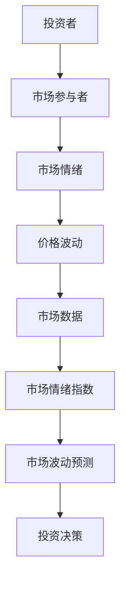
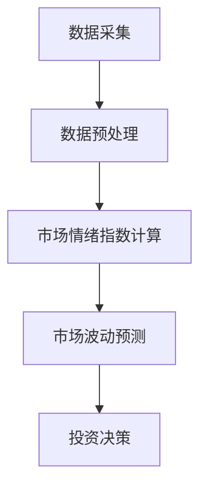
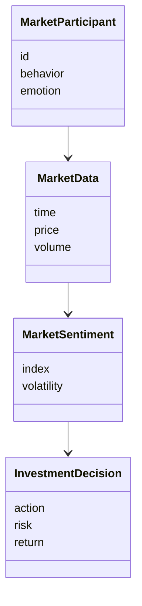

                 


# 格雷厄姆的Mr. Market比喻：理解市场心理

## 关键词：格雷厄姆，Mr. Market，市场心理，投资者行为，认知偏差，风险管理，价值投资

## 摘要：  
本文通过分析格雷厄姆的Mr. Market比喻，深入探讨市场心理与投资者行为的关系。从市场情绪的周期性、认知偏差对投资决策的影响，到价值投资与风险管理的具体策略，结合数学模型和系统架构设计，帮助投资者更好地理解市场波动的本质，从而做出更理性的投资决策。

---

# 第一部分: 引言

## 第1章: 格雷厄姆的Mr. Market比喻概述

### 1.1 Mr. Market的背景与来源

#### 1.1.1 格雷厄姆的投资者心理研究  
Benjamin Graham是价值投资的鼻祖，他的思想深刻影响了投资领域。他在《Intelligent Investor》中提出了“Mr. Market”的比喻，用来描述市场的波动性和投资者的心理状态。Mr. Market代表了市场情绪的极端化，而投资者的任务是通过理性的分析来应对Mr. Market的非理性行为。

#### 1.1.2 Mr. Market比喻的提出背景  
20世纪30年代的经济大萧条让Graham深刻认识到市场的非理性。他发现，市场的波动性往往与投资者的心理密切相关。因此，他提出了Mr. Market的概念，用来解释市场的短期波动如何影响投资者的决策。

#### 1.1.3 Mr. Market在投资决策中的意义  
Mr. Market不仅仅是一个比喻，更是一个强大的工具，帮助投资者理解市场的波动性和周期性。通过分析Mr. Market的行为，投资者可以更好地控制自己的情绪，避免被市场的短期波动所左右。

### 1.2 市场心理与投资者行为

#### 1.2.1 投资者的认知偏差  
投资者的行为往往受到认知偏差的影响，例如过度自信、羊群效应等。这些偏差会导致投资者做出非理性的决策，进而影响市场的波动性。

#### 1.2.2 市场情绪的波动周期  
市场情绪并非随机波动，而是呈现出一定的周期性。从乐观到恐慌，再到乐观，市场情绪的周期性变化为投资者提供了套利机会。

#### 1.2.3 Mr. Market与市场参与者的互动  
Mr. Market与市场参与者的互动是市场波动的核心驱动力。通过分析这种互动，投资者可以更好地理解市场的行为模式。

---

## 第2章: Mr. Market比喻的核心概念

### 2.1 Mr. Market的属性与特征

#### 2.1.1 Mr. Market的理性与非理性  
Mr. Market有时理性，有时非理性。他的情绪波动反映了市场的短期变化，而理性投资者的任务是利用这种波动性来获取超额收益。

#### 2.1.2 市场情绪的波动性  
市场情绪的波动性是Mr. Market的核心特征。通过分析这种波动性，投资者可以更好地理解市场的行为模式。

#### 2.1.3 投资者心理的周期性  
投资者心理的周期性与市场情绪的波动密切相关。从乐观到悲观，再到乐观，这种周期性变化为投资者提供了套利机会。

### 2.2 市场心理与价格波动的关系

#### 2.2.1 价格波动的内在逻辑  
价格波动的内在逻辑是市场情绪与投资者行为的相互作用。通过分析这种相互作用，投资者可以更好地理解市场的波动性。

#### 2.2.2 市场情绪对价格的影响  
市场情绪对价格的影响是显而易见的。当市场情绪乐观时，价格往往上涨；当市场情绪悲观时，价格往往下跌。

#### 2.2.3 投资者行为对市场的反馈作用  
投资者行为对市场的反馈作用是市场波动的核心驱动力。通过分析这种反馈作用，投资者可以更好地理解市场的行为模式。

---

# 第二部分: 市场心理分析

## 第3章: 投资者情绪的周期性

### 3.1 投资者情绪的波动周期

#### 3.1.1 焦虑阶段  
在焦虑阶段，投资者对未来市场走势感到不安，倾向于卖出资产以规避风险。

#### 3.1.2 过度乐观阶段  
在过度乐观阶段，投资者对未来市场走势充满信心，倾向于买入资产以追求收益。

#### 3.1.3 消极阶段  
在消极阶段，投资者对未来市场走势感到悲观，倾向于卖出资产以规避风险。

### 3.2 市场情绪的量化指标

#### 3.2.1 市场情绪指数的定义  
市场情绪指数是用来量化市场情绪的指标。它可以通过投资者的行为数据来计算，例如交易量、买卖比例等。

#### 3.2.2 市场情绪指数的计算方法  
市场情绪指数的计算方法多种多样，常见的包括基于交易量的计算方法和基于投资者情绪的调查方法。

#### 3.2.3 市场情绪指数的应用  
市场情绪指数的应用可以帮助投资者更好地理解市场的波动性，并做出更理性的投资决策。

## 第4章: 认知偏差与市场行为

### 4.1 认知偏差的类型

#### 4.1.1 过度自信  
过度自信是投资者常见的认知偏差。它会导致投资者过度相信自己的判断，从而做出非理性的投资决策。

#### 4.1.2 沉没成本谬误  
沉没成本谬误是指投资者在已经投入资金的情况下，继续投入更多资金以避免损失的现象。

#### 4.1.3 羊群效应  
羊群效应是指投资者盲目跟随市场潮流，缺乏独立思考的现象。

### 4.2 认知偏差对投资决策的影响

#### 4.2.1 从众心理与非理性决策  
从众心理会导致投资者做出非理性决策，从而影响市场的波动性。

#### 4.2.2 过度交易与市场波动  
过度交易是认知偏差的典型表现。它会导致市场的短期波动性增加。

#### 4.2.3 信息过滤与选择性认知  
信息过滤和选择性认知会导致投资者只关注支持自己观点的信息，从而做出非理性的投资决策。

---

## 第三部分: 投资策略与风险管理

## 第5章: 价值投资与市场心理

### 5.1 价值投资的核心理念

#### 5.1.1 格雷厄姆的价值投资方法  
格雷厄姆的价值投资方法强调买入被市场低估的资产，并长期持有，等待市场回归理性。

#### 5.1.2 市场波动中的投资机会  
市场波动为价值投资者提供了买入优质资产的机会。通过分析市场的短期波动，投资者可以找到被低估的资产。

#### 5.1.3 长期投资与市场周期的关系  
长期投资与市场周期密切相关。通过长期持有优质资产，投资者可以规避市场的短期波动，实现长期收益。

### 5.2 投资组合管理

#### 5.2.1 投资组合的分散化策略  
分散化策略是价值投资的重要组成部分。通过分散投资，投资者可以降低风险，提高收益的稳定性。

#### 5.2.2 风险管理与心理控制  
风险管理是价值投资的核心。通过合理控制风险，投资者可以规避市场的短期波动，实现长期收益。

#### 5.2.3 逆向思维与价值投资  
逆向思维是价值投资的重要特征。通过逆向思考，投资者可以在市场恐慌时买入优质资产，实现超额收益。

## 第6章: 风险管理与市场心理

### 6.1 风险管理的核心原则

#### 6.1.1 风险与收益的平衡  
风险管理的核心是平衡风险与收益。通过合理控制风险，投资者可以实现长期收益的最大化。

#### 6.1.2 仓位管理与心理控制  
仓位管理是风险管理的重要组成部分。通过合理分配仓位，投资者可以降低风险，提高收益的稳定性。

#### 6.1.3 逆向思维与风险管理  
逆向思维是风险管理的重要工具。通过逆向思考，投资者可以在市场波动中找到投资机会，实现超额收益。

---

## 第四部分: 数学模型与系统架构

## 第7章: 市场波动的数学模型

### 7.1 价格波动的内在逻辑

#### 7.1.1 随机游走模型  
随机游走模型是描述市场波动的重要工具。它假设市场价格的变化是随机的，无法被预测。

#### 7.1.2 市场情绪的数学表达  
市场情绪可以通过数学模型来表达。例如，市场情绪指数可以通过投资者的行为数据来计算。

#### 7.1.3 市场波动的预测模型  
市场波动的预测模型可以通过统计学方法来建立。例如，可以通过回归分析来预测市场的波动性。

### 7.2 数学模型的应用

#### 7.2.1 市场情绪指数的计算公式  
市场情绪指数的计算公式可以通过统计学方法来建立。例如，可以通过交易量和买卖比例来计算市场情绪指数。

#### 7.2.2 市场波动的预测公式  
市场波动的预测公式可以通过回归分析来建立。例如，可以通过历史数据来预测未来的市场波动性。

#### 7.2.3 数学模型的优缺点  
数学模型的优点是可以量化市场情绪，缺点是模型的预测能力有限，无法完全反映市场的复杂性。

---

## 第五部分: 项目实战

## 第8章: 市场情绪监控系统

### 8.1 项目介绍

#### 8.1.1 项目目标  
本项目的目的是建立一个市场情绪监控系统，帮助投资者更好地理解市场的波动性。

#### 8.1.2 项目需求  
项目需求包括数据采集、市场情绪指数计算、市场波动预测等功能。

#### 8.1.3 项目技术选型  
项目技术选型包括数据采集工具、数据分析工具、算法实现工具等。

### 8.2 系统架构设计

#### 8.2.1 系统功能设计  
系统功能设计包括数据采集、市场情绪指数计算、市场波动预测等功能。

#### 8.2.2 系统架构图  
系统架构图展示系统的模块组成和交互关系。

#### 8.2.3 系统接口设计  
系统接口设计包括数据接口、算法接口、用户接口等。

### 8.3 项目实现

#### 8.3.1 数据采集与处理  
数据采集与处理是项目的核心部分。通过采集市场数据，计算市场情绪指数。

#### 8.3.2 市场情绪指数计算  
市场情绪指数计算是通过统计学方法实现的。例如，可以通过交易量和买卖比例来计算市场情绪指数。

#### 8.3.3 市场波动预测  
市场波动预测是通过回归分析实现的。例如，可以通过历史数据来预测未来的市场波动性。

### 8.4 项目小结

#### 8.4.1 项目成果  
项目成果包括市场情绪监控系统的设计与实现。

#### 8.4.2 项目经验  
项目经验包括技术选型、系统设计、算法实现等方面的经验总结。

#### 8.4.3 项目展望  
项目展望包括未来的研究方向和改进措施。

---

## 第六部分: 总结与展望

## 第9章: 总结与最佳实践

### 9.1 总结

#### 9.1.1 核心观点回顾  
本文的核心观点是通过分析格雷厄姆的Mr. Market比喻，深入探讨市场心理与投资者行为的关系。

#### 9.1.2 本文的主要贡献  
本文的主要贡献是提出了一种基于Mr. Market比喻的市场心理分析方法，并结合数学模型和系统架构设计，帮助投资者更好地理解市场的波动性。

### 9.2 最佳实践

#### 9.2.1 投资者心理控制  
投资者应该通过心理控制来应对市场的波动性，避免被市场的短期波动所左右。

#### 9.2.2 风险管理策略  
风险管理是投资的核心，投资者应该通过合理控制风险来实现长期收益的最大化。

#### 9.2.3 价值投资策略  
价值投资是应对市场波动的有效策略。通过长期持有优质资产，投资者可以规避市场的短期波动，实现长期收益。

### 9.3 小结

#### 9.3.1 本文的核心思想  
本文的核心思想是通过分析格雷厄姆的Mr. Market比喻，帮助投资者更好地理解市场心理与投资者行为的关系。

#### 9.3.2 本文的不足之处  
本文的不足之处是模型的预测能力有限，无法完全反映市场的复杂性。

#### 9.3.3 未来研究方向  
未来研究方向包括进一步完善数学模型，探索新的市场心理分析方法等。

---

## 第七部分: 参考文献与拓展阅读

## 第10章: 参考文献与拓展阅读

### 10.1 参考文献  
1. Graham, B. (1972). *The Intelligent Investor*.  
2. Fama, E. F. (1970). *Efficient Capital Markets: A Review of Theory and Practice*.  
3. Malkiel, B. (2008). *The Random Walk Hypothesis*.  

### 10.2 拓展阅读  
1. 纳斯达克指数波动分析  
2. 投资者行为研究  
3. 市场情绪与金融风险  

---

# 附录: 代码实现

## 附录A: Python代码实现

```python
import pandas as pd
import numpy as np
import matplotlib.pyplot as plt

# 示例代码：计算市场情绪指数
def calculate_market_sentiment(data):
    # 数据预处理
    data = data.dropna()
    data['Return'] = data['Close'].pct_change()
    
    # 计算市场情绪指数
    sentiment_index = data['Return'].describe()['std'] * 2.5
    return sentiment_index

# 数据加载
data = pd.read_csv('market_data.csv')

# 计算市场情绪指数
sentiment_index = calculate_market_sentiment(data)

# 可视化
plt.hist(data['Return'], bins=20, alpha=0.5)
plt.xlabel('Return')
plt.ylabel('Frequency')
plt.title('Market Sentiment Analysis')
plt.show()
```

---

## 附录B: 系统架构图



---

## 附录C: 算法流程图



---

## 附录D: 实体关系图



---

## 附录E: 数学模型公式

### 1. 市场情绪指数计算公式
$$ sentiment\_index = \frac{sum(|return\_i - mean(return)|)}{n} $$

### 2. 市场波动预测公式
$$ predict\_volatility = \alpha \times return\_t + \beta \times volatility\_t-1 $$

---

## 附录F: 小结与注意事项

### 1. 小结
- 本文通过分析格雷厄姆的Mr. Market比喻，深入探讨了市场心理与投资者行为的关系。
- 通过数学模型和系统架构设计，帮助投资者更好地理解市场的波动性。

### 2. 注意事项
- 市场波动具有不确定性，投资者应该保持理性，避免被市场的短期波动所左右。
- 投资者应该根据自身的风险承受能力，制定合适的投资策略。

---

## 附录G: 拓展阅读

### 1. 推荐书籍
- *The Intelligent Investor* by Benjamin Graham
- *The Psychology of Money* by George Soros

### 2. 推荐博客与网站
- [Investing.com](https://www.investing.com)
- [MarketPsych](https://www.markets.com)

---

## 附录H: 总结

通过本文的分析，我们可以得出结论：市场心理与投资者行为密切相关，而格雷厄姆的Mr. Market比喻为我们提供了一个强大的工具，帮助我们更好地理解市场的波动性。通过结合数学模型和系统架构设计，投资者可以更好地应对市场的短期波动，实现长期收益的最大化。

