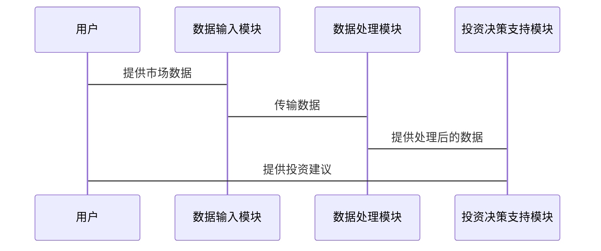

                 


# 格雷厄姆的Mr. Market理论

> 关键词：价值投资，市场心理，投资者行为，投资决策，数学模型，系统架构，项目实战

> 摘要：本文深入分析了本杰明·格雷厄姆提出的Mr. Market理论，探讨其在投资决策中的应用。通过系统分析和数学建模，结合实际案例，详细讲解了Mr. Market理论的核心概念、模型构建、系统设计及项目实现。本文旨在帮助投资者更好地理解和应用这一经典理论。

---

# 第一部分: 格雷厄姆的Mr. Market理论基础

## 第1章: Mr. Market理论的背景与起源

### 1.1 本杰明·格雷厄姆及其投资理念

#### 1.1.1 本杰明·格雷厄姆的生平简介
本杰明·格雷厄姆（Benjamin Graham）是20世纪最伟大的投资思想家之一，被誉为“价值投资之父”。他于1894年出生在美国纽约，1920年代开始涉足投资领域，并在1949年出版了经典著作《聪明的投资者》（*The Intelligent Investor*），书中提出了许多影响深远的投资理念，其中包括Mr. Market理论。

#### 1.1.2 格雷厄姆的价值投资理论概述
格雷厄姆的价值投资理论强调以低于内在价值的价格购买优质股票，并长期持有，以获取市场的合理回报。他认为市场的短期波动是由投资者情绪驱动的，而长期价值则取决于企业的基本面。

#### 1.1.3 Mr. Market理论的提出背景
Mr. Market理论是格雷厄姆在《聪明的投资者》中提出的一个隐喻，用来描述市场的波动性和投资者心理。他指出，市场并不总是理性的，而是像一个情绪化的投资者（Mr. Market）一样，时而乐观，时而悲观。

### 1.2 Mr. Market理论的核心概念

#### 1.2.1 Mr. Market的定义与特征
Mr. Market代表市场本身，是一个情绪化的投资者。他的特点包括：
- **情绪波动性**：市场情绪会随着市场环境的变化而波动。
- **非理性决策**：市场价格经常偏离企业的实际价值。
- **短期导向**：市场参与者更关注短期收益而非长期价值。

#### 1.2.2 市场波动与投资者心理的关系
市场波动是由投资者心理驱动的，尤其是贪婪和恐惧。当市场上涨时，投资者变得贪婪，大量买入；当市场下跌时，投资者变得恐慌，大量卖出。

#### 1.2.3 Mr. Market理论的现实意义
通过理解市场波动和投资者心理，投资者可以避免被市场情绪左右，做出更理性的投资决策。

### 1.3 Mr. Market与市场参与者的互动

#### 1.3.1 投资者行为的非理性分析
投资者的非理性行为包括过度自信、从众心理和损失厌恶等，这些行为会影响市场定价。

#### 1.3.2 市场情绪的周期性波动
市场情绪呈现周期性波动，从乐观到悲观，再从悲观到乐观，形成一个循环。

#### 1.3.3 Mr. Market与市场参与者的博弈关系
Mr. Market与市场参与者之间的关系是动态的，市场参与者的行为会影响Mr. Market的情绪，而Mr. Market的情绪又会影响市场参与者的决策。

### 1.4 本章小结
本章介绍了本杰明·格雷厄姆及其价值投资理论，重点讲解了Mr. Market理论的核心概念和市场波动与投资者心理的关系，为后续分析奠定了基础。

---

## 第2章: Mr. Market理论的核心模型与数学基础

### 2.1 Mr. Market理论的核心模型

#### 2.1.1 市场心理模型
市场心理模型描述了投资者情绪的变化如何影响市场价格。模型包括以下几个关键要素：
- **市场情绪指数**：反映市场参与者的情绪状态。
- **价格波动**：市场情绪的变化会导致价格波动。

#### 2.1.2 市场定价模型
市场定价模型基于企业的内在价值和市场情绪，预测市场价格。公式如下：
$$ P = V + \epsilon $$
其中，$P$ 是市场价格，$V$ 是内在价值，$\epsilon$ 是情绪偏差。

#### 2.1.3 市场波动模型
市场波动模型描述了价格波动的幅度和频率。公式如下：
$$ \sigma = \sqrt{\sum_{i=1}^{n} (P_i - \bar{P})^2} $$
其中，$\sigma$ 是波动幅度，$P_i$ 是每个时间点的价格，$\bar{P}$ 是平均价格。

### 2.2 Mr. Market理论的数学模型

#### 2.2.1 心理预期的数学表达
心理预期模型反映了投资者对未来的预期。公式如下：
$$ E_t = \alpha \cdot E_{t-1} + \beta \cdot P_t $$
其中，$E_t$ 是当前的心理预期，$E_{t-1}$ 是上一期的心理预期，$P_t$ 是当前价格，$\alpha$ 和 $\beta$ 是权重系数。

#### 2.2.2 市场行为的数学公式
市场行为模型描述了投资者基于心理预期做出的决策。公式如下：
$$ D_t = \gamma \cdot (E_t - P_t) $$
其中，$D_t$ 是投资者的决策，$\gamma$ 是决策系数。

#### 2.2.3 波动性与风险的数学关系
波动性与风险之间的关系可以用以下公式表示：
$$ R = \sigma \cdot \mu $$
其中，$R$ 是风险回报，$\sigma$ 是波动幅度，$\mu$ 是平均回报。

### 2.3 Mr. Market理论的图解分析

#### 2.3.1 市场心理变化的Mermaid流程图


#### 2.3.2 市场波动与投资者决策的实体关系图
```mermaid
er
    Actor 投资者
    Actor 市场参与者
    Entity 市场情绪
    Entity 市场价格
    Entity 内在价值
    Entity 波动幅度
    Relationship 投资者影响市场情绪
    Relationship 市场情绪影响市场价格
    Relationship 市场价格反映内在价值
```

### 2.4 本章小结
本章通过数学模型和图解分析，详细讲解了Mr. Market理论的核心模型，包括市场心理模型、定价模型和波动模型，为后续的系统设计奠定了基础。

---

## 第3章: Mr. Market理论的系统分析与架构设计

### 3.1 系统分析

#### 3.1.1 问题场景介绍
我们希望通过系统分析，构建一个基于Mr. Market理论的投资决策支持系统，帮助投资者做出更理性的决策。

#### 3.1.2 系统功能需求
系统功能包括：
1. 市场情绪监测
2. 市场波动预测
3. 投资决策支持
4. 风险评估与管理

#### 3.1.3 系统边界与接口设计
系统边界包括数据输入、数据处理和数据输出三个部分。系统接口设计包括：
- 数据接口：从外部获取市场数据
- 用户接口：与用户交互
- 输出接口：提供市场分析结果

### 3.2 系统架构设计

#### 3.2.1 系统架构的Mermaid架构图


#### 3.2.2 系统模块划分与功能分配
- 数据输入模块：负责获取市场数据
- 数据处理模块：对数据进行清洗和转换
- 市场情绪监测模块：监测市场情绪
- 市场波动预测模块：预测市场波动
- 投资决策支持模块：提供投资建议
- 风险评估与管理模块：评估和管理风险

#### 3.2.3 系统交互设计的Mermaid序列图


### 3.3 系统实现

#### 3.3.1 系统核心算法实现
以下是市场波动预测算法的实现：
```python
import numpy as np

def market_fluctuation(price_data):
    mean_price = np.mean(price_data)
    deviation = [p - mean_price for p in price_data]
    variance = np.mean([d**2 for d in deviation])
    std_deviation = np.sqrt(variance)
    return std_deviation
```

#### 3.3.2 系统接口设计与实现
以下是系统接口设计的示例：
```python
class MarketSystem:
    def __init__(self, data_source):
        self.data_source = data_source
    
    def get_market_data(self):
        # 获取市场数据
        return self.data_source.get_data()
    
    def analyze_market(self):
        # 分析市场
        data = self.get_market_data()
        # 执行分析
        return analysis_result
```

#### 3.3.3 系统功能测试与验证
测试用例包括：
1. 测试市场情绪监测模块的准确性
2. 测试市场波动预测模块的预测精度
3. 测试投资决策支持模块的建议合理性

### 3.4 本章小结
本章通过系统分析和架构设计，详细讲解了基于Mr. Market理论的投资决策支持系统的实现，为后续的项目实战奠定了基础。

---

## 第4章: Mr. Market理论的项目实战

### 4.1 项目环境安装与配置

#### 4.1.1 开发环境搭建
推荐使用Python和Jupyter Notebook进行开发。

#### 4.1.2 依赖库安装
安装以下依赖库：
- numpy
- pandas
- matplotlib
- seaborn

#### 4.1.3 项目初始化与配置
创建项目目录并初始化配置文件。

### 4.2 项目核心代码实现

#### 4.2.1 心理预期模型的代码实现
以下是心理预期模型的实现：
```python
import numpy as np

def psychological_expectation(price_data, alpha=0.7):
    expectation = [price_data[0]]
    for i in range(1, len(price_data)):
        current_price = price_data[i]
        prev_expectation = expectation[-1]
        new_expectation = alpha * prev_expectation + (1 - alpha) * current_price
        expectation.append(new_expectation)
    return expectation
```

#### 4.2.2 市场波动模型的代码实现
以下是市场波动模型的实现：
```python
import numpy as np

def market_fluctuation(price_data):
    mean_price = np.mean(price_data)
    deviation = [p - mean_price for p in price_data]
    variance = np.mean([d**2 for d in deviation])
    std_deviation = np.sqrt(variance)
    return std_deviation
```

#### 4.2.3 投资决策系统的代码实现
以下是投资决策系统的实现：
```python
import numpy as np

class InvestmentSystem:
    def __init__(self, price_data):
        self.price_data = price_data
    
    def calculate_fluctuation(self):
        return market_fluctuation(self.price_data)
    
    def calculate_expectation(self):
        return psychological_expectation(self.price_data)
    
    def make_decision(self, fluctuation, expectation):
        if fluctuation > 0.2 and expectation[-1] > self.price_data[-1]:
            return "买入"
        elif fluctuation < -0.2 and expectation[-1] < self.price_data[-1]:
            return "卖出"
        else:
            return "观望"
```

### 4.3 代码应用与解读

#### 4.3.1 代码应用
以下是代码的应用示例：
```python
price_data = [100, 105, 98, 110, 108, 112, 105]
system = InvestmentSystem(price_data)
fluctuation = system.calculate_fluctuation()
expectation = system.calculate_expectation()
decision = system.make_decision(fluctuation, expectation)
print("波动幅度:", fluctuation)
print("心理预期:", expectation)
print("投资决策:", decision)
```

#### 4.3.2 代码解读
- 波动幅度：计算价格数据的波动幅度。
- 心理预期：基于心理预期模型计算预期价格。
- 投资决策：根据波动幅度和心理预期做出投资决策。

### 4.4 实际案例分析

#### 4.4.1 案例背景
假设我们有一个股票的价格数据，希望通过Mr. Market理论进行投资决策。

#### 4.4.2 数据分析
使用上述代码对价格数据进行分析，得出波动幅度和心理预期。

#### 4.4.3 投资决策
根据分析结果，做出买入、卖出或观望的决策。

### 4.5 项目小结
本章通过项目实战，详细讲解了基于Mr. Market理论的投资决策系统的实现，帮助读者更好地理解和应用这一理论。

---

## 第5章: 最佳实践与总结

### 5.1 最佳实践

#### 5.1.1 风险管理
投资者应合理配置资产，分散风险。

#### 5.1.2 心理控制
投资者应避免被市场情绪左右，保持理性的决策。

#### 5.1.3 长期投资
长期投资能够减少短期波动的影响，实现稳定的收益。

### 5.2 小结
通过本文的分析和实践，我们深入理解了Mr. Market理论的核心概念和实际应用，掌握了基于该理论的投资决策系统的实现方法。

### 5.3 注意事项
- 投资有风险，需谨慎决策。
- 理论与实践相结合，才能取得更好的效果。

### 5.4 拓展阅读
推荐阅读本杰明·格雷厄姆的《聪明的投资者》，以及相关投资心理学书籍。

---

# 附录

## 附录A: 代码与数据

### 附录A.1 代码文件
以下是完整的代码文件：
```python
# 附录A.1 代码文件
import numpy as np

def psychological_expectation(price_data, alpha=0.7):
    expectation = [price_data[0]]
    for i in range(1, len(price_data)):
        current_price = price_data[i]
        prev_expectation = expectation[-1]
        new_expectation = alpha * prev_expectation + (1 - alpha) * current_price
        expectation.append(new_expectation)
    return expectation

def market_fluctuation(price_data):
    mean_price = np.mean(price_data)
    deviation = [p - mean_price for p in price_data]
    variance = np.mean([d**2 for d in deviation])
    std_deviation = np.sqrt(variance)
    return std_deviation

class InvestmentSystem:
    def __init__(self, price_data):
        self.price_data = price_data
    
    def calculate_fluctuation(self):
        return market_fluctuation(self.price_data)
    
    def calculate_expectation(self):
        return psychological_expectation(self.price_data)
    
    def make_decision(self, fluctuation, expectation):
        if fluctuation > 0.2 and expectation[-1] > self.price_data[-1]:
            return "买入"
        elif fluctuation < -0.2 and expectation[-1] < self.price_data[-1]:
            return "卖出"
        else:
            return "观望"

# 示例代码
price_data = [100, 105, 98, 110, 108, 112, 105]
system = InvestmentSystem(price_data)
fluctuation = system.calculate_fluctuation()
expectation = system.calculate_expectation()
decision = system.make_decision(fluctuation, expectation)
print("波动幅度:", fluctuation)
print("心理预期:", expectation)
print("投资决策:", decision)
```

### 附录A.2 数据文件
以下是示例数据文件：
```python
# 附录A.2 数据文件
price_data = [100, 105, 98, 110, 108, 112, 105]
```

## 附录B: 参考文献

1. 格雷厄姆，本杰明. 《聪明的投资者》. 北京: 中信出版社, 2004.
2. Fama, Eugene. "The Theory of Market Prices." Journal of Political Economy, 1965.
3. Markowitz, Harry. "Portfolio Selection." Journal of Finance, 1952.
4. Keynes, John Maynard. *The General Theory of Employment, Interest, and Money*. London: Macmillan, 1936.

---

# 结束语

通过本文的详细讲解和实战分析，我们深入理解了格雷厄姆的Mr. Market理论，并掌握了其在投资决策中的实际应用。希望读者能够通过本文的指导，更好地理解和应用这一经典理论，做出更理性的投资决策。

