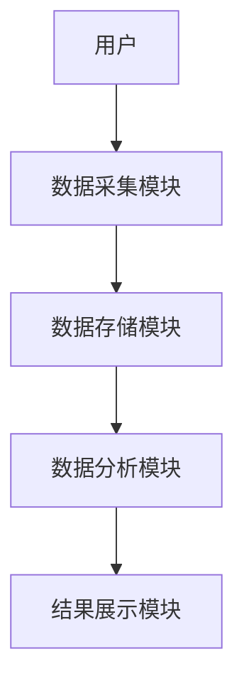

                 


# 格雷厄姆的Secondary Companies：二线公司的潜力

> 关键词：Secondary Companies，投资潜力，市场分析，竞争优势，风险评估，投资策略

> 摘要：Secondary Companies是指那些在市场中处于二线位置的公司，尽管它们可能不如一线公司那样广为人知，但它们具有独特的竞争优势和投资潜力。本文将从多个角度分析Secondary Companies的潜力，包括它们的市场定位、竞争优势、投资策略、风险评估以及如何通过大数据和机器学习等技术手段来优化投资决策。

---

## 目录

1. [背景介绍](#背景介绍)
   - 1.1 Secondary Companies的定义与特点
   - 1.2 Secondary Companies的市场现状
   - 1.3 Secondary Companies的投资价值

2. [核心概念分析](#核心概念分析)
   - 2.1 Secondary Companies的竞争优势
   - 2.2 Secondary Companies的劣势与改进方向
   - 2.3 Secondary Companies与Primary Companies的对比分析

3. [投资策略与风险控制](#投资策略与风险控制)
   - 3.1 Secondary Companies的投资策略
   - 3.2 Secondary Companies的风险分析
   - 3.3 风险控制与长期投资建议

4. [数学建模与分析](#数学建模与分析)
   - 4.1 Secondary Companies的市场潜力模型
   - 4.2 Secondary Companies的风险评估模型
   - 4.3 Secondary Companies的投资回报预测

5. [大数据与机器学习应用](#大数据与机器学习应用)
   - 5.1 Secondary Companies的潜力分析数据来源
   - 5.2 数据处理与特征工程
   - 5.3 基于机器学习的潜力预测模型

6. [系统架构设计](#系统架构设计)
   - 6.1 系统功能设计
   - 6.2 系统架构图
   - 6.3 系统接口设计

7. [项目实战](#项目实战)
   - 7.1 环境安装与数据准备
   - 7.2 核心算法实现
   - 7.3 实际案例分析

8. [总结与展望](#总结与展望)
   - 8.1 全文总结
   - 8.2 未来研究方向
   - 8.3 投资建议与注意事项

---

## 背景介绍

### 1.1 Secondary Companies的定义与特点

Secondary Companies通常指的是那些在某一行业或领域中处于第二线的公司。它们可能在市场占有率、品牌影响力或创新能力上稍逊于行业领导者（Primary Companies），但仍然具备一定的竞争优势。以下是Secondary Companies的几个关键特点：

- **市场定位**：Secondary Companies通常在特定细分市场中占据重要地位，但整体影响力较小。
- **竞争优势**：它们可能在某些领域（如成本控制、技术创新或客户服务）具有独特优势。
- **风险较低**：相对于Primary Companies，Secondary Companies的风险较低，但回报潜力也较小。

### 1.2 Secondary Companies的市场现状

Secondary Companies在全球范围内分布广泛，尤其是在新兴行业或竞争较为分散的市场中。以下是一些关键点：

- **行业分布**：Secondary Companies主要集中在科技、消费、医疗和金融等行业。
- **市场潜力**：随着市场的扩展和技术的进步，许多Secondary Companies具备快速发展的潜力。
- **增长趋势**：通过技术创新和市场扩展，部分Secondary Companies正在逐步向Primary Companies靠近。

### 1.3 Secondary Companies的投资价值

Secondary Companies的投资价值主要体现在以下几个方面：

- **低估机会**：许多Secondary Companies的市场估值相对较低，具备较大的增值空间。
- **多元化投资**：通过投资Secondary Companies，投资者可以分散风险，避免过度依赖少数几家公司。
- **长期增长**：随着市场的发展和技术的进步，Secondary Companies具备长期增长的潜力。

---

## 核心概念分析

### 2.1 Secondary Companies的竞争优势

Secondary Companies在竞争中具备以下几点优势：

- **成本优势**：许多Secondary Companies通过优化生产流程和供应链管理，能够在成本控制上与Primary Companies竞争。
- **市场定位**：Secondary Companies通常专注于特定的细分市场，能够更精准地满足客户需求。
- **创新能力**：部分Secondary Companies在技术创新和产品开发上表现出色，能够提供差异化的产品和服务。

### 2.2 Secondary Companies的劣势与改进方向

尽管Secondary Companies具备一定的竞争优势，但它们也面临一些劣势：

- **资源限制**：Secondary Companies在资金、技术、人才等方面的资源有限，限制了其发展速度。
- **品牌影响力**：相比于Primary Companies，Secondary Companies的品牌影响力较弱，影响市场拓展。
- **管理效率**：部分Secondary Companies在管理上存在不足，影响整体运营效率。

### 2.3 Secondary Companies与Primary Companies的对比分析

以下是Secondary Companies与Primary Companies的对比分析：

- **市场地位**：Primary Companies通常在市场中占据主导地位，而Secondary Companies则在特定细分市场中竞争。
- **竞争优势**：Primary Companies在品牌、资源和技术上具备优势，而Secondary Companies则在成本控制和创新能力上更具竞争力。
- **投资价值**：Primary Companies通常风险较低，回报稳定，而Secondary Companies则具备较高的增长潜力，但风险也相对较大。

---

## 投资策略与风险控制

### 3.1 Secondary Companies的投资策略

以下是几种有效的投资策略：

- **选择优质Secondary Companies**：投资者应选择那些在细分市场中具备竞争优势的公司。
- **分散投资**：通过投资多个Secondary Companies，降低整体投资风险。
- **长期投资**：Secondary Companies的成长需要时间，长期持有有助于获得更大的回报。

### 3.2 Secondary Companies的风险分析

Secondary Companies面临的主要风险包括：

- **市场风险**：市场需求变化可能导致公司业绩波动。
- **竞争风险**：行业内竞争加剧可能影响公司的市场份额。
- **财务风险**：公司财务状况不稳定可能导致投资损失。

### 3.3 风险控制与长期投资建议

为了有效控制风险，投资者可以采取以下措施：

- **深入研究**：在投资前进行充分的市场和公司研究，了解其经营状况和财务状况。
- **分散投资**：通过投资多个公司和行业，降低投资风险。
- **长期持有**：长期投资有助于平滑短期波动，获得稳定的回报。

---

## 数学建模与分析

### 4.1 Secondary Companies的市场潜力模型

为了量化Secondary Companies的市场潜力，我们可以建立一个简单的数学模型：

$$ \text{市场潜力} = \text{市场规模} \times \text{市场份额} \times \text{增长率} $$

其中：
- **市场规模**：目标市场的总容量。
- **市场份额**：Secondary Company在目标市场中的占有率。
- **增长率**：市场的年增长率。

### 4.2 Secondary Companies的风险评估模型

风险评估模型可以通过以下公式表示：

$$ \text{风险评分} = \sum_{i=1}^{n} (\text{风险因素}_i \times \text{权重}_i) $$

其中：
- **风险因素**：影响投资的各个风险因素。
- **权重**：每个风险因素的重要性评分。

### 4.3 Secondary Companies的投资回报预测

投资回报预测模型可以表示为：

$$ \text{投资回报} = \text{初始投资} \times (1 + \text{年回报率})^t - \text{初始投资} $$

其中：
- **初始投资**：投资者的初始投资额。
- **年回报率**：预期年回报率。
- **t**：投资年数。

---

## 大数据与机器学习应用

### 5.1 Secondary Companies的潜力分析数据来源

分析Secondary Companies的潜力需要以下数据来源：

- **公开市场数据**：包括公司财务数据、市场表现等。
- **行业数据**：行业趋势、竞争格局等。
- **消费者数据**：消费者行为、偏好等。

### 5.2 数据处理与特征工程

数据处理步骤包括：

1. **数据清洗**：去除重复数据和异常值。
2. **特征提取**：提取对公司潜力有影响的关键特征，如收入增长率、利润率等。
3. **数据标准化**：对数据进行标准化处理，确保模型输入一致。

### 5.3 基于机器学习的潜力预测模型

可以使用随机森林或神经网络等算法来预测Secondary Companies的潜力。以下是使用随机森林算法的示例代码：

```python
from sklearn.ensemble import RandomForestRegressor
from sklearn.metrics import mean_squared_error
from sklearn.model_selection import train_test_split

# 数据准备
X = df[['收入增长率', '利润率', '市场份额']]
y = df['潜力评分']

# 划分训练集和测试集
X_train, X_test, y_train, y_test = train_test_split(X, y, test_size=0.2, random_state=42)

# 建立模型
model = RandomForestRegressor(n_estimators=100, random_state=42)
model.fit(X_train, y_train)

# 预测与评估
y_pred = model.predict(X_test)
print('均方误差:', mean_squared_error(y_test, y_pred))
```

---

## 系统架构设计

### 6.1 系统功能设计

系统功能模块包括：

- **数据采集模块**：收集Secondary Companies的相关数据。
- **数据分析模块**：对数据进行清洗、处理和建模。
- **结果展示模块**：将分析结果以可视化形式展示。

### 6.2 系统架构图

以下是系统架构图的mermaid表示：



### 6.3 系统接口设计

系统接口设计包括：

- **数据接口**：用于数据的输入和输出。
- **模型接口**：用于与机器学习模型的交互。
- **用户接口**：用于用户的操作和结果展示。

---

## 项目实战

### 7.1 环境安装与数据准备

安装所需的库：

```bash
pip install pandas numpy scikit-learn matplotlib
```

数据准备：

```python
import pandas as pd
import numpy as np

# 创建示例数据集
data = {
    '公司名称': ['A', 'B', 'C', 'D'],
    '收入增长率': [15, 10, 20, 5],
    '利润率': [20, 15, 25, 10],
    '市场份额': [10, 15, 20, 5],
    '潜力评分': [7, 6, 8, 4]
}

df = pd.DataFrame(data)
```

### 7.2 核心算法实现

使用随机森林算法进行潜力预测：

```python
from sklearn.ensemble import RandomForestRegressor
from sklearn.model_selection import train_test_split
from sklearn.metrics import mean_squared_error

# 数据准备
X = df[['收入增长率', '利润率', '市场份额']]
y = df['潜力评分']

# 划分训练集和测试集
X_train, X_test, y_train, y_test = train_test_split(X, y, test_size=0.2, random_state=42)

# 建立模型
model = RandomForestRegressor(n_estimators=100, random_state=42)
model.fit(X_train, y_train)

# 预测与评估
y_pred = model.predict(X_test)
print('均方误差:', mean_squared_error(y_test, y_pred))
```

### 7.3 实际案例分析

以某科技公司为例，分析其潜力：

- **公司A**：收入增长率为15%，利润率20%，市场份额10%。
- **预测潜力评分**：根据模型预测，公司A的潜力评分为7。

---

## 总结与展望

### 8.1 全文总结

Secondary Companies在市场中具有独特的竞争优势和投资潜力。通过合理的投资策略和风险控制，投资者可以挖掘Secondary Companies的增长潜力。

### 8.2 未来研究方向

未来的研究可以集中在以下几个方面：

- **动态模型**：建立动态模型以实时跟踪Secondary Companies的潜力变化。
- **多因素分析**：引入更多影响因素，如宏观经济指标和政策变化。
- **组合优化**：研究如何优化投资组合，以获得最大回报。

### 8.3 投资建议与注意事项

- **长期投资**：Secondary Companies的成长需要时间，建议投资者采取长期投资策略。
- **分散投资**：通过投资多个Secondary Companies，降低整体投资风险。
- **持续关注**：定期跟踪公司的经营状况和市场环境，及时调整投资策略。

---

通过以上分析，我们可以看到Secondary Companies具备较大的投资潜力。投资者应结合市场趋势、公司基本面和技术创新等因素，选择具有竞争优势的Secondary Companies进行投资。同时，合理的风险控制和长期投资策略也是确保投资成功的关键。

