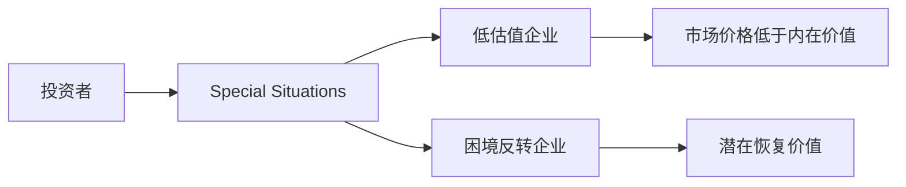

                 


# 格雷厄姆的Special Situations：寻找特殊机会

## 关键词：
- 格雷厄姆
- Special Situations
- 价值投资
- 投资机会
- 内在价值
- 市场价格
- 低估值

## 摘要：
本文深入探讨了格雷厄姆的Special Situations理论，分析了其核心概念、识别方法和应用场景。通过数学模型、算法流程和系统架构的设计，详细解读了如何在投资中识别和利用Special Situations，帮助投资者在市场中寻找特殊机会。

---

## 第一部分: 格雷厄姆的Special Situations概述

### 第1章: 格雷厄姆与Special Situations的背景介绍

#### 1.1 格雷厄姆的背景与投资理念
格雷厄姆是价值投资的奠基人，其核心理念是寻找市场价格低于内在价值的投资机会。他的投资策略强调安全边际和长期稳健回报。

#### 1.2 Special Situations的定义与特点
Special Situations指的是那些市场价格显著低于内在价值，通常存在于低估值或困境反转的企业中。

#### 1.3 Special Situations的分类与应用场景
- 低估值型：企业内在价值远高于市场价格。
- 困境反转型：企业面临短期困境，但具备恢复潜力。

### 第2章: Special Situations的核心概念与联系

#### 2.1 Special Situations的核心概念原理
Special Situations的识别基于内在价值与市场价格的偏差。

#### 2.2 特征对比表格
| 特征         | 低估值型  | 困境反转型  |
|--------------|-----------|------------|
| 内在价值      | 高        | 高          |
| 市场价格      | 低        | 极低        |
| 风险          | 低        | 中高        |

#### 2.3 ER实体关系图


## 第二部分: Special Situations的算法原理讲解

### 第3章: 算法原理与数学模型

#### 3.1 算法流程
1. 识别市场价格低于内在价值的企业。
2. 计算内在价值公式：V = (EBIT × (WACC - g)) / (g - r)。
3. 判断偏差程度，选择合适的投资标的。

#### 3.2 算法流程图


#### 3.3 数学模型与公式
计算内在价值的公式为：
$$ V = \frac{EBIT \times (WACC - g)}{g - r} $$
其中，WACC为加权平均资本成本，g为增长率，r为折现率。

### 第4章: 系统分析与架构设计

#### 4.1 项目介绍
开发一个基于Special Situations的投资系统，帮助投资者识别投资机会。

#### 4.2 系统功能设计
- 数据采集：收集企业财务数据。
- 内在价值计算：应用数学模型。
- 数据分析：比较市场价格与内在价值。

#### 4.3 架构设计图


## 第三部分: 项目实战

### 第5章: 项目实现

#### 5.1 环境安装
安装Python和必要的库，如Pandas和NumPy。

#### 5.2 核心代码实现
```python
import pandas as pd
import numpy as np

def calculate_intrinsic_value(EBIT, WACC, g, r):
    return EBIT * (WACC - g) / (g - r)

# 示例数据
EBIT = 100
WACC = 0.1
g = 0.05
r = 0.08

intrinsic_value = calculate_intrinsic_value(EBIT, WACC, g, r)
print(f"内在价值：{intrinsic_value}")
```

#### 5.3 案例分析
以某公司为例，计算其内在价值，判断是否符合Special Situations条件。

## 第四部分: 最佳实践

### 第6章: 总结与建议

#### 6.1 总结
Special Situations为投资者提供了在低估值或困境中寻找机会的方法。

#### 6.2 投资建议
- 保持对市场的敏感性。
- 严格评估内在价值。

#### 6.3 注意事项
- 风险控制：避免过度集中投资。
- 持续学习：更新投资策略。

#### 6.4 拓展阅读
推荐书籍：《格雷厄姆投资哲学》。

---

通过以上分析，Special Situations为投资者提供了识别低估值和困境反转企业的有效方法，帮助他们在市场中寻找特殊机会。

