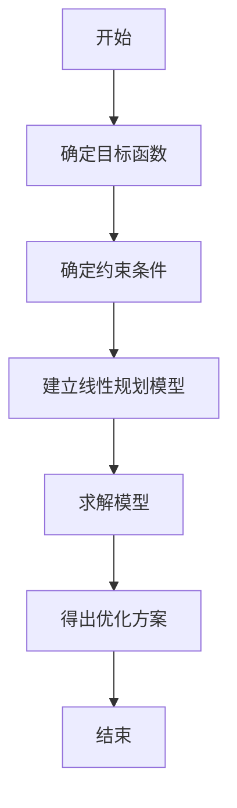
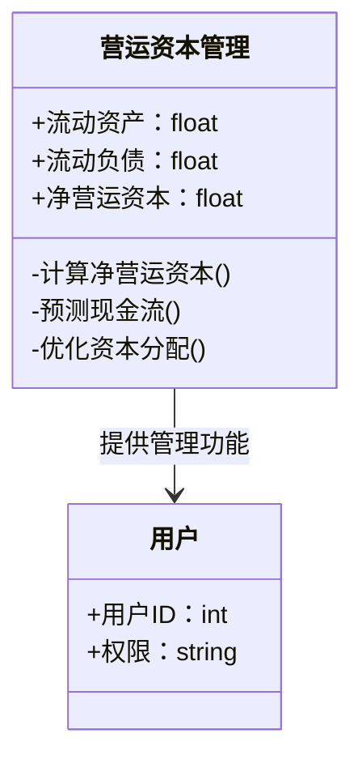

                 


# 格雷厄姆的Working Capital管理：运营效率的重要性

## 关键词：格雷厄姆、Working Capital、运营效率、企业管理、财务分析

## 摘要：本文深入探讨了格雷厄姆的Working Capital管理理论，分析其对企业运营效率的重要性。通过详细讲解核心概念、算法原理、系统架构及实际案例，帮助读者理解并应用这些知识。

---

## 第1章：背景介绍

### 1.1 营运资本管理的基本概念

#### 1.1.1 营运资本的定义与构成

营运资本（Working Capital）是指企业在日常运营中使用的流动资产与流动负债的差额，反映企业的短期偿债能力和运营效率。其构成包括现金、应收账款、存货和应付账款等。

#### 1.1.2 营运资本管理的目标与意义

营运资本管理的目标是优化资源配置，提高运营效率，降低财务风险。其意义在于确保企业日常运营的流动性，支持业务扩展，并提升整体竞争力。

#### 1.1.3 营运资本管理的核心要素

- **流动资产**：现金、应收账款、存货等。
- **流动负债**：应付账款、短期债务等。
- **净营运资本**：流动资产减去流动负债。

### 1.2 当前背景与问题

#### 1.2.1 企业营运资本管理的现状

许多企业在营运资本管理中存在效率低下、资金闲置或短缺的问题，影响整体运营。

#### 1.2.2 营运资本管理中的主要问题

- 资金链断裂风险。
- 库存积压或短缺。
- 应收账款回收周期过长。

#### 1.2.3 格雷厄姆的理论对营运资本管理的影响

格雷厄姆的理论强调稳健的财务管理和资本结构优化，为营运资本管理提供了新的思路。

### 1.3 营运资本管理的重要性

#### 1.3.1 对企业运营效率的影响

优化营运资本管理可提高资金周转率，降低运营成本。

#### 1.3.2 对财务健康状况的作用

确保企业有足够的流动性应对突发事件，维持财务稳定。

#### 1.3.3 与企业竞争力的关系

高效营运资本管理可提升企业市场反应速度和竞争力。

---

## 第2章：核心概念与联系

### 2.1 营运资本的构成要素

#### 2.1.1 流动资产的构成与分类

| 资产类别 | 定义 | 示例 |
|----------|------|------|
| 现金 | 企业的现金及现金等价物 | 库存现金、银行存款 |
| 应收账款 | 企业因赊销而应收回的款项 | 应收账款、应收票据 |
| 存货 | 企业为销售而持有的商品 | 原材料、在制品、产成品 |

#### 2.1.2 流动负债的构成与分类

| 负债类别 | 定义 | 示例 |
|----------|------|------|
| 应付账款 | 企业因购买商品或服务而应付的款项 | 应付账款、应付票据 |
| 短期借款 | 企业短期内需要偿还的债务 | 短期贷款、应付利息 |

#### 2.1.3 营运资本的净额计算

$$ \text{营运资本} = \text{流动资产} - \text{流动负债} $$

### 2.2 营运资本管理的核心框架

#### 2.2.1 资金管理

- 现金管理：确保充足的流动性，合理安排资金使用。
- 应收账款管理：优化信用政策，缩短回收周期。

#### 2.2.2 存货管理

- 优化库存周转，减少库存成本。
- 采用先进先出法等库存管理方法。

#### 2.2.3 短期负债管理

- 合理利用短期借款，降低融资成本。
- 优化应付账款，延长付款周期。

### 2.3 营运资本管理的理论与模型

#### 2.3.1 格雷厄姆的营运资本管理理论

格雷厄姆强调稳健的财务管理和资本结构优化，主张通过分析企业的净现值和内在价值来评估其财务健康状况。

#### 2.3.2 营运资本管理的主要模型与方法

- **现金流预测模型**：预测未来现金流，评估营运资本需求。
- **线性规划模型**：优化营运资本分配，提高效率。

#### 2.3.3 营运资本管理的边界与外延

营运资本管理不仅涉及内部优化，还需考虑外部市场环境和供应链管理。

### 2.4 实体关系图（ER图）

```mermaid
erDiagram
    customer[客户] {
        id : integer
        name : string
    }
    supplier[供应商] {
        id : integer
        name : string
    }
    product[产品] {
        id : integer
        name : string
        price : decimal
    }
    order[订单] {
        id : integer
        customer_id : integer
        product_id : integer
        order_date : date
    }
    inventory[库存] {
        id : integer
        product_id : integer
        quantity : integer
    }
    customer --> order : 下订单
    supplier --> product : 提供产品
    order --> product : 订单产品
    inventory --> product : 存储产品
```

---

## 第3章：算法原理讲解

### 3.1 营运资本管理的核心算法

#### 3.1.1 营运资本周转率的计算公式

$$ \text{营运资本周转率} = \frac{\text{营业收入}}{\text{营运资本平均余额}} $$

#### 3.1.2 营运资本回报率的计算公式

$$ \text{营运资本回报率} = \frac{\text{净利润}}{\text{营运资本平均余额}} $$

### 3.2 现金流预测模型

#### 3.2.1 现金流预测的步骤与方法

1. 数据收集：收集历史财务数据和市场信息。
2. 模型选择：采用线性回归或机器学习模型。
3. 预测与优化：基于模型预测未来现金流，并进行优化调整。

#### 3.2.2 现金流预测的数学模型

$$ \text{现金流预测} = a \times \text{收入} + b \times \text{成本} + c \times \text{其他因素} $$

#### 3.2.3 现金流预测的优化方法

- 使用动态规划优化预测模型。
- 结合实际数据不断调整模型参数。

### 3.3 营运资本管理的优化算法

#### 3.3.1 线性规划模型



#### 3.3.2 机器学习预测模型

使用Python中的scikit-learn库进行预测：

```python
from sklearn.linear_model import LinearRegression
model = LinearRegression()
model.fit(X_train, y_train)
y_pred = model.predict(X_test)
```

---

## 第4章：系统分析与架构设计

### 4.1 系统需求分析

#### 4.1.1 问题场景介绍

企业面临营运资本管理效率低下，希望通过系统化管理提高效率。

### 4.2 系统功能设计

#### 4.2.1 领域模型设计



### 4.3 系统架构设计


---

## 第5章：项目实战

### 5.1 环境安装与配置

- **Python安装**：安装Python 3.x版本。
- **库安装**：使用pip安装numpy、pandas、scikit-learn等库。

### 5.2 核心代码实现

#### 5.2.1 现金流预测代码

```python
import numpy as np
import pandas as pd
from sklearn.linear_model import LinearRegression

# 数据加载与预处理
data = pd.read_csv('data.csv')
X = data[['收入', '成本']]
y = data['现金流']

# 模型训练
model = LinearRegression()
model.fit(X, y)

# 模型预测
X_new = np.array([[100000, 50000]])
y_pred = model.predict(X_new)
print(f'预测现金流：{y_pred[0]:.2f}')
```

#### 5.2.2 线性规划优化代码

```python
from scipy.optimize import linprog

# 定义目标函数
c = [-1, -1]

# 定义约束条件
A = [[1, 1], [0, 1]]
b = [100, 50]

# 求解线性规划问题
result = linprog(c, A, b, bounds=(0, None), method='highs')

print(result.x)
```

---

## 第6章：最佳实践与总结

### 6.1 关键要点回顾

- 理解营运资本管理的核心概念。
- 掌握相关算法和模型的应用。
- 系统化管理与优化。

### 6.2 实践建议

- 定期分析营运资本状况。
- 结合实际情况选择合适的模型。
- 持续优化管理流程。

### 6.3 未来展望

随着技术进步，营运资本管理将更加智能化和数据驱动，为企业创造更大价值。

---

## 附录：扩展阅读

- 格雷厄姆的《证券分析》。
- 其他相关财务管理和运筹学书籍。

通过以上步骤，我们详细阐述了格雷厄姆的Working Capital管理理论，并结合实际案例和系统设计，展示了其在企业运营中的重要性。希望本文能为您提供有价值的信息和启发。

