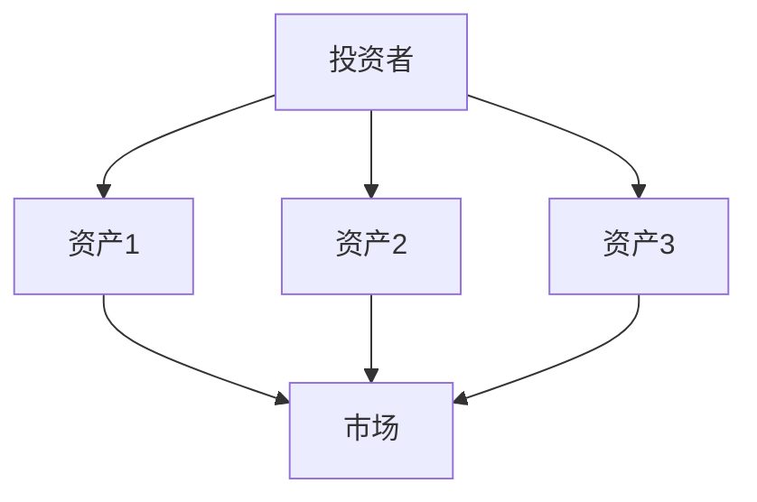
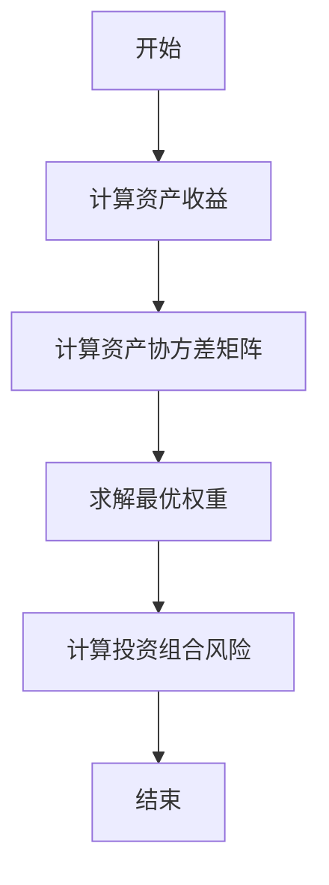
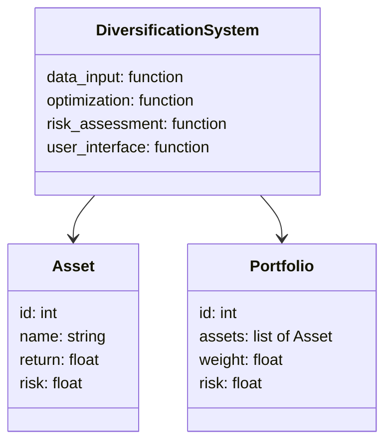

                 


# 格雷厄姆的分散化原则：降低投资风险

> **关键词**：投资风险、分散化原则、资产配置、风险调整收益、投资组合优化

> **摘要**：格雷厄姆的分散化原则是一种通过合理分配资产来降低投资风险的经典策略。本文将深入探讨分散化原则的核心概念、数学模型、算法实现、系统架构以及实际应用案例，帮助读者全面理解如何通过分散化降低投资风险。

---

# 第一部分：格雷厄姆分散化原则的核心概念

## 第1章：投资风险与分散化概述

### 1.1 投资风险的基本概念

#### 1.1.1 风险的定义与分类
投资风险是指在投资过程中，由于市场波动、经济变化或其他不可预测因素，导致投资收益低于预期或出现本金损失的可能性。风险可以分为系统性风险和非系统性风险：
- **系统性风险**：影响整个市场的风险，如经济衰退、通货膨胀等。
- **非系统性风险**：特定于某个资产或行业的风险，如公司经营不善、行业政策变化等。

#### 1.1.2 投资风险的来源
投资风险主要来源于以下几个方面：
1. **市场风险**：市场整体波动对资产价格的影响。
2. **流动性风险**：资产难以快速变现而产生的损失。
3. **信用风险**：债券发行人违约的可能性。
4. **操作风险**：投资决策或交易过程中的失误。

#### 1.1.3 风险与收益的权衡
投资的基本原则是风险与收益成正比。高风险的资产通常伴随着较高的潜在收益，而低风险的资产则可能提供较低的收益。分散化原则通过合理分配资产，平衡风险与收益，以实现最优的投资组合。

---

### 1.2 分散化投资的背景与意义

#### 1.2.1 传统投资方式的局限性
传统的集中投资方式容易受到单一资产或市场的波动影响，导致投资组合的收益不稳定。例如，如果将所有资金投资于一只股票，一旦该股票价格下跌，整个投资组合的价值将大幅缩水。

#### 1.2.2 分散化投资的起源与发展
分散化投资的理念可以追溯到古罗马时期，但在20世纪得到了系统化的发展。现代投资组合理论（MPT）的提出者哈里·马科维茨（Harry Markowitz）将分散化提升为一种科学的投资策略。格雷厄姆作为价值投资的鼻祖，进一步完善了分散化原则，强调通过投资多样化资产来降低风险。

#### 1.2.3 分散化投资的核心理念
分散化投资的核心理念是通过将资金分配到不同资产类别、行业或地理区域，降低特定资产或市场波动对整体投资组合的影响。通过分散化，投资者可以在保持预期收益的同时，显著降低投资风险。

---

## 第2章：格雷厄姆分散化原则的核心概念

### 2.1 分散化原则的定义与特征

#### 2.1.1 分散化原则的定义
分散化原则是指通过将资金分配到多个不相关的资产或资产组合中，以降低投资组合的整体风险。分散化的核心在于资产之间的相关性：当资产之间的相关性较低时，分散化效果最佳。

#### 2.1.2 分散化原则的属性特征对比表格

| **属性**       | **分散化原则**          | **非分散化原则**        |
|-----------------|-------------------------|--------------------------|
| 风险水平         | 较低                   | 较高                     |
| 收益波动性       | 较小                   | 较大                     |
| 抗跌性           | 较强                   | 较弱                     |
| 投资组合稳定性   | 高                     | 低                       |

#### 2.1.3 分散化原则的ER实体关系图


---

### 2.2 分散化原则与投资组合管理

#### 2.2.1 投资组合管理的基本原理
投资组合管理是指通过科学的方法构建和调整投资组合，以实现既定的投资目标。分散化是投资组合管理的重要组成部分，通过优化资产配置降低风险。

#### 2.2.2 分散化在投资组合中的作用
分散化通过降低投资组合的非系统性风险（即特定资产或行业的风险），提高投资组合的稳定性。具体作用包括：
1. 降低整体投资风险。
2. 提高投资组合的流动性。
3. 平滑资产价格波动。

#### 2.2.3 分散化与风险调整收益的关系
分散化不仅降低了风险，还能提高风险调整后的收益。通过优化资产配置，分散化投资能够在相同风险水平下实现更高的收益，或在相同收益水平下实现更低的风险。

---

## 第3章：分散化原则的数学模型与算法原理

### 3.1 分散化投资的数学模型

#### 3.1.1 投资组合风险的数学表达式
投资组合的风险可以用方差来衡量，其数学表达式为：
$$ \text{风险} = \sqrt{w_1^2\sigma_1^2 + w_2^2\sigma_2^2 + 2w_1w_2\sigma_1\sigma_2\rho_{12}} $$
其中：
- $w_i$：资产i的权重
- $\sigma_i$：资产i的波动率
- $\rho_{12}$：资产1和资产2的相关性

#### 3.1.2 分散化对投资组合风险的影响
通过分散化，资产之间的相关性$\rho_{12}$降低，从而减少投资组合的总体风险。当资产之间的相关性趋近于0时，分散化效果最佳。

#### 3.1.3 分散化与夏普比率的关系
夏普比率衡量的是单位风险超额收益，公式为：
$$ \text{夏普比率} = \frac{E[r_p] - r_f}{\sigma_p} $$
其中：
- $E[r_p]$：投资组合的预期收益
- $r_f$：无风险利率
- $\sigma_p$：投资组合的风险（标准差）

通过分散化降低$\sigma_p$，可以在保持$E[r_p]$不变的情况下提高夏普比率。

---

### 3.2 分散化算法的实现

#### 3.2.1 基于均值-方差优化的分散化算法
均值-方差优化是一种经典的分散化算法，通过最小化投资组合的方差来实现风险最小化。

#### 3.2.2 分散化算法的mermaid流程图


#### 3.2.3 分散化算法的Python实现
```python
import numpy as np

def diversification_algorithm(returns, covariance):
    n = len(returns)
    cov_matrix = np.array(covariance)
    inv_cov = np.linalg.inv(cov_matrix)
    weights = inv_cov.dot(np.ones(n)) / np.sum(inv_cov.dot(np.ones(n)))
    return weights

# 示例用法
returns = np.array([0.1, 0.12, 0.08])
covariance = np.array([[0.02, 0.01, 0.015],
                        [0.01, 0.03, 0.01],
                        [0.015, 0.01, 0.025]])
weights = diversification_algorithm(returns, covariance)
print("优化后的权重：", weights)
```

---

## 第4章：分散化原则的系统分析与架构设计

### 4.1 分散化投资系统概述

#### 4.1.1 系统目标与功能
分散化投资系统的目标是帮助投资者构建和管理分散化的投资组合。主要功能包括：
1. 资产配置优化。
2. 风险评估与预警。
3. 投资组合监控与调整。

#### 4.1.2 系统的输入与输出
- **输入**：资产收益数据、协方差矩阵、投资者风险偏好。
- **输出**：优化后的资产权重、投资组合风险评估、调整建议。

#### 4.1.3 系统的使用场景
- 机构投资者：优化投资组合，降低系统性风险。
- 个人投资者：通过分散化实现稳健投资。

---

### 4.2 分散化投资系统的架构设计

#### 4.2.1 系统功能模块划分
- **数据采集模块**：获取资产收益和协方差数据。
- **优化算法模块**：实现均值-方差优化。
- **风险评估模块**：计算投资组合风险。
- **用户界面模块**：展示优化结果和调整建议。

#### 4.2.2 系统架构的mermaid类图


---

## 第5章：分散化原则的项目实战

### 5.1 环境安装与数据准备
- **环境安装**：安装Python、NumPy、Matplotlib等工具。
- **数据准备**：收集资产的历史收益数据和协方差矩阵。

### 5.2 核心代码实现

#### 5.2.1 均值-方差优化代码
```python
import numpy as np

def portfolio_optimization(returns, covariance):
    n = len(returns)
    cov_matrix = np.array(covariance)
    inv_cov = np.linalg.inv(cov_matrix)
    weights = inv_cov.dot(np.ones(n)) / np.sum(inv_cov.dot(np.ones(n)))
    portfolio_return = weights.dot(returns)
    portfolio_risk = np.sqrt(weights.T.dot(cov_matrix).dot(weights))
    return weights, portfolio_return, portfolio_risk

# 示例用法
returns = np.array([0.1, 0.12, 0.08])
covariance = np.array([[0.02, 0.01, 0.015],
                        [0.01, 0.03, 0.01],
                        [0.015, 0.01, 0.025]])
weights, return_, risk = portfolio_optimization(returns, covariance)
print("优化权重：", weights)
print("投资组合预期收益：", return_)
print("投资组合风险：", risk)
```

#### 5.2.2 系统交互流程
1. 用户输入资产收益和协方差数据。
2. 系统进行优化计算。
3. 展示优化后的权重和风险评估。

---

## 第6章：分散化原则的最佳实践与总结

### 6.1 小结
分散化原则通过合理分配资产，有效降低投资风险，是现代投资组合理论的核心内容。

### 6.2 注意事项
- 分散化并非万能药，需结合市场环境和投资者风险偏好。
- 分散化效果依赖于资产之间的相关性，相关性过高的资产无法有效分散风险。

### 6.3 拓展阅读
- 《投资学》（读书）
- 现代投资组合理论（MPT）
- 风险平价投资策略

---

通过本文的详细讲解，读者可以全面理解格雷厄姆分散化原则的理论基础、数学模型和实际应用。无论是机构投资者还是个人投资者，都可以通过分散化原则实现稳健的投资收益。

